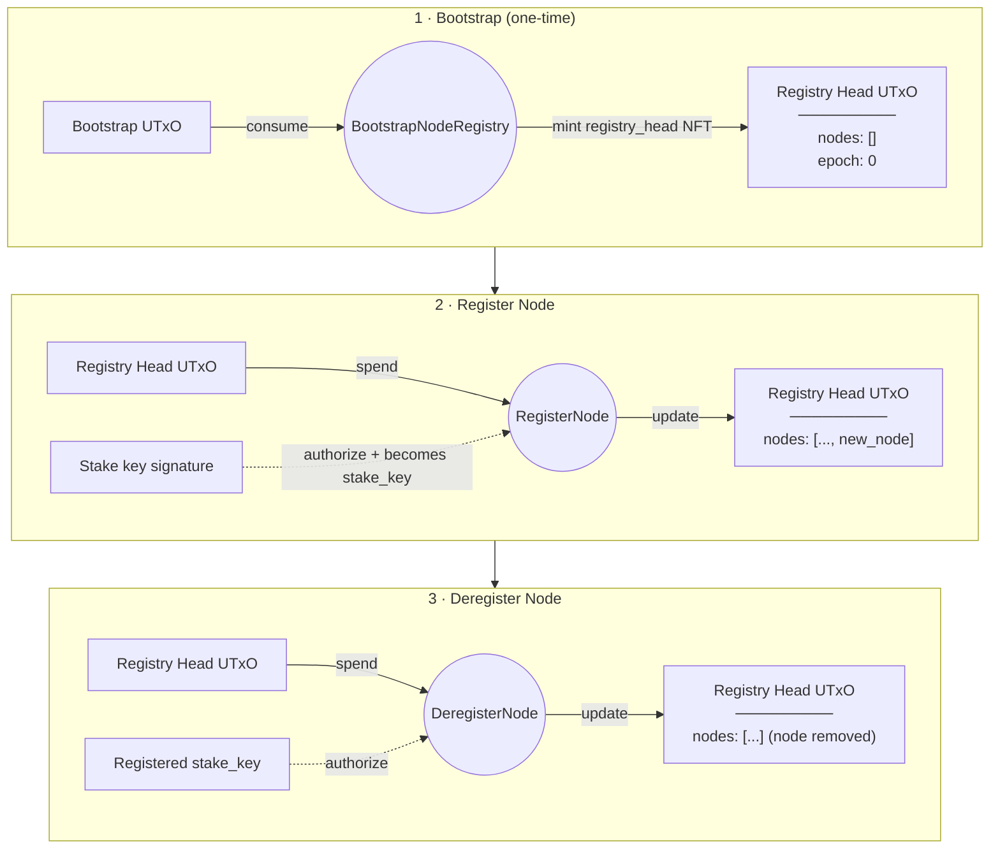

# Node Registry — On-Chain Contract

Aiken (Plutus V3) contract for the PubSub node registry. A single multi-validator manages relay node registration and deregistration using an NFT-based registry head under one minting policy.

## How It Works

A one-time **bootstrap** transaction consumes a designated UTxO and mints a `registry_head` NFT. This NFT sits at the registry script address and carries the current set of registered nodes plus protocol parameters.

**Registering a node** spends the registry head UTxO and produces a new one with the node appended to the list. The first transaction signatory becomes the node's `stake_key` — used later to authorize deregistration. A minimum ADA deposit is locked in the registry head UTxO.

**Deregistering a node** spends the registry head UTxO and produces a new one with the node removed. Only the node's registered `stake_key` may sign this transaction.

**Ticking the epoch** advances the epoch counter on the registry head. Used for periodic protocol synchronization.

## Transaction Flow



## Validators

| Validator | Purpose |
|---|---|
| [`node_registry`](validators/node_registry.ak) | Minting policy (bootstrap) + registry head spend logic |

Supporting modules: [`types`](lib/node_registry/types.ak), [`utils`](lib/node_registry/utils.ak).

## Datum Types

### NodeRegistryDatum

| Field | Type | Description |
|---|---|---|
| `nodes` | `List<NodeEntry>` | Currently registered relay nodes |
| `epoch` | `Int` | Current epoch counter |
| `min_deposit_lovelace` | `Int` | Minimum ADA a registering node must lock |

### NodeEntry

| Field | Type | Description |
|---|---|---|
| `node_id` | `ByteArray` | Node's network identifier |
| `addr` | `ByteArray` | Network address (host:port) |
| `stake_key` | `ByteArray` | Pubkey hash authorized to deregister this node |
| `registered_at_epoch` | `Int` | Epoch when the node registered |

## Redeemer Actions

### NodeRegistryMintAction (minting policy)

| Action | What It Does | Authorization |
|---|---|---|
| `BootstrapNodeRegistry` | Mint the `registry_head` NFT. Requires consuming the bootstrap UTxO. | Bootstrap UTxO must be spent |

### NodeRegistryAction (registry head spend)

| Action | What It Does | Authorization |
|---|---|---|
| `RegisterNode { node_id, addr }` | Append node to registry. First signatory becomes `stake_key`. Checks deposit. | Any signer |
| `DeregisterNode { node_id }` | Remove node from registry. | Registered `stake_key` for that node |
| `TickEpoch` | Increment epoch counter. | None |

## Building and Testing

```sh
aiken build
aiken check
```
