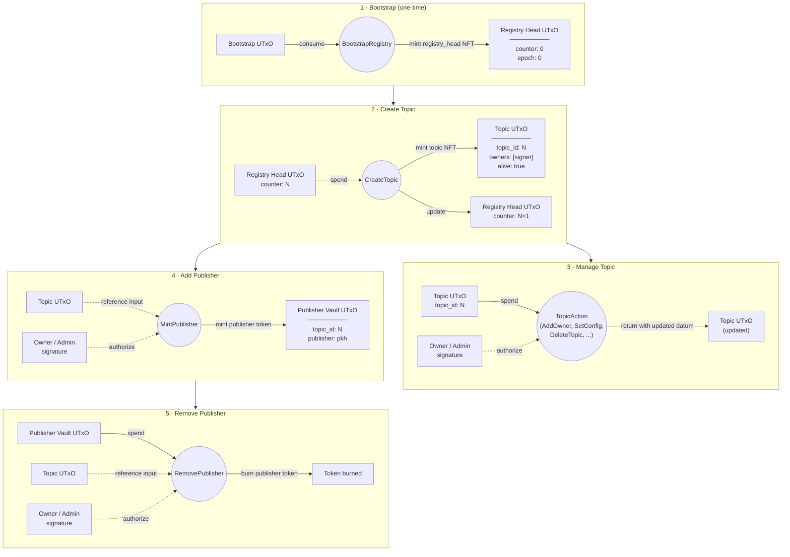

# Topic Registry — On-Chain Contracts

Aiken (Plutus V3) contracts for the PubSub topic registry. Three validators manage topic lifecycle, role assignment, and publisher authorization using NFT-based state tokens under a single minting policy.

## How It Works

A one-time **bootstrap** transaction consumes a designated UTxO and mints a `registry_head` NFT. This NFT sits at the registry script address and carries a counter that increments with each new topic. The counter ensures globally unique topic IDs.

**Creating a topic** spends the registry head UTxO (incrementing the counter) and mints a topic NFT (`t` + 4-byte ID). The topic NFT is sent to the topic validator address with a `TopicDatum` containing the topic's configuration and initial owner. The transaction signer becomes the first owner.

**Managing a topic** (adding owners/admins, changing config, deleting) spends the topic NFT UTxO at the topic validator. Authorization is checked against the datum's owner/admin lists via transaction signatories. The topic NFT is returned to the same address with an updated datum.

**Adding a publisher** mints a publisher role token (`p` + 4-byte topic ID + 28-byte pubkey hash) and sends it to the publisher vault address with a `PublisherVaultDatum`. The topic NFT is referenced (not spent) to check authorization. Requires owner or admin signature.

**Removing a publisher** spends the publisher vault UTxO and burns the role token. Also requires owner or admin signature, checked against the topic's reference input.

> [!NOTE]
> **Why separate publisher tokens instead of a list in the topic datum?** A topic may have hundreds or thousands of authorized publishers. Storing them all in the `TopicDatum` would hit Plutus execution budget and transaction size limits — every publisher change would require deserializing and re-serializing the entire list. By giving each publisher its own minted token and vault UTxO, adding or removing a publisher is a constant-cost operation regardless of how many publishers a topic has. The topic UTxO is only needed as a reference input for authorization checks, never modified during publisher management.

## Transaction Flow



Solid lines are spent/produced UTxOs. Dashed lines are reference inputs and signatures.

## Validators

| Validator | Purpose |
|---|---|
| [`registry`](validators/registry.ak) | Minting policy (all token types) + registry head spend logic |
| [`topic`](validators/topic.ak) | Topic UTxO spend logic (parameterized by registry policy ID) |
| [`publisher`](validators/publisher.ak) | Publisher vault spend logic (parameterized by registry policy ID) |

Supporting modules: [`types`](lib/topic_registry/types.ak), [`auth`](lib/topic_registry/auth.ak), [`validation`](lib/topic_registry/validation.ak), [`utils`](lib/topic_registry/utils.ak).

## Token Encoding

| Token | Format | Example |
|---|---|---|
| Registry head | `"registry_head"` (literal) | — |
| Topic | `0x74` + 4-byte big-endian topic ID | `t\x00\x00\x00\x05` for topic 5 |
| Publisher | `0x70` + 4-byte topic ID + 28-byte pubkey hash | `p\x00\x00\x00\x05<pkh>` |

## Datum Types

### RegistryHeadDatum

| Field | Type | Description |
|---|---|---|
| `counter` | `Int` | Next topic ID to assign (monotonically increasing) |
| `epoch` | `Int` | Current epoch, advanced via `TickEpoch` |

### TopicDatum

| Field | Type | Description |
|---|---|---|
| `topic_id` | `Int` | Unique identifier (assigned from counter at creation) |
| `name` | `ByteArray` | Human-readable topic name |
| `owners` | `List<ByteArray>` | Pubkey hashes with full control |
| `admins` | `List<ByteArray>` | Pubkey hashes with limited management rights |
| `replication_factor` | `Int` | Persistence replication target (must be > 0). See note below. |
| `retention_period` | `Int` | How long messages are retained (must be > 0). See note below. |
| `alive` | `Bool` | `False` after deletion (tombstoned) |
| `published_at_epoch` | `Int` | Epoch when the topic was created |

> [!NOTE]
> **`replication_factor` and `retention_period`.** The current contract requires both fields to be > 0, carried over from the Quint formal spec and the AUEB design which assumed persistence for all topics. For topics that only need ephemeral dissemination (no persistence), these fields may not be meaningful. This constraint may need revisiting to allow zero values.

### PublisherVaultDatum

| Field | Type | Description |
|---|---|---|
| `topic_id` | `Int` | Which topic this publisher is authorized for |
| `publisher` | `ByteArray` | Publisher's pubkey hash |

## Redeemer Actions

### RegistryMintAction (minting policy)

| Action | What It Does | Authorization |
|---|---|---|
| `BootstrapRegistry` | Mint the `registry_head` NFT. Requires consuming the bootstrap UTxO. | Bootstrap UTxO must be spent |
| `MintTopic` | Mint a topic NFT. Registry head must be in inputs (enforces counter increment via spend). | Registry head in inputs |
| `MintPublisher { topic_id, publisher }` | Mint a publisher role token. Topic must be alive. | Owner or admin signature (checked via topic reference input) |
| `BurnPublisher { topic_id, publisher }` | Burn a publisher role token. | Unconditional (token holder can always burn) |

### RegistryHeadAction (registry head spend)

| Action | What It Does | Authorization |
|---|---|---|
| `CreateTopic { name, replication_factor, retention_period }` | Increment counter, mint topic NFT, create topic UTxO with initial datum. Signer becomes first owner. | Transaction signer (becomes owner) |
| `TickEpoch` | Advance the epoch counter by 1. Counter stays the same. | None specified |

### TopicAction (topic UTxO spend)

| Action | What It Does | Authorization |
|---|---|---|
| `DeleteTopic` | Set `alive = False`, zero out all fields (tombstone). | Owner |
| `AddOwner { new_owner }` | Insert a pubkey hash into the owners list. | Owner |
| `RemoveOwner { old_owner }` | Remove a pubkey hash from owners. Must keep at least 1 owner. | Owner |
| `AddAdmin { new_admin }` | Insert a pubkey hash into the admins list. | Owner |
| `RemoveAdmin { old_admin }` | Remove a pubkey hash from admins. | Owner |
| `SetReplicationFactor { r }` | Update replication factor (must be > 0). | Owner or admin |
| `SetRetentionPeriod { t }` | Update retention period (must be > 0). | Owner or admin |

### PublisherVaultAction (publisher vault spend)

| Action | What It Does | Authorization |
|---|---|---|
| `RemovePublisher` | Spend the vault UTxO and burn the publisher token. Topic must be alive. | Owner or admin (checked via topic reference input) |

## Building and Testing

```sh
aiken build
aiken check
```
