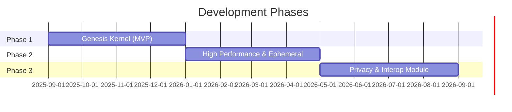

# Development Strategy

We adopt a **phased, kernel-out strategy**, prioritizing the generic transport layer first before adding complex modules like Encryption and Cross-Chain verification.

## Phase Overview

---

## Phase 1: The "Genesis" Kernel (MVP)

### Goal
A working public broadcast network.

### Focus Use Cases
- GOV-01 (Governance)
- Basic DEF-01 (DeFi)

### Deliverables

| Deliverable | Description |
|-------------|-------------|
| **Rust Node** | Cardano Native / Libp2p Hybrid Networking |
| **Identus Integration** | Basic DID resolution and signature verification |
| **Durable Storage** | RocksDB for Governance proposals |

### Rationale

!!! info "Why Governance First?"
    Governance allows us to test reliability, identity, and persistence **without** the extreme latency pressure of HFT. It's the ideal proving ground for the core architecture.

---

## Phase 2: High Performance & Ephemeral Data

### Goal
Support high-frequency trading and agents.

### Focus Use Cases
- DEF-01 (Advanced)
- AI-01 (Agents)

### Deliverables

| Deliverable | Description |
|-------------|-------------|
| **Hot Cache** | Implementation for ephemeral topics |
| **Latency Optimizations** | Gossip tuning for sub-second delivery |
| **Schema Registry** | Protobuf/CBOR schema enforcement |

### Rationale

!!! info "Why Performance Second?"
    Once reliability is proven, we optimize for speed to capture the DeFi Intent market. This sequence reduces risk.

---

## Phase 3: The Privacy & Interop Module

### Goal
Enable private communities and cross-chain signals.

### Focus Use Cases
- SOC-01 (Social)
- XCB-01 (Cross-Chain)

### Deliverables

| Deliverable | Description |
|-------------|-------------|
| **Layer 3 Expansion** | Pluggable Verification Modules for foreign chains |
| **Layer 4 Integration** | MLS (Messaging Layer Security) for E2EE |
| **Sealed Sender** | Routing implementation for metadata privacy |

### Rationale

!!! info "Why Privacy Last?"
    These features are computationally heavier and add complexity. They are best layered onto a stable, high-performance network.
