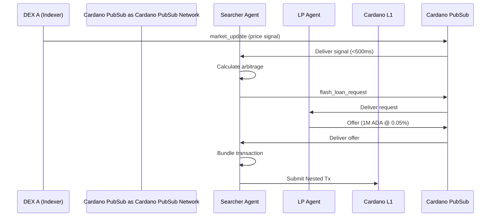

# AI-01: Autonomous Agent Coordination

**Use Case Definition: Cardano PubSub for Autonomous Agent Coordination**

## Executive Summary

This use case defines Cardano Cardano PubSub's role as the **Machine-to-Machine (M2M) Nervous System** for the emerging autonomous economy.

In the near future, the majority of blockchain transactions will not be initiated by humans, but by **autonomous AI agents** performing high-frequency tasks: arbitrage, liquidation, yield optimization, and resource negotiation. These agents require a communication layer that is significantly faster and cheaper than the L1 ledger for coordination, yet more reliable and open than centralized Web2 APIs.

Cardano PubSub provides this **high-throughput "Coordination Bus,"** allowing agents to discover opportunities, negotiate complex multi-step executions, and reach consensus off-chain before settling the final result on Cardano.

## Strategic Value Proposition

| Value | Description |
|-------|-------------|
| **Speed (The "Mempool" for Intents)** | Agents operate in milliseconds. Cardano PubSub offers sub-second propagation for market signals, allowing agents to react to price inefficiencies faster than waiting for the next block |
| **Cost Efficiency** | "Chatter" (negotiation) is free or low-cost. Agents can exchange thousands of bid/ask messages off-chain to find the optimal trade route, only paying L1 gas fees for the final settlement transaction |
| **Standardized Interoperability** | Instead of every DeFi protocol building its own WebSocket API for liquidation bots, Cardano PubSub provides a single, universal standard (`intents/liquidation`). An agent built for one protocol can easily monitor all protocols |
| **Deterministic Ordering** | For agents coordinating sequence-critical tasks (e.g., "I will flash loan X only if you guarantee swap Y"), Cardano PubSub's ordered message stream provides a preliminary consensus before on-chain submission |

## Actors & Roles

| Actor | Role in Cardano PubSub | Description |
|-------|---------------|-------------|
| **DEX / Protocol** | Publisher | The smart contract or off-chain indexer announcing an opportunity (e.g., "Loan #123 is undercollateralized") |
| **Searcher Agent** | Subscriber | A specialized bot scanning Cardano PubSub topics for profit opportunities (arbitrage, liquidation) |
| **Solver Agent** | Publisher & Subscriber | A sophisticated agent that not only finds opportunities but negotiates execution paths (e.g., providing liquidity for an intent) |
| **Coordinator Node** | Relayer | High-performance Cardano PubSub nodes optimized for low latency, often run by entities specializing in MEV (Maximal Extractable Value) infrastructure |

## Operational Flow: "The Multi-Hop Arbitrage"

**Scenario:** An opportunity arises where ADA is cheaper on DEX A than on DEX B. Multiple independent AI agents coordinate to close this gap efficiently.

### Step 1: Signal Detection

- **Trigger:** DEX A's off-chain indexer publishes a `market_update` message to `market/ada-usdm/price` on Cardano PubSub
- **Reception:** Five different "Searcher Agents" subscribed to this topic receive the update within 500ms

### Step 2: Opportunity Negotiation (The "Chatter")

- **Analysis:** Agents calculate that buying on DEX A and selling on DEX B yields a 0.5% profit, but requires a Flash Loan
- **Request:** Agent X publishes a `flash_loan_request` to `intents/flash-loans`
- **Response:** A "Liquidity Provider Agent" (LP Agent) sees the request and replies on a direct channel: *"I can provide 1M ADA for 0.05% fee."*

### Step 3: Bundle Construction

- **Agreement:** Agent X accepts the LP Agent's offer via a signed Cardano PubSub message
- **Coordination:** Agent X constructs a Nested Transaction (bundling the Flash Loan, Buy on A, Sell on B, Repay Loan)

### Step 4: Execution & Settlement

- **Submission:** Agent X submits the final transaction bundle to the Cardano Mempool
- **Finality:** The transaction settles in the next block. The "Chatter" on Cardano PubSub (price updates, loan negotiation) remains off-chain, preventing ledger bloat



## Technical Specifications

### Topic Taxonomy

M2M communication requires strict schema enforcement and high granularity.

| Topic ID | Message Type | Purpose | QoS Requirement |
|----------|--------------|---------|-----------------|
| `market/{pair}/depth` | OrderBookUpdate | Real-time order book depth updates | Ultra-Low Latency |
| `intents/liquidation/global` | LiquidationAlert | Alerts for positions approaching insolvency | High Reliability |
| `agent/negotiation/{session_id}` | Offer/CounterOffer | Ephemeral channels for private agent-to-agent negotiation | Encryption Required |

### Message Payload (Binary/CBOR)

Unlike human-readable governance messages, M2M payloads must be highly optimized for parsing speed.

```protobuf
message AgentSignal {
  // UUID for the opportunity (e.g., specific loan ID)
  bytes target_id = 1;

  // Type of action required/requested
  enum ActionType {
    LIQUIDATE = 0;
    ARBITRAGE = 1;
    FLASH_LOAN = 2;
  }
  ActionType type = 2;

  // The economic parameters (structured CBOR)
  bytes parameters_cbor = 3;

  // Expiration (in milliseconds, not slots, for tighter precision)
  uint64 expires_at_ts = 4;

  // Machine verification signature
  bytes agent_signature = 5;
}
```

### Performance Requirements

| Requirement | Target |
|-------------|--------|
| **Throughput** | 10,000+ messages/second during market volatility |
| **Latency** | < 500ms p99 (critical for avoiding failed transactions) |
| **Filtering** | Bloom-filter subscriptions so agents only receive traffic for assets they trade |

## Requirements Integration

| Agent Requirement | Cardano PubSub Feature Support |
|-------------------|----------------------|
| **High Throughput** | DP-6 (Scalability): Cardano PubSub is designed to handle high-volume bursts without congesting the L1 chain |
| **Machine Readability** | DP-9 (Message Specs): Native support for `application/cbor` ensures agents don't waste cycles parsing JSON |
| **Sequence Precision** | RES-1 (Partition Handling): Vector clocks ensure that even in distributed negotiations, the sequence of "Offer -> Accept" is preserved |
| **Private Negotiation** | SEC-1 (MLS Encryption): Agents can spin up encrypted sessions to negotiate flash loan terms without revealing their strategy to the public network |

## Open Questions / Next Steps

1. **MEV Protection:** If Cardano PubSub broadcasts "Liquidation Opportunities" publicly, does it create a "Gas War" on L1?
    - *Mitigation:* Cardano PubSub could support "Sealed Bid" topics where only the winner is revealed

2. **Agent Identity:** How do we prevent "Sybil Agents" from spamming the negotiation channels?
    - *Proposal:* Agents must stake a minimum amount of AGORA to publish on high-frequency topics (Proof-of-Stake for bandwidth)

3. **Time Synchronization:** M2M relies on precise timestamps. Do Cardano PubSub nodes need an NTP-enforced time sync requirement to prevent "fake timestamp" arbitrage?
