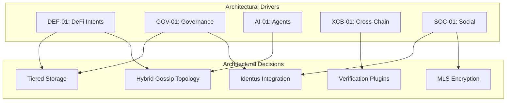

# Architectural Drivers

!!! info "Audience: Engineers, Architects"

These five use cases serve as the **primary architectural drivers** for Cardano PubSub. Each defines specific technical requirements that shape the system design.

## Why "Drivers"?

Architecture isn't designed in a vacuum. These use cases represent the **extremes** of what the system must support:

- **DEF-01** pushes latency limits
- **GOV-01** pushes reliability requirements  
- **AI-01** pushes throughput limits
- **XCB-01** pushes interoperability requirements
- **SOC-01** pushes privacy requirements

If the architecture handles these five, it handles everything in between.

## Driver Index

| ID | Name | Critical Constraint | Primary Layers |
|----|------|---------------------|----------------|
| [DEF-01](def-01-defi-intents.md) | DeFi Intents | Latency < 500ms | L1 (GossipSub), L2 (Hot Cache) |
| [GOV-01](gov-01-governance.md) | DAO Governance | 100% delivery guarantee | L1 (Harary), L3 (Identus) |
| [AI-01](ai-01-agents.md) | Autonomous Agents | 10k+ msg/sec throughput | L1 (Burst), L5 (CBOR) |
| [XCB-01](xcb-01-cross-chain.md) | Cross-Chain Bridge | Foreign chain verification | L3 (Verifier Plugins) |
| [SOC-01](soc-01-social.md) | Token-Gated Social | E2EE + on-chain gating | L3 (L1 Oracle), L4 (MLS) |

## How Drivers Shape Architecture

## Cross-Reference Matrix

| Requirement | DEF-01 | GOV-01 | AI-01 | XCB-01 | SOC-01 |
|-------------|--------|--------|-------|--------|--------|
| Low Latency (<500ms) | ✅ Primary | - | ✅ | - | - |
| Guaranteed Delivery | - | ✅ Primary | - | - | - |
| E2EE (MLS) | - | - | ✅ | - | ✅ Primary |
| Identus DID | - | ✅ Primary | - | - | ✅ |
| L1 State Verification | - | - | - | ✅ | ✅ Primary |
| Foreign Chain Proofs | - | - | - | ✅ Primary | - |
| High Throughput | ✅ | - | ✅ Primary | - | - |
| Durable Storage | - | ✅ Primary | - | - | ✅ |
| Ephemeral Storage | ✅ Primary | - | ✅ | - | - |

## Traceability to Requirements

Each driver maps to specific [Functional Requirements](../../product/requirements/functional.md) and [Non-Functional Requirements](../../product/requirements/non-functional.md):

| Driver | Functional Reqs | Non-Functional Reqs |
|--------|-----------------|---------------------|
| DEF-01 | FR1.1, FR1.4, FR3.1, FR5.1 | NFR1.1, NFR1.2, NFR2.5 |
| GOV-01 | FR1.3, FR2.1, FR4.2 | NFR3.1, NFR3.4, NFR4.2 |
| AI-01 | FR1.4, FR4.4, FR5.3 | NFR1.2, NFR1.3, NFR2.1 |
| XCB-01 | FR3.2, FR4.4 | NFR6.2, NFR6.3 |
| SOC-01 | FR1.2, FR2.1, FR2.4 | NFR4.1, NFR4.3, NFR5.1 |
