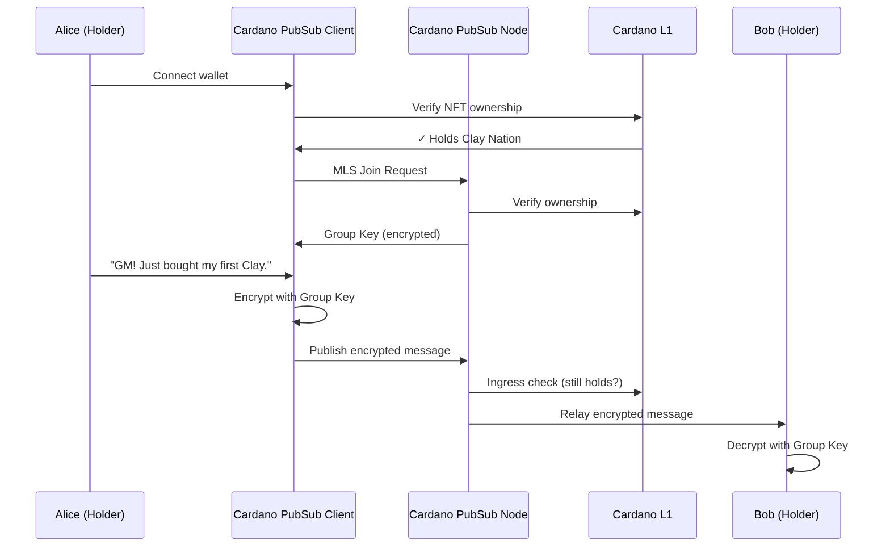

# SOC-01: Token-Gated Social Feeds

**Use Case Definition: Cardano PubSub for Token-Gated Social Feeds**

## Executive Summary

This use case defines Cardano Cardano PubSub's role as the **"Web3 Social Layer"**, specifically focusing on Token-Gated Communities.

Currently, Web3 communities rely on Web2 platforms (Discord, Telegram, X) which present critical risks:

1. **Centralization:** Communities can be de-platformed or censored arbitrarily
2. **Security:** "Verify your wallet" bots are a primary vector for phishing attacks
3. **Data Extraction:** User metadata is harvested for ad targeting

Cardano PubSub replaces this with a native, decentralized communication infrastructure where **"Your Wallet is Your Login"** and **"Your Assets are Your Permissions."** Users access encrypted chat groups automatically based on their on-chain holdings, with no middleman server to ban them or leak their data.

## Strategic Value Proposition

| Value | Description |
|-------|-------------|
| **Native Gating (No Bots)** | Permissions are derived directly from the ledger. If you hold the NFT, you are in. If you sell it, you are out. No clunky "Collab.land" bots required |
| **Privacy First (E2EE)** | All messages are End-to-End Encrypted using MLS (Messaging Layer Security). Only fellow token holders can decrypt the content; even the Cardano PubSub nodes relaying the messages cannot read them |
| **Censorship Resistance** | The social graph lives on a distributed network of SPOs. As long as the blockchain exists, the community exists |
| **Sovereign Identity** | Users build a portable reputation linked to their DID/Wallet, not a siloed Discord ID that can be deleted |

## Actors & Roles

| Actor | Role in Cardano PubSub | Description |
|-------|---------------|-------------|
| **Community / DAO** | Admin / Creator | The entity defining the access rules (e.g., "Must hold PolicyID X"). They typically initialize the Group Key for encryption |
| **Member (Holder)** | Publisher & Subscriber | The user holding the required asset. They publish encrypted messages and subscribe to the group topic |
| **Cardano PubSub Node** | Relayer & Gatekeeper | The node propagates messages. Crucially, it performs **Ingress Validation**—checking L1 state to ensure a sender actually holds the required token before relaying |
| **Archive Node** | Store | Specialized nodes that store long-term chat history (optional service, as standard nodes may prune old chat logs) |

## Operational Flow: "The Clay Nation Holders Chat"

**Scenario:** Alice buys a "Clay Nation" NFT and wants to join the exclusive holders-only channel.

### Step 1: Access & Discovery

- **User Action:** Alice connects her wallet to a community interface (e.g., a dApp or generic Cardano PubSub Client)
- **Discovery:** The client scans for Cardano PubSub topics matching her assets. It finds `social/group/clay-nation-verified`
- **Validation:** The client proves Alice's ownership of the specific NFT Policy ID

### Step 2: Key Exchange (MLS)

- **Join Request:** Alice publishes a "Member Add" proposal to the group's MLS Tree
- **Key Derivation:** Existing members (or a bootstrap node) validate her holding on-chain and approve the add, sharing the Group Epoch Key with her (encrypted via her public key)
- **Result:** Alice can now decrypt the stream

### Step 3: Publishing a Message

- **Composition:** Alice types "GM! Just bought my first Clay."
- **Encryption:** Her client encrypts the text using the current Group Epoch Key
- **Broadcast:** The client sends the encrypted blob to the Cardano PubSub network topic `social/group/clay-nation-verified`

### Step 4: Network Enforcement

- **Ingress Check:** The receiving Cardano PubSub Node observes the message. It queries the Cardano L1 (via local DB or Ogmios): *"Does Sender Address X still hold Asset Y?"*
- **Relay:**
    - **If Yes:** The node propagates the message to peers
    - **If No:** The node drops the message (preventing spam from former holders)

### Step 5: Consumption

- **Reception:** Bob (another holder) receives the blob
- **Decryption:** His client uses the shared Group Key to decrypt and display *"GM! Just bought my first Clay."*



## Technical Specifications

### Topic Taxonomy

Social topics must scale to millions of groups while maintaining privacy.

| Topic ID | Access Model | Purpose |
|----------|--------------|---------|
| `social/group/{policy_id}` | Token-Gated | Public metadata, encrypted payloads. One topic per NFT collection or Token |
| `social/dm/{user_did}` | Private | Direct Messages. Only the owner of the DID can decrypt |
| `social/broadcast/{creator_did}` | Public | One-way announcements from creators to followers (like a decentralized Twitter/X feed) |

### Message Payload (MLS Encrypted)

The payload is a standard MLS PublicMessage container.

```protobuf
message SocialMessage {
  // The sender's on-chain identity (User Handle or Address)
  string sender_did = 1;

  // The Group ID (linked to the Topic)
  bytes group_id = 2;

  // The MLS Ciphertext (fully encrypted content + padding)
  bytes mls_ciphertext = 3;

  // Epoch generation (for key rotation)
  uint64 epoch = 4;

  // Signature (verifying sender identity)
  bytes signature = 5;
}
```

### Scalability & Storage Drivers

**Constraint:** A popular group can generate 100k messages/day. Storing this forever on every node is impossible.

**Solution:**

- **Tiered Retention:** Standard nodes store `social/*` topics for only 24 hours
- **Archival Services:** Community-run "History Nodes" or user clients are responsible for persisting long-term history (IPFS integration)
- **Sharding:** For massive collections (e.g., 100k holders), the topic may be sharded: `social/group/{policy_id}/shard-01`

## Requirements Integration

| Social Requirement | Cardano PubSub Feature Support |
|-------------------|----------------------|
| **Privacy (E2EE)** | SEC-1 (Encryption): Native support for MLS (IETF RFC 9420) to manage group keys efficiently, even as members join/leave dynamically |
| **Access Control** | DP-10 (State Awareness): The node's ability to check L1 ledger state (UTXO set) is the critical enforcement mechanism for "Token Gating" |
| **Identity** | SDK-7 (DID Integration): Messages are signed by DID keys, allowing clients to resolve "addr1...xyz" to "Alice.ada" via CNS/Handle standards |
| **Metadata Protection** | SEC-4 (Sealed Sender): Advanced routing where nodes know where to send a message but not who sent it (protecting the social graph from analysis) |

## Open Questions / Next Steps

1. **History Storage Economics:** Who pays to store the chat history of 2024?
    - *Idea:* Communities might run their own Cardano PubSub Node (embedded in a desktop app) to serve their own history

2. **Moderation:** If the network is censorship-resistant, how does a community ban an abusive user who still holds the token?
    - *Solution:* The MLS protocol allows the "Group Administrator" to forcibly remove a member from the Encryption Key Tree, effectively muting them even if they broadcast messages (peers won't be able to decrypt them)

3. **Cross-Wallet Identity:** How does a user chat if their NFT is on a hardware wallet (cold) but they are on mobile (hot)?
    - *Solution:* CIP-88 (or similar) delegation standards, allowing a Hot Wallet to sign "on behalf of" the Cold Wallet for social actions
