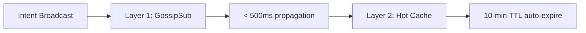
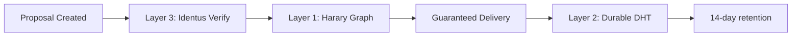

# Use Case Coverage Matrix

This table summarizes how the architecture satisfies the critical constraints of each key use case.

## Coverage Matrix

| Use Case ID | Name | Critical Driver | Architectural Solution |
|-------------|------|-----------------|------------------------|
| **DEF-01** | DeFi Intents | Latency < 1s | **Layer 1:** Hybrid Gossip (Native + GossipSub) **Layer 2:** RAM-based Hot Cache |
| **GOV-01** | DAO Governance | Identity & Trust | **Layer 3:** Identus DID verification for Proposal origins **Layer 1:** Harary Graph (guaranteed delivery) |
| **AI-01** | Autonomous Agents | Throughput & Structure | **Layer 5:** Protobuf/CBOR native schemas **Layer 1:** Burst handling logic |
| **XCB-01** | Cross-Chain Bridge | Foreign Verification | **Layer 3:** Modular "Verifier Plugins" alongside Identus for non-native curves |
| **SOC-01** | Token-Gated Social | Privacy & Gating | **Layer 4:** Native MLS integration **Layer 3:** L1 UTXO State lookups |

## Detailed Mapping

### DEF-01: DeFi Intents

**Critical Requirement:** Solvers must see intents immediately to compete.

**Solution:** Hybrid gossip for speed + RAM cache for ephemeral storage.

---

### GOV-01: DAO Governance

**Critical Requirement:** 100% delivery guarantee; missing a vote notification is unacceptable.

**Solution:** Structured topology for reliability + durable storage + identity verification.

---

### AI-01: Autonomous Agents

**Critical Requirement:** Handle bursts of negotiation "chatter" with structured payloads.

**Solution:** Native Protobuf/CBOR schema support + burst handling in networking layer.

---

### XCB-01: Cross-Chain Bridge

**Critical Requirement:** Verify signatures from non-Cardano chains.

**Solution:** Pluggable verification modules in Layer 3 that can handle foreign curve signatures alongside Identus.

---

### SOC-01: Token-Gated Social

**Critical Requirement:** E2EE for private groups + on-chain permission checks.

**Solution:** MLS for encryption + L1 State Oracle for UTXO-based access control.
