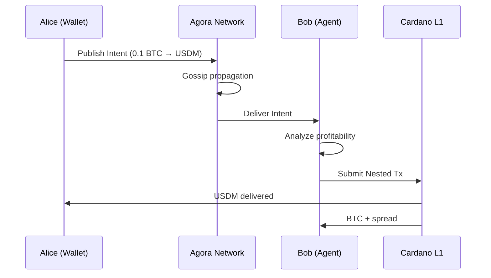

# DEF-01: DeFi Intents

**Use Case Definition: Agora for DeFi Intents**

!!! info "Related Documents"
    - DeFi Intents (Nested Transactions) PRD 0.3

## Executive Summary

This use case defines the critical role of Cardano Agora as the **Decentralized Message Bus (DMB)** within the "DeFi Intents" architecture.

In this model, users do not construct full on-chain transactions. Instead, they broadcast **"User Intents"**—partial, declarative transactions expressing a desired outcome (e.g., "I want to swap 0.1 BTC for USDM")—via the Agora network. Specialized actors called **Agents** subscribe to these intent streams via Agora, compete to fulfill them, and bundle them into Nested Transactions for final on-chain settlement.

Agora provides the censorship-resistant, high-availability transport layer that decouples **intent expression** (the user's "what") from **execution** (the agent's "how").

## Strategic Value Proposition

| Value | Description |
|-------|-------------|
| **Censorship Resistance** | Unlike centralized order books or Web2-based relayers, Agora ensures intents are propagated across a decentralized network of SPO nodes, preventing any single entity from blocking a user's financial requests |
| **Standardized Propagation** | Agora provides a unified gRPC interface and topic structure (`intents/swap`, `intents/bridge`), allowing wallets to broadcast to a single standard rather than integrating with fragmented agent APIs |
| **Latency & Throughput** | Off-chain propagation via Agora (targeting <1s latency) allows for high-frequency intent discovery compared to waiting for on-chain block propagation |

## Actors & Roles

| Actor | Role in Agora | Description |
|-------|---------------|-------------|
| **User / Wallet** | Publisher | The entity creating the financial intent. They use Agora to publish the intent to the network |
| **Intent Agent** | Subscriber | Solvers, Market Makers, or Babel Fee providers. They subscribe to relevant Agora topics to discover profitable intents to execute |
| **SPO Node** | Relayer | The infrastructure provider running `agora-node`. They ensure the intent message is propagated from User to Agent securely and reliably |

## Operational Flow: "The BTC-to-Token Swap"

**Scenario:** Alice holds Bitcoin (on the Bitcoin network or wrapped) but zero ADA. She wants to swap 0.1 BTC for a Cardano-native stablecoin (USDM).

### Step 1: Intent Creation (Client Side)

- **User Action:** Alice enters "Swap 0.1 BTC for USDM" in her wallet
- **Construction:** The wallet constructs a User Intent (a partial transaction/SubTx):
    - **Inputs:** 0.1 BTC (represented via bridge proof or wrapped asset)
    - **Outputs:** At least 1000 USDM (user constraint)
    - **Fees:** None (Intent is unbalanced; Agent must cover ADA fees)
- **Packaging:** The wallet wraps this SubTx payload into an Agora message envelope

### Step 2: Publishing to Agora

- **Topic Selection:** The wallet targets the specific Agora topic for this intent type, e.g., `cardano.intents.market_order` or `cardano.intents.babel_fee`
- **Broadcasting:** The wallet connects to a random Agora Node (via DNS discovery) and publishes the message

!!! note "Fee Model"
    Per the Agora Economic Model, this publication may require a small AGORA fee, typically abstracted by the wallet or sponsored by the Agent protocol to ensure the "ADA-free" experience for Alice.

### Step 3: Propagation (The Agora Network)

- **Relay:** The Agora Node verifies the message signature (preventing spam) and propagates it to peer nodes via libp2p gossip
- **Persistence:** Nodes temporarily persist this intent in the local DHT (based on the topic's `retentionPeriod`), ensuring availability even if Agents go briefly offline

### Step 4: Discovery & Matching (Agent Side)

- **Subscription:** Bob (an Intent Resolver Agent) is subscribed to `cardano.intents.market_order` via his local Agora node
- **Receiving:** Bob receives Alice's intent message in milliseconds
- **Validation:** Bob's software analyzes the intent:
    - **Profitability:** Can I swap her 0.1 BTC, pay the ADA transaction fees, and still make a profit?
    - **Constraints:** Does my liquidity meet her minimum output requirement?

### Step 5: Execution (On-Chain)

- **Transaction Construction:** Bob combines Alice's intent with his own inputs (ADA for fees + USDM for the swap) into a Nested Transaction
- **Submission:** Bob signs the final transaction and submits it to the Cardano blockchain
- **Settlement:** The transaction is confirmed. Alice receives USDM; Bob receives the BTC + a spread



## Technical Specifications

### Topic Taxonomy

| Topic ID | Access | Purpose |
|----------|--------|---------|
| `intents/general` | Open | General market orders and swap requests |
| `intents/babel` | Open | Requests specifically for ADA fee coverage (Babel fees) |
| `intents/bridge` | Open | Cross-chain bridging proofs (e.g., BitcoinVMX) waiting for minting |
| `intents/private/{agent_did}` | Permissioned | Directed intents sent to a specific, KYC'd/reputable agent (e.g., institutional OTC) |

### Message Payload Structure (Protobuf)

```protobuf
message AgoraIntentMessage {
  // Maps to "Subject" in Intents PRD
  string intent_type = 1; // e.g., "limitOrder", "marketOrder"

  // The raw CBOR of the Partial Tx / SubTx
  bytes intent_cbor = 2;

  // Constraints (from RequiredObservers)
  message Constraints {
    int64 min_output_amount = 1;
    int64 expiration_slot = 2;
  }
  Constraints user_constraints = 3;

  // Signature of the User (verifiable via CIP-30)
  bytes user_signature = 4;
}
```

## Requirements Integration

| DeFi Intents Requirement | Agora Feature Support |
|--------------------------|----------------------|
| **DMB-1: Permissionless Network** | Agora uses a decentralized P2P network of SPOs; no central gatekeeper |
| **DMB-2: ADA-free Broadcasting** | Agora messages are off-chain. While Agora has its own fee model (AGORA token), it decouples the broadcast cost from L1 ADA gas mechanics, enabling flexible fee abstraction |
| **DMB-3: Anti-Censorship** | Agora's "Hybrid Dissemination" (Gossipsub + Harary Graph) ensures message delivery resilience |
| **DMB-5: Metadata Tagging** | Agora's "Topic Registry" allows granular filtering, ensuring Agents only receive intents they are designed to process |

## Open Questions / Next Steps

1. **Fee Abstraction Layer:** How specifically does a user with only BTC pay the Agora broadcast fee?
    - *Proposal:* Agents utilize the Agora "Sponsored Message" capability (if available in V2) or Wallets subsidize this low-cost action as a user acquisition cost.

2. **Message TTL:** Intents are time-sensitive. We must configure the Agora topic `retentionPeriod` to match the intent expiry (e.g., 10 minutes) to prevent Agents from processing stale orders.
