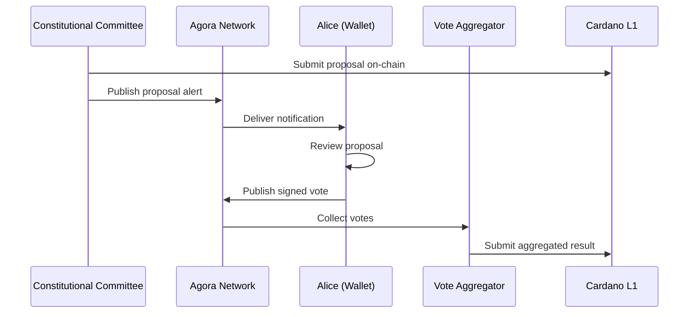

# GOV-01: Actionable DAO Governance

**Use Case Definition: Agora for Actionable DAO Governance**

!!! info "Related Documents"
    - PRD_Cardano Agora

## Executive Summary

This use case defines the role of Cardano Agora as the **"Secure Notification & Voting Bus"** for the Voltaire era and DAO governance.

Currently, governance is fragmented: proposals are posted on forums (IdeaScale, GitHub), discussions happen on Discord, and voting occurs on separate dApps. Users often miss critical voting windows because they rely on social media feeds for alerts.

Agora solves this by enabling a **direct, authenticated communication channel** between Governance Bodies (DAOs, Constitutional Committee, DReps) and the Voter. It transforms governance from a passive, "pull-based" activity (checking a website) into an active, **"push-based" experience** where users receive Actionable Notifications in their wallets and can cast votes without leaving the interface.

## Strategic Value Proposition

| Value | Description |
|-------|-------------|
| **Reliability (Guaranteed Delivery)** | Unlike Twitter or Discord algorithms that may bury an announcement, Agora ensures that every subscribed wallet receives the "New Proposal" notification. This is critical for achieving quorum |
| **Security (Anti-Phishing)** | Governance messages are cryptographically signed by the proposal creator (e.g., the Constitutional Committee's multisig DID). Wallets can display a "Verified" badge, protecting users from fake proposal scams |
| **In-Wallet Experience** | By embedding the "Vote" action directly into the notification payload, Agora reduces the friction of voting from ~5 minutes (connect wallet, find dApp, navigate) to <10 seconds |
| **Censorship Resistance** | Relying on centralized Web2 platforms for governance discussion introduces a central point of failure. Agora ensures the debate and the voting signals travel over a decentralized network of SPOs |

## Actors & Roles

| Actor | Role in Agora | Description |
|-------|---------------|-------------|
| **Governance Body** | Publisher | The entity initiating a vote. This could be a DAO Smart Contract, the Constitutional Committee, or a DRep. They publish the Proposal Notification |
| **Voter / Wallet** | Subscriber & Publisher | The ADA holder. They subscribe to governance topics to receive alerts and publish their signed "Vote" message back to the network |
| **SPO Node** | Relayer & Store | The infrastructure provider. Crucially, they serve as the **Durable Storage** layer, ensuring proposal metadata persists for the entire voting period (e.g., 14 days) |
| **Vote Aggregator** | Subscriber | An off-chain service or Oracle that listens to vote messages, aggregates the tally, and submits the final result or proof to the L1 ledger |

## Operational Flow: "The Constitutional Vote"

**Scenario:** The Constitutional Committee raises a "State of No Confidence" motion. This is a critical, time-sensitive vote (7 days) requiring high participation.

### Step 1: Proposal Submission & Notification

- **Action:** The Committee submits the proposal on-chain (L1)
- **Broadcast:** Simultaneously, they publish an Agora Message to the topic `governance/cip-1694/alerts`
- **Payload:** Proposal Hash, Title ("Motion of No Confidence"), Summary, End Epoch, and Action: Vote
- **Verification:** Agora nodes verify the message is signed by the known Committee keys before relaying

### Step 2: Delivery & Alert

- **Reception:** Alice's wallet (subscribed to `governance/cip-1694/alerts`) receives the message
- **Display:** The wallet validates the signature and displays a high-priority "Official Governance Alert" push notification: *"Critical Vote: Motion of No Confidence. Ends in 48h."*

### Step 3: In-Wallet Review

- **Interaction:** Alice taps the notification. The wallet expands the message, showing the summary and a link to the full text (IPFS)
- **Context:** The wallet may also pull "DRep Recommendations" from a separate Agora topic (`governance/dreps/recommendations`) to help Alice decide

### Step 4: Casting the Vote

- **Action:** Alice selects "Vote No" directly in the message interface
- **Signing:** The wallet constructs a vote message (referencing the Proposal ID + "No") and prompts Alice to sign it
- **Publishing:** The wallet publishes this message to `governance/votes/{proposal_id}`

### Step 5: Aggregation & Settlement

- **Tallying:** Aggregator nodes (subscribers) collect all signed vote messages for that proposal ID
- **Settlement:** Depending on the governance model:
    - **Direct:** The vote is a signal; Alice later submits an L1 transaction to finalize (Agora acted as the coordination layer)
    - **Batch:** An aggregator bundles 1,000 Agora vote signatures into a single L1 transaction to save fees



## Technical Specifications

### Topic Taxonomy

Governance requires a structured topic tree to separate high-noise (votes) from high-signal (proposals).

| Topic ID | Access | Retention | Purpose |
|----------|--------|-----------|---------|
| `governance/proposals` | Moderated | Long (30 days) | Official notifications of new proposals. Only authorized bodies can publish |
| `governance/votes/{proposal_id}` | Public | Medium (14 days) | The stream of user votes for a specific proposal |
| `governance/discussion/{proposal_id}` | Public | Medium (14 days) | Open forum/comments for the proposal |

### Message Payload Structure (Protobuf)

The Vote message needs to be lightweight but cryptographically verifiable.

```protobuf
message GovernanceVote {
  // The on-chain ID of the proposal being voted on
  string proposal_id = 1;

  // The vote choice (e.g., YES, NO, ABSTAIN)
  enum VoteOption {
    YES = 0;
    NO = 1;
    ABSTAIN = 2;
  }
  VoteOption choice = 2;

  // Optional: A justification url or hash
  string justification_url = 3;

  // The Voter's verification key
  bytes voter_vkey = 4;

  // Signature of (proposal_id + choice)
  bytes signature = 5;
}
```

### Persistence Requirements

Unlike "DeFi Intents" which can expire in minutes, Governance messages must adhere to **Strict Durability**.

- **Requirement:** Nodes must enforce `retentionPeriod >= The on-chain Voting Period + 2 Epochs`
- **Replication:** Higher `replicationFactor` (e.g., 7-10) is recommended to ensure data availability even if many nodes churn

## Requirements Integration

| Governance Requirement | Agora Feature Support |
|-----------------------|----------------------|
| **Reliable Notification** | CP-4 (Persistence): Ensures proposal data is available for the full 14-day voting window, even if users come online late |
| **Verified Source** | SEC-3 (Authentication): Ensures alerts claim to be from the "Constitutional Committee" are actually signed by their keys |
| **Spam Protection** | DP-4 (Anti-Spam): `governance/proposals` is a "Moderated" topic (write-access restricted to on-chain auth token holders) |
| **Auditability** | CP-5 (Immutability): The history of the proposal and discussion is preserved in the decentralized store for audit |

## Open Questions / Next Steps

1. **Vote Aggregation Standardization:** If Agora is used for "Soft Signaling" before on-chain votes, do we need a standard specification for how Aggregators prove the result?

2. **DRep Identity Integration:** How do we link an Agora Publisher ID to a registered DRep ID (CIP-1694) to display their "Reputation" alongside their forum posts?

3. **Large Scale Discussion:** A controversial proposal could generate 100k+ discussion messages. Do we need "Sharding" for the discussion topic type?
