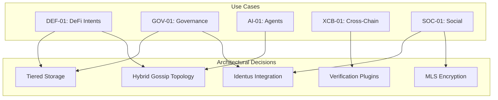

# Key Use Cases (Architectural Drivers)

These five use cases serve as the primary architectural drivers for Agora. Each defines specific technical requirements that shape the system design.

## Use Case Index

| ID | Name | Critical Driver | Primary Layers |
|----|------|-----------------|----------------|
| [DEF-01](def-01-defi-intents.md) | DeFi Intents | Latency < 1s | L1 (Gossip), L2 (Hot Cache) |
| [GOV-01](gov-01-governance.md) | DAO Governance | Identity & Trust | L1 (Harary), L3 (Identus) |
| [AI-01](ai-01-agents.md) | Autonomous Agents | Throughput & Structure | L1 (Burst), L5 (CBOR) |
| [XCB-01](xcb-01-cross-chain.md) | Cross-Chain Bridge | Foreign Verification | L3 (Verifier Plugins) |
| [SOC-01](soc-01-social.md) | Token-Gated Social | Privacy & Gating | L3 (L1 Oracle), L4 (MLS) |

## How These Drive Architecture

## Cross-Reference Matrix

| Requirement | DEF-01 | GOV-01 | AI-01 | XCB-01 | SOC-01 |
|-------------|--------|--------|-------|--------|--------|
| Low Latency (<500ms) | ✅ Primary | - | ✅ | - | - |
| Guaranteed Delivery | - | ✅ Primary | - | - | - |
| E2EE (MLS) | - | - | ✅ | - | ✅ Primary |
| Identus DID | - | ✅ Primary | - | - | ✅ |
| L1 State Verification | - | - | - | ✅ | ✅ Primary |
| Foreign Chain Proofs | - | - | - | ✅ Primary | - |
| High Throughput | ✅ | - | ✅ Primary | - | - |
| Durable Storage | - | ✅ Primary | - | - | ✅ |
| Ephemeral Storage | ✅ Primary | - | ✅ | - | - |
