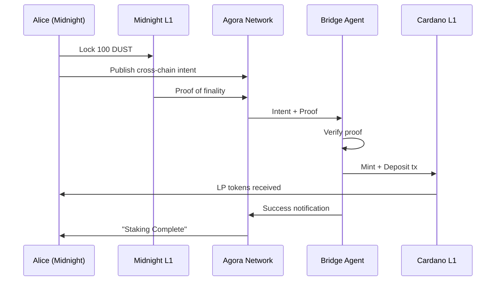

# XCB-01: Cross-Chain "Bridge & Stake"

**Use Case Definition: Agora for Cross-Chain "Bridge & Stake"**

## Executive Summary

This use case defines Cardano Agora's role as the **"Interoperability Signaling Layer"** for the Partner Chain ecosystem (Midnight, Sidechains) and external networks.

Traditionally, moving liquidity between chains is a high-friction "funnel killer," requiring users to: (1) Find a bridge, (2) Lock assets, (3) Wait for confirmation, (4) Switch networks, (5) Claim assets, and (6) Deposit into a DeFi protocol.

Agora collapses this into a **"One-Click Bridge & Stake"** experience. By decoupling the signaling of cross-chain events from the slow consensus of the underlying ledgers, Agora allows users to express complex cross-chain intents (e.g., "Move my BTC from Bitcoin to Cardano and immediately stake it in Lending Protocol X") as a single message. Agents listen for these signals and execute the multi-chain orchestration.

## Strategic Value Proposition

| Value | Description |
|-------|-------------|
| **Liquidity Acquisition Funnel** | Transforms Agora from a communication tool into a "TVL Magnet." Cardano DeFi protocols can proactively market yield opportunities to users on Partner Chains (e.g., Midnight) and offer immediate execution |
| **UX Abstraction** | Removes the need for users to manually interact with bridge interfaces or manage gas on the destination chain. The Agent handles the "Mint & Deposit" complexity |
| **Reduced Latency Perception** | While the underlying bridge finality takes time, the Agora signal is instant. The user receives immediate feedback ("Bridging in progress...") via the message bus, maintaining engagement |
| **Unified Standard** | Instead of every bridge building a proprietary notification system, Agora provides a universal transport for "Bridge Events" and "Cross-Chain Intents" |

## Actors & Roles

| Actor | Role in Agora | Description |
|-------|---------------|-------------|
| **Source User** | Publisher | The user on the external chain (e.g., Midnight, Bitcoin) initiating the transfer. They sign the Agora Intent |
| **Destination Protocol** | Publisher | The Cardano DeFi protocol (e.g., LenFi, Liqwid) broadcasting yield opportunities to external chains |
| **Bridge Agent** | Subscriber & Relayer | A specialized solver that listens for Agora signals, verifies source-chain finality (proofs), and executes the mint/deposit on Cardano |
| **Verifier Node** | Relayer | Agora nodes with the "State Verification" module enabled, capable of validating light-client proofs (Mithril, ZK) attached to messages |

## Operational Flow: "Midnight to Cardano Yield"

**Scenario:** Alice holds DUST on the Midnight blockchain. She receives an Agora notification in her wallet: *"Earn 5% APY on your DUST by staking in Cardano Protocol X."*

### Step 1: Opportunity & Intent

- **Trigger:** Alice clicks "Bridge & Stake" on the notification
- **Construction:** Her wallet constructs a complex Cross-Chain Intent:
    - **Source Action:** Lock 100 DUST on Midnight Bridge Contract
    - **Destination Action:** Mint Wrapped DUST on Cardano → Deposit to Protocol X
    - **Reward:** 5% APY

### Step 2: Source Execution & Signaling

- **L1 Action:** Alice signs the "Lock" transaction on Midnight
- **Agora Publication:** Once the lock is submitted, her wallet publishes a message to `crosschain/midnight-cardano/intents`
- **Payload:** Transaction Hash of the Lock + "Intent: Deposit to Protocol X"

### Step 3: Propagation & Proof Attachment

- **Observation:** The Agora network propagates the intent
- **Proof Generation:** As the Midnight transaction confirms, a "Prover Service" (or the Bridge Agent) generates a cryptographic proof (e.g., a ZK-proof or Mithril signature) attesting that the lock is final
- **Update:** This proof is appended to the Agora message thread or referenced in a follow-up "Proof Available" message

### Step 4: Destination Execution (The Agent)

- **Verification:** A Bridge Agent on Cardano receives the Intent + Proof via Agora
- **Validation:** The Agent verifies the proof against the Midnight Light Client running on Cardano (or off-chain)
- **Execution:** The Agent submits a transaction on Cardano that:
    1. Mints Wrapped DUST (using the proof)
    2. Deposits the Wrapped DUST into Protocol X on Alice's behalf
    3. Sends the LP tokens to Alice's Cardano address

### Step 5: Notification

- **Completion:** The Agent publishes a `execution/success` message to Alice's Agora inbox
- **Result:** Alice sees "Staking Complete" in her wallet. She successfully moved yield without manually switching networks



## Technical Specifications

### Topic Taxonomy

Cross-chain topics must be segmented by the "Bridge Pair" to ensure Agents can filter relevant traffic.

| Topic ID | Access | Purpose |
|----------|--------|---------|
| `crosschain/{source}-{dest}/opportunities` | Public | Protocols advertising yield to attract liquidity |
| `crosschain/{source}-{dest}/intents` | Public | User intents signaling a desire to bridge |
| `crosschain/{source}-{dest}/proofs` | Public | High-bandwidth topic for propagating ZK/Mithril proofs associated with intents |

### Message Payload (Protobuf)

The payload must support "Foreign Addressing" (addresses that don't look like Cardano addresses) and "Proof Blobs."

```protobuf
message CrossChainIntent {
  // The source chain identifier (e.g., "midnight-mainnet", "bitcoin")
  string source_chain_id = 1;

  // The user's address on the SOURCE chain
  string source_address = 2;

  // The user's address on the DESTINATION (Cardano) chain
  string destination_address = 3;

  // The action payload (e.g., "Deposit 100 WDUST to ScriptHash X")
  bytes action_payload = 4;

  // Optional: Reference to the source chain transaction hash (The "Lock")
  string source_tx_hash = 5;

  // Optional: The cryptographic proof data (if small enough for Agora msg)
  bytes proof_data = 6;
}
```

### Verification Module

To support this, Agora Nodes require a modular architecture where "Verification Plugins" can be loaded.

- **Requirement:** The node must be able to parse non-Cardano signature schemes (e.g., Schnorr for Bitcoin, Ed25519 for Midnight) to validate that the sender of the intent actually owns the source address
- **State Verification:** For advanced security, the node may check a Light Client endpoint to verify the `source_tx_hash` exists before propagating the message, preventing "Fake Intent" spam

## Requirements Integration

| Cross-Chain Requirement | Agora Feature Support |
|------------------------|----------------------|
| **Non-Native Addressing** | SDK-8 (Multi-Chain Identity): The SDK and message schema must support string-based address formats for generic chain compatibility |
| **Proof Propagation** | DP-6 (Large Payloads): While Agora is optimized for small messages, it must support "Blob Attachments" (up to ~64KB) for ZK-proofs, or reliable linking to IPFS/Arweave |
| **Agent Discovery** | ECO-4 (Service Discovery): Users need to find which Agents support "Midnight bridging." The Agora Registry allows Agents to advertise their capabilities |
| **Interoperability** | INT-1 (Partner Chains): Specific mandates to support Midnight and Sidechain architectures as first-class citizens in the topic tree |

## Open Questions / Next Steps

1. **Proof Size Limits:** ZK-SNARKs are small, but STARKs or full block headers might exceed Agora's message size limits. Do we need a "Sidecar" download protocol for heavy proofs?

2. **Atomicity:** What happens if the User locks funds on Midnight, but the Agent fails to mint on Cardano?
    - *Mitigation:* The "Intent" mechanism must rely on a trust-minimized bridge contract that allows the user to "Reclaim" funds on Source after a timeout if no Mint proof is provided

3. **Fee Payment:** The user has DUST, not ADA. The Agent must pay the Cardano gas. The economics of the "Spread" (taking a cut of the DUST) must be explicitly defined in the Agent standard
