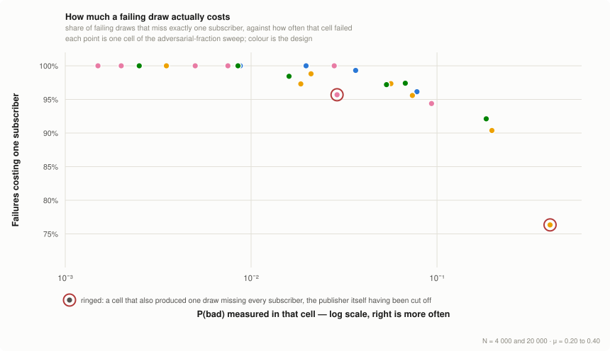

<!-- Existing categories:

- Meta      | For meta-CIPs which typically serves another category or group of categories.
- Wallets   | For standardisation across wallets (hardware, full-node or light).
- Tokens    | About tokens (fungible or non-fungible) and minting policies in general.
- Metadata  | For proposals around metadata (on-chain or off-chain).
- Tools     | A broad category for ecosystem tools not falling into any other category.
- Plutus    | Changes or additions to Plutus
- Ledger    | For proposals regarding the Cardano ledger (including Reward Sharing Schemes)
- Consensus | For proposals affecting implementations of the Cardano Consensus layer and algorithms
- Network   | Specifications and implementations of Cardano's network protocols and applications

-->

## Abstract
<!-- A short (\~200 word) description of the proposed solution and the technical issue being addressed. -->

The Cardano ecosystem lacks a decentralised layer for [messages](#term-message) that must be trustworthy but do not belong on the chain itself. Emergency alerts to stake pool operators, notifications from pools to their delegators, dApp and wallet messaging, and governance communication all run on centralised infrastructure today. Nothing binds a message to the on-chain identity of its sender, and delivery depends on a single service, so coordination around a Byzantine-fault-tolerant chain does not inherit its guarantees. Existing peer-to-peer solutions such as GossipSub[^gossipsub] do not close the gap: their resistance to eclipse rests on a discovery layer that admits freely created identities.

We propose a decentralised topic-based publish/subscribe protocol anchored on Cardano. The chain serves as the protocol's trust root. [Nodes](#term-node) [register](#term-registry) on-chain, which makes identities verifiable and costly to mass-produce. Each [epoch](#term-epoch), verifiable on-chain randomness derives a fresh, degree-bounded dissemination topology that any participant can recompute but none can influence. Topics carry arbitrary application content: the chain anchors trust, not the payload. Against an adversary controlling a bounded fraction of nodes, the per-epoch probability that any honest publisher fails to reach every honest subscriber is a tunable design target. The design is grounded in formal analysis and simulation at deployment scale, cross-validated between independent implementations.

> [!NOTE]
> **This document reports what the evidence establishes; it does not yet select a design.** *Proposed* is meant literally. Two candidates remain, several parameters are deployment choices rather than results, and [Path to Active](#acceptance-criteria) lists what would close each gap.

## Motivation: Why is this CIP necessary?
<!-- A clear explanation that introduces the reason for a proposal, its use cases and stakeholders. If the CIP changes an established design then it must outline design issues that motivate a rework. For complex proposals, authors must write a Cardano Problem Statement (CPS) as defined in CIP-9999 and link to it as the `Motivation`. -->

### The gap

Cardano does not run itself. Behind the protocol sits a network of people and services that must hear from one another for the system to function: stake pool operators must learn of a critical vulnerability before it is exploited, delegators that their pool is retiring, voters that a governance action is open while there is still time to act on it. The chain's security and governance models quietly presume this communication happens: incident response assumes operators can be reached, accountability assumes constituents hear from their representatives.

Yet Cardano has no standard way to deliver a [message](#term-message) that must be trustworthy but does not belong in a transaction. The chain settles state; it is not a medium for the operational and time-sensitive traffic around that state. Today that traffic runs on infrastructure outside the ecosystem's trust model: mailing lists, Discord and Telegram channels, vendor push services, each provider's own backend.

Traffic of this kind needs three of the four classic communication-security properties:

- **Authenticity.** The recipient can verify who sent a message.
- **Integrity.** It arrived as written.
- **Availability.** It reaches everyone it should, when it should.

Confidentiality, the fourth, is not required here: these messages are broadcasts, meant to be read.

Existing channels each provide some of these properties, none all three. An end-to-end encrypted messenger preserves integrity and confidentiality, but its notion of identity has no connection to Cardano's: an operator receiving an urgent notice cannot verify that it came from the protocol team it appears to come from, that it is the current version, or that other operators received it too. Availability fares worse, because each channel is a single privately run service: messages can be dropped, delayed, or delivered selectively, through outage, compromise, or policy, and the recipient cannot tell which. The chain beneath is Byzantine-fault-tolerant; the channel used to coordinate around it is not, and the weaker layer sets the effective guarantee.

### Why existing peer-to-peer messaging does not close it

Substituting a peer-to-peer protocol for the centralised channel removes the operator but does not, on its own, supply the missing guarantee.

Mature gossip protocols, of which GossipSub is the widely deployed example, are engineered against message-level attacks such as flooding and spam, and mitigate them with peer scoring and mesh hardening.[^gossipsub] Their resistance to *eclipse* — a victim whose every neighbour is adversarial, and whose view of the network is therefore controlled — rests on the peer discovery layer beneath, and in the common libp2p deployment that layer admits freely created identities.[^libp2p] An adversary willing to run many of them can influence which peers a target connects to, and neither peer scoring nor mesh hardening restores a guarantee lost at the point of neighbour selection.

The missing ingredient is therefore not a better gossip mechanism. It is a peer set whose membership is costly to inflate and whose topology no participant can steer. Cardano maintains both already: an on-chain [registry](#term-registry) with an associated cost is exactly a Sybil-resisted membership list, and its per-epoch randomness is verifiable as well as unpredictable. A dissemination layer anchored on both can offer what neither a centralised broker nor an unanchored gossip mesh can.

### Use cases and stakeholders

Four scenarios have driven the design so far, drawn from a [broader survey of candidate use cases](https://github.com/input-output-hk/pubsub/blob/main/docs/actor-use-case-analysis.md). Each is given with the counts that shape the protocol and with what it asks of the design.

<div align="center">
<a name="table-1" id="table-1"></a>

| Scenario | Publishers | Direct participants | What it asks of the design |
| --- | --- | --- | --- |
| Protocol teams → stake pool operators: emergency alerts | ~10 | ~3,000 SPO nodes, always-on | The strongest delivery guarantee |
| Stake pools → delegators: announcements | Hundreds | Wallet backends, mediated | Best-effort only |
| Governance bodies and dReps → community: proposals, voting alerts, voting-intent disclosure | Tens to hundreds | Wallet backends, mediated | Delivery inside a voting deadline |
| dApps → users: position and protocol alerts | Tens | Wallet backends, mediated | Delivery targeted by address |

<em>Table 1: the four motivating scenarios</em>

</div>

The design is tuned to the rows where a missed message carries a cost — operational for an unheeded vulnerability alert, financial for a dApp position alert — and the first of them also sets the scale it is evaluated at. The mediated rows are less demanding but smaller, and the Rationale is explicit that its evidence does not reach topics of tens of nodes. Two further things follow from the table.

First, **the audience is large but the participant set is not.** Recipients in the hundreds of thousands are reached through wallet infrastructure providers, of which there are on the order of ten. The [nodes](#term-node) that must disseminate are the always-on operators — stake pools, wallet backends, dApp and governance infrastructure — in the low thousands today and dominated by the roughly three thousand stake pools. The Rationale evaluates at four thousand nodes to match that and twenty thousand as headroom, a scale at which a topology bounded in connections per node, and derivable in full by every participant, is tractable rather than aspirational.

Second, **the participants are already registered on-chain, or can be.** Stake pool operators are registered by construction, which makes an on-chain trust root a natural fit rather than an imposition: the registry substantially exists, and the identities in it are already backed by a cost.

Stakeholders follow: stake pool operators, the largest set of direct participants and the recipients in the delivery-critical scenario; wallet and infrastructure providers, whose integration connects the protocol to end users; governance bodies, dReps, and dApp teams as publishers; and protocol developer teams, who today have no authenticated broadcast channel to operators at all.

### What a solution has to provide

Together with the failure mode above, these scenarios imply requirements that rule out both incumbent options:

- **Authenticity and integrity.** A recipient must be able to verify that a message originated with the claimed publisher and reached them as written, without trusting the path it arrived over. A signature that verifies establishes both, so integrity needs no separate mechanism.
- **Censorship resistance.** Availability restated against an adversary that chooses its target: suppressing a message must require luck rather than choice. Isolation cannot be prevented in every draw: a subscriber whose every upstream peer happens to be adversarial receives nothing, however small the adversarial fraction. The requirement is therefore that such isolation be rare, that it end when the topology is next drawn, and that it not be repeatable at will. The Rationale quantifies the first two.
- **Non-influenceable neighbour selection.** Which peers a node disseminates with must be set by the protocol, not negotiated between participants, and no participant may steer that choice: not by registering additional identities, not by timing its own registration, not by influencing the randomness it derives from. This is what a discovery layer with freely created identities fails to provide, and what makes the requirement above achievable at all.
- **Bounded cost per node.** No node may have to hold connections, or carry traffic, in proportion to the size of the network — the Rationale measures these as *standing [links](#term-link) per node* and *copies per honest node*. Both must stay bounded as the network grows, or only well-resourced operators will participate and the centralisation returns informally.
- **Openness to arbitrary payloads.** The scenarios differ widely in content and cadence. The protocol carries topics, and does not interpret what those topics transport.

The Specification that follows defines a protocol meeting these requirements: on-chain registration for the peer set, per-epoch verifiable randomness for the topology drawn over it, and topics as the unit of subscription. The Rationale then examines where the guarantees stop.

## Specification
<!-- The technical specification should describe the proposed improvement in sufficient technical detail. In particular, it should provide enough information that an implementation can be performed solely on the basis of the design in the CIP. This is necessary to facilitate multiple, interoperable implementations. This must include how the CIP should be versioned, if not covered under an optional Versioning main heading. If a proposal defines structure of on-chain data it must include a CDDL schema in its specification.-->

<!-- Conventions used in the rest of this document.

     FORWARD-REF(target): marks prose that points at a section not yet written.
     Each names the target section and what must exist there, so the reference
     can be completed without recovering the intent. Grep FORWARD-REF before
     declaring a section finished.

     OPEN(name): marks a subsection that is deliberately unresolved. Each names
     what will be fixed there, what decides it, and where the decision is
     tracked, so the surrounding prose reads normally and only the marked
     subsection changes when the question closes. Grep OPEN before claiming the
     proposal is complete.

     Terminology links: the first use of a Terminology term within each
     top-level section links to its entry (#term-...); later uses in the same
     section do not. Link text stays the bare word, so the prose reads
     unchanged. -->

This section specifies the protocol, and what it aims at is an interoperable implementation written from this document alone. It is ordered by how settled its parts are rather than by the order a node executes them.

**Settled, and stated first:** the vocabulary, the shape of the system, the canonical encodings every implementation must agree on, what an epoch and its randomness are, how a node derives the links it will hold, and the parameter surface that follows.

**Drafted, and collapsed after them:** the on-chain registries, identity and keys, link establishment, the message format, dissemination and recovery, and versioning. These are written out in full and are the current working text; they are collapsed because they have not been reviewed to the standard the settled sections have, not because they are empty.

The proposal does not yet reach the standard above, and what it leaves open is of four kinds. Each one is marked where it arises rather than only here, so a reader meets it alongside the mechanism it affects.

- **The dissemination design is not yet fixed.** Which link kinds exist, how many links a node opens of each, and in which direction they carry traffic remain open; two candidates stand, and the evidence measures both without selecting between them. Until the question closes an implementation MUST treat the choice as configuration. When it closes, this proposal will either specify one design or specify both, with their trade-offs stated. See [The dissemination design](#the-dissemination-design).
- **Three components are given as interfaces rather than mechanisms.** The [randomness beacon](#epochs-and-the-randomness-beacon), [address resolution](#address-resolution) and the on-chain validators state the requirements they must meet, and a conforming deployment MAY satisfy each in more than one way.
- **Six of the ten parameters in [Table 4](#table-4) carry a rule or a bound rather than a value.**
- **The transport is left to the deployment.** What is fixed here are the canonical byte strings every implementation must agree on, not the framing or session layer that carries them, subject to the rule that a peer's identity is taken from the signed preimage and never from the connection it arrived over.

Everything else is settled. The gate, link establishment, the message format, dissemination and recovery are all stated in terms of link kinds, rules and interfaces, so closing one of these questions supplies a value or a component without reinterpreting the design around it, and the [Versioning](#versioning) rules say how each such change reaches a running deployment.

The key words MUST, MUST NOT, SHOULD, SHOULD NOT and MAY are to be interpreted as described in [RFC 2119](https://www.rfc-editor.org/rfc/rfc2119).

### Terminology

Several words below carry an established Cardano meaning that is *not* the meaning used here, and a reader who imports the familiar one will misread the design rather than merely miss a nuance. The table fixes the protocol's vocabulary, and names the colliding term where one exists; the right-hand column is empty for the entries that are simply defined here and collide with nothing. The quantities used to *measure* a design, rather than to configure one, are defined separately in [Table 6](#table-6).

<div align="center">
<a name="table-2" id="table-2"></a>

| Term | In this proposal | Not to be confused with |
| --- | --- | --- |
| <a name="term-epoch" id="term-epoch"></a>**epoch** | One dissemination period: the interval for which a drawn topology stands, indexed *e*. Its length is a parameter of this proposal. | The Cardano **ledger epoch** of five days. The two are independent; this proposal does not require them to coincide, and the dissemination epoch is expected to be far shorter. |
| <a name="term-node" id="term-node"></a>**node** | A process that has registered in the node registry and participates in dissemination. | A **Cardano node**, block-producing or otherwise. A pub/sub node runs alongside one and reads from it; it does not validate blocks. |
| <a name="term-relay" id="term-relay"></a>**relay** | A role, not a class of machine: any node forwarding another party's message on a topic it subscribes to. Every subscriber relays. | An **SPO relay node**, which is a distinct, privileged piece of infrastructure. There is no relay tier here, and no node is designated to carry traffic for others. |
| <a name="term-registry" id="term-registry"></a>**registry**, **registration** | The protocol's own two on-chain registries, holding participating nodes and topics. | **Stake pool registration**, **dRep registration**, or the entries these create. Registering here neither requires nor implies either. |
| <a name="term-deposit" id="term-deposit"></a>**deposit** | Ada locked by a registration entry for as long as it stands, making identities costly to mass-produce. Returned after retirement, once the withdrawal delay has elapsed. | **Pledge**, delegated **stake**, or a governance deposit. It is not delegated, earns nothing, and confers no weight in the protocol beyond the right to hold one identity. |
| <a name="term-link" id="term-link"></a>**link** | A logical channel identified by a peer, a topic and a link kind, held for the whole epoch. Not a transport connection: many links MAY share one, and doing so is RECOMMENDED; see [Link establishment](#link-establishment). | |
| <a name="term-message" id="term-message"></a>**message** | An application payload published to a topic, signed end to end by its publisher. | A **transaction**, or a Cardano network-protocol message. Messages are never written to the chain. |
| <a name="term-beacon" id="term-beacon"></a>**beacon** | The source of the per-epoch randomness *η*, treated here as an interface with stated requirements. | The ledger's **epoch nonce** specifically. That nonce is one candidate source among others; the choice is open. |
| <a name="term-pick-count" id="term-pick-count"></a>**pick count**, *k* | How many peers one node picks to link to, per topic and per link kind. Named per kind where the kind matters: the relay pick count, the seeding pick count. Measured configurations and the formal analysis label the relay case *RF*, which is why the design tables and figures below read *RF* = 13 rather than *k* = 13. | A **replication factor**, which in this project means how many replication servers hold a topic and belongs to the deferred storage layer. Nor the relay-tier extension's fanout, which that proposal also writes *k*: there is no relay tier here, and nothing is replicated to *k* places. |
| <a name="term-eligible" id="term-eligible"></a>**eligible peers** | The registered peers a given node may link to in a given epoch, being those its gate admits. Roughly one in *B* of the topic, and so far larger than the number of links it opens: it picks those from this set privately. | |
| <a name="term-b" id="term-b"></a>**bucket count**, *B* | How narrow the verifiable gate is. Roughly one candidate in *B* survives it for a given node and epoch. | |
| <a name="term-r" id="term-r"></a>**selection headroom**, *r* | How many peers the gate leaves a node eligible to link to, per link it must open. Its floor is what keeps the draw random. A property of the gate rather than of the coverage target. | |
| <a name="term-cap" id="term-cap"></a>**serving cap**, *C* | How many links a node will admit on one topic for one link kind that it did not itself select. An admissions budget: a commitment to serve, never a limit on what the node may open, and refusing beyond it is normal behaviour rather than a fault. | Not a bound on a node's total degree; a node's own picks are never charged against it. |

<em>Table 2: the protocol's vocabulary, and where it collides with an established term</em>

</div>

### Architecture

The chain is the protocol's trust root and carries none of its traffic. Two registries record who may participate and who may publish, and a randomness beacon supplies one unpredictable value per [epoch](#term-epoch). From those three public inputs, plus its own registered identity, every [node](#term-node) computes, for each topic it subscribes to, the set of peers it is permitted to link with — and so can anyone else, for any node. From that set it then draws privately the [links](#term-link) it will hold for the epoch. Messages then travel over those links.

<div align="center">
<a name="figure-1" id="figure-1"></a>


<em>Figure 1: the protocol at a glance</em>

</div>

Three properties of that arrangement carry most of the design.

**Derivation replaces discovery.** A node does not ask peers who its peers should be. It reads the [registry](#term-registry), applies a public predicate, and dials the result. There is no gossiped view of the network to poison, because there is no view: the peers a node may consider are the registry itself. This is what removes the attack surface the [Motivation](#motivation-why-is-this-cip-necessary) identified in discovery layers that admit freely created identities.

**The topology is checkable, not merely asserted.** Because the predicate is a function of public data, any participant can recompute which links a given node was permitted to hold in a given epoch and check the ones it actually holds. A node that dials outside its permitted set produces signed evidence of having done so.

**What a node keeps private is its own draw, not its position.** The predicate narrows a node's eligible set; which of those peers it then picks is its own randomness and is not required to be checkable. That split is deliberate, and [Topology derivation](#topology-derivation) states precisely where it falls.

### Canonical encoding and domain separation

Every signature in the protocol is over a canonical byte string, never over a serialised structure, so that two implementations cannot disagree by encoding the same content differently. Three rules apply throughout:

- Variable-length fields are **length-prefixed**, written `LP(x)`: a four-byte big-endian length followed by the bytes.
- Integers are **big-endian and fixed width**.
- Every preimage begins with a length-prefixed **domain tag** naming what is being signed, so a signature valid in one role cannot be replayed into another.

A node identity is an Ed25519 public key,[^ed25519] and wherever it enters a preimage it is consumed raw, never in a display form.

### Epochs and the randomness beacon

An [epoch](#term-epoch) is the unit the topology stands for: epoch *e* runs for *T*<sub>epoch</sub>, and for its whole duration every node holds the links derived for *e* and re-derives nothing. Rotation to *e*+1 bounds how long a subscriber can be cut off, so *T*<sub>epoch</sub> is a security parameter and not merely an operational one. Its value is open; the [Rationale](#how-long-an-epoch-may-be) bounds it from both directions and shows only the upper bound binds.

Each epoch has one randomness value *η*<sub>e</sub>, a byte string, supplied by a **beacon**. The choice of source is open, so the beacon is specified here as an interface rather than a mechanism. A conforming source MUST meet all four of:

1. **Unbiasable.** No participant, and no coalition of the size the protocol is analysed against, may influence *η*<sub>e</sub> towards a value of its choosing.
2. **Grinding-resistant.** The same requirement stated against a party that can cheaply enumerate candidate values: no adversary may search over anything it controls to move where it lands in the topology.
3. **Publicly recomputable.** Every node derives the identical value from chain data alone — no service to trust, no round of agreement.
4. **Fixed after the epoch's registration cutoff.** The membership the topology is drawn over is settled before the randomness that draws it.

Requirements 3 and 4 are the pair that interact. Public recomputability means *η*<sub>e</sub> becomes knowable at some point; the cutoff ordering means membership is already closed when it does. Neither alone suffices, and the [Rationale](#what-the-protocol-guarantees-instead) states why the independence of successive draws depends on both.

The beacon also floors *T*<sub>epoch</sub>, which cannot be shorter than the interval at which a fresh unbiasable value is available: a per-block source would permit epochs of seconds, a ledger-derived per-epoch nonce would force five days. The source therefore decides whether epoch length is constrained by the beacon or by the churn ceiling, and the choice is tracked as [issue #22](https://github.com/input-output-hk/pubsub/issues/22).

> [!WARNING]
> **A beacon derived from the chain inherits the chain's failure modes, and this layer is most needed exactly when the chain is having them.** Two cases matter, and neither is settled by this proposal. If the chain **forks**, nodes following different branches may read different *η*<sub>e</sub> and derive different topologies for the same epoch, splitting the overlay along the line the chain split on; deriving from a registration-cutoff snapshot deep enough to be stable bounds how often this happens but does not remove it, and no confirmation depth is fixed here. If the chain **halts**, no fresh *η* becomes available and rotation stops, so the topology of the last derivable epoch stands indefinitely. That is not a coverage failure — it is a topology that met the design target — but it suspends the bounded-exposure guarantee that rotation exists to provide, which is the one property a subscriber relies on when it is being cut off.
>
> Two heuristics were considered against this, and neither is adopted. A node might retain part of the previous epoch's links across a rotation, so that a node drawing badly is not left without usable peers while fresh randomness is unavailable. A deployment might also hold links to an operator-configured set of peers independently of any derivation, which by construction cannot diverge under a fork. Both are partition insurance rather than protocol, and both cut against the property that makes the rest of this design analysable — that no node chooses its own neighbours — so both are recorded here as open rather than specified. Their interaction with the coverage analysis is unmeasured.

### Topology derivation

Everything in this subsection is a pure function of the epoch's snapshot, *η*<sub>e</sub>, and the deriving node's own identity. No message is exchanged and no peer is consulted. Two nodes running the same derivation over the same inputs obtain the same answer, which is what lets an acceptor check a dialler's claim rather than take it.

<div align="center">
<a name="figure-2" id="figure-2"></a>


<em>Figure 2: deriving one node's links for one epoch</em>

</div>

The figure is drawn at exactly the sizing rule fixed below: 32 registered peers, *B* = 4, so eight are eligible, and *k* = 4 are picked from those eight. The ratio of the second row to the third is the [selection headroom](#term-r) *r* = 2, the smallest value this Specification permits.

The two halves of that picture differ in who can check them, and the split is the whole of the design's honesty about what it enforces. **Rows one and two are recomputable by anyone holding the chain**, so an acceptor, or any third party, can reject or expose a link outside the permitted set. **Row three is the node's own randomness and is not checkable by anyone**, because a private pick is what keeps the topology a random graph rather than a published one. Concretely, an acceptor presented with a dial verifies three things and nothing else:

- the dialler is registered on this topic, in the snapshot this epoch derives from;
- the gate holds for the ordered pair, recomputed from public data alone;
- accepting would not exceed the serving cap *C*.

Nobody can check *which* eligible peers a node chose, or that it opened any links at all. The gate bounds where an adversary may place itself; it does not compel anyone to participate.

#### The registered peers on a topic

Write *N*<sub>T</sub> for the number of nodes whose snapshot entry lists topic *T*. For a node *a* among them, the peers it might link to on *T* are the other *N*<sub>T</sub> − 1, and that is the full membership rather than a sample of it: there is no view, and therefore nothing to bias. Being registered on the topic says only that a link between the two would be legitimate; it does not mean the link exists, nor that the gate below admits it.

#### The verifiable gate

The gate narrows the candidates to those a node is permitted to link with in this epoch. For an ordered pair (*a*, *b*) on topic *T* under randomness *η*, with domain tag *d* and [bucket count](#term-b) *B*:

$$\mathrm{gate}_d(a, b, T, \eta, B) \iff \mathrm{trunc}_{64}\big(\mathrm{SHA\text{-}256}(P)\big) \bmod B = 0$$

where the preimage *P* and its reduction are fixed exactly as follows, since any divergence makes two implementations disagree about which links are legal:

$$P = \mathrm{LP}(d) \,\|\, \mathrm{LP}(\eta) \,\|\, \mathrm{LP}(T) \,\|\, \mathrm{LP}(a) \,\|\, \mathrm{LP}(b)$$

`LP` is the length prefix defined under [Canonical encoding and domain separation](#canonical-encoding-and-domain-separation); *T* is the raw 32-byte topic identifier and *a*, *b* are the raw identity public keys, never a display form. `trunc`<sub>64</sub> takes the first eight bytes of the digest as a big-endian unsigned integer. *B* = 1 makes the gate vacuous and every registered peer eligible, which is the correct degenerate behaviour on a topic too small to bucket.

The gate is evaluated on the **ordered** pair for a directional link and on the pair sorted by identity bytes for a symmetric one, so that both ends of a symmetric link compute the identical draw and neither can claim an edge the other does not see. That choice is measured rather than assumed. The alternative — drawing each direction independently and admitting the pair if either draw holds — doubles a pair's admissibility to 2/*B*, so it needs twice the bucket count for the same density; at equal density it sits on the same coverage cliff, it destroys the property that a node's own selections are immune to the admissions budget, and under a budget that binds its looser admission rule converts into roughly twice the honest starvation. The sorted pair dominates across the operating window.[^symgate] Each link kind uses its own domain tag, of the form `pubsub/gate/<kind>/v1`, so a node's choices for one kind are an independent draw from its choices for another.

The **eligible set** *S*<sub>d</sub>(*a*, *T*) is the registered peers for which the gate holds. Since SHA-256[^hashes] is modelled as a random oracle over inputs no participant controls after the cutoff, roughly (*N*<sub>T</sub> − 1)/*B* of them are eligible, and an adversary holding *A* identities has roughly *A*/*B* of its own eligible for any chosen victim. That division is the gate's purpose: it is what an attacker cannot escape by registering more identities, because each of them lands in a bucket it did not choose.

#### Selection headroom and the bucket count

Narrowing has a cost, and it is paid in the randomness of the draw. If the gate leaves a node barely as many eligible peers as it must open links to, the node has no choice left and the topology stops being a random graph. The [selection headroom](#term-r) is the ratio that measures this, for a link kind with pick count *k*:

$$r = \frac{N_\text{T} - 1}{B \cdot k}$$

*B* MUST be chosen so that *r* ≥ 2 for every link kind in use, and SHOULD be the largest such value. Both halves matter and pull the same way only because of where the coverage plateau falls: below *r* = 2 the failure probability rises, sharply, and above it a larger *B* is free coverage-wise while dividing an attacker's pressure further. The [Rationale](#choosing-the-admission-parameters) measures both sides and Figure 8 plots them.

> [!TIP]
> The rule an implementation applies is one line. For each link kind, take *B* = ⌊(*N*<sub>T</sub> − 1) / 2*k*⌋, and if that is less than 2, set *B* = 1 and leave the gate off: the topic is too small to bucket, and gating it would cost coverage for resistance it cannot buy.

The rule has an upper boundary as well as a lower one, and past it the gate stops being a defence at all. Narrowing beyond *B* = (*N*<sub>T</sub> − 1)/*k* leaves a candidate pool no larger than the pick count itself: a node takes everything eligible, and the gate has stopped dividing an attacker's pressure because there is nothing left to divide. Two things follow. The probability that a node's pool is empty altogether, about e<sup>−(1−*μ*)(*N*<sub>T</sub>−1)/*B*</sup>, stops being negligible, and it does not depend on the pick count, so no amount of fanout compensates for a pool that was never populated. And the [serving cap](#the-serving-cap) inverts: past this point no value of *C* both binds and stays harmless, since one loose enough to be safe protects nothing and one tight enough to bind makes isolation measurably more likely. The headroom rule keeps a deployment well inside this boundary, and the [Rationale](#choosing-the-admission-parameters) prices both edges.

*B* is therefore derived per topic and per epoch rather than configured, and every node derives the same value because *N*<sub>T</sub> comes from the snapshot. A deployment MAY instead forgo the pick step and let the gate alone set a node's degree, sizing *B* so that the expected eligible count is *k*+1; the [Rationale](#choosing-the-admission-parameters) measures this variant at roughly six per cent more traffic and the same coverage.

#### Selection

From its eligible set on each topic and for each link kind, a node picks *k* of them uniformly at random without replacement, and opens a link to each. If fewer than *k* are eligible, it links to all of them. The randomness used for this pick MUST be private to the node and unpredictable to others; it is not derived from *η*, and two nodes with identical registry entries must not make identical picks.

> [!IMPORTANT]
> **What is verifiable is that every link a node holds passes the gate, not that it picked the right peers.** The distinction is the whole of the design's honesty about what it enforces. An acceptor, or any third party, can recompute the gate and reject or expose a link outside the permitted set. Nobody can check *which* eligible peers a node chose, or that it opened any links at all, because the pick is private by construction and a node's silence is not attributable. The gate bounds where an adversary can place itself; it does not compel anyone to participate.

#### The dissemination design

<!-- OPEN(dissemination-design): this subsection fixes the link kinds, their
     pick counts, whether links are directional or symmetric, and whether a
     separate publication-seeding kind exists. The evidence does not select
     between M3 at (RF = 13, s = 7) and M4 at RF = 9; the Rationale's
     "Where this leaves the choice" states why. Selection is tracked as
     input-output-hk/pubsub#85 and turns on a fact about operators, namely
     whether a participating node's binding constraint is the traffic it
     carries or the connections it can hold open. Nothing outside this
     subsection depends on the answer: the gate, the headroom rule, the
     serving cap, the handshake, the message format and recovery are all
     stated in terms of "each link kind and its pick count k". -->

Everything above is stated for a link kind with a pick count. What remains is to fix which link kinds exist, how many links a node opens of each, and in which direction they carry traffic. **This proposal does not yet fix them.** Two candidates remain, and the evidence measures both without selecting between them.

Both candidates share every mechanism defined elsewhere in this section. They differ in four respects, and those four are what this subsection will state when the question closes:

- the **link kinds** in use, and the gate domain tag each evaluates under;
- the **pick count** *k* for each kind, and hence the total pick budget *K* per topic;
- whether a link is **directional**, carrying traffic one way and established by one end, or **symmetric**, carrying traffic both ways and established once for the pair;
- whether a separate **seeding link kind** exists, carrying only its owner's own publications rather than relaying others'.

<div align="center">
<a name="table-3" id="table-3"></a>

| | Relay links | Seeding links | Direction | Pick budget *K* | Standing links, mean / busiest |
| :--: | ---: | ---: | :--: | ---: | ---: |
| Candidate M3 | *RF* = 13 | *s* − 1 = 6 | directional | 19 | 38 / 64 |
| Candidate M4 | *RF* = 9 | none | symmetric | 9 | 18 / 37 |

<em>Table 3: the two candidate dissemination designs, each at its best known parameters</em>

</div>

The two are jointly non-dominated: M3 carries 22 % less traffic, M4 holds less than half the links, reaches its last subscriber sooner and absorbs more than three times the honest downtime. The [Rationale](#where-this-leaves-the-choice) measures all four axes and states, explicitly, that they do not select a winner. What would select one is a fact about the operators expected to run the layer rather than about the protocol, and it is posed in the [Open Questions](#open-questions). The decision is tracked as [issue #85](https://github.com/input-output-hk/pubsub/issues/85).

Until it closes, an implementation targeting this proposal MUST treat the dissemination design as configuration, and MUST NOT assume either candidate elsewhere. Everything in this section outside this subsection is stated in terms of link kinds and their pick counts, and holds unchanged under either.

#### The serving cap

The gate bounds who may dial a node; the [serving cap](#term-cap) bounds how many of them it will serve. The cap is an **admissions budget**: a node MUST refuse a peer-initiated request for a link it did not itself select, once *C* such admissions have been granted for that topic and link kind in the current epoch. A request that answers the node's own pending selection — a *crossing*, where both ends picked each other — is not an admission decision, and MUST be completed regardless of the state of the budget.

> [!IMPORTANT]
> **The budget bounds only what a node did not choose.** A node's own picks can never be refused on account of it. That is the property a cap on total degree lacks: where a node's own links are counted against it, an adversary that floods early makes the node refuse peers it had itself selected, so arriving first buys a veto over honest selection. Counting admissions alone closes that channel, and a node MUST count an admission as it grants it — it MUST NOT recover the figure by counting its links at the end of the epoch, since a symmetric handshake erases which side initiated.
>
> Two consequences follow by construction, whatever order requests arrive in: a node's degree on a symmetric kind is at most *k* + *C* in an epoch, and a node never holds more than *C* links it did not choose. The budget is per epoch and is NOT restored when a link is severed, because the direction that would justify restoring it is precisely what the handshake erased.

*C* is sized against honest arrival rather than against the adversary, and reading it the other way round gets its direction backwards. Raising the budget hands an attacker more slots on each victim and nevertheless preserves delivery, because the damage a tight budget does is honest links refused for want of capacity, and those are far more numerous than the adversary's. The quantity to size against is the fresh honest load a node should expect to admit in an epoch, *k*(1 − *m*)(1 − *μ*), where *m* = min(1, *k*·*B*/(*N*<sub>T</sub> − 1)) is the share of a node's own picks that are answered as crossings rather than arriving as admissions. The [Rationale](#choosing-the-admission-parameters) sets out the evidence and Figure 8 plots the reversal.

> [!WARNING]
> **No acceptance policy can reach the adversary's baseline share.** Under a symmetric kind a node reaches an adversary through its own picks as readily as the adversary reaches it, and a node's own picks are selections rather than admissions, so the budget never sees them. That floor is about *k*·*μ* links per node, and the only parameter that moves it is the bucket count, through the size and composition of the candidate pool. The budget governs the additional, attacker-initiated route and nothing else. Sizing *C* against the adversary therefore spends honest capacity against a term it cannot reach — which is the structural difference from a directional kind, where the whole of the attacker's surface is admission-gated.

Because the gate divides an attacker's identities across *B* buckets before any of them reach a victim, the cap is a second line rather than the first. The two compose: the gate makes concentration rare, and the cap bounds what concentration can achieve when it happens.

#### What the rules do on a small topic

*B* is a function of the topic's own size, recomputed per epoch, so nothing here needs a separate mode for small topics; the same two rules produce one. As *N*<sub>T</sub> falls the gate narrows until it cannot: at *N*<sub>T</sub> − 1 < 4*k* the formula yields *B* < 2 and the gate switches off, every registered peer becomes eligible, and a node that cannot find *k* of them links to all of them. For a pick count of 9 that floor is around thirty-seven participants. Below it the protocol degenerates continuously into a fully connected mesh, which is the correct answer at that scale: the reason fanout is bounded at all is cost at twenty thousand nodes, and at thirty that constraint is absent.

> [!WARNING]
> **The gate switching off is a loss of defence, not merely a parameter reaching its floor.** Its contribution against a flooding adversary is to divide that adversary's reach by *B*, so at *B* = 1 an attacker's every identity may dial every victim and the serving cap is the only remaining bound. On a topic that small a cap of *C* ≥ *N*<sub>T</sub> − 1 restores the position, since a node that accepts everyone cannot be crowded out of anything; a deployment that instead keeps a tight cap on a small topic has the worst of both.
>
> The range this proposal is least able to speak to is neither extreme but the middle: a few hundred participants, where the gate still functions, a complete mesh is no longer cheap, and the coverage laws have begun to drift. Nothing here is measured in that range.

### Parameters

Every parameter this Specification fixes or leaves open, with the value it takes and where that value is argued. The quantities used to *measure* a design rather than to configure one, including the failure target *δ* and the adversarial fraction *μ*, are defined in [Table 6](#table-6) and are not repeated here.

<div align="center">
<a name="table-4" id="table-4"></a>

| Symbol | Controls | Value | Where argued |
| :--: | --- | --- | --- |
| *T*<sub>epoch</sub> | How long a topology stands, and so how long a subscriber can be cut off | **Open.** Bounded below by the beacon interval and above by the churn budget | [How long an epoch may be](#how-long-an-epoch-may-be) |
| n/a | The registration cutoff | **Fixed by rule:** strictly before *η*<sub>e</sub> is determined | [Lifecycle and the registration cutoff](#lifecycle-and-the-registration-cutoff) |
| *η*<sub>e</sub> | The epoch's randomness | **Open source**, fixed requirements | [Epochs and the randomness beacon](#epochs-and-the-randomness-beacon), [issue #22](https://github.com/input-output-hk/pubsub/issues/22) |
| *B* | How narrow the verifiable gate is | **Derived per topic:** ⌊(*N*<sub>T</sub> − 1) / 2*k*⌋, or 1 where that is below 2 | [Choosing the admission parameters](#choosing-the-admission-parameters) |
| *r* | Candidates the gate leaves per link opened | **Fixed:** ≥ 2 | [Choosing the admission parameters](#choosing-the-admission-parameters) |
| *k*, *K* | Links a node opens per kind, and in total per topic | **Open:** set by the dissemination design | [The dissemination design](#the-dissemination-design), [issue #85](https://github.com/input-output-hk/pubsub/issues/85) |
| *C* | Links a node accepts per topic per kind | **Fixed by rule:** ≥ 2*k* | [Choosing the admission parameters](#choosing-the-admission-parameters) |
| retention | How long a node caches messages, for dedup, equivocation and recovery | **Floor fixed:** ≥ 1 epoch. Value open, per topic | [What the protocol guarantees instead](#what-the-protocol-guarantees-instead) |
| deposit | The cost of one registered identity, and so the Sybil surface | **Open.** Not forfeitable for non-delivery | [Two classes of fault](#two-classes-of-fault-with-different-guarantees), [Open Questions](#open-questions) |
| withdrawal delay | How long a retired entry waits before its deposit may be claimed, and so how fast identities can rotate | **Floor fixed:** ≥ 1 epoch. Value open | [The node registry](#the-node-registry) |

<em>Table 4: the parameters this Specification fixes and leaves open</em>

</div>

Six of the ten rows carry a value that is open, and they are not independent of one another. The epoch length cannot be settled without the beacon source, since the beacon sets its floor; neither the retention window nor the withdrawal delay can be settled without the epoch length, since the epoch sets both their floors; and the dissemination design sets the pick counts that *B* and *C* are derived from. What is settled is the shape: each open value has a rule or a bound that the rest of the protocol is stated in terms of, so fixing one changes a value and not a mechanism.

### Identity and keys

> [!NOTE]
> **Everything from here on is drafted rather than settled, and is collapsed.**
> These subsections are written out in full and are the current working text; they are
> collapsed because they have not been reviewed to the standard the sections above have,
> and each carries its open questions inside it. Expand a section to read it.

> [!WARNING]
> **Drafted, not settled.** This is the subsection that states least of what it needs to. A separate response to the identity proposal tracked under [issue #103](https://github.com/input-output-hk/pubsub/issues/103) sets out which of the constraints below the rest of the Specification already depends on, and which questions remain genuinely open. What follows is the current working position and the shape of the decision, not a specification.

<details>
<summary><b>Draft</b> · the three key roles, and the open questions from issue #103</summary>

**The three key roles.** Three keys with distinct roles appear in the protocol, and an implementation MUST keep them distinct.

- The **operator credential** authorises registry transactions. It is a payment credential in the ordinary Cardano sense, held wherever the operator holds keys, and is never used by the running node.
- The **node identity key** signs link-establishment messages, and is the identity the topology is derived over. The private key is held by the node process.
- The **publisher key** signs messages on a topic and is authorised by that topic's registry entry.

A publisher key MAY coincide with a node identity key, and a single publisher key MAY be authorised on several topics, but the roles do not imply one another: authorisation to publish does not admit a key to the node registry, and registration does not authorise publication.

**What the rest of the Specification already leans on.** Identity is the raw Ed25519 public key rather than a hash of it, because peers verify signatures against it directly on every handshake and because the [gate preimage](#the-verifiable-gate) consumes it raw. Anything that gates participation must be **snapshottable** — evaluable at a fixed chain position, identically by every node — since the topology derives from the registration-cutoff snapshot rather than from the chain tip. A change to either reopens something else in this section.

**What is open.**

- **Anchoring to an existing Cardano credential.** As this proposal stands, any keypair plus a deposit is an identity. Binding a credential that already carries a trust relationship — an SPO cold key, a dRep certificate — would make an identity more than that, and could price its deposit by the reputation behind it. The fork everything else hangs from is whether anchoring is *consensus-relevant*, changing who may register, what deposit is required, or the identifier itself, or merely a *verifiable attribute* that nothing in derivation or admission reads.
- **Proof of possession at registration.** Without it, an operator can lock a deposit against a public key it does not hold. Because an identity may hold at most one entry, squatting a key that is known in advance blocks its legitimate holder from registering at all. An anchor needs its own proof of possession for the same reason.
- **A display encoding.** This section excludes "a display form" without ever defining one. Bech32 under a `pubsub` prefix is the candidate, and is needed whether or not the identifier is derived.
- **How many node identities one trust anchor may derive**, which is already carried in the [Open Questions](#open-questions).

</details>

### On-chain state

<details>
<summary><b>Draft</b> · registry schemas and CDDL — one open question on authorisation position</summary>

The protocol holds two registries on chain. Each entry is a script output whose datum carries the entry's content; creating, updating and retiring an entry are ordinary transactions spending and recreating that output. This proposal specifies the datum schemas, in CDDL,[^cddl] and the state transitions they must admit, and leaves the validator implementation to the deployment.

#### The node registry

One entry per participating node. It binds a node identity to the topics that node takes part in, to a locked [deposit](#term-deposit), and optionally to a network endpoint at which it can be reached.

The topic-interest set is authoritative. A node's effective subscriptions are the topics in its registry entry, never a local configuration file, because every other node derives that node's obligations from the registry and the two must agree. An entry MUST list at least one topic, and every topic it lists MUST be registered in the topic registry.

The deposit makes identities costly to mass-produce and is the whole of the protocol's Sybil resistance. It is returned to the operator when the entry is retired, after a delay. It MUST NOT be forfeitable for failing to deliver messages: as the [Rationale](#two-classes-of-fault-with-different-guarantees) establishes, the protocol cannot attribute an absence of messages to any node, so a bond conditioned on delivery would be a bond conditioned on something unobservable.

The withdrawal delay is what keeps the deposit attached to a *standing* identity, and it does two things. A retiring entry is still in the snapshot the current epoch derives from, so other nodes hold links to it until that epoch ends; reclaiming immediately would leave the identity unbonded while it still occupies positions in the standing topology. **The delay MUST therefore be at least one epoch.** And because the deposit prices identities that stand rather than identities that once existed, the delay bounds how fast an operator can rotate them: without it, a single deposit funds a fresh identity every epoch, which is the re-registration the [Rationale](#the-adversary-this-proposal-defends-against) excludes from its adversary model. Its value beyond that floor is open.

#### Address resolution

Turning a registered identity into an address that can be dialled is specified here as an interface rather than a mechanism, in the same way the [beacon](#term-beacon) is. The topology never depends on an address: the snapshot fixes identities and topic interests, and nothing in the derivation, the gate, the handshake or the analysis reads an endpoint. What the protocol needs is only that a node which another node has derived a link to can be found, and that finding it cannot be spoofed. Any mechanism meeting four requirements conforms.

It must be **authenticated to the node identity key**, so that an address is usable only where the identity the topology is derived over vouches for it. It must be **resolvable by every node that derives a link** to the one being addressed, since a dialler learns who its peers are from the registry rather than from whoever told it about them. It must be **refreshable within an epoch**, because an operator whose address changes mid-epoch would otherwise be unreachable until the next cutoff for no gain. And an address that cannot be resolved MUST be treated exactly as silence: a node that cannot be reached is indistinguishable from one that is registered and not forwarding, which is the [adversary](#the-adversary-this-proposal-defends-against) the analysis already assumes.

Recording the endpoint in the node's registry entry is the RECOMMENDED mechanism, and it is the one this proposal specifies. It meets all four by construction, and it removes the bootstrap problem rather than relocating it: the chain is the entry point, so there are no seed nodes to advertise, attack, or keep online. Its cost is that every participant's address is public and permanent, which for stake pool operators inverts the practice of keeping block-producing infrastructure unadvertised. A deployment unwilling to pay that cost MAY leave the endpoint list empty and resolve addresses off-chain instead. Signed address records are the candidate: because identity is rooted in the registry rather than in the layer that distributes addresses, such a record is self-authenticating, so that layer can withhold an address but cannot forge one. What it does not supply is an entry point, and that gap, along with the choice between the two mechanisms, is among the questions [Path to Active](#acceptance-criteria) leaves open.

One participant needs no address at all. A [publisher](#identity-and-keys) key need not belong to a registered node, so an authorised key held on an unregistered machine has no position in the topology, no deposit and no endpoint, and a node run by the same operator injects the messages it signs. Because a publisher signature is end to end and relays never re-sign, such a publisher trusts its injecting node for availability only, never for authenticity or integrity. This is available on topics that name their publisher keys, and not on open topics, where publishing is reserved to registered nodes.

#### The topic registry

One entry per topic. It binds a topic identifier to the set of keys authorised to publish on it, to the owner permitted to change that set, and to the topic's retention window. An empty publisher set means the topic is open: any registered node may publish to it.

The topic registry is global and read by every node, because whether a topic exists and who may publish on it are facts about the network rather than about any node.

A topic entry moves through three operations of its own, and the third is *announced* rather than immediate.

**Step 1. Creation.** Creates the entry and brings the topic into existence.

1. The topic identifier MUST be the blake2b-256 hash of the output that creates the entry, which makes identifiers unforgeable and collision-free without a naming authority.
2. The retention window MUST be at least one epoch, for the reason [Dissemination, recovery and retention](#dissemination-recovery-and-retention) gives.
3. The entry MAY carry an empty publisher set, which opens the topic to every registered node.

**Step 2. Changing the authorised publishers.** Replaces the publisher set.

1. Only the owner credential named in the entry MAY change the set. That credential MUST NOT be a publisher key: the authority to revoke has to sit outside the set it revokes from.
2. A key is **granted** authority from the first epoch whose snapshot contains it, in the same way a node's topic interests are, so a grant is predictable and every node in the epoch agrees on it.
3. A **revocation** takes effect at the chain tip, once it is deep enough that a rollback will not restore it; a deployment SHOULD require the same confirmation depth it uses for any other consequential registry read.
4. Messages the key signed before its revocation remain verifiable and are unaffected.

The two directions are deliberately asymmetric, and the asymmetry is the point. Both moves are in the safe direction: a node can only ever drop a message another node accepted, never accept one another node dropped. Grants wait for the snapshot because nothing is urgent about admitting a publisher and consistency is worth more; revocation cannot wait, because the case that matters is a compromised key, and an epoch is hours or days. The cost is that nodes at slightly different chain positions disagree for a few blocks about a revoked key's last messages. That is tolerable here in a way it would not be in a ledger: this protocol does not attempt consensus on what was delivered, only that what is delivered is authentic.

**A revocation MUST record the hash of the last message the owner recognises from that key**, and a recipient MUST reject any message from a revoked key that does not chain back to it. Without that, revocation is not final: message timestamps are self-reported and carry no consensus meaning, so a holder of a compromised key could publish messages back-dated into the period when it was still authorised, and a recipient checking only "was this key authorised when it says it published?" would accept them. The [parent hash](#messages) each message carries is what makes the check possible, since it makes a publisher's history a chain rather than a set.

**Step 3. Ending the topic.** A topic ends at an epoch boundary, announced in advance.

1. The owner MUST announce the end by recording in the entry the epoch *e*<sub>end</sub> at which it takes effect.
2. *e*<sub>end</sub> MUST be an epoch whose registration cutoff has not yet passed, so that every node sees the announcement in the snapshot of the epoch the end takes effect in.
3. Until *e*<sub>end</sub> the topic is live in every respect: nodes keep their subscriptions, derive links for it, and publish and relay on it as normal.
4. From *e*<sub>end</sub> the topic MUST be excluded from topology derivation, and nodes MUST drop their subscriptions and tear down their links for it at that epoch boundary.
5. The owner MAY move *e*<sub>end</sub> later or cancel the end, provided the change is itself announced before the cutoff of the epoch it affects.
6. The entry MAY be removed from the chain once *e*<sub>end</sub> has passed.

The announcement exists because the alternative does not work. Removing an entry outright ends the topic at the chain tip, while every node derives its topology from the epoch's snapshot, so the two rules read different chain positions: nodes tearing down links the moment they see a removal would disagree with nodes still deriving that topic from the snapshot, and a message in flight would be relayed by some and dropped by others. Announcing an end and applying it at an epoch boundary puts topic lifetime on the same clock as everything else the topology depends on, in the same way that a stake pool's retirement names a future epoch rather than taking effect on submission.

Two consequences follow. A node entry may outlive a topic it lists, so a listed topic that has ended is simply excluded from that node's derivation, and a node left with no live topic takes part in no topology until it updates its entry, which the announcement gives it an epoch's notice to do. And retention is unaffected: messages already forwarded stay in caches for the retention window, so a subscriber can still recover from a topic that has just ended.

#### Lifecycle and the registration cutoff

A node entry moves through four operations, and every epoch is derived from a snapshot taken at a fifth point. Each step below states its constraints normatively, with the reasoning after them.

**Step 1. Registration.** Creates a node entry and locks the [deposit](#term-deposit).

1. The entry MUST list at least one topic, and every topic it lists MUST have an active entry in the topic registry.
2. The transaction MUST lock the deposit, which stays locked for as long as the entry stands.
3. An identity MUST NOT hold more than one entry. The identity key is the entry's key, so a second entry for it is not a second identity but a malformed registry.
4. The entry participates in dissemination from the first epoch whose snapshot contains it, never from the moment it lands on chain.

**Step 2. Update.** Replaces the topic-interest set, the endpoint, or both.

1. Only the operator credential named in the entry MAY update it.
2. Every newly listed topic MUST have an active entry in the topic registry, and the set MUST remain non-empty.
3. A changed topic set takes effect at the next registration cutoff, because the topic set is an input the topology is derived from.
4. A changed endpoint list takes effect at the chain tip, because reachability is not such an input, and it MAY be emptied by a node resolving its address off-chain instead.

That asymmetry is deliberate: an operator changing endpoints submits one transaction and remains reachable, while an operator changing topics waits for the next epoch. A node whose address changed mid-epoch would otherwise be unreachable until the next cutoff for no gain.

**Step 3. Retirement.** Marks an entry withdrawing and starts the withdrawal delay.

1. Only the operator credential MAY retire the entry.
2. The entry remains in every snapshot already taken, so the node MUST continue to serve the links derived for the epoch in progress.
3. The entry MUST NOT appear in the snapshot of any later epoch.

Retirement is the orderly path. A node that simply stops responding leaves its entry standing and is treated by everyone else as a registered node that happens not to be forwarding, which is indistinguishable from the adversary the [Rationale](#the-adversary-this-proposal-defends-against) analyses.

**Step 4. Claim.** Takes the deposit back.

1. The claim MUST NOT succeed before the epoch recorded in the entry as `claimable_from`.
2. That epoch MUST be at least one epoch after the retirement, for the reasons given under [The node registry](#the-node-registry).

**Step 5. The snapshot and the registration cutoff.** Each epoch is derived from a *snapshot* of both registries, taken at that epoch's **registration cutoff**.

1. The cutoff MUST fall strictly before the point at which the epoch's randomness *η*<sub>e</sub> is determined.
2. A node MUST derive the epoch from the snapshot, and MUST NOT derive it from the chain as it currently stands.
3. The snapshot fixes exactly the inputs the topology is a function of: the registered identities and their topic interests. The endpoint is read at the tip and is not fixed by it.

The cutoff ordering is what makes neighbour selection non-influenceable: a node registering, retiring or changing its topics cannot see the randomness it will be positioned by, so it cannot choose an identity or a moment that places it near a chosen victim. The converse obligation falls on the beacon, and is stated in [Epochs and the randomness beacon](#epochs-and-the-randomness-beacon).

> [!WARNING]
> **A node derives an epoch from the snapshot, not from the chain as it currently stands.** The plain reading, that a node reads the registry and computes its peers, is wrong in the one case that matters: a registration that lands after the cutoff is visible at the tip and is *not* part of the epoch. Two nodes deriving from different chain positions would disagree about who is registered and refuse each other's dials. Deriving from the cutoff snapshot is what makes the derivation agree across the network.

#### CDDL

```cddl
; --- node registry -----------------------------------------------------------
; Datum of one node-registry entry. One entry per participating node.

node_registration =
  [ node_id       : node_key       ; identity public key; also the entry's key
  , operator      : credential     ; may update, retire and claim this entry
  , topics        : [+ topic_id]   ; authoritative topic interests, non-empty
  , endpoints     : [* endpoint]   ; ordered, most preferred first; MAY be empty
  , deposit       : coin           ; locked while the entry stands
  , state         : node_state
  , format        : uint           ; entry format version; see Versioning
  ]

node_state =
    [ 0 ]                          ; active
  / [ 1, claimable_from : epoch_no ]  ; withdrawing, after retirement

; Redeemer for spending a node-registry entry.
node_redeemer =
    [ 0, topics : [+ topic_id], endpoints : [* endpoint] ]  ; update
  / [ 1 ]                                                   ; retire
  / [ 2 ]                                                   ; claim the deposit

; --- topic registry ----------------------------------------------------------
; Datum of one topic-registry entry. One entry per topic.

topic_registration =
  [ topic_id      : topic_id
  , owner         : credential     ; may change publishers, or end the topic
  , publishers    : [* publisher_key]  ; empty = open to every registered node
  , retention     : uint           ; epochs; at least 1 (see Retention below)
  , state         : topic_state
  , format        : uint
  ]

topic_state =
    [ 0 ]                          ; live
  / [ 1, ends_at : epoch_no ]      ; ending, effective at that epoch

topic_redeemer =
    [ 0, publishers : [* publisher_key] ]  ; set the authorised publishers
  / [ 1, ends_at : epoch_no ]              ; announce the end, or move it later
  / [ 2 ]                                  ; cancel a pending end
  / [ 3 ]                                  ; remove the entry, once ended

; --- shared ------------------------------------------------------------------

node_key      = bytes .size 32     ; Ed25519 public key
publisher_key = bytes .size 32     ; Ed25519 public key
topic_id      = bytes .size 32     ; blake2b-256 of the topic's creating output
credential    = $hash28            ; key hash or script hash, as in CIP-0019
coin          = uint
epoch_no      = uint               ; dissemination epoch index, not a ledger epoch

endpoint  = [ host : host_name / ipv4 / ipv6, port : uint .size 2 ]
host_name = text .size (1..255)
ipv4      = bytes .size 4
ipv6      = bytes .size 16
```

</details>

### Link establishment

<details>
<summary><b>Draft</b> · handshake preimage, the normative order of checks, teardown</summary>

Links are opened by a signed handshake. The dialler sends a **Request** naming the topic and, by the message's kind, the link kind. The acceptor replies **Accepted**, replies **Rejected** if it is at its serving cap, or silently drops the request. Either end MAY send **Terminated** to tear down an established link, and MUST send one for each link it holds when shutting down.

Every handshake message is signed by the emitter's node identity key over

$$\mathrm{LP}(\texttt{pubsub/link/v1}) \,\|\, \mathrm{LP}(id) \,\|\, \texttt{action} \,\|\, \mathrm{LP}(T) \,\|\, \texttt{kind} \,\|\, e$$

where *id* is the emitter's identity key, `action` and `kind` are one byte each, *T* is the topic identifier and *e* is the eight-byte epoch index. The identity in the preimage, not the transport's notion of who sent the frame, is the identity the acceptor evaluates everything against.

An acceptor evaluates a Request in this order, and the order is normative because it determines what a refusal reveals:

1. **Kind.** A request for a link kind the node does not operate is dropped.
2. **Signature.** The signature MUST verify against the emitter's key, and the emitter MUST NOT be the acceptor itself.
3. **Epoch.** The epoch index MUST equal the acceptor's current epoch. An acceptor MUST NOT evaluate the gate at an epoch the requester claims, only at its own; the index is there to prevent replay, not to select the randomness.
4. **Membership.** The acceptor MUST subscribe to *T*, and the emitter MUST be registered on *T* in this epoch's snapshot.
5. **Already held.** If the link already exists, the acceptor re-sends Accepted and stops. Accepting twice is idempotent, which lets a lost reply be repaired by re-dialling.
6. **Gate.** The gate MUST hold for the ordered pair as the requester's role requires, recomputed by the acceptor from public data.
7. **Cap.** If the acceptor already holds *C* links of that kind on *T*, it refuses.

A failure at 1, 2, 3, 4 or 6 is dropped without reply. These are conditions an honest dialler never meets, since it reads the same registry and computes the same gate, so a reply would inform only a peer that is probing. A failure at 7 is answered with **Rejected**, because capacity is a normal and honest outcome that the dialler should distinguish from unreachability. An honest dialler never sees a silent drop, since it computes the same gate the acceptor does.

A dialler that is rejected does not retry that peer within the epoch, and its realised degree may therefore fall short of *k*. Sizing the serving cap by the rule above is what keeps that outcome rare rather than routine, and the next epoch redraws regardless.

> [!NOTE]
> A [link](#term-link) is logical. It is identified by a peer, a topic and a link kind, and an implementation MAY carry any number of links to the same peer over a single transport connection; doing so is RECOMMENDED. The consequence for cost is worth carrying forward: the connection counts throughout the [Rationale](#what-a-node-pays-and-how-it-scales) are *link* counts, and are upper bounds on transport connections. As a node's subscriptions multiply, its transport connections tend towards the number of distinct peers rather than the number of links.

Nodes tear down every link at the end of an epoch and derive afresh. An implementation MAY overlap the two, holding the outgoing epoch's links while establishing the incoming epoch's, and this is RECOMMENDED for topics carrying time-critical traffic. It MUST NOT forward messages over links derived for an epoch that has ended.

</details>

### Messages

<details>
<summary><b>Draft</b> · message format, signing, and the receive path</summary>

A message is identified by the triple (topic, publisher, sequence number), and that triple is what makes loss detectable and recovery precise. Sequence numbers are per (topic, publisher), begin at zero, and increase by one for each message that publisher publishes on that topic. A publisher MUST NOT reuse a sequence number; doing so is equivocation, and is detectable by any node holding both messages. It is one of the two faults this protocol makes self-evidencing, the other being a link outside the permitted set, and the [Rationale](#two-classes-of-fault-with-different-guarantees) explains why the list stops there.

Each message additionally carries the hash of the publisher's previous message on the topic, which chains a publisher's messages so that a recovered range can be checked to be the range that was published rather than a plausible substitute, and a publisher timestamp, which is signed but carries no consensus meaning and MUST NOT be relied on for ordering.

```cddl
message =
  [ topic      : topic_id
  , publisher  : publisher_key
  , sequence   : uint .size 8
  , parent     : bytes .size 32   ; hash of the previous message; zero if first
  , timestamp  : uint .size 8     ; publisher wall clock, milliseconds
  , payload    : bytes            ; opaque to the protocol
  , signature  : bytes .size 64
  ]
```

The signature is over

$$\mathrm{LP}(\texttt{pubsub/message/v1}) \,\|\, \mathrm{LP}(\text{topic}) \,\|\, \mathrm{LP}(\text{publisher}) \,\|\, \text{parent} \,\|\, \text{sequence} \,\|\, \text{timestamp} \,\|\, \mathrm{LP}(\text{payload})$$

and is produced once by the publisher. Relays forward the message unchanged and never re-sign it, so authenticity is end to end and independent of the path. The **message hash** is the SHA-256 of that same preimage, excluding the signature, so that a malleable signature cannot produce a second identity for one message.

A recipient MUST, in order: confirm the topic is registered; confirm the publisher key is authorised on it, or that the topic is open; confirm the key has not been revoked, and that the message chains back to the last message its revocation recognises if it has; verify the signature; and only then act on the message. Ordering matters here too, since an unverified message must never be recorded, forwarded, or allowed to occupy the duplicate-suppression cache. Authorisation is read at the epoch's snapshot and revocation at the chain tip, as [The topic registry](#the-topic-registry) sets out.

Delivery is ordered per (topic, publisher). The protocol defines no ordering across publishers on a topic, and two subscribers MAY observe messages from different publishers in different relative orders. An application needing a total order must impose one itself.

</details>

### Dissemination, recovery and retention

<details>
<summary><b>Draft</b> · forwarding, duplicate suppression, gap detection, the retention floor</summary>

**Forwarding.** On receiving a message that verifies and is not a duplicate, a node delivers it to its local application if it subscribes to the topic, and forwards it on its links for that topic, excluding the link it arrived on. Relay links carry every message on their topic; a seeding link, where the dissemination design has one, carries only its owner's own publications. Publishing is the same path with no arrival link to exclude.

**Duplicate suppression.** A node keeps the message hashes it has seen and drops a message whose hash it already holds. Suppression is by content hash rather than by the identifying triple, deliberately: two different messages bearing the same triple are equivocation, and both must propagate so that any node holding both can recognise it.

**Gap detection.** A node tracks, per (topic, publisher), the highest sequence number below which it holds everything. A message arriving more than one above that mark reveals a gap. This detects loss between messages but not loss at the end of a sequence: if a publisher falls silent, or is silenced, nothing arrives to reveal what is missing. Closing that case requires a reference outside the dissemination path, which the [Rationale](#what-the-protocol-guarantees-instead) sets out and does not resolve here.

**Recovery.** Having identified a gap, a node requests the missing range for that (topic, publisher) from one or more of its upstream peers, and SHOULD request from several, since a single peer that dropped the messages is also able to decline to return them. Each returned message is verified as any other, and additionally checked to chain correctly from the last message the node holds. A range that no reachable peer can serve is reported to the application as unrecoverable; the node does not stall, and continues delivering newer messages.

**Retention.** Recovery is served out of peers' caches. Each node keeps messages it has forwarded for a bounded window, and that one cache does three jobs: it suppresses duplicates, it makes equivocation detectable, and it answers recovery requests. Nothing else stores a topic's history. There are no archival nodes in this proposal, and the chain holds no message content.

The window has a floor, and the floor follows from what rotation is for. Rotation is what ends muting, and a muted subscriber can act on what it missed only once it holds honest upstream peers, which is the next epoch at the earliest. **The retention window MUST be at least one epoch**, since a shorter one would expire precisely the messages rotation exists to let a subscriber recover. Its value beyond that floor is a per-topic parameter carried in the topic registry, is open, and is posed in the [Open Questions](#open-questions).

Long-range replay is out of scope. A node offline for longer than the retention window, or one whose messages were withheld widely enough that no reachable cache still holds them, has no path back to what it missed within this proposal. Recovering content beyond the cache window would need dedicated replication nodes, which are future work; the [Rationale](#what-the-protocol-guarantees-instead) states the limitation and what it does and does not imply.

</details>

### Versioning

<details>
<summary><b>Draft</b> · what versions independently, and how a change reaches a deployment</summary>

Three things version independently, because they change for unrelated reasons and on unrelated timescales.

**Registry entry formats** carry an explicit `format` field. A validator accepts the formats it knows and rejects the rest, so an entry written under a newer format is inert rather than misinterpreted by an older reader. Adding a field is a new format; a deployment migrates by allowing both for a transition and then refusing the old one.

**Signature preimages** carry their version in the domain tag, as `pubsub/message/v1` and `pubsub/link/v1`. Any change to what a preimage covers, or to how it is encoded, MUST increment that suffix. Because the tag is inside the signed bytes, a signature made under one version can never verify under another, so incompatible implementations fail closed instead of accepting each other's messages under the wrong interpretation. The gate's domain tags version by the same rule, and a change there changes which links are legal, so it MUST take effect at an epoch boundary and never within one.

**The protocol as a whole** is versioned by this CIP. A change that alters what a conforming node computes, rather than what it encodes, is a new revision of this document. Because every node in an epoch must derive the same topology, such a change cannot be rolled out gradually: it takes effect at an announced epoch, and nodes MUST agree on which epoch that is before it arrives.

Within these rules, the changes this proposal anticipates are additive. Fixing the dissemination design adds link kinds and their parameters. Fixing the beacon source supplies *η* without altering how it is consumed. New link kinds, new payload conventions and per-topic policy all extend the registries rather than reinterpreting them.

</details>

The [Rationale](#rationale-how-does-this-cip-achieve-its-goals) that follows is what this design is answerable to: it sets out the adversary the protocol is analysed against, what was measured and how, what the guarantees cost, and where they stop.

## Rationale: How does this CIP achieve its goals?
<!-- The rationale fleshes out the specification by describing what motivated the design and what led to particular design decisions. It should describe alternate designs considered and related work. The rationale should provide evidence of consensus within the community and discuss significant objections or concerns raised during the discussion.

It must also explain how the proposal affects the backward compatibility of existing solutions when applicable. If the proposal responds to a CPS, the 'Rationale' section should explain how it addresses the CPS, and answer any questions that the CPS poses for potential solutions.
-->

The [Motivation](#motivation-why-is-this-cip-necessary) set out five requirements, and the [Specification](#specification) defines a protocol claiming to meet them. Two of them are structural and are met by construction rather than by measurement: **authenticity**, which follows from publisher signatures verifiable against the on-chain [registry](#term-registry), and **payload-agnostic topics**, which is a matter of the protocol declining to interpret what it carries. A third, **non-influenceable neighbour selection**, rests on the randomness source and the registration cutoff, and is treated under the guarantees below rather than measured.

The remaining two are quantitative, and are what the evidence in this section is for. **Censorship resistance** was stated as a requirement on how rare, how brief and how unsteerable suppression is; rarity is the failure probability measured throughout, brevity is bounded by the [epoch](#term-epoch), and unsteerability is the same randomness argument. **Bounded cost per node** was stated as connections and traffic that must not scale with the network; both are measured, and what a node actually pays is set out under the trade-offs.

Everything below is stated per [epoch](#term-epoch), whose length is a parameter of this proposal rather than a fixed quantity; the bounds on it are among the open questions this section reaches.

### The adversary this proposal defends against

The protocol is analysed against an adversary controlling a bounded fraction **μ** of registered [nodes](#term-node), each of which is *silent*: it registers legitimately, accepts its allotted share of [links](#term-link), and then forwards nothing. This is deliberately the weakest adversary that still defeats delivery. A node that never emits a [message](#term-message) cannot be distinguished from an honest node that has nothing to forward, so it is also the cheapest attack to mount and the hardest to observe. An eclipse attack against a specific subscriber reduces to this behaviour among that subscriber's upstream peers.

Not modelled, and out of scope for this proposal: an adversary that forwards selectively or forwards corrupted content, resource exhaustion and denial of service, and an adaptive adversary that re-registers between epochs in order to re-target a chosen victim.

One further exclusion is worth stating separately, because it is a different capability rather than a different behaviour. The analysis assumes the adversarial share is fixed before the epoch's topology is drawn, and drawn independently of it. An adversary able to corrupt *chosen* nodes once an epoch is under way is stronger, and the cost of stranding a particular victim under that assumption is a property of that victim's own links rather than of the network-wide fraction. Note what such an adversary must know. The gate is publicly recomputable, so which links are *permitted* is public; which of them a node actually opened is drawn with the node's own randomness and is published nowhere. An adversary that knows only the public half must corrupt a victim's whole eligible set rather than its realised neighbours, and because the gate is sized to leave about twice the pick count eligible, that is at most twice as many corruptions and for M4 only a quarter more. Both readings are given below.[^eclipse]

Honest node churn is not a separate threat model. An honest node that is offline for an epoch is indistinguishable, to every other node, from a silent adversary, because it holds its allotted links and forwards nothing. Independent honest downtime with per-epoch probability *p* therefore enters the coverage analysis as a shift in the adversarial fraction, from μ to μ + *p*(1−μ), and the same results apply at the shifted value. That shift has been checked against simulation, by marking nodes down and re-measuring coverage.[^churn] What it does not cover is correlated downtime, such as upgrade waves or region outages, which a single independent *p* cannot represent.

### Evidence

This section sets out what was measured, how, and what the results do and do not establish.

#### What is measured, and by what

Each epoch the protocol derives a dissemination topology over the registered nodes: every node is assigned a bounded set of peers, and that assignment stands for the whole epoch. Nodes following the protocol are *honest*; the rest are the silent adversary set out above. On any topic some nodes publish and others subscribe.

The guarantee is a property of the drawn topology, not of an individual message. For a given assignment either every honest publisher reaches every honest subscriber, or some publisher does not, in which case that publisher is cut off for the whole epoch every time it publishes. The first case is **good**, the second **bad**. This is deliberately all-or-nothing rather than an average, because an average hides the failure mode that matters: 99.99 % delivery might be a uniform trickle of losses, which is tolerable, or one publisher silenced completely, which is not.

Being all-or-nothing, the criterion says nothing about magnitude, and the magnitude turns out to be worth stating. Two measurements bound it.

> [!NOTE]
> **A bad draw is a bad *topology*, not necessarily a failed delivery.** The criterion asks whether *every* honest publisher would reach everyone, so a draw counts as bad when one publisher *could* be silenced, whether or not that node published. Of the 7 104 bad draws recorded in the sweeps below, **30 % delivered to every subscriber anyway**, the publisher that would have been silenced not being the one publishing. The proportion is a property of the design rather than of luck: nil under M4, where a node cut off cannot receive either and is missed whoever publishes, and total under M2, whose failures are almost entirely publishers who cannot be heard. *p*<sub>bad</sub> is therefore an upper bound on observed failure, by a margin each design fixes.
>
> **And when delivery does fall short, it falls short by one subscriber.** That is what Figure 3 plots. At the assumed adversarial fraction every failing draw missed exactly one honest subscriber out of thousands, and the share stays near the top of the axis until the failure rate is orders of magnitude past anything this proposal targets. The measured worst case anywhere in that range is three. Failure is not partition into halves; it is one node left out.
>
> The ringed cells are the exception, and it is real but distinct: twice in the sweep a draw missed *every* subscriber, the publisher itself having been the isolated node. That is the second term of the coverage laws rather than a new phenomenon, it is what the seeding links in M3 and M5 exist to make rare, and it is the mode that scales with nothing — one node's isolation costs the whole topic that epoch.

<div align="center">
<a name="figure-3" id="figure-3"></a>



<em>Figure 3: what a failing draw costs, against how often draws fail</em>

</div>

The central quantity is the probability that a draw is bad, written *p*<sub>bad</sub>. **Everything below is a way of estimating it, a cost paid to lower it, or a condition under which it rises.**

Two independent instruments estimate it, built separately. **Analysis** derives, for each design, a closed-form *coverage law* predicting *p*<sub>bad</sub> from the network size, the adversarial fraction and the design's own parameters, with its own simulator to check the law wherever sampling is feasible. **Measurement** builds populations of the reference implementation's own node logic, the same code the node runs, driven by a deterministic scheduler in place of a network, then disseminates real messages and counts what happens.

Neither alone would convince. A closed form can approximate the wrong model; an implementation can faithfully run a subtly wrong protocol. They fail in unrelated ways, so **their agreement is the evidence offered here**, not either result alone. Every measurement is reproducible byte-for-byte from a tool commit, a configuration and a master seed.[^reproduction]

#### Performance metrics

A design is characterised by three things: how often a draw fails, what it costs to run at that failure rate, and how much degradation it absorbs before the failure rate changes. The metrics below express those three.

Two of them are design inputs rather than outcomes: *μ*, the fraction of nodes assumed adversarial, and *δ*, the failure probability a configuration is required to meet.

Every figure and table in this section is one slice of a parameter space, and four constants fix which slice. They are collected here because a reader comparing two figures needs to know whether they were measured at the same point, and each figure repeats the ones it depends on so that it can be read on its own.

<div align="center">
<a name="table-5" id="table-5"></a>

| Constant | Value | What it is | Where it comes from |
| :--: | :--: | --- | --- |
| *N* | 20 000, and 4 000 | The registered population on a topic | 4 000 is the order of today's stake-pool population; 20 000 is headroom above it |
| *μ* | 0.2 | Fraction of registered nodes assumed adversarial | An assumption about who registers and what registration costs them, not a measurement. Swept from 0.20 to 0.40 to check the laws hold across it[^musweep] |
| *δ* | 10⁻⁴ per epoch | The failure probability a configuration is sized to meet | A choice, and one that cannot be read independently of epoch length |
| *k* | varies by design | Peers a node picks per topic per link kind, written *RF* for relay links | The knob each design is tuned by; the comparison holds *δ* fixed and lets *k* differ |

<em>Table 5: the constants every figure in this section is measured at</em>

</div>

> [!IMPORTANT]
> **Two of these four are choices this proposal makes rather than results it derives.** *μ* and *δ* are assumptions about the deployment; every failure probability quoted anywhere in this document is conditional on them, and both are posed as open questions below. A reader who disagrees with either should read the figures as a shape rather than as a set of values.
>
> A reader who wants the values under their own assumptions can have them. Every design's coverage law is [available interactively](https://pubsub.cardano-scaling.org/experiments/cost-model/), with *μ*, *N* and *δ* as controls, so the comparison below can be re-derived at any point in that space rather than only at the one this section fixes. The laws are what the tool evaluates, and [Figure 4](#figure-4) is the evidence that they predict what the reference implementation actually does.

<div align="center">
<a name="table-6" id="table-6"></a>

| Category | Metric | Measurement |
| :--: | --- | --- |
| Coverage | Epoch failure probability, *p*<sub>bad</sub> | Probability that a drawn epoch topology fails to carry some honest publisher's messages to every honest subscriber |
| | Design target, *δ* | The value of *p*<sub>bad</sub> a configuration is sized to meet |
| Cost | Transmissions per publication, *m* | Honest-to-honest message copies sent per published message, duplicates included |
| | Copies per honest node, *c* | Copies of each published message received by an average honest node |
| | Standing links per node, *d* and *d̂* | Connections held open for the whole epoch, mean and maximum, counting a node's own picks and the links others opened to it |
| Latency | Hops to full coverage, *h*<sub>full</sub> | Forwarding depth at which the last honest subscriber receives |
| | Mean first receipt, *h*<sub>mean</sub> | Forwarding depth at which a typical honest subscriber first receives |
| Resilience | Adversarial fraction, *μ* | Share of registered nodes that accept their links and forward nothing |
| | Churn budget, *p*<sub>max</sub> | Largest honest downtime fraction for which a deployed configuration still meets *δ* |
| | Adversary's identities, *A* | How many registered identities one adversary holds, as distinct from the share *μ* of the population they amount to. The gate leaves *A*/*B* of them eligible for any chosen victim |

<em>Table 6: performance metrics</em>

</div>

Most of these are self-explanatory from the table. Two are not.

**_Epoch failure probability._** A property of the draw rather than of a message, so it is estimated by sampling topologies and counting failures. The all-or-nothing criterion is the one defined above.

$$p_\text{bad} = P(\text{some honest publisher cannot reach every honest subscriber over the epoch's links})$$

**_Churn budget._** Reading a design's own law at the shifted fraction defined above, the budget is the largest downtime a configuration absorbs while still meeting the target:

$$p_\text{max} = \max \{\, p : p_\text{bad}(\mu + p(1-\mu)) \le \delta \,\}$$

Downtime relates to the drop-out rate and the epoch length by *p* = 1 − e<sup>−λ·T</sup>, which is why *p*<sub>max</sub> bounds epoch length as well as resilience.

A note on two of the cost metrics. Transmissions per publication and copies per honest node are the same quantity divided differently, *c* = *m* / *H* with *H* the honest count, so either may be quoted. Both include duplicates, since a duplicate is suppressed only after crossing the network. And for standing links the maximum matters as much as the mean, because connection slots are provisioned for the worst-affected node.

#### Designs evaluated

Five dissemination designs were analysed against the metrics above. They were not arbitrary alternatives: each varies one structural choice, so that the comparison isolates what that choice costs.

The choices are: whether a node *pushes* messages to peers it selected, or *pulls* from peers it selected, which determines the failure a node can suffer, being unable to receive or being unable to be heard; whether a link carries traffic in one direction or both; and whether a node has a dedicated way to seed its own publications separate from the links it relays over. Each design's tuning parameter is the number of peers a node selects, which is the knob that trades cost against *p*<sub>bad</sub>. That count is the [pick count](#term-pick-count), written *RF* below for its relay-link case. Where a design has a second link kind for a node's own publications, the peers picked that way are counted separately: *s* − 1 of them under M3, whose *s* counts the intended initial holders rather than the links opened, and *F* under M1.

<div align="center">
<a name="table-7" id="table-7"></a>

| Design | Mechanism | Tuning parameters |
| :--: | --- | --- |
| M1 | Push: each node forwards to *F* randomly drawn targets | *F* |
| M2 | Pull: each node draws *RF* forwarders and receives from them | *RF* |
| M3 | M2, plus *s*−1 standing initiation links carrying only their owner's own publications | *RF*, *s* |
| M4 | Each node draws *RF* peers; links are bidirectional and flood | *RF* |
| M5 | Directed: each node opens *k*<sub>in</sub> inbound and *k*<sub>out</sub> outbound links | *k*<sub>in</sub>, *k*<sub>out</sub> |

<em>Table 7: the dissemination designs evaluated</em>

</div>

M1 and M2 are the two halves of M5 taken separately: switching off M5's inbound links leaves pure push, and switching off its outbound links leaves pure pull. That gives a free consistency check on both the analysis and the implementation. M5 configured at those boundaries must reproduce M1's and M2's results exactly, and any discrepancy is a defect in one of the three rather than a property of the protocol.

<!-- Figures are generated, not hand-drawn: pubsub-node/docs/experiments/cells.json is
     the single source, and make_cip_figures.py regenerates images/*.svg from it.
     `make_cip_figures.py --check` fails if a committed SVG is stale, so the figures
     cannot drift from the data.

     cells.json is transcribed by hand from the comparison documents rather than
     emitted by the experiments tool. check_cells_against_docs.py closes that loop
     for every configuration that has a write-up: it looks each measured quantity
     up in its design's comparison document and fails on anything it cannot find.
     All twenty-eight values pass, across every configuration the figures use:
     the five published operating points and the two preferred splits, whose
     write-ups landed with input-output-hk/pubsub#169. -->


#### Agreement between analysis and simulation

The laws were checked against the measurement framework at 23 configurations, spanning all five designs, two and a half orders of magnitude in *p*<sub>bad</sub>, and two network sizes: *N* = 4,000, which is the order of today's stake-pool population, and *N* = 20,000 as headroom above it. Each configuration draws between 150 and 30 000 topologies and counts the bad ones, and the two power runs described below draw 110 000 and 170 000; each count is compared against what that design's law predicts.

In the figure below each point is one measured sample: its horizontal position is the failure rate the law predicts, and its vertical position the rate actually observed. **A point is not expected to land exactly on the diagonal.** Counting failures in a finite number of draws is sampling, so the observed rate scatters around the true one, and how much it scatters depends on how many draws were taken. The two devices in the figure both express that. The **bar** through each point is the range of true rates that would plausibly produce the count observed, at 95 % confidence, computed for that sample's own size;[^wilson] a law falling inside the bar is consistent with the measurement. The **shaded band** is the same idea drawn once for the whole diagonal, at the size most of these samples share, so the eye has a scale for how far off the line is ordinary. Points from the larger samples should sit well inside it, and the handful from very small ones may sit outside without anything being wrong. There are 25 rather than 23, because the two designs still in contention each carry a second, much larger sample, discussed below. Both axes are logarithmic, and the configurations range from failing in roughly one epoch in three hundred to failing in almost every epoch. Filled marks are the configurations above; hollow ones are a further 35 measured under honest downtime, described under Robustness, and are included here because they test the same laws along a second axis.

<div align="center">
<a name="figure-4" id="figure-4"></a>


<em>Figure 4: measured against predicted epoch failure probability</em>

</div>

The points lie on the diagonal across the whole range. Per configuration, the law falls inside the measurement's 95 % interval in 22 of the 23. The exception is one 1 500-draw configuration, whose independent 6 000-draw resample brings it inside.

Per-configuration agreement is the weaker claim, though, because with 23 comparisons a few near-misses are expected and a consistent small bias would hide behind them. The stronger check is aggregate: across the 22 non-degenerate configurations the mean standardised deviation from the laws is +0.21, which over 22 comparisons is not distinguishable from zero. The spread of those deviations is 0.84 against the 1.0 that pure sampling noise would produce, so the agreement is if anything closer than chance alone would give.

> [!IMPORTANT]
> The same comparison against the analysis team's own independent simulators gives a mean standardised deviation of +0.05 over 22 paired configurations. **The two implementations are statistically indistinguishable from each other and from the laws**, which is the claim this section exists to support.

One question deserves separate mention, because both studies had been carrying an answer to it that turns out to be wrong. The laws count a single cut-off node exactly but a small cut-off *group* only approximately, and both had taken the laws as roughly 11 % optimistic in the range where failures are rare. No published sample could check it: separating a ten-percent effect at these rates needs on the order of 10⁵ draws, and the cells were 3 × 10⁴. Two cells were therefore re-run at power, one on each of the two designs still in contention, each on an independent master seed so it pools with the existing sample rather than replacing it. M3 gives 1 240 failures in 230 000 draws, a factor of **1.009 ± 0.029**; M4 gives 1 146 in 140 000, a factor of **0.979 ± 0.029**. **Neither design shows the correction, and together they reject 1.11 at more than five standard errors.**[^tail] The laws are accurate in that range rather than optimistic, and the operating points carry more margin than the corrected figures suggested.

The hollow points extend that claim sideways. The 23 configurations above all sit at one adversarial fraction and vary the designs' own parameters; the churn cells hold parameters fixed and vary the adversarial fraction instead, from 0.20 to 0.44. The laws track along both directions.

<!-- TODO(evidence): per-configuration table generated from cells.json, rather than
     restating the figure in prose. -->

#### Comparison at the proposed configurations

Every design below is shown at the configuration this proposal names for it, at *N* = 20 000 and *μ* = 0.2, and every later table and figure carries the same configurations. For M1, M2 and M5 that is the cheapest one meeting *δ* = 10⁻⁴. For M3 and M4 it is the preferred split, which [Robustness](#robustness) derives below: those two designs each have a configuration at the same or nearly the same cost that absorbs several times the downtime, and carrying the superseded ones here purely to keep the failure rates level would mean comparing designs at parameters the rest of this proposal argues against.

> [!IMPORTANT]
> **The rows are therefore not equally safe, and the first column says by how much.** M4 at RF = 9 sits an order of magnitude inside the target where M2 sits just under it. This is a comparison of the configurations on offer, not a like-for-like reading at a common failure rate: a design that is both cheaper and safer than another has genuinely won, but a cost difference between two rows at different *p*<sub>bad</sub> is not by itself a verdict.

<div align="center">
<a name="table-8" id="table-8"></a>

| Design | Parameters | *p*<sub>bad</sub> | Messages per publication | Copies per node | Standing links, mean | Standing links, busiest node | Hops (full) | Hops (mean) |
| :--: | --- | ---: | ---: | ---: | ---: | ---: | ---: | ---: |
| M3 | RF = 13, *s* = 7 | 4.4 × 10⁻⁵ | **166,400** | **10.4** | 38.0 | 64 | 5.5 | 4.2 |
| M4 | RF = 9 | **6.1 × 10⁻⁶** | 214,345 | 13.4 | **18.0** | **37** | 5.0 | 3.9 |
| M5 | (9, 8) | 4.4 × 10⁻⁵ | 217,530 | 13.6 | 34.0 | 58 | 5.0 | 4.0 |
| M1 | *F* = 24 | 7.3 × 10⁻⁵ | 307,201 | 19.2 | 48.0 | 75 | 5.0 | 3.6 |
| M2 | RF = 24 | 7.3 × 10⁻⁵ | 307,162 | 19.2 | 48.0 | 75 | **4.8** | **3.6** |

<em>Table 8: cost at each design's proposed configuration</em>

</div>

Bold marks the best value in each column. All are measured; see the reproduction note. The busiest-node column is the largest number of connections any single honest node had to hold, which is the figure a deployment sizes connection limits against. The maximum is taken over honest nodes and over the sampled graphs *at that row's configuration*, not over configurations. It is therefore a measured worst case over that sample rather than a bound.[^degrees] Plotting three of those columns at once shows the shape of the trade: the two axes are costs, so lower and further left is better, and marker size is hops to the last subscriber, so a smaller marker is faster.

<div align="center">
<a name="figure-5" id="figure-5"></a>


<em>Figure 5: three costs at the proposed configurations — bandwidth, state, and latency as marker size</em>

</div>

Three things follow, and the third is the one that matters for the choice.

**Latency barely discriminates at the mean.** The whole field spans 4.8 to 5.5 forwarding steps, which at wide-area per-hop times is a couple of hundred milliseconds between the best and worst design, unlikely to decide anything for the use cases in the Motivation. The full depth distributions separate the designs more sharply at the tail, by two orders of magnitude in how often a subscriber waits the longest hop, but that tail is a fraction of a percent of subscribers.[^depth]

**Bandwidth and state disagree about the winner.** M3 is cheapest in traffic and M4 in held connections, and neither beats the other on both. M3's standing links exceed what its traffic would suggest because 12 of its 38 links carry only their owner's own publications, cheap to run but still connection slots to provision and still exposed to churn. The gap widens at the worst node rather than the average one: 64 connections against M4's 37.

**M1, M2 and M5 are beaten on both cost axes at once**, so no weighting of bandwidth against state selects them. On cost alone the choice is between M3 and M4, and it turns on which resource binds in the deployment. That is not the whole comparison, though: once latency and tolerance of degradation are included, three of these five are back in contention. See [Trade-offs and Limitations](#trade-offs-and-limitations). The remaining subsection is what stops that from being the whole answer.

The [Specification](#the-dissemination-design) carries both candidates rather than one, for the reason this subsection begins to establish: it fixes only what each design costs, and the one below fixes what each gives up under an unreliable population, and the two do not agree.<!-- FORWARD-REF(specification): partly resolved. The Specification now states everything independent of the choice, and marks the dissemination design itself OPEN with both candidates and their parameters. What still blocks naming one is not evidence but a fact about operators, whether traffic or held connections binds; see input-output-hk/pubsub#85. Delete this comment when that issue closes and the Specification names a single design. -->

#### Robustness

The comparison above prices every design *under the assumption that all honest nodes are up*. Since honest downtime enters as a shift in the adversarial fraction, each design also has a churn budget, the downtime it absorbs before leaving the target, and those budgets are not equal.

A design's churn budget cannot be sampled directly. It is defined where *p*<sub>bad</sub> meets the 10⁻⁴ target, and resolving a rate that low takes on the order of 10⁵ to 10⁶ draws for every churn level tested. What can be tested is the reduction underneath it, the claim that downtime enters as a shift of the adversarial fraction, at parameters where failures are frequent enough to count. If that holds, the budgets follow from laws that Figure 4 has already validated.

It holds, in two rounds. Across five designs and five downtime levels, from none to 12 % of honest nodes offline, twenty-three of twenty-five configurations placed the shifted-fraction prediction inside the measurement's interval, and at the largest shift there all five designs landed on their laws almost exactly.

Those cells were chosen for measurability rather than for realism, so the operating points themselves were then run under heavier downtime, at 20, 25 and 30 % offline. **All nine placed the prediction inside the interval**, with a mean deviation of +0.30 and no detectable bias. A third round then covered the two configurations this proposal actually names, which the second had run at their superseded settings: M3 at (13, 7) and M4 at RF = 9, the latter at 35 % offline as well. **All six placed the prediction inside the interval**, M4 landing on its law almost exactly. The three rounds together carry the reduction from an adversarial fraction of 0.20 out to 0.48, and the designs still in contention are now tested under churn at the parameters they are proposed at rather than at neighbouring ones.[^churn]

The resulting budgets span more than a factor of four:

<div align="center">
<a name="table-9" id="table-9"></a>

| Design | Proposed configuration | Downtime absorbed |
| :--: | --- | ---: |
| M4 | RF = 9 | **7.43 %** |
| M5 | (9, 8) | 2.18 % |
| M3 | RF = 13, *s* = 7 | 2.17 % |
| M1 | *F* = 24 | 1.76 % |
| M2 | RF = 24 | 1.70 % |

<em>Table 9: churn budget at each design's proposed configuration</em>

</div>

At the *published* operating points this column read as almost the reverse of the cost order: the design cheapest in bandwidth, M3 at (12, 8), absorbed the least downtime of any of the five, at 0.54 %. That inverse relationship is what the two re-splits below break, and it was never a property of the mechanisms — M4 at RF = 9 is now both second-cheapest in traffic and the most tolerant by a factor of three. What it tracked was the rule used to choose parameters, which [Trade-offs and Limitations](#trade-offs-and-limitations) develops.

The same figures can be read as security rather than resilience. Because an offline honest node and a silent adversary are indistinguishable, a budget for downtime is equally a margin above the assumed adversarial fraction: against the 0.2 assumed, M3 at (13, 7) still meets the target at *μ* = 0.217 and M4 at RF = 9 at *μ* = 0.259. Downtime tolerance and adversary tolerance are one quantity here, not two. The mechanism behind M3's narrower margin is structural rather than incidental: it reaches its bandwidth advantage through a small number of dedicated seeding links, and a mechanism that is cheap because it is small is also the one with least margin when part of it stops responding.

This does not overturn Table 8, but it does mean **cost alone does not select a design**. Which matters more, traffic or held connections or tolerance of an unreliable population, is a deployment question, and it is posed as an open question below.

**Where M3's proposed split comes from.** The budget of 19 can be divided between relaying and seeding in several ways, and the published choice of (RF = 12, *s* = 8) is not the best of them. The pair is written (*RF*, *s*), and *s* counts the intended initial holders of a publication rather than the links opened, so the seeding links are *s* − 1 and the budget is *RF* + (*s* − 1): 12 + 7 and 13 + 6 both come to 19. The split (RF = 13, *s* = 7) holds that same budget and the same 38 standing links, and improves every other figure:

<div align="center">
<a name="table-10" id="table-10"></a>

| M3 split | *p*<sub>bad</sub> | Copies per node | Standing links | Downtime absorbed |
| :--: | ---: | ---: | ---: | ---: |
| RF = 12, *s* = 8 | 7.9 × 10⁻⁵ | 9.6 | 38 | 0.54 % |
| **RF = 13, *s* = 7** | **4.4 × 10⁻⁵** | 10.4 | 38 | **2.17 %** |

<em>Table 10: two splits of M3's budget of 19</em>

</div>

For 0.8 further copies per honest node, a factor of four in downtime tolerance and a halved failure probability. The formal churn analysis predicted this and flagged it unvalidated; the measurements support it.

> [!NOTE]
> **(13, 7) is the split every table and figure in this proposal carries**, and (12, 8) appears only in the table above, whose subject is the comparison between them. A reader meeting the published split in the earlier literature should expect M3 to look stronger on bandwidth and markedly weaker on the other three axes.

The budgets above remain read off the laws rather than observed, for the reason the first paragraph gives. What the experiment establishes is that the laws apply under churn, not the budget values themselves. And throughout, the measurements sit slightly above their predictions. That excess does not grow with downtime, so it does not behave like a mistaken reduction, and pooling it by design rather than by round locates it: across all three rounds and every parameterisation tested, M3 accounts for it and M4 shows none. That is the same asymmetry a separate experiment found without any churn at all, sweeping population instead — M3's law is mildly optimistic wherever its pick count is small, and the design was until now the only contender ever checked for such a deviation.[^finiten] The likeliest reading is therefore that this is not a property of the churn reduction but that same optimism seen along a second axis. It is suggestive rather than established, since neither experiment identifies a mechanism. Its direction is conservative either way: it would make M3's budget smaller rather than larger.[^churn]

#### Limits of this evidence

> [!IMPORTANT]
> The following are stated so that a reader can judge what the numbers above do and do not establish, in descending order of how much they bear on the conclusions.

**The configurations that were measured are not the configurations that are proposed.** Sampling can only resolve a failure probability down to roughly one over the number of trials: observing a one-in-ten-thousand event often enough to estimate its rate takes far more than ten thousand draws. The configurations that meet the design target are, by construction, ones that almost never fail, so measuring them directly is impractical. What was measured instead is a range of deliberately weaker configurations, where failures are common enough to count.

**The worst-case connection count is a sample minimum, not a bound.** Mean held connections are now measured on both instruments and agree exactly.[^degrees] The busiest-node figures in [Table 8](#table-8) are different in kind: the largest value in a sample, and an extreme-value statistic grows with the number of graphs drawn and with the population size. A longer run, or a larger deployment, would find a larger one. They should be read as measured lower bounds on the worst case rather than as limits to provision against.

**Every measurement is at thousands of participants; some use cases are at tens.** The evidence runs at *N* = 4 000 and *N* = 20 000, chosen against the stake-pool population. Three of the four scenarios in [Table 1](#table-1) reach their audience through wallet backends, and the number of nodes *directly* on such a topic may be tens rather than thousands. Nothing here establishes how the design behaves there, and there is reason to expect it differs in kind rather than degree: the coverage laws are asymptotic in *N*, the gate divides a population into *B* buckets that cannot be finer than the population itself, and the connection advantage that separates the two candidate designs weakens as topics shrink. A topic of fifty is not a small instance of this analysis; it is outside it.

**The laws carry a small systematic error, and it differs by design.** Pooled across the corpus the measurements sit about 2 % above the laws. That figure is two effects of opposite sign which nearly cancel: M3's law is optimistic where the pick count is low, by about 6 % at *RF* = 6 and around 2 % at the *RF* = 13 it is proposed with, at any population tested; M2's is pessimistic on small populations and converges as they grow.[^finiten] Both operating points sit where the error is around 2 %, which moves a target of 10⁻⁴ to roughly 1.02 × 10⁻⁴ and changes no conclusion here. It bounds something else, though: two designs whose errors differ by several percent in opposite directions cannot be told apart more finely than that, and some of the margins separating the two candidates are of that order.

**Correlated failure is out of scope.** Downtime is modelled as independent across nodes and epochs. Region outages and upgrade waves violate both assumptions, in the direction that makes the guarantee weaker, and are not quantified here.

**The adversarial fraction is chosen, not derived.** The designs are sized at a single value of *μ*, and that value is an assumption about who registers and what registration costs them rather than a result of any analysis. The laws themselves have since been measured across the range a deployment might plausibly choose, from 0.20 to 0.40 natively and to 0.44 through churn, so *reading* a design off its law at another fraction is now evidence-backed;[^musweep] *picking* the fraction is not, and the designs do not degrade at equal rates as it varies.

Figure 6 places the two side by side. Solid marks are configurations whose failure rate was counted; hollow marks are the configuration each design actually proposes, whose rate is a law prediction at a level no feasible sample can resolve. The dashed span between them is carried by the laws alone.

<div align="center">
<a name="figure-6" id="figure-6"></a>


<em>Figure 6: measured configurations against the configuration proposed</em>

</div>

The gap is close to two orders of magnitude for four of the five designs, and more than three for M4 at RF = 9, whose proposed point sits an order of magnitude inside the target rather than just under it. The laws are expected to be accurate across it, because the dominant failure mode in that range is the simplest one, a single node with no usable links, which they model exactly; Figure 4 confirms they track measurement wherever measurement is possible. But the operating points themselves are predictions, not observations, and no amount of agreement at 10⁻² is a direct measurement at 10⁻⁴.

### Trade-offs and Limitations

A dissemination layer trades bandwidth, connection state, latency and tolerance of degradation against one another; no design in the family is best on all four. The Evidence subsection measures each axis separately, and the figure below puts them side by side.

Widening the comparison from two axes to four changes which designs are in contention, and so did letting M3 and M4 take their best parameters rather than the ones the published tables carried.

That second step is worth stating plainly, because it is why Table 8 no longer holds the designs at a common failure rate. The published operating points were all chosen by one rule — the cheapest configuration meeting the failure target — and that rule selects, by construction, the configuration sitting closest to the cliff, since anything cheaper fails. Searching each design's parameter space against the validated laws and then measuring the results shows how much that costs. M3's re-split has already been described. The equivalent step for M4, from RF = 8 to RF = 9, buys **seven times the churn budget** (1.07 % to 7.43 %) for 1.6 further copies per node and two further connections. Only M3 and M4 were re-searched, being the two still in contention; M1, M2 and M5 remain at their cheapest-meeting-target points, which is the asymmetry the *p*<sub>bad</sub> column in Table 8 makes visible.

Allowing that step changes the field. **M4 at RF = 9 beats M5 at (9, 8) on every axis**: 13.4 copies against 13.6, 18 standing links against 34, equal hops to the last subscriber, and 7.43 % downtime absorbed against 2.18 %. M5 was already best at nothing that survived rounding; it is now dominated outright, and M1 with it. Three designs remain.

In the figure below every axis is oriented so that outward is better, and each design is scored against the best of the three shown, so the outer ring on an axis is the best value any of them achieves and a design half-way out is half as good on that axis. Each design is labelled at the axis it leads. M1 and M5 are drawn as muted grey shapes rather than dropped: each lies wholly inside a contending design, which is what domination looks like when it is plotted rather than asserted. The churn axis is drawn dashed, and is the only dashed line in the figure, because it is read off the coverage laws rather than sampled directly. The enclosed area of these shapes has no meaning, the axes being different quantities in different units, so only position along each individual axis should be compared.

<div align="center">
<a name="figure-7" id="figure-7"></a>


<em>Figure 7: four-way trade-off across the non-dominated designs</em>

</div>

The shapes carry the argument. **M4 is the most even, and it is the only design to reach the outer ring twice**: eighteen standing links against M3's thirty-eight and M2's forty-eight, and 7.43 % downtime absorbed against 2.17 % and 1.70 %. Both margins are wide. **M2 is fastest** to its last subscriber, by 0.2 hops over the next design, which the latency discussion above puts in proportion, and is innermost on everything else. **M3 at (13, 7) leads bandwidth**, and that is the only axis it leads; on churn tolerance it sits under a third of the way out.

The churn axis is where the re-split does its visible work, even though it does not change who leads. At M3's published split of (12, 8) that vertex is 0.54 % against M4's 7.43 %, less than a tenth of the way out, so the shape is a spike on bandwidth and very little else. Moving one link from seeding to relaying, at the same budget and the same standing links, quadruples it. That is the same design under a different split, not a different design, which is what makes the selection rule rather than the mechanism the thing to fix.

The re-split is not free on the axis M3 leads, and the figure is drawn the conservative way round. The two splits hold the same nineteen links and the same thirty-eight standing connections, and the extra relay link is paid for in traffic: 10.4 copies per node against 9.6. Against M4 at RF = 9 that is a bandwidth lead of 22 % rather than the 28 % the published split would show. So M3 is plotted at its best *overall* split rather than its best *bandwidth* split, and the one axis it leads is drawn at its narrowest defensible margin. A reader weighing traffic against connections — the question [Where this leaves the choice](#where-this-leaves-the-choice) turns on — should know that M3 has a further 6 % of bandwidth available to it, at the cost of three quarters of its churn tolerance and a longer path to the last subscriber.

> [!IMPORTANT]
> The general form is worth stating, because it governs the parameter choice as much as the design choice: **within this family, efficiency is bought with margin.** A configuration tuned to sit just inside the failure target is, by construction, the one with least room to absorb anything the model did not anticipate. That is a property of the rule used to choose parameters, not of any mechanism, which is why M3's brittleness disappears under a different split of the same budget rather than requiring a different design.

**On the choice of axes.** These four are the quantities that are both measured, independent of one another, and derived under the *same* adversary. That last condition is what keeps the figure readable as a single comparison, and it is why the cost of an adaptive eclipse is not a fifth spoke: it is priced against an adversary that corrupts chosen nodes once an epoch is under way, which the coverage analysis explicitly excludes. Plotting it beside four quantities measured under the silent adversary would imply the five are commensurable when they rest on different assumptions about what the attacker can do. It is carried in [Table 11](#table-11) instead, where both readings of it can be stated. Three further quantities were considered and left out. The *worst-case* number of connections a node must accept, as distinct from the mean, is arguably the figure an operator provisions against. It is now measured, and appears in Table 8; it is left off the figure only because four axes already carry the argument. And the headroom a configuration has below the failure target was rejected as an axis because it reflects where integer parameter steps happened to fall rather than any property of the design. Mean receipt depth is omitted as well, since it moves with the hop count already plotted and would double-count latency.

#### Where this leaves the choice

Two designs remain in contention, and neither dominates the other. M3 at (13, 7) is cheaper in traffic; M4 at RF = 9 holds less than half the connections, reaches its last subscriber sooner, and absorbs more than three times the downtime:

<div align="center">
<a name="table-11" id="table-11"></a>

| | M3 (13, 7) | M4 (RF = 9) |
| :--: | ---: | ---: |
| Copies per honest node | **10.4** | 13.4 |
| Standing links, mean / busiest | 38 / 64 | **18 / 37** |
| Hops to the last subscriber | 5.5 | **5.0** |
| Downtime absorbed | 2.17 % | **7.43 %** |
| Corruptions to strand a chosen node, knowing its links | 10.4 | **14.4** |
| … knowing only the public gate | 26 | 18 |

<em>Table 11: the two remaining candidates, each at its best known parameters</em>

</div>

> [!IMPORTANT]
> **The evidence leans to M4, and this proposal stops short of naming it for one specific reason.** M4 leads four of the five coverage-model quantities — connections, latency, downtime absorbed and failure probability — and the one M3 leads is bandwidth, by 22 %. Nor is that a balanced trade at deployment scale: [what a node pays](#what-a-node-pays-and-how-it-scales) shows the axis M3 wins staying cheap in absolute terms as subscriptions multiply, a couple of megabits at twenty-five topics, while the axis M4 wins becomes a hard limit at 950 connections against 450.
>
> What holds the choice open is narrower than a tie. Two things would close it. The first is a fact about deployment rather than about the protocol: whether any operator expected to run this layer is genuinely bandwidth-bound *and* on few enough topics that connection count never binds. The second was an evidence gap that was ours to close, and it has since been closed: **the admission parameters are now measured on M4's symmetric handshake.**[^symgate] The gate's coverage cost and its value against a flooding adversary have both been run on symmetric links, the acceptance cap has been given semantics that survive a handshake erasing direction, and the sorted-pair gate has been measured against its alternative rather than argued for. What that pass establishes is that the symmetric seam needs its own sizing rules rather than the directional ones — an adversarial floor the cap cannot reach, an arrival-based anchor for the budget, and a pool floor past which the budget stops being a usable instrument — and those rules are now stated in the Specification. None of it weakens the case for M4; it removes a reason for not stating that case. What holds the choice open is therefore the first question alone, which needs evidence from operators rather than further simulation, together with the closed-form model the admission parameters still lack.

What the evidence does establish is that the field is two, not five, and that the axes on which they differ are measured rather than assumed.

#### What a node pays, and how it scales

Both measured costs are per topic, and a node that subscribes to several pays for each. The measurements fix the per-topic figures; the rest is arithmetic over deployment assumptions. For one-kilobyte messages arriving once a second on each topic:

<div align="center">
<a name="table-12" id="table-12"></a>

| Topics a node subscribes to | M3 (13, 7) | | M4 (RF = 9) | |
| :--: | ---: | ---: | ---: | ---: |
| | ingress | connections | ingress | connections |
| 1 | **83 kbit/s** | 38 | 107 kbit/s | **18** |
| 5 | **416 kbit/s** | 190 | 536 kbit/s | **90** |
| 10 | **832 kbit/s** | 380 | 1.1 Mbit/s | **180** |
| 25 | **2.1 Mbit/s** | 950 | 2.7 Mbit/s | **450** |

<em>Table 12: per-node cost against topics subscribed, at 1 kB messages and one publication per second per topic</em>

</div>

Both quantities scale linearly, so the ratio between the designs never changes. What changes is which one becomes the binding constraint. Bandwidth stays modest throughout: even twenty-five busy topics is a couple of megabits, which any always-on operator already has. Connection count does not stay modest. At ten topics M3 asks a node to hold 380 connections against M4's 180, and at twenty-five it is 950 against 450.

**This is the strongest argument yet for M4**, and it did not appear in the single-topic comparison, where 38 against 18 looks like a difference of degree. Under a realistic subscription profile it becomes a difference of kind: one design stays inside the file-descriptor and socket budgets an operator will accept, and the other does not.

> [!NOTE]
> These counts are of [links](#term-link), and a link is identified by a peer, a topic *and* a link kind. The [Specification](#link-establishment) permits an implementation to carry every link to one peer over a single transport connection, and recommends it, so **the columns above are upper bounds on transport connections** rather than connection counts.
>
> How much that saves is not a matter of opinion. A node subscribing to *T* topics, each drawing *d* links from a population of *P*, expects to hold (*P*−1)(1−(1−*d*/(*P*−1))<sup>*T*</sup>) distinct peers, and the saving is whatever separates that from *dT*. At the *N* = 20 000 the table assumes it is negligible: twenty-five topics take M3 from 950 links to 929 connections and M4 from 450 to 445, around 2 % and 1 %. Two topics rarely land on the same peer when there are twenty thousand to choose from, so **multiplexing does not rescue M3 at deployment scale and the argument above stands**.
>
> It bites where the population is small. On a topic drawing from three thousand participants, the same twenty-five subscriptions save M3 14 % and M4 7 %; at five hundred, 55 % and 33 %. Small topics are the regime where connection count stops separating the designs, and the [use cases](#use-cases-and-stakeholders) include some.

#### Choosing the admission parameters

Everything above concerns how many peers a node links to. Two further knobs govern *which* peers it may link to and *how many* it must serve: the [bucket count](#term-b) *B*, which sets how narrow the verifiable gate is, and the [serving cap](#term-cap) *C*, which bounds how many links one node will accept. The [Specification](#topology-derivation) defines both normatively, along with the [selection headroom](#term-r) *r* = (*N*<sub>T</sub>−1)/(*B*·*k*) that measures what the gate costs the draw. Neither knob appears in the coverage models, so neither had evidence until now, and the sizing rules the Specification states are the ones this subsection establishes. *r* is what Figure 8 is really drawn against, and the bucket counts on its axis are annotated with it.

The two pull in opposite directions on the same knob, and both sides are now measured. Figure 8 puts them one above the other on a shared bucket-count axis. **Moving right narrows the gate**: fewer eligible peers per node, so the upper panel is what verifiability costs in coverage, and at the same time the attacker's identities are divided across more buckets, so the lower panel is what it buys. A good value of *B* is one that has not yet moved in the upper panel and has moved as far as possible in the lower.

<div align="center">
<a name="figure-8" id="figure-8"></a>


<em>Figure 8: what the bucket count costs and what it buys</em>

</div>

Coverage is unaffected while the gate leaves each node at least twice as many eligible peers as it needs to pick from: across that plateau the measured failure rate is 279 in 32 000, against a law of 0.0088. **Verifiability is free where the gate leaves headroom.** Remove the headroom and it stops being free: at parity the failure rate is five times the law, and below parity the draw collapses. In the other direction the gate divides an attacker's pressure by the bucket count, so a wider gate concentrates a flooder's identities on fewer victims. That division is not an approximation: an attacker holding *A* identities lands *A*/*B* slots on the average victim, and across a grid of bucket counts, serving caps and attacker sizes the measured means match that prediction in 36 of 48 cells to within 2 %, with the per-victim distributions taking the predicted Poisson shape. The exceptions are all in one direction and are the defence working: where the attacker's share approaches what the cap leaves free, the cap truncates it below *A*/*B*.[^gate]

> [!TIP]
> The rule follows from the shape: **the largest bucket count that still leaves headroom is simultaneously coverage-exact and the most dilutive**. Anything narrower pays a coverage penalty for resistance it already had; anything wider hands the attacker proportionally more concentration for no gain.

Two further results are worth carrying into the Specification.

**Where a deployment forgoes the pick count and lets the gate alone set degree, it pays a factor of two in failure probability, and one extra link buys it back.** Sizing the gate for one more link than the model's pick count restores the ungated law: measured at a ratio of 2.27 against 2.26 predicted. Around six per cent more traffic is the gate's entire coverage price wherever it is priced at all.

**The serving cap's failure mode is not the one it looks like.** Raising the cap hands an attacker *more* slots on each victim, which sounds like the wrong direction, and yet it is what preserves coverage. Within one cell of the grid the gate and the attacker are fixed and only the cap varies, which isolates the effect.

At the narrow gate under a 10 % attacker, moving the cap from 20 to 24 takes the network from failing in seven epochs out of ten to failing in none, while the attacker's hold on each victim rises from 6.8 slots to 7.6. Under a 20 % attacker the same gate fails at both those caps and is whole at 32, where the attacker holds 15.5 slots on each victim against the 11.1 it held at the cap where the network was collapsing.

> [!IMPORTANT]
> **The harm is honest links starved of capacity, not slots lost to the adversary.** The mechanism is the same measurement read from the honest side, and per victim rather than in aggregate: at the recommended gate under a fifth-of-the-network attacker, the share of honest nodes that lose at least one dial to a full acceptor runs **30.6 % at a cap of 20, 14.0 % at 24 and 0.36 % at 32**. The deepest single victim loses fourteen dials at the tight cap and two at the loose one. A cap sized only to deny the attacker is sized against the wrong quantity, and denies the honest population first.

A cap of about twice the pick count absorbed even an attacker holding a fifth of the network. That anchor is a directional result, and it is superseded under a symmetric kind, where the budget is sized against fresh honest arrival instead; the Specification states the rule that applies to each. The wider gate is better still: at *B* = 125 the network never enters the failing regime at any cap tested, which is the same recommendation the coverage panel of Figure 8 gives, arrived at from the attack side.[^gate]

> [!IMPORTANT]
> **The symmetric seam is now measured, and it does not behave like the directional one.** The two experiments above run M2's relay wiring, and their rules carry to M3 and M5, which share the acceptance plane unchanged. Two further passes cover M4's symmetric handshake directly: the coverage cost of the gate under symmetric links, and a flooding grid over bucket count, admissions budget and attacker size.[^symgate] Three of their results do not carry over from the directional case, and the Specification states them normatively rather than leaving them here.
>
> **The adversary holds a floor no acceptance policy can reach.** A node reaches an adversary through its own picks, and those are selections rather than admissions, so the budget never sees them. Measured per victim that floor tracks *k*·*μ* and is flat in the bucket count across the operating window; the admitted route sitting on top of it is the only part the budget governs. In operator form the adversary's occupancy is *k*·*μ* plus the smaller of the fair race share and what the budget admits. In the directional case the whole of the attacker's surface was admission-gated, and no such floor existed.
>
> **The cap's semantics had to be fixed before the grid meant anything.** Counting a node's own links against its cap lets a flooder that arrives early force the node to refuse peers it selected itself. Under the admissions budget that channel closes exactly — no such refusal occurs anywhere in the grid, against a measurable rate under the counting rule it replaces — and degree is bounded by *k* + *C* instead of overshooting in an order-dependent way. What is admitted is very nearly the same either way, around 41 % adversarial in the contrast cell: what the semantics buys is the invariant and the closed veto, not a better mix.
>
> **Past the pool floor, no budget both binds and stays harmless.** Inside the operating window the sizing rule costs almost nothing in isolation risk. Outside it the two ends meet: a budget blocking as little as a twelfth of the fresh route adds a percentage point of failure probability, while one loose enough to avoid that is not doing anything at all. A pre-registered prediction was refuted here and is kept as a correction — the budget does *not* leave the empty-pool law untouched at saturation, and the two compose to add around six percentage points of failure probability where none was predicted.
>
> These results still rest on a single instrument. The gate and the budget exist in the reference implementation and in the measurements of them; there is no closed-form model of either, so the agreement argument that carries the coverage results is unavailable here. That, rather than coverage of M4, is what remains open.

The starvation counts show why the coverage panel and the attack side agree. Widening the gate does not merely dilute the attacker, it removes the starvation: at *B* = 125 a node loses 2 934 honest dials per run at the tight cap against 12 at the loose one, where the narrow gate under the same attacker loses 12 605 and 1 320. Two independent runs of those three cells, on different machines from the same configuration, seed and tool commit, agree on every one of those figures. The gate and the cap are two ways of buying the same thing, which is honest links that are not refused.[^gate]

#### What can be turned, and what it costs

The evidence above prices a fixed set of choices; this subsection collects what a deployment may actually turn, because the parameters are not equally powerful and two of them are far cheaper than they look.

**Fanout is the strong knob, and it is exponential.** A design's failure probability falls roughly as the adversarial fraction raised to the fanout, so single links matter enormously. At *N* = 20 000 one more link takes M4 from 6.8 × 10⁻⁵ to 6.1 × 10⁻⁶ and then to 5.4 × 10⁻⁷, **a factor of eleven each time**, for two further standing links and about 1.5 further copies of each message. M3 buys a factor of two to three per link at half the connection cost. Anyone who finds the delivery guarantee insufficient should reach for this first: it is the only knob whose return compounds.

**Re-allocating a fixed budget is free.** M3 at (13, 7) and at (12, 8) hold the same nineteen links and the same thirty-eight standing connections, and differ by a factor of four in the downtime they absorb. Nothing is bought and nothing is spent; the same resources are simply divided better. Whenever a design has more than one link kind, that division is a parameter in its own right and the cheapest one available.

**Aim at the failure mode that dominates.** The two measurements above separate failures into a subscriber who cannot receive and a publisher who cannot be heard, and the balance differs sharply by design: under M3 at (10, 4) roughly seven failures in ten are publishers. A design whose failures are mostly publisher-side is improved by seeding links specifically, not by relay links, and the reverse holds for M4. Sizing without that split spends on the wrong side.

**The epoch length is a duration knob, not a probability one.** Shortening it does not lower the per-epoch failure probability; it shortens each episode of muting while making episodes proportionally more frequent, at roughly constant total exposure, and it raises the cost of rotation and the memory held for recovery. It is the right knob for traffic where a brief interruption is tolerable and a long one is not, and the wrong one for lowering *p*<sub>bad</sub>.

**Two knobs sit off the coverage axis entirely.** The bucket count and the serving cap govern admission rather than reachability: they decide how verifiable the assignment is and how much of a victim's capacity an attacker can occupy, and neither appears in a coverage law. Sizing them against coverage is a category error in both directions.

**And one lever is not in this protocol at all.** The adversarial fraction is the parameter every failure probability is most sensitive to, and it is set by what registration costs, which is a chain-side decision. Making identities dearer moves the whole family further than any amount of fanout.

> [!WARNING]
> **Carrying links across an epoch boundary is not a free improvement.** Holding the previous epoch's peers as a fallback, or reusing them to seed publications, would plainly improve continuity. It would also correlate consecutive draws, and the argument that muting is bounded in duration rests on those draws being independent: a subscriber unlucky in one epoch is unlucky again exactly to the extent that its peer set persists. The bounded handover overlap the Specification permits does not have this effect, because the outgoing links are released.<!-- FORWARD-REF(specification): link this to Link establishment once the sections are composed; it is where the overlap is permitted normatively. --> A longer-lived fallback is a different proposition and would need the rotation argument re-derived, not merely re-stated.

#### Two classes of fault, with different guarantees

The protocol distinguishes faults that are attributable from faults that are not, and the boundary between them is not a matter of engineering effort. Accountability for the *presence* of an incorrect message and accountability for the *absence* of a message are formally different problems.[^accountable-liveness]

**Attributable faults** are evidenced by a message that was actually sent, and any recipient can verify them without cooperation from anyone else:

- content that is malformed under, or contradicts, the publisher's signature, checkable against the publisher's registered key;
- a message sent by a peer outside the connections permitted to it for the current epoch, checkable against the obligation graph, which any participant can derive from the on-chain registry together with the epoch's public randomness.

**Non-attributable faults** consist of the absence of messages. Attributing these is provably impossible without both a network that is more often synchronous than asynchronous and an honest majority among the parties able to attest.[^accountable-liveness] This proposal assumes neither. The dissemination analysis makes no timing assumption at all, and attestation here is inherently local: the only parties who can speak to whether a given relay forwarded a given message to a given subscriber are those two nodes. With two potential attesters there is no majority to appeal to, and a subscriber's entire upstream set can be adversarial even when the network-wide fraction μ is small, and that case is one of the failure modes making up the residual per-epoch failure probability that the [Evidence](#evidence) subsection quantifies.

> [!IMPORTANT]
> Two consequences follow, and this proposal states them rather than working around them. **The protocol does not claim to identify which node silenced a message.** A registration deposit therefore cannot be made conditional on relaying behaviour, and this proposal specifies [deposits](#term-deposit) as a Sybil-resistance cost rather than as a bond forfeitable for poor service.

#### What the protocol guarantees instead

Rather than punishing silence, the design bounds its duration and makes it observable.

**Bounded duration.** The dissemination topology is re-derived every epoch from fresh public randomness, so a subscriber receives an independently drawn set of upstream peers each epoch. Being surrounded entirely by adversarial peers in one epoch is already improbable; remaining so across successive epochs requires that improbable draw to repeat, and the probability falls geometrically in the number of epochs.

That geometry is worth stating in numbers, because it is what sizes both the epoch and the retention window below. The same laws that give *p*<sub>bad</sub> give the risk borne by one named node, since the network-wide figure is just that risk over the honest population. At *N* = 20 000 and *μ* = 0.2:

<div align="center">
<a name="table-13" id="table-13"></a>

| | M3 (13, 7) | M4 (RF = 9) |
| --- | ---: | ---: |
| One named node cut off in a given epoch | 2.7 × 10⁻⁹ | 3.8 × 10⁻¹⁰ |
| The same node cut off again in the next | 7.5 × 10⁻¹⁸ | 1.4 × 10⁻¹⁹ |
| *Some* node cut off, network-wide | 4.4 × 10⁻⁵ | 6.1 × 10⁻⁶ |

<em>Table 13: per-epoch isolation risk, per node and network-wide, read off the coverage laws</em>

</div>

Two things follow, and the second is the one that matters downstream. **Isolation is a network-scale event, not a node-scale one.** A given node's own exposure is nine or ten orders of magnitude below the network-wide figure, so an operator asking "will this happen to me" and a protocol designer asking "will this happen to anyone" are asking questions with very different answers. And **muting does not persist.** Because the draws are independent, the probability that a node already cut off is cut off again is not raised by its predicament: it is the same one-in-a-billion draw a second time. Runs of consecutive muting are not a regime this design has to be provisioned against.

> [!NOTE]
> The two designs also fail differently, which the single figure hides. Under M4 a cut-off node is one that cannot receive. Under M3 that accounts for under a third of the risk; the rest is a node that cannot be *heard*, its seeding links having all landed on adversaries while no honest node happened to pick it. The remedy is the same, but what a node should watch for is not.

Muting is therefore bounded in duration by the epoch length, with no evidence, accusation, or attribution required.

Three qualifications:

- **Shortening the epoch redistributes risk rather than reducing it.** Each episode of muting gets shorter, but episodes begin proportionally more often, leaving total expected exposure roughly unchanged. The redistribution is still worth having for time-critical topics, where a brief interruption is tolerable and a prolonged one is not.
- **Independence requires grinding resistance and a registration cutoff.** Both are requirements the [Specification](#epochs-and-the-randomness-beacon) states normatively: the randomness must resist grinding, and registration for an epoch must close before that epoch's randomness is fixed. Without both, an adversary can influence where it is positioned.
- **Independence of draws is not independence of outcomes.** Whether a subscriber is muted depends on the peers it draws *and* on whether they are live, and liveness is not redrawn each epoch. A correlated outage raises the effective adversarial fraction across consecutive epochs at once, so the geometric decay describes a network whose downtime is independent between epochs, not one in the middle of an upgrade wave.

**Detectability.** A subscriber cannot establish that it is being silenced from the dissemination channel alone. If its upstream peers are entirely silent, no later messages arrive either, so there is no gap in the received sequence to observe and the situation is indistinguishable from a topic with no recent activity. Detection requires a reference that remains reachable *while* the subscriber is being silenced. Two mechanisms satisfy this:

- **On-chain position commitments.** A publisher periodically commits its current sequence position for a topic, together with a commitment to the messages published in that period. Any subscriber compares this against what it holds. Because the commitment is public and durable, it also supports later verification by third parties, which an in-network mechanism cannot provide.
- **An adjacent epoch's peer set.** Because each epoch's topology is drawn independently, the peers a subscriber holds in the neighbouring epoch, during the handover overlap or immediately after rotation, constitute an independent sample that can be queried for each publisher's current position. This costs nothing on-chain, at the price of a detection delay of up to one epoch and no durable record.

The two compose: the peer set is cheap, the on-chain commitment adds a cadence independent of the epoch and evidence that outlives it.

**Recovery.** Messages are identified by the triple (topic, publisher, sequence number), so a subscriber that has established what it is missing can request precisely those messages once it holds honest upstream peers. Recovery therefore requires messages to be retained for at least the detection interval, which makes retention a protocol parameter rather than an implementation detail.

**Retention is a cache, and the epoch sets its floor.** What a subscriber recovers comes from other nodes' caches rather than from storage. Each node keeps recently forwarded messages for a bounded window, the same cache that suppresses duplicates and detects equivocation, and answers recovery requests from it. Nothing in this proposal keeps a topic's history: there are no archival nodes, and the chain records no message content.

Rotation is what ends muting, and a muted subscriber can act on what it missed only once it holds honest upstream peers, which is the next epoch at the earliest. Its oldest missing message is then already a full epoch old, and it must still detect the gap before it can ask for anything. Detection by the adjacent epoch's peer set costs up to a further epoch, so **the window has to exceed one epoch, and approaches two where detection is left to rotation alone**. It does not have to exceed that by much, and [Table 13](#table-13) is why: runs of consecutive muting are not a regime the design has to cover, so the window is sized for one episode plus its detection rather than for a worst case that compounds. The on-chain position commitments described above are what buy that second epoch back, by decoupling detection cadence from the epoch: retention and commitment cadence trade against each other, and neither is free.<!-- Provenance: input-output-hk/pubsub discussion #144, which sets out the rotation/detection/deterrence layering this subsection renders, and poses the detection-delay-against-anchor-cost question as open. -->

That makes retention a third quantity the epoch length governs, alongside the two bounds in [How long an epoch may be](#how-long-an-epoch-may-be), and the only one whose cost is borne as memory by every node on every topic it subscribes to. Where the two other bounds argue for a longer epoch or against it, this one simply makes a longer epoch more expensive.

> [!IMPORTANT]
> **This is an ephemeral delivery layer, not a data availability layer.** A subscriber offline for longer than the retention window has no path back to what it missed, and neither has one whose messages were withheld widely enough that no cache it can reach still holds them. That second case is indistinguishable from a publisher that never published, which is what the position commitments above exist to resolve, and resolving it establishes only that a message is missing, not what it said. Recovering content beyond the cache window would need dedicated replication nodes with longer retention; that is future work and is not specified here. Applications that cannot tolerate silent per-publisher omission must carry their own end-to-end acknowledgement.

> [!WARNING]
> **Bounding duration is not a latency guarantee.** A message delivered after the next rotation is still late. Topics carrying urgent traffic must obtain redundancy within the epoch, publishing along several independent paths, rather than relying on rotation to repair a missed delivery.

#### How long an epoch may be

Rotation bounds how long a subscriber can be silenced, so the epoch length sets that guarantee directly. Two of the measurements bound it from opposite directions, and the bounds are not of comparable size.

**From below, convergence.** The analysis assumes a standing topology, so an epoch must last long enough for one to form. Topology formation took exactly two dial rounds in every run of every operating point, with no variation across 200 runs each. A round is one request and one reply, so the floor is a few round-trips: seconds, once real connection establishment is included.

**From above, downtime.** Links are not repaired within an epoch, so the longer one runs the more of the population has dropped out by the time the topology is judged. Setting the accumulated downtime equal to a design's churn budget gives the longest epoch it sustains. With *λ* the rate at which a node drops out, that is *T* = −ln(1 − p_max) / *λ*. It is linear in the mean time between departures, so the designs differ on this axis by their churn budgets alone.

Three things follow.

**The window is extremely lopsided.** Seconds at the bottom against hours at the top. Describing epoch length as constrained from both directions is accurate but misleading: only the upper bound is close enough to bind, and it is the one that depends on the design.

**The design choice sets how often the protocol must rotate.** At any assumed reliability the designs are separated by their churn budgets alone, so M4 at RF = 9 sustains roughly three and a half times the epoch length of M3 at (13, 7) or M5. Each rotation re-derives the topology and re-establishes every connection, so rotation is not free, and this operating cost follows directly from the parameter choice — within a design as well as between them, since M3 at the superseded (12, 8) sustains only a quarter of what (13, 7) does.

**A chosen epoch length implies a reliability requirement.** Reading the relation the other way turns it into something a deployment can check. For a candidate epoch, each design needs the population to depart no more often than:

<div align="center">
<a name="table-14" id="table-14"></a>

| Proposed configuration | 1 hour | 6 hours | 1 day | 5 days |
| :--: | ---: | ---: | ---: | ---: |
| **M4 RF = 9** | **13 hours** | **3 days** | **13 days** | **2 months** |
| M5 (9, 8) | 2 days | 11 days | 45 days | 7 months |
| M3 (13, 7) | 2 days | 11 days | 46 days | 7 months |
| M1 *F* = 24 | 2 days | 14 days | 56 days | 9 months |
| M2 RF = 24 | 2 days | 15 days | 58 days | 10 months |

<em>Table 14: mean time between one node's departures required to sustain a given epoch length</em>

<em>Every row is computed from that design's churn budget by the relation above, and none is a separate measurement; the budgets themselves are read off the coverage laws rather than sampled, for the reason [Robustness](#robustness) gives.</em>


</div>

Short epochs are undemanding: an hourly epoch asks only that a node stay up for between half a day and a week, which every design clears easily. The spread across the column is the churn budgets restated, so the design proposing the largest budget asks the least of the population. The requirement becomes severe only if the epoch is long, and nothing in this proposal requires it to be. The design pressure runs the other way, since bounded muting is bounded by the epoch length.

> [!NOTE]
> One coupling is worth naming because it is not yet decided. The topology is redrawn from fresh public randomness, so the epoch cannot be shorter than the interval at which unbiasable randomness is available. That interval is a property of the [beacon](#term-beacon), whose design is open: a per-block source would permit epochs of seconds, while reusing the ledger's own per-epoch nonce would force five days and, with it, the demanding right-hand column above. **The beacon design therefore sets the epoch floor, and through it decides whether the churn ceiling binds at all.** Under a per-block or dedicated beacon it does not; under the ledger nonce it does, and M3 at (13, 7) would need a population departing less often than once every seven months, against two months for M4 at RF = 9.

*λ* is the one quantity here that was not measured, being a property of the deployed population rather than of the protocol. What the analysis fixes is the shape of the trade.

### Open Questions

- Whether a deposit should decay in the absence of positively supplied evidence of participation, following the approach Ethereum's inactivity leak takes to liveness faults,[^accountable-liveness] or remain a static Sybil-resistance cost with detection used only for recovery. Deterrence requires a record a third party can check after the fact, which an in-network mechanism does not produce.
- The epoch length itself. The Evidence subsection bounds it from both directions and shows the upper bound is the binding one, but the bound depends on how often a node drops out, which is a property of the deployed population rather than of the protocol and was not measured. Settling the epoch length means settling that rate first, and the two have to be argued together with the failure target.
- What population the topics that matter actually draw from. Multiplexing is now permitted, and the arithmetic above shows it saves almost nothing at *N* = 20 000 and a great deal below a few thousand, so the size of the topics a deployment expects to carry decides whether connection count separates the two designs at all. That is a question about who registers, not about the protocol.
- Which of the two remaining designs to adopt. The measurements lean to M4, which leads four of the five coverage quantities, so what is open is narrower than a tie. Two things would close it. Whether any operator expected to run the layer is genuinely bandwidth-bound rather than connection-bound is a question about stake pools, wallet backends and dApp infrastructure, and needs evidence from them rather than further simulation. The admission parameters were the other half of this question and are no longer part of it: the bucket count and the acceptance cap have since been measured on M4's symmetric handshake, which needs its own sizing rules rather than the directional ones.[^symgate] What they still lack is a closed-form model, carried as its own criterion below.
- How the design behaves on small topics. The use cases include topics whose direct participants number in the tens, and every measurement here is at thousands. Whether such a topic is served by this protocol at all, by a degenerate parameterisation of it, or by something else, is not settled, and it interacts with the choice of design: connection count is what separates the two candidates and it stops separating them as topics shrink.
- The adversarial fraction the deployment should be sized against. The analysis is carried out at a single value throughout, and that value is an assumption about who registers and what registration costs them rather than a result of the analysis. It should be justified against the registry's actual cost structure, and against the observation that a subscriber only needs its own upstream set captured rather than the network, before parameters are fixed.
- The per-epoch failure probability to target, which is likewise a choice rather than a derived quantity. It cannot be read independently of epoch length: the same per-epoch figure is a rare event at multi-day epochs and a routine one at short epochs, so the target and the epoch length have to be argued together.
- The cadence of on-chain position commitments against their cost, and whether topics carrying urgent traffic require a cadence finer than the epoch.
- The retention window, which the epoch bounds from below but does not fix. It is held as memory by every node on every topic it subscribes to, so its cost scales with the subscription profile in the same way connections do, and it has not been measured. It cannot be settled independently of the commitment cadence, since a finer cadence detects gaps sooner and so shortens the window that has to be held: the question is which is cheaper for a given topic, memory on every node or anchors on the chain.
- How the topology should behave when the chain the beacon reads from forks or halts. A fork can give two nodes different randomness for the same epoch and so different topologies; a halt stops rotation altogether and with it the bound on how long a subscriber can be cut off. Whether either warrants a mechanism — links retained across a rotation, an operator-configured set of peers held independently of derivation, or a confirmation depth fixed normatively — is open, and any such mechanism has to be priced against the coverage analysis rather than assumed free.
- Whether adding a partial-synchrony assumption is acceptable, given that the analysis presented here deliberately avoids one, and what it would buy.
- How many node identities a single trust anchor may derive, which bounds the residual Sybil surface that the deposit alone must price.

## Path to Active

### Acceptance Criteria
<!-- Describes what are the acceptance criteria whereby a proposal becomes 'Active' -->

This proposal is deliberately not implementation-ready. It establishes what the dissemination family costs and what it guarantees, and it leaves named choices open where the evidence does not settle them. The list below is what would close them, and it is the honest inventory of what this document does *not* decide.

**Before a design can be built from this**

- [ ] A dissemination design is selected and its parameters fixed. The evidence narrows the field to two and does not choose between them; what decides it is whether an operator's binding constraint is traffic or held connections.
- [ ] The admission parameters gain a closed-form model. The verifiable gate and the serving cap exist only in the reference implementation and in the measurements of them, so they are the one part of this proposal resting on a single instrument.
- [x] Those parameters gain evidence covering both candidate designs. The directional measurements run M2's wiring and carry to M3 and M5; a further pass covers M4's symmetric handshake, which needs its own sizing rules rather than the directional ones.[^symgate]
- [ ] The randomness beacon is specified. It sets the epoch floor and, through it, decides whether the churn ceiling binds at all.
- [ ] Node behaviour is specified at the seams the analysis does not reach: refused-dial retry within an epoch, the handover across an epoch boundary, and tolerance of clock skew between publishers and recipients.

**Choices this proposal poses rather than answers**

- [ ] The adversarial fraction to size against, and separately the coordinated Sybil budget the gate is provisioned for. The gate divides an attacker's reach by the bucket count, and the bucket count cannot exceed what the topic's own size allows, so on a small topic the protection is correspondingly small.
- [ ] The epoch length, the retention window, and the per-epoch failure target. None is derivable from the analysis; each is a deployment choice the analysis prices.
- [ ] The network size below which these designs need something other than a parameterisation of themselves. Every measurement here is at thousands of participants; several use cases put tens of nodes on a topic, and whether that regime is served by this design, by a degenerate case of it, or by an additional mechanism is unestablished. The leading candidate for an additional mechanism is a hardened backbone: a small set of peers, identifiable on chain, holding links that are not derived per epoch and so do not thin out as a topic shrinks. It is the same shape as the links [the beacon section](#epochs-and-the-randomness-beacon) records as insurance against a fork, and it would apply to the scenarios whose direct participants number in the tens rather than to the population this analysis measures. Nothing here prices it, and it trades against the property that no node chooses its own neighbours.

**Left to the layers this proposal does not define**

- [ ] Message persistence beyond the recovery window, and with it the omission problem: distinguishing a message withheld from one never published.
- [ ] Fees and incentives, including whether a registration deposit decays in the absence of evidence of participation or remains a static Sybil-resistance cost.
- [ ] An off-chain mechanism for [address resolution](#address-resolution), for deployments that will not publish endpoints on chain, and with it the entry-point question that the on-chain endpoint answers for free.

<!-- For core categories (Ledger, Plutus, Network, Consensus) the following SHOULD be included: -->

- [ ] Implementation present within block producing nodes used by 80%+ of stake

### Implementation Plan
<!-- A plan to meet those criteria or `N/A` if an implementation plan is not applicable. -->

The criteria above fall into three groups and only the first blocks a specification. Selecting the design and closing the admission-parameter gap are experiment and analysis work, and both are scoped: the design choice needs evidence about operators rather than about the protocol, and the admission parameters need a closed form to sit alongside the measurements already taken. The deployment choices need a deployment to argue against, and are best settled with the stake pools, wallet backends and dApp infrastructure expected to run the layer. The deferred layers are separate proposals, and this one is written so that it does not presume their answers.

<!--
OPTIONAL SECTIONS (see CIP-0001 > Document > Structure table for details):
These may appear here, between 'Path to Active' and 'Copyright', in any order
and at author/editor discretion. To use one, add it as an H2 below.

## Versioning            — if versioning is not addressed in Specification
## References            — external documents, prior art, related CIPs/CPSs
## Appendices            — supplementary material
## Acknowledgements      — contributors and discussion participants

Note: 'Open Questions' is a CPS-only section. Unresolved design questions in a
CIP belong in the Rationale section, e.g. as an '### Open Questions' subsection.
-->

## References

[^accountable-liveness]: Andrew Lewis-Pye, Joachim Neu, Tim Roughgarden and Luca Zanolini. *Accountable Liveness.* IACR ePrint Archive, Report 2025/693. <https://eprint.iacr.org/2025/693>. Establishes accountability for liveness violations as a distinct problem from accountability for safety violations, and proves it unattainable both in networks that are more often asynchronous than synchronous and under an adversarial majority, neither restriction applying to safety accountability. Also formalises the guarantees underlying Ethereum's inactivity-leak mechanism.

[^gossipsub]: Dimitris Vyzovitis, Yusef Napora, Dirk McCormick, David Dias and Yiannis Psaras. *GossipSub: Attack-Resilient Message Propagation in the Filecoin and ETH2.0 Networks.* arXiv:2007.02754. <https://arxiv.org/abs/2007.02754>. The peer scoring and mesh hardening referred to here are specified in gossipsub v1.1, *Security extensions to improve on attack resilience and bootstrapping*: <https://github.com/libp2p/specs/blob/master/pubsub/gossipsub/gossipsub-v1.1.md>.

[^libp2p]: libp2p, the modular networking stack GossipSub is most widely deployed on. <https://libp2p.io>. Peer discovery in the usual deployment is its Kademlia DHT, in which a peer identity is a self-generated key pair rather than an entry in any registry: <https://github.com/libp2p/specs/tree/master/kad-dht>.

[^cddl]: Concise Data Definition Language (CDDL), RFC 8610. <https://www.rfc-editor.org/rfc/rfc8610>. The registry schemas in this proposal are written against it, as CIP-0001 requires of a proposal that defines the structure of on-chain data.

[^ed25519]: Edwards-Curve Digital Signature Algorithm (EdDSA), RFC 8032, of which Ed25519 is the instantiation used here. <https://www.rfc-editor.org/rfc/rfc8032>. It is the scheme Cardano already signs transactions and blocks with.

[^hashes]: SHA-256 is specified in FIPS 180-4. <https://nvlpubs.nist.gov/nistpubs/FIPS/NIST.FIPS.180-4.pdf>. The topic identifier's blake2b-256 is BLAKE2b truncated to 256 bits, specified in RFC 7693 <https://www.rfc-editor.org/rfc/rfc7693>, and is the hash Cardano already derives on-chain identifiers with.

[^churn]: Churn tolerance, experiment E13. Forty configurations in three rounds: twenty-five across the five designs with downtime swept from 0 to 12 % of the honest population, then nine at the then-published operating points at 20 to 30 %, then six at the two configurations this proposal names, M3 at (13, 7) and M4 at RF = 9, the latter at 25 to 35 %. About 121 000 draws; each scored against its design's coverage law evaluated at the shifted adversarial fraction, which together span 0.20 to 0.48. Method, full results and the residual: [`docs/experiments/churn-tolerance.md`](https://github.com/input-output-hk/pubsub/blob/main/pubsub-node/docs/experiments/churn-tolerance.md) and [`docs/experiments/churn-proposed-points.md`](https://github.com/input-output-hk/pubsub/blob/main/pubsub-node/docs/experiments/churn-proposed-points.md).

[^depth]: Propagation depth as a distribution. Pooled first-receipt depth at each operating point, from the same runs as the cost table; the means reproduce the published figures. The deepest wave carries 0.17 % of receipts under M3 against 0.0013 % under M4, so the tail separates the designs where the means do not. Detail: [`docs/experiments/depth-distribution.md`](https://github.com/input-output-hk/pubsub/blob/main/pubsub-node/docs/experiments/depth-distribution.md).

[^tail]: The deep-tail power runs, one per contending design, each on an independent master seed so it pools with the existing sample rather than replacing it. **M3** at RF = 9, s = 5 and N = 4 000, 170 000 draws: 912 failures, a ratio to the law of 1.0039 (z = +0.12); pooled, 1 240 in 230 000 for 1.009 ± 0.029. **M4** at RF = 6 and N = 20 000, 110 000 draws: 886 failures, a ratio of 0.963 (z = −1.13); pooled with the published 30 000-draw cell, 1 146 in 140 000 for 0.979 ± 0.029. Inverse-variance combined the two give 0.994 ± 0.021, so 1.11 is rejected at z = −5.7. The earlier disagreement resolves as sampling noise in both directions: the formal team's 30 000-draw sample sat at 1.11× and ours at 0.94×, and the truth is on the law.

[^eclipse]: The cost of stranding a chosen node. Analysed separately from the coverage work, and priced two ways because the answer depends on what the adversary knows. Knowing a victim's realised links, the cost is its honest degree: *k*(1−*μ*) where links are directional and 2*k*(1−*μ*) where they are symmetric, since one corruption removes a bidirectional link once rather than twice. Knowing only the public gate, the cost is the eligible set the gate leaves, about 2*k*, whichever a node happened to pick. The second figure is the one an adversary without inside knowledge pays, and it is the smaller gap of the two for M4 because its symmetric links already give it a realised degree close to its eligible set. Method and the cross-model table: [`adaptive_eclipse_cost.md`](https://github.com/input-output-hk/pubsub/blob/main/formal_spec/hybrid_dissemination/models/m4/properties/adaptive_eclipse_cost.md).

[^musweep]: The adversarial fraction as a swept axis. Twenty-nine cells across five designs, μ from 0.20 to 0.40, two network sizes, 116 000 draws; the law falls inside the measurement's interval in 24 of them, mean standardised deviation +0.36, pooled ratio 1.017 ± 0.012. What it licenses is narrow: inverting a design's law at a fraction other than 0.2 in order to size it, which every re-provisioning argument does. Method and full results: [`docs/experiments/mu-sweep.md`](https://github.com/input-output-hk/pubsub/blob/main/pubsub-node/docs/experiments/mu-sweep.md).

[^finiten]: Where the laws lose accuracy. Sixteen cells at μ = 0.2, 60 000 draws each, isolating what the corpus-wide 2 % optimism actually is. M3 measures 1.059, 1.064 and 1.056 against its law at N = 1 000, 2 000 and 4 000 with the pick count held at RF = 6, so the deviation does not follow the population; sorted by pick count it falls to about 2 % at RF = 12–13. M2 measures 0.961, 0.986 and 0.991 across the same populations at RF = 11, so its deviation does follow the population. Three intermediate readings were overturned, two by control cells and one by a confound in the sweep's own design, and the document keeps them. Method and full results: [`docs/experiments/finite-n.md`](https://github.com/input-output-hk/pubsub/blob/main/pubsub-node/docs/experiments/finite-n.md).

[^gate]: The admission parameters, directional case. Both experiments run model M2 at N = 4 000; M4's symmetric handshake is covered separately.[^symgate] Two experiments over the calibrated bulk point: the coverage cost of the verifiable gate across a ladder of bucket counts, and its value against a slot-flooding attacker over a grid of bucket count, serving cap and attacker size; 10 350 runs in the flooding grid alone. Method, full grids and the sizing rules: [`e10-selection-fidelity.md`](https://github.com/input-output-hk/pubsub/blob/main/pubsub-node/docs/experiments/e10-selection-fidelity.md) and [`e12-flooding-mitigation.md`](https://github.com/input-output-hk/pubsub/blob/main/pubsub-node/docs/experiments/e12-flooding-mitigation.md).

[^symgate]: The admission parameters under symmetric links, experiments E18 and E19 at N = 4 000. E18 prices what the gate costs in coverage once links are symmetric; E19 prices what it buys against a Sybil flooder that dials every honest node the gate admits, over a grid of bucket count, admissions budget and attacker fraction, with 400 runs per cell and the tail arms at 8 000. Every cell's predictions were committed before it ran and the refuted ones are kept as corrections rather than rewritten. The cap semantics are fixed in ADR 0042 and the comparison against the direction-dependent gate in ADR 0043. Method and full grids: [`docs/experiments/gated-symmetric.md`](https://github.com/input-output-hk/pubsub/blob/main/pubsub-node/docs/experiments/gated-symmetric.md) and [`docs/experiments/symmetric-flooding.md`](https://github.com/input-output-hk/pubsub/blob/main/pubsub-node/docs/experiments/symmetric-flooding.md).

[^wilson]: The Wilson score interval, used throughout for a proportion estimated from a finite number of draws. It is preferred to the normal approximation here because the failure rates measured are small and the approximation's coverage degrades badly as a proportion approaches zero. Intervals are quoted at 95 % and computed at each sample's own size.

[^degrees]: Standing links per node. Counted as the distinct (peer, link kind) pairs a node holds an established link with, in either direction and regardless of the counterparty's class, since an adversary still occupies a connection slot; a symmetric link is counted once. Measured over 200 graphs per operating point (M2: 40). The propagation-digraph degrees the framework reports elsewhere are a different and smaller quantity, omitting links that carry no dissemination traffic, which under M3 is fourteen of its thirty-eight. Method and the one unresolved discrepancy against the earlier figures: [`docs/experiments/standing-degree.md`](https://github.com/input-output-hk/pubsub/blob/main/pubsub-node/docs/experiments/standing-degree.md).

[^reproduction]: Reproducing the measurements. Each result is identified by a tool commit, a sweep configuration, and a master seed; those three reproduce the output files byte-for-byte, independently of how many runs execute in parallel. All three are recorded per configuration in [`cells.json`](https://github.com/input-output-hk/pubsub/blob/main/pubsub-node/docs/experiments/cells.json), which is also the source the figures in this section are generated from; the configurations themselves are under [`configs/experiments/`](https://github.com/input-output-hk/pubsub/tree/main/pubsub-node/configs/experiments) and the per-design comparisons, including the statistical conventions, under [`docs/experiments/`](https://github.com/input-output-hk/pubsub/tree/main/pubsub-node/docs/experiments).

## Copyright
<!-- The CIP must be explicitly licensed under acceptable copyright terms. Uncomment the license you wish to use (delete the other one) and ensure it matches the License field in the header.

If AI/LLMs were used in the creation of the copyright text, the author may choose to include a disclaimer to describe their application within the proposal.
-->

This CIP is licensed under [CC-BY-4.0](https://creativecommons.org/licenses/by/4.0/legalcode).
