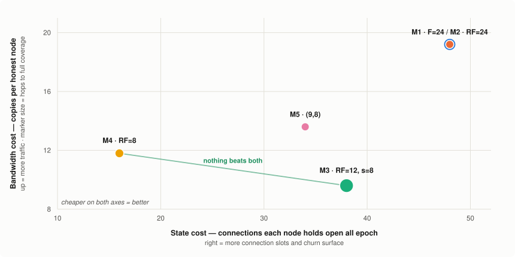

<!-- Existing categories:

- Meta      | For meta-CIPs which typically serves another category or group of categories.
- Wallets   | For standardisation across wallets (hardware, full-node or light).
- Tokens    | About tokens (fungible or non-fungible) and minting policies in general.
- Metadata  | For proposals around metadata (on-chain or off-chain).
- Tools     | A broad category for ecosystem tools not falling into any other category.
- Plutus    | Changes or additions to Plutus
- Ledger    | For proposals regarding the Cardano ledger (including Reward Sharing Schemes)
- Consensus | For proposals affecting implementations of the Cardano Consensus layer and algorithms
- Network   | Specifications and implementations of Cardano's network protocols and applications

-->

## Abstract
<!-- A short (\~200 word) description of the proposed solution and the technical issue being addressed. -->

The Cardano ecosystem lacks a decentralised layer for messages that must be trustworthy but do not belong on the chain itself. Emergency alerts to stake pool operators, notifications from pools to their delegators, dApp and wallet messaging, and governance communication all run on centralised infrastructure today, whose operators can censor, fabricate, or silently drop messages, so coordination around a Byzantine-fault-tolerant chain does not inherit its guarantees. Existing peer-to-peer solutions such as GossipSub do not close the gap: their resistance to eclipse rests on a discovery layer that admits freely created identities.

We propose a decentralised topic-based publish/subscribe protocol anchored on Cardano. The chain serves as the protocol's trust root. Nodes register on-chain, which makes identities verifiable and costly to mass-produce. Each epoch, verifiable on-chain randomness derives a fresh, degree-bounded dissemination topology that any participant can recompute but none can influence. Topics carry arbitrary application content: the chain anchors trust, not the payload. Against an adversary controlling a bounded fraction of nodes, the per-epoch probability that any honest publisher fails to reach every honest subscriber is a tunable design target. The design is grounded in formal analysis and simulation at deployment scale, cross-validated between independent implementations.

## Motivation: Why is this CIP necessary?
<!-- A clear explanation that introduces the reason for a proposal, its use cases and stakeholders. If the CIP changes an established design then it must outline design issues that motivate a rework. For complex proposals, authors must write a Cardano Problem Statement (CPS) as defined in CIP-9999 and link to it as the `Motivation`. -->

### The gap

Cardano does not run itself. Behind the protocol sits a network of people and services that must hear from one another for the system to function: stake pool operators must learn of a critical vulnerability before it is exploited, delegators must learn their pool is retiring before it affects them, voters must learn a governance action is open while there is still time to act on it. The chain's security and governance models quietly presume this communication happens: incident response assumes operators can be reached; accountability in governance assumes constituents hear from their representatives.

Cardano has no standard way to deliver a message that must be trustworthy but does not belong in a transaction. The chain settles state; it is not a medium for the operational and time-sensitive traffic around that state. Today that traffic runs on infrastructure outside the ecosystem's trust model: mailing lists, Discord and Telegram channels, vendor push services, and each provider's own backend.

That arrangement has a specific consequence. Traffic of this kind needs three of the four classic communication-security properties. Authenticity: the recipient can verify who sent a message. Integrity: it arrived as written. Availability: it reaches everyone it should, when it should. Confidentiality, the fourth, is not required for the needs identified here, since these messages are broadcasts, meant to be read.

Existing channels each provide some of these properties, none all three. An end-to-end encrypted messenger preserves integrity and confidentiality, but its notion of identity has no connection to Cardano's: a stake pool operator receiving an urgent notice cannot verify that it came from the protocol team it appears to come from, that it is the current version, or that other operators received it too. Availability fares worse, because each channel is a single privately run service. Messages can be dropped, delayed, or delivered selectively, through outage, compromise, or policy, and the recipient cannot tell which. The chain beneath is Byzantine-fault-tolerant; the channel used to coordinate around it is not. The weaker layer sets the effective guarantee.

### Why existing peer-to-peer messaging does not close it

Substituting a peer-to-peer protocol for the centralised channel removes the operator but does not, on its own, supply the missing guarantee.

Mature gossip protocols — GossipSub being the widely deployed example — are engineered against message-level attacks such as flooding and spam, and mitigate them with peer scoring and mesh hardening. Their resistance to *eclipse*, in which a victim's every neighbour is adversarial and its view of the network is controlled, ultimately rests on the peer discovery layer beneath. In the common libp2p deployment that layer admits freely created identities. An adversary willing to run many of them can influence which peers a target connects to, and neither peer scoring nor mesh hardening restores a guarantee that has been lost at the point of neighbour selection.

The missing ingredient is therefore not a better gossip mechanism. It is a peer set whose membership is costly to inflate and whose topology no participant can steer. Cardano already maintains the first: an on-chain registry with an associated cost is exactly a Sybil-resisted membership list. It also maintains the second: verifiable, unpredictable per-epoch randomness. A dissemination layer anchored on both can offer what neither a centralised broker nor an unanchored gossip mesh can.

### Use cases and stakeholders

The design is motivated by four standing scenarios, drawn from a [broader survey of candidate use cases](https://github.com/input-output-hk/pubsub/blob/main/docs/actor-use-case-analysis.md). They are listed with the participant counts that drive the design, because those counts, not the size of the eventual audience, determine what the protocol must sustain.

| Scenario | Publishers | Direct protocol participants | Delivery requirement |
| --- | --- | --- | --- |
| Protocol developer teams → stake pool operators: emergency alerts and operational coordination | ~10 | ~3,000 SPO nodes, always-on | High; a missed critical alert has operational cost |
| Stake pools → delegators: operational announcements | Hundreds | Wallet backends, on behalf of a mediated audience of hundreds of thousands | Best-effort |
| Governance bodies and DReps → community: proposal notifications, voting alerts, and voting-intent disclosure | Tens to hundreds | Wallet backends, mediated | Medium to high; tied to voting deadlines |
| dApps → users: position alerts and protocol notifications | Tens | Wallet backends, mediated, with delivery targeted by address | High; alerts are financially consequential |

<em>Table 1: the four standing scenarios</em>

Two properties of this table shape the proposal.

First, **the audience is large but the participant set is not.** Where recipients number in the hundreds of thousands, they are reached through wallet infrastructure providers, of which there are on the order of ten. The nodes that must participate in dissemination are the always-on operators: stake pools, wallet backends, dApp and governance infrastructure. That population is in the low thousands today, dominated by the roughly three thousand stake pools. The Rationale sizes its evaluation accordingly, at four thousand nodes to match it and twenty thousand as headroom for growth well beyond it. At this scale a topology bounded in connections per node, and derivable in full by every participant, is tractable rather than aspirational.

Second, **the participants are already registered on-chain, or can be.** Stake pool operators are registered by construction. This is what makes an on-chain trust root a natural fit rather than an imposition: the registry the protocol needs substantially exists, and the identities in it are already backed by a cost.

The stakeholders are correspondingly: stake pool operators, as the largest set of direct participants and the recipients in the most delivery-critical scenario; wallet and infrastructure providers, whose integration is what connects the protocol to end users; governance bodies, DReps, and dApp teams as publishers; and protocol developer teams, who currently lack any authenticated broadcast channel to operators at all.

### What a solution has to provide

The scenarios above, together with the failure mode in the previous section, imply requirements that jointly rule out both incumbent options:

- **Authenticity and integrity.** A recipient must be able to verify that a message originated with the claimed publisher and reached them as written, without trusting the path it arrived over. A signature that verifies establishes both, so integrity requires no separate mechanism.
- **Censorship resistance.** This is availability restated against an adversary that chooses its target: suppressing a message must require luck rather than choice. No participant may be able to place itself where it can silence a chosen publisher or subscriber. Isolation cannot be prevented in every draw, since a subscriber whose every upstream peer happens to be adversarial receives nothing however small the adversarial fraction. The requirement is therefore that such isolation be rare, that it end when the topology is next drawn, and that it not be repeatable at will. The Rationale quantifies the first two.
- **Non-influenceable neighbour selection.** Which peers a node disseminates with must be set by the protocol, not negotiated between participants, and no participant may be able to steer that choice: not by registering additional identities, not by timing its own registration, not by influencing the randomness the assignment derives from. This is what a discovery layer with freely created identities fails to provide, and what makes the censorship requirement achievable at all.
- **Bounded cost per node.** Participation must not require a node to hold connections, or carry traffic, in proportion to the size of the network. The Rationale measures these as *standing links per node* and *copies per honest node*. Both must stay bounded as the network grows, or only well-resourced operators will participate, reintroducing informally the centralisation the proposal removes.
- **Openness to arbitrary payloads.** The scenarios differ widely in content and cadence. The protocol carries topics, and does not interpret what those topics transport.

The Specification that follows defines a protocol meeting these requirements: on-chain registration for the peer set, per-epoch verifiable randomness for the topology drawn over it, and topics as the unit of subscription. The Rationale then examines where the guarantees stop.

<!-- TODO before submission upstream: CIP-0001 asks that complex proposals link a
Cardano Problem Statement as the Motivation. Confirm whether an existing CPS
covers ecosystem messaging; if not, decide whether to author one or to argue
this section stands alone. -->

## Specification
<!-- The technical specification should describe the proposed improvement in sufficient technical detail. In particular, it should provide enough information that an implementation can be performed solely on the basis of the design in the CIP. This is necessary to facilitate multiple, interoperable implementations. This must include how the CIP should be versioned, if not covered under an optional Versioning main heading. If a proposal defines structure of on-chain data it must include a CDDL schema in its specification.-->

## Rationale: How does this CIP achieve its goals?
<!-- The rationale fleshes out the specification by describing what motivated the design and what led to particular design decisions. It should describe alternate designs considered and related work. The rationale should provide evidence of consensus within the community and discuss significant objections or concerns raised during the discussion.

It must also explain how the proposal affects the backward compatibility of existing solutions when applicable. If the proposal responds to a CPS, the 'Rationale' section should explain how it addresses the CPS, and answer any questions that the CPS poses for potential solutions.
-->

<!-- Cross-reference convention: a FORWARD-REF comment marks prose that will point at
     a section not yet written. Each names the target section and what must exist there,
     so the reference can be completed without recovering the intent. Grep FORWARD-REF
     before declaring a section finished. -->

The [Motivation](#motivation-why-is-this-cip-necessary) set out five requirements. Two of them are structural and are met by construction rather than by measurement: **authenticity**, which follows from publisher signatures verifiable against the on-chain registry, and **payload-agnostic topics**, which is a matter of the protocol declining to interpret what it carries. A third, **non-influenceable neighbour selection**, rests on the randomness source and the registration cutoff, and is treated under the guarantees below rather than measured.

The remaining two are quantitative, and are what the evidence in this section is for. **Censorship resistance** was stated as a requirement on how rare, how brief and how unsteerable suppression is; rarity is the failure probability measured throughout, brevity is bounded by the epoch, and unsteerability is the same randomness argument. **Bounded cost per node** was stated as connections and traffic that must not scale with the network; both are measured, and what a node actually pays is set out under the trade-offs.

> [!NOTE]
> Throughout this Rationale an **epoch** means one dissemination period: the interval for which a drawn topology stands and over which the guarantees below are stated. Its length is a parameter of this proposal and is **not** required to coincide with the ledger epoch; the bounds on it are an open question below.

### The adversary this proposal defends against

The protocol is analysed against an adversary controlling a bounded fraction **μ** of registered nodes, each of which is *silent*: it registers legitimately, accepts its allotted share of links, and then forwards nothing. This is deliberately the weakest adversary that still defeats delivery. A node that never emits a message cannot be distinguished from an honest node that has nothing to forward, so it is also the cheapest attack to mount and the hardest to observe. An eclipse attack against a specific subscriber reduces to this behaviour among that subscriber's upstream peers.

Not modelled, and out of scope for this proposal: an adversary that forwards selectively or forwards corrupted content, resource exhaustion and denial of service, and an adaptive adversary that re-registers between epochs in order to re-target a chosen victim.

One further exclusion is worth stating separately, because it is a different capability rather than a different behaviour. The analysis assumes the adversarial share is fixed before the epoch's topology is drawn, and drawn independently of it. An adversary able to corrupt *chosen* nodes after the draws become public is stronger, and the cost of stranding a particular victim under that assumption is a property of the victim's own degree rather than of the network-wide fraction. That cost is being analysed separately and is not claimed here.

Honest node churn is not a separate threat model. An honest node that is offline for an epoch is indistinguishable, to every other node, from a silent adversary, because it holds its allotted links and forwards nothing. Independent honest downtime with per-epoch probability *p* therefore enters the coverage analysis as a shift in the adversarial fraction, from μ to μ + *p*(1−μ), and the same results apply at the shifted value. That shift has been checked against simulation, by marking nodes down and re-measuring coverage.[^churn] What it does not cover is correlated downtime, such as upgrade waves or region outages, which a single independent *p* cannot represent.

### Evidence

This section sets out what was measured, how, and what the results do and do not establish. It proceeds in that order: first the quantity being predicted and the two instruments that predict it, then the metrics and the designs compared, then the results, then the limits.

#### What is measured, and by what

Each epoch the protocol derives a dissemination topology over the registered nodes: every node is assigned a bounded set of peers, and that assignment stands for the whole epoch. Nodes following the protocol are *honest*; the rest accept their links and forward nothing, the adversary set out above. On any topic some nodes publish and others subscribe.

The guarantee is a property of the drawn topology, not of an individual message. For a given assignment either every honest publisher reaches every honest subscriber, or some publisher does not, in which case that publisher is cut off for the whole epoch every time it publishes. The first case is **good**, the second **bad**. This is deliberately all-or-nothing rather than an average, because an average hides the failure mode that matters: 99.99 % delivery might be a uniform trickle of losses, which is tolerable, or one publisher silenced completely, which is not.

The central quantity is the probability that a draw is bad, written *p*bad. **Everything below is a way of estimating it, a cost paid to lower it, or a condition under which it rises.**

Two independent instruments estimate it, built separately. **Analysis** derives, for each design, a closed-form *coverage law* predicting *p*bad from the network size, the adversarial fraction and the design's own parameters, with its own simulator to check the law wherever sampling is feasible. **Measurement** builds populations of the reference implementation's own node logic, the same code the node runs, driven by a deterministic scheduler in place of a network, then disseminates real messages and counts what happens.

Neither alone would convince. A closed form can approximate the wrong model; an implementation can faithfully run a subtly wrong protocol. They fail in unrelated ways, so **their agreement is the evidence offered here**, not either result alone. Every measurement is reproducible byte-for-byte from a tool commit, a configuration and a master seed.[^reproduction]

#### Performance metrics

A design is characterised by three things: how often a draw fails, what it costs to run at that failure rate, and how much degradation it absorbs before the failure rate changes. The metrics below express those three, and are stated per epoch throughout, since the guarantee is a property of each epoch's standing assignment.

Two of them are design inputs rather than outcomes: *μ*, the fraction of nodes assumed adversarial, and *δ*, the failure probability a configuration is required to meet. This proposal uses *δ* = 10⁻⁴ per epoch.

| Category | Metric | Measurement |
| :--: | --- | --- |
| Coverage | Epoch failure probability, *p*bad | Probability that a drawn epoch topology fails to carry some honest publisher's messages to every honest subscriber |
| | Design target, *δ* | The value of *p*bad a configuration is sized to meet |
| Cost | Transmissions per publication, *m* | Honest-to-honest message copies sent per published message, duplicates included |
| | Copies per honest node, *c* | Copies of each published message received by an average honest node |
| | Standing links per node, *d* and *d̂* | Connections held open for the whole epoch, mean and maximum, counting a node's own picks and the links others opened to it |
| Latency | Hops to full coverage, *h*full | Forwarding depth at which the last honest subscriber receives |
| | Mean first receipt, *h*mean | Forwarding depth at which a typical honest subscriber first receives |
| Resilience | Adversarial fraction, *μ* | Share of registered nodes that accept their links and forward nothing |
| | Churn budget, *p*max | Largest honest downtime fraction for which a deployed configuration still meets *δ* |

<em>Table 2: performance metrics</em>

Most of these are self-explanatory from the table. Two are not.

**_Epoch failure probability._** A property of the draw rather than of a message, so it is estimated by sampling topologies and counting failures. The all-or-nothing criterion is the one defined above.

$$p_\text{bad} = P(\text{some honest publisher cannot reach every honest subscriber over the epoch's links})$$

**_Churn budget._** An honest node offline for the epoch is indistinguishable from an adversarial one, so downtime with per-epoch probability *p* raises the effective adversarial fraction to *μ* + *p*(1−*μ*) and a design's own law can be read at that higher value. The budget is the largest downtime a configuration absorbs while still meeting the target:

$$p_\text{max} = \max \{\, p : p_\text{bad}(\mu + p(1-\mu)) \le \delta \,\}$$

Downtime relates to the drop-out rate and the epoch length by *p* = 1 − e−λ·T, which is why *p*max bounds epoch length as well as resilience.

A note on two of the cost metrics. Transmissions per publication and copies per honest node are the same quantity divided differently, *c* = *m* / *H* with *H* the honest count, so either may be quoted. Both include duplicates, since a duplicate is suppressed only after crossing the network. And for standing links the maximum matters as much as the mean, because connection slots are provisioned for the worst-affected node.

#### Designs evaluated

Five dissemination designs were analysed against the metrics above. They were not arbitrary alternatives: each varies one structural choice, so that the comparison isolates what that choice costs.

The choices are: whether a node *pushes* messages to peers it selected, or *pulls* from peers it selected, which determines the failure a node can suffer, being unable to receive or being unable to be heard; whether a link carries traffic in one direction or both; and whether a node has a dedicated way to seed its own publications separate from the links it relays over. Each design's tuning parameter is the number of peers a node selects, which is the knob that trades cost against *p*bad. That count is a node's **pick count**, and for the links a node relays over it is written ***RF*** throughout: how many peers one node picks on one topic, and the single number each design is tuned by. Where a design has a second link kind for a node's own publications, the peers picked that way are counted separately as *s* or *F*. It is not a replication factor in the storage sense, and nothing here is replicated to *RF* places.

| Design | Mechanism | Tuning parameters |
| :--: | --- | --- |
| M1 | Push: each node forwards to *F* randomly drawn targets | *F* |
| M2 | Pull: each node draws *RF* forwarders and receives from them | *RF* |
| M3 | M2, plus *s*−1 standing initiation links carrying only their owner's own publications | *RF*, *s* |
| M4 | Each node draws *RF* peers; links are bidirectional and flood | *RF* |
| M5 | Directed: each node opens *k*in inbound and *k*out outbound links | *k*in, *k*out |

<em>Table 3: the dissemination designs evaluated</em>

M1 and M2 are the two halves of M5 taken separately: switching off M5's inbound links leaves pure push, and switching off its outbound links leaves pure pull. That gives a free consistency check on both the analysis and the implementation. M5 configured at those boundaries must reproduce M1's and M2's results exactly, and any discrepancy is a defect in one of the three rather than a property of the protocol.

<!-- Figures are generated, not hand-drawn: pubsub-node/docs/experiments/cells.json is
     the single source, and make_cip_figures.py regenerates images/*.svg from it.
     `make_cip_figures.py --check` fails if a committed SVG is stale, so the figures
     cannot drift from the data.

     TODO(evidence) still outstanding:
       1. the churn sweep (experiment E13) at the five operating points, which is what
          "Robustness" below is waiting on;
       2. depth histograms at those points, so the latency column becomes a
          distribution rather than five rounded means;
       3. cells.json emitted by the experiments tool directly, retiring the one-time
          transcription from the comparison documents. -->

#### Agreement between analysis and simulation

The laws were checked against the measurement framework at 23 configurations, spanning all five designs, two and a half orders of magnitude in *p*bad, and two network sizes: *N* = 4,000, which is the order of today's stake-pool population, and *N* = 20,000 as headroom above it. Each configuration draws between 200 and 30 000 topologies and counts the bad ones; the count is compared against what that design's law predicts.

In the figure below each point is one measured sample: its horizontal position is the failure rate the law predicts, its vertical position the rate actually observed, and its bar the Wilson 95 % interval around that observation. There are 25 rather than 23, because the two designs still in contention each carry a second, much larger sample, discussed below. Both axes are logarithmic, and the configurations range from failing in roughly one epoch in three hundred to failing in almost every epoch. Filled marks are the configurations above; hollow ones are a further 29 measured under honest downtime, described under Robustness, and are included here because they test the same laws along a second axis.

<em>Figure 1: measured against predicted epoch failure probability</em>

The points lie on the diagonal across the whole range. Per configuration, the law falls inside the measurement's 95 % interval in 22 of the 23. The exception is one 1 500-draw configuration, whose independent 6 000-draw resample brings it inside.

Per-configuration agreement is the weaker claim, though, because with 23 comparisons a few near-misses are expected and a consistent small bias would hide behind them. The stronger check is aggregate: across the 22 non-degenerate configurations the mean standardised deviation from the laws is +0.21, which over 22 comparisons is not distinguishable from zero. The spread of those deviations is 0.84 against the 1.0 that pure sampling noise would produce, so the agreement is if anything closer than chance alone would give.

> [!IMPORTANT]
> The same comparison against the analysis team's own independent simulators gives a mean standardised deviation of +0.05 over 22 paired configurations. **The two implementations are statistically indistinguishable from each other and from the laws**, which is the claim this section exists to support.

One question deserves separate mention, because both studies had been carrying an answer to it that turns out to be wrong. The laws count a single cut-off node exactly but a small cut-off *group* only approximately, and both had taken the laws as roughly 11 % optimistic in the range where failures are rare. No published sample could check it: separating a ten-percent effect at these rates needs on the order of 10⁵ draws, and the cells were 3 × 10⁴. Two cells were therefore re-run at power, one on each of the two designs still in contention, each on an independent master seed so it pools with the existing sample rather than replacing it. M3 gives 1 240 failures in 230 000 draws, a factor of **1.009 ± 0.029**; M4 gives 1 146 in 140 000, a factor of **0.979 ± 0.029**. **Neither design shows the correction, and together they reject 1.11 at more than five standard errors.**[^tail] The laws are accurate in that range rather than optimistic, and the operating points carry more margin than the corrected figures suggested.

The hollow points extend that claim sideways. The 23 configurations above all sit at one adversarial fraction and vary the designs' own parameters; the churn cells hold parameters fixed and vary the adversarial fraction instead, from 0.20 to 0.44. The laws track along both directions.

<!-- TODO(evidence): per-configuration table generated from cells.json, rather than
     restating the figure in prose. -->

#### Comparison at the design target

Each design was then tuned to its cheapest configuration meeting *δ* = 10⁻⁴ at *N* = 20 000, *μ* = 0.2, and the costs compared. Because every entry is equally safe by construction, the table is a pure cost comparison.

| Design | Parameters | Messages per publication | Copies per node | Standing links, mean | Standing links, busiest node | Hops (full) | Hops (mean) |
| :--: | --- | ---: | ---: | ---: | ---: | ---: | ---: |
| M3 | RF = 12, *s* = 8 | **153,577** | **9.6** | 38.0 | 64 | 5.9 | 4.3 |
| M4 | RF = 8 | 188,751 | 11.8 | **16.0** | **36** | 5.1 | 4.1 |
| M5 | (9, 8) | 217,530 | 13.6 | 34.0 | 58 | 5.0 | 4.0 |
| M1 | *F* = 24 | 307,201 | 19.2 | 48.0 | 75 | 5.0 | 3.6 |
| M2 | RF = 24 | 307,162 | 19.2 | 48.0 | 75 | **4.8** | **3.6** |

<em>Table 4: cost at equal safety</em>

Bold marks the best value in each column. All are measured; see the reproduction note. The busiest-node column is the largest number of connections any single honest node had to hold, which is the figure a deployment sizes connection limits against. It is a measured worst case over the sample, not a bound.[^degrees] Plotting two of those columns against each other shows the shape of the trade: both axes are costs, so lower and further left is better, and marker size is hops to the last subscriber.

<em>Figure 2: bandwidth cost against state cost at equal safety</em>

Three things follow, and the third is the one that matters for the choice.

**Latency barely discriminates at the mean.** The whole field spans 4.8 to 5.9 forwarding steps, which at wide-area per-hop times is a few hundred milliseconds between the best and worst design, unlikely to decide anything for the use cases in the Motivation. The full depth distributions separate the designs more sharply at the tail, by two orders of magnitude in how often a subscriber waits the longest hop, but that tail is a fraction of a percent of subscribers.[^depth]

**Bandwidth and state disagree about the winner.** M3 is cheapest in traffic and M4 in held connections, and neither beats the other on both. M3's standing links exceed what its traffic would suggest because 14 of its 38 links carry only their owner's own publications, cheap to run but still connection slots to provision and still exposed to churn. The gap widens at the worst node rather than the average one: 64 connections against M4's 36.

**M1, M2 and M5 are beaten on both cost axes at once**, so no weighting of bandwidth against state selects them. On cost alone the choice is between M3 and M4, and it turns on which resource binds in the deployment. That is not the whole comparison, though: once latency and tolerance of degradation are included, three of these five are back in contention. See [Trade-offs and Limitations](#trade-offs-and-limitations). The remaining subsection is what stops that from being the whole answer.

The design this proposal adopts, and the parameters it fixes, are given in the [Specification](#specification); this subsection establishes only what each candidate costs; the one below establishes what each gives up under an unreliable population, and the two do not agree.<!-- FORWARD-REF(specification): the Specification must name the adopted design (expected M3 or M4) and its parameters, so this sentence resolves to a concrete choice. Selection is blocked on the Robustness subsection below; see input-output-hk/pubsub#85. -->

#### Robustness

The comparison above holds every design at the same failure probability *under the assumption that all honest nodes are up*. Since honest downtime enters as a shift in the adversarial fraction, each design also has a churn budget, the downtime it absorbs before leaving the target, and those budgets are not equal.

A design's churn budget cannot be sampled directly. It is defined where P(bad) meets the 10⁻⁴ target, and resolving a rate that low takes on the order of 10⁵ to 10⁶ draws for every churn level tested. What can be tested is the reduction underneath it, the claim that downtime enters as a shift of the adversarial fraction, at parameters where failures are frequent enough to count. If that holds, the budgets follow from laws that Figure 1 has already validated.

It holds, in two rounds. Across five designs and five downtime levels, from none to 12 % of honest nodes offline, twenty-three of twenty-five configurations placed the shifted-fraction prediction inside the measurement's interval, and at the largest shift there all five designs landed on their laws almost exactly.

Those cells were chosen for measurability rather than for realism, so the operating points themselves were then run under heavier downtime, at 20, 25 and 30 % offline. **All nine placed the prediction inside the interval**, with a mean deviation of +0.30 and no detectable bias. The two rounds together carry the reduction from an adversarial fraction of 0.20 out to 0.44, more than doubling it, and the second round tests the configurations this proposal actually names.[^churn]

The resulting budgets differ by a factor of four, and **their order is close to the reverse of the cost order in Table 4**:

| Design | Operating point | Downtime absorbed |
| :--: | --- | ---: |
| M5 | (9, 8) | 2.18 % |
| M1 | *F* = 24 | 1.76 % |
| M2 | RF = 24 | 1.70 % |
| M4 | RF = 8 | 1.07 % |
| M3 | RF = 12, *s* = 8 | **0.54 %** |

<em>Table 5: churn budget at each operating point</em>

The design that is cheapest in bandwidth absorbs the least downtime, and the two the cost comparison ruled out absorb the most.

The same figures can be read as security rather than resilience. Because an offline honest node and a silent adversary are indistinguishable, a budget for downtime is equally a margin above the assumed adversarial fraction: M3 at (13, 7) still meets the target at *μ* = 0.217 where M4 breaches it at 0.209, twice the headroom over the assumed 0.2. Downtime tolerance and adversary tolerance are one quantity here, not two. The mechanism is structural rather than incidental: M3 reaches its bandwidth advantage through a small number of dedicated seeding links, and a mechanism that is cheap because it is small is also the one with least margin when part of it stops responding.

This does not overturn Table 4, but it does mean **cost alone does not select a design**. Which matters more, traffic or held connections or tolerance of an unreliable population, is a deployment question, and it is posed as an open question below.

**M3's published operating point should move.** The budget of 19 can be split between relaying and seeding in several ways, and the published choice of (RF = 12, *s* = 8) is not the best of them. The split (RF = 13, *s* = 7) holds the same total budget and the same 38 standing links, and improves every other figure:

| M3 split | P(bad) | Copies per node | Standing links | Downtime absorbed |
| :--: | ---: | ---: | ---: | ---: |
| RF = 12, *s* = 8 | 7.9 × 10⁻⁵ | 9.6 | 38 | 0.54 % |
| **RF = 13, *s* = 7** | **4.4 × 10⁻⁵** | 10.4 | 38 | **2.17 %** |

<em>Table 6: two splits of M3's budget of 19</em>

For 0.8 further copies per honest node, a factor of four in downtime tolerance and a halved failure probability. The formal churn analysis predicted this and flagged it unvalidated; the measurements support it.

> [!WARNING]
> **Any use of M3 in this proposal should take (13, 7).** The comparisons that follow keep (12, 8) only because it is the figure the published tables carry; a reader taking those tables as M3's best showing will under-rate it on three of the four axes.

The budgets above remain read off the laws rather than observed, for the reason the first paragraph gives. What the experiment establishes is that the laws apply under churn, not the budget values themselves. And in the first round the measurements sat slightly above their predictions in the middle of the range. That excess does not grow with downtime, so it does not behave like a mistaken reduction, and it does not reappear at the operating points, where the second round shows no bias. It is nonetheless unexplained. Its direction is conservative: it would make these budgets smaller rather than larger.[^churn]

#### Limits of this evidence

> [!IMPORTANT]
> The following are stated so that a reader can judge what the numbers above do and do not establish, in descending order of how much they bear on the conclusions.

**The configurations that were measured are not the configurations that are proposed.** Sampling can only resolve a failure probability down to roughly one over the number of trials: observing a one-in-ten-thousand event often enough to estimate its rate takes far more than ten thousand draws. The configurations that meet the design target are, by construction, ones that almost never fail, so measuring them directly is impractical. What was measured instead is a range of deliberately weaker configurations, where failures are common enough to count.

**The worst-case connection count is a sample minimum, not a bound.** Mean held connections are now measured on both instruments and agree exactly.[^degrees] The busiest-node figures in Table 4 are different in kind: the largest value in a sample, and an extreme-value statistic grows with the number of graphs drawn and with the population size. A longer run, or a larger deployment, would find a larger one. They should be read as measured lower bounds on the worst case rather than as limits to provision against.

**Every measurement is at thousands of participants; some use cases are at tens.** The evidence runs at *N* = 4 000 and *N* = 20 000, chosen against the stake-pool population. Three of the four scenarios in [Table 1](#table-1) reach their audience through wallet backends, and the number of nodes *directly* on such a topic may be tens rather than thousands. Nothing here establishes how the design behaves there, and there is reason to expect it differs in kind rather than degree: the coverage laws are asymptotic in *N*, the gate divides a population into *B* buckets that cannot be finer than the population itself, and the connection advantage that separates the two candidate designs weakens as topics shrink. A topic of fifty is not a small instance of this analysis; it is outside it.

**Correlated failure is out of scope.** Downtime is modelled as independent across nodes and epochs. Region outages and upgrade waves violate both assumptions, in the direction that makes the guarantee weaker, and are not quantified here.

**One adversarial fraction.** All results are at a single value of *μ*. That value is an assumption about the deployment, not a measurement of it, and the designs do not degrade at equal rates as it varies.

Figure 3 places the two side by side. Solid marks are configurations whose failure rate was counted; hollow marks are the configuration each design actually proposes, whose rate is a law prediction at a level no feasible sample can resolve. The dashed span between them is carried by the laws alone.

<em>Figure 3: measured configurations against the configuration proposed</em>

The gap is close to two orders of magnitude for every design. The laws are expected to be accurate across it, because the dominant failure mode in that range is the simplest one, a single node with no usable links, which they model exactly; Figure 1 confirms they track measurement wherever measurement is possible. But the operating points themselves are predictions, not observations, and no amount of agreement at 10⁻² is a direct measurement at 10⁻⁴.

### Trade-offs and Limitations

A dissemination layer trades bandwidth, connection state, latency and tolerance of degradation against one another; no design in the family is best on all four. The Evidence subsection measures each axis separately, and the figure below puts them side by side.

Widening the comparison from two axes to four changes which designs are in contention, and so does letting each design take its best parameters rather than the ones the published tables carry.

Every operating point in Table 4 was chosen by the same rule: the cheapest configuration meeting the failure target. That rule selects, by construction, the configuration sitting closest to the cliff, since anything cheaper fails. Searching each design's parameter space against the validated laws and then measuring the results shows how much that costs. M3's re-split has already been described. The equivalent step for M4, from RF = 8 to RF = 9, buys **seven times the churn budget** — 1.07 % to 7.43 % — for 1.6 further copies per node and two further connections.

Allowing that step changes the field. **M4 at RF = 9 beats M5 at (9, 8) on every axis**: 13.4 copies against 13.6, 18 standing links against 34, equal hops to the last subscriber, and 7.43 % downtime absorbed against 2.18 %. M5 was already best at nothing that survived rounding; it is now dominated outright, and M1 with it. Three designs remain.

In the figure below every axis is oriented so that outward is better, and each design is scored against the best of the three shown, so the outer ring on an axis is the best value any of them achieves and a design half-way out is half as good on that axis. Each design is labelled at the axis it leads. M1 and M5 are drawn as muted dashed outlines rather than dropped: each lies wholly inside a contending design, which is what domination looks like when it is plotted rather than asserted. The churn axis is read off the coverage laws rather than sampled directly.

<em>Figure 4: four-way trade-off across the non-dominated designs</em>

The shapes carry the argument. **M4 is the most even, and it is the only design to reach the outer ring twice**: eighteen standing links against M3's thirty-eight and M2's forty-eight, and 7.43 % downtime absorbed against 2.17 % and 1.70 %. Both margins are wide. **M2 is fastest** to its last subscriber, by 0.2 hops over the next design, which the latency discussion above puts in proportion, and is innermost on everything else. **M3 at (13, 7) leads bandwidth**, and that is the only axis it leads; on churn tolerance it sits under a third of the way out.

The churn axis is where the re-split does its visible work, even though it does not change who leads. At M3's published split of (12, 8) that vertex is 0.54 % against M4's 7.43 %, less than a tenth of the way out, so the shape is a spike on bandwidth and very little else. Moving one link from seeding to relaying, at the same budget and the same standing links, quadruples it. That is the same design under a different split, not a different design, which is what makes the selection rule rather than the mechanism the thing to fix.

> [!IMPORTANT]
> The general form is worth stating, because it governs the parameter choice as much as the design choice: **within this family, efficiency is bought with margin.** A configuration tuned to sit just inside the failure target is, by construction, the one with least room to absorb anything the model did not anticipate. That is a property of the rule used to choose parameters, not of any mechanism, which is why M3's brittleness disappears under a different split of the same budget rather than requiring a different design.

**On the choice of axes.** These four are the quantities that are both measured and independent of one another. Two others were considered and left out. The *worst-case* number of connections a node must accept, as distinct from the mean, is arguably the figure an operator provisions against. It is now measured, and appears in Table 4; it is left off the figure only because four axes already carry the argument. And the headroom a configuration has below the failure target was rejected as an axis because it reflects where integer parameter steps happened to fall rather than any property of the design. Mean receipt depth is omitted as well, since it moves with the hop count already plotted and would double-count latency.

#### Where this leaves the choice

Two designs remain in contention, and neither dominates the other. M3 at (13, 7) is cheaper in traffic; M4 at RF = 9 holds less than half the connections, reaches its last subscriber sooner, and absorbs more than three times the downtime:

| | M3 (13, 7) | M4 (RF = 9) |
| :--: | ---: | ---: |
| Copies per honest node | **10.4** | 13.4 |
| Standing links, mean / busiest | 38 / 64 | **18 / 37** |
| Hops to the last subscriber | 5.5 | **5.0** |
| Downtime absorbed | 2.17 % | **7.43 %** |

<em>Table 7: the two remaining candidates, each at its best known parameters</em>

> [!IMPORTANT]
> **This proposal does not claim the evidence selects between them.** M4 now leads three of the four axes, but the one M3 leads is bandwidth, by 22 %, and no weighting of traffic against connections follows from the analysis. What would decide it is a fact about deployment rather than about the protocol: whether a node's binding constraint is the traffic it carries or the connections it can hold open. For an operator on a metered link the first binds; for one behind a connection-limited gateway the second does. That question is posed in the Open Questions below, and the Specification names the design the answer selects.

What the evidence does establish is that the field is two, not five, and that the axes on which they differ are measured rather than assumed.

#### What a node pays, and how it scales

Both measured costs are per topic, and a node that subscribes to several pays for each. The measurements fix the per-topic figures; the rest is arithmetic over deployment assumptions. For one-kilobyte messages arriving once a second on each topic:

| Topics a node subscribes to | M3 (13, 7) | | M4 (RF = 8) | |
| :--: | ---: | ---: | ---: | ---: |
| | ingress | connections | ingress | connections |
| 1 | 83 kbit/s | 38 | 94 kbit/s | **16** |
| 5 | 416 kbit/s | 190 | 472 kbit/s | **80** |
| 10 | 832 kbit/s | 380 | 944 kbit/s | **160** |
| 25 | 2.1 Mbit/s | 950 | 2.4 Mbit/s | **400** |

<em>Table 8: per-node cost against topics subscribed, at 1 kB messages and one publication per second per topic</em>

Both quantities scale linearly, so the ratio between the designs never changes. What changes is which one becomes the binding constraint. Bandwidth stays modest throughout: even twenty-five busy topics is a couple of megabits, which any always-on operator already has. Connection count does not stay modest. At ten topics M3 asks a node to hold 380 connections against M4's 160, and at twenty-five it is 950 against 400.

**This is the strongest argument yet for M4**, and it did not appear in the single-topic comparison, where 38 against 16 looks like a difference of degree. Under a realistic subscription profile it becomes a difference of kind: one design stays inside the file-descriptor and socket budgets an operator will accept, and the other does not.

> [!WARNING]
> One qualification, and it is a specification question rather than a measurement. These counts are of links, and a link is identified by a peer *and* a topic. Whether two topics sharing a peer share one transport connection is not settled here. If they do, the counts above are upper bounds and both designs converge toward the number of distinct peers as topics multiply, which would blunt this argument considerably. If they do not, the table stands. **The Specification should settle it, because the answer changes which design the cost comparison selects.**

Two caveats on reading the figure. Three of its axes are measured directly; churn tolerance is read off each design's coverage law, for the reason the Robustness subsection gives, so it carries the qualification recorded there. And the enclosed area of these shapes has no meaning, since the axes are different quantities in different units, so only position along each individual axis should be compared.

#### Choosing the admission parameters

Everything above concerns how many peers a node links to. Two further knobs govern *which* peers it may link to and *how many* it must serve, and they are what make the assignment verifiable and bound its abuse. Neither appears in the coverage models, so neither had evidence until now.<!-- FORWARD-REF(specification): the Specification must describe the verifiable gate and the serving cap before this subsection's parameters have referents. Terms used here: the bucket count B narrows each node's candidate set to those passing a verifiable predicate; the serving cap bounds how many peers one node will serve. -->

In outline, since the Specification defines it normatively: a node may not link to whichever peers it likes. Its own identity and the epoch randomness together select one of ***B*** buckets, and the peers it may draw from are those whose identity falls in that bucket. Anyone holding the registry and the epoch randomness can recompute the predicate, so a node's choice of peers is checkable rather than merely asserted — that is what the **bucket count** *B* buys.

Narrowing costs something, and the cost has a natural unit. Raising *B* shrinks the set of peers a node is eligible to link to, to roughly (*N*−1)/*B* of them, while the number it must pick stays fixed at its fanout *RF*. The ratio between the two is the **selection headroom**:

$$r = \frac{N-1}{B \cdot RF}$$

At *r* = 10 a node chooses its peers from ten times as many candidates as it needs, which is barely a constraint. At *r* = 1 the gate leaves exactly as many candidates as picks, so the node has no choice at all and the draw stops being random. *r* is what Figure 5 is really drawn against, and the bucket counts on its axis are annotated with it.

The **serving cap** is the second knob, and it points the other way. It bounds how many peers one node will accept, which is what stops an attacker holding many identities from consuming a victim's entire capacity.

The two pull in opposite directions on the same knob, and both sides are now measured. Figure 5 puts them one above the other on a shared bucket-count axis. **Moving right narrows the gate**: fewer eligible peers per node, so the upper panel is what verifiability costs in coverage, and at the same time the attacker's identities are divided across more buckets, so the lower panel is what it buys. A good value of *B* is one that has not yet moved in the upper panel and has moved as far as possible in the lower.

<em>Figure 5: what the bucket count costs and what it buys</em>

Coverage is unaffected while the gate leaves each node at least twice as many eligible peers as it needs to pick from: across that plateau the measured failure rate is 279 in 32 000, against a law of 0.0088. **Verifiability is free where the gate leaves headroom.** Remove the headroom and it stops being free: at parity the failure rate is five times the law, and below parity the draw collapses. In the other direction the gate divides an attacker's pressure by the bucket count, so a wider gate concentrates a flooder's identities on fewer victims. That division is not an approximation: an attacker holding *K* identities lands *K*/*B* slots on the average victim, and across a grid of bucket counts, serving caps and attacker sizes the measured means match that prediction in 36 of 48 cells to within 2 %, with the per-victim distributions taking the predicted Poisson shape. The exceptions are all in one direction and are the defence working — where the attacker's share approaches what the cap leaves free, the cap truncates it below *K*/*B*.[^gate]

> [!TIP]
> The rule follows from the shape: **the largest bucket count that still leaves headroom is simultaneously coverage-exact and the most dilutive**. Anything narrower pays a coverage penalty for resistance it already had; anything wider hands the attacker proportionally more concentration for no gain.

Two further results are worth carrying into the Specification.

**Where a deployment forgoes the pick count and lets the gate alone set degree, it pays a factor of two in failure probability, and one extra link buys it back.** Sizing the gate for one more link than the model's fanout restores the ungated law: measured at a ratio of 2.27 against 2.26 predicted. Around six per cent more traffic is the gate's entire coverage price wherever it is priced at all.

**The serving cap's failure mode is not the one it looks like.** Raising the cap hands an attacker *more* slots on each victim, which sounds like the wrong direction, and yet it is what preserves coverage. Within one cell of the grid the gate and the attacker are fixed and only the cap varies, which isolates the effect.

At the narrow gate under a 10 % attacker, moving the cap from 20 to 24 takes the network from failing in seven epochs out of ten to failing in none, while the attacker's hold on each victim rises from 6.8 slots to 7.6. Under a 20 % attacker the same gate fails at both those caps and is whole at 32, where the attacker holds 15.5 slots on each victim against the 11.1 it held at the cap where the network was collapsing.

> [!IMPORTANT]
> **The harm is honest links starved of capacity, not slots lost to the adversary.** The mechanism is the same measurement read from the honest side: dials refused for want of a slot fall by two orders of magnitude across the same range that restores coverage. A cap sized only to deny the attacker is sized against the wrong quantity, and denies the honest population first.

A cap of about twice the fanout absorbed even an attacker holding a fifth of the network.

> [!WARNING]
> **This subsection's evidence does not cover M4.** Both experiments run M2's relay wiring. The concentration law and the contention mechanics live in the acceptance plane, which M3 and M5 share unchanged, so the sizing rules carry to them; M3 and M5 additionally have a publisher-acceptance seam with its own cap, which the same arithmetic is expected to govern by symmetry but which no cell measures. **M4 is excluded outright**, because its symmetric handshake changes the selection mechanism rather than sitting on top of it. Since M4 is one of the two designs still in contention, the admission parameters are settled for one candidate and open for the other.
>
> These two are also the only results in this Rationale that rest on a single instrument. The gate and the serving cap exist in the reference implementation and in these measurements; there is no closed-form model of either, so the agreement argument that carries the coverage results is unavailable here.

The wider gate is better still: at *B* = 125 the network never enters the failing regime at any cap tested, which is the same recommendation the coverage panel of Figure 5 gives, arrived at from the attack side. The starvation counts show why the two agree. Widening the gate does not merely dilute the attacker, it removes the starvation: at *B* = 125 a node loses 2 934 honest dials per run at the tight cap against 12 at the loose one, where the narrow gate under the same attacker loses 12 605 and 1 320. The gate and the cap are two ways of buying the same thing, which is honest links that are not refused.[^gate]

#### Two classes of fault, with different guarantees

The protocol distinguishes faults that are attributable from faults that are not, and the boundary between them is not a matter of engineering effort. Accountability for the *presence* of an incorrect message and accountability for the *absence* of a message are formally different problems.[^accountable-liveness]

**Attributable faults** are evidenced by a message that was actually sent, and any recipient can verify them without cooperation from anyone else:

- content that is malformed under, or contradicts, the publisher's signature, checkable against the publisher's registered key;
- a message sent by a peer outside the connections permitted to it for the current epoch, checkable against the obligation graph, which any participant can derive from the on-chain registry together with the epoch's public randomness.

**Non-attributable faults** consist of the absence of messages. Attributing these is provably impossible without both a network that is more often synchronous than asynchronous and an honest majority among the parties able to attest.[^accountable-liveness] This proposal assumes neither. The dissemination analysis makes no timing assumption at all, and attestation here is inherently local: the only parties who can speak to whether a given relay forwarded a given message to a given subscriber are those two nodes. With two potential attesters there is no majority to appeal to, and a subscriber's entire upstream set can be adversarial even when the network-wide fraction μ is small, and that case is one of the failure modes making up the residual per-epoch failure probability that the Evidence subsection quantifies.<!-- FORWARD-REF(evidence): resolves once the Evidence subsection lands; link it directly. -->

> [!IMPORTANT]
> Two consequences follow, and this proposal states them rather than working around them. **The protocol does not claim to identify which node silenced a message.** A registration deposit therefore cannot be made conditional on relaying behaviour, and this proposal specifies deposits as a Sybil-resistance cost rather than as a bond forfeitable for poor service.

#### What the protocol guarantees instead

Rather than punishing silence, the design bounds its duration and makes it observable.

**Bounded duration.** The dissemination topology is re-derived every epoch from fresh public randomness, so a subscriber receives an independently drawn set of upstream peers each epoch. Being surrounded entirely by adversarial peers in one epoch is already improbable; remaining so across successive epochs requires that improbable draw to repeat, and the probability falls geometrically in the number of epochs.

That geometry is worth stating in numbers, because it is what sizes both the epoch and the retention window below. The same laws that give *p*bad give the risk borne by one named node, since the network-wide figure is just that risk over the honest population. At *N* = 20 000 and *μ* = 0.2:

| | M3 (13, 7) | M4 (RF = 9) |
| --- | ---: | ---: |
| One named node cut off in a given epoch | 2.7 × 10⁻⁹ | 3.8 × 10⁻¹⁰ |
| The same node cut off again in the next | 7.5 × 10⁻¹⁸ | 1.4 × 10⁻¹⁹ |
| *Some* node cut off, network-wide | 4.4 × 10⁻⁵ | 6.1 × 10⁻⁶ |

<em>Table 9: per-epoch isolation risk, per node and network-wide, read off the coverage laws</em>

Two things follow, and the second is the one that matters downstream. **Isolation is a network-scale event, not a node-scale one.** A given node's own exposure is nine or ten orders of magnitude below the network-wide figure, so an operator asking "will this happen to me" and a protocol designer asking "will this happen to anyone" are asking questions with very different answers. And **muting does not persist.** Because the draws are independent, the probability that a node already cut off is cut off again is not raised by its predicament: it is the same one-in-a-billion draw a second time. Runs of consecutive muting are not a regime this design has to be provisioned against.

> [!NOTE]
> The two designs also fail differently, which the single figure hides. Under M4 a cut-off node is one that cannot receive. Under M3 that accounts for under a third of the risk; the rest is a node that cannot be *heard*, its seeding links having all landed on adversaries while no honest node happened to pick it. The remedy is the same, but what a node should watch for is not.

Muting is therefore bounded in duration by the epoch length, with no evidence, accusation, or attribution required.

Three qualifications:

- **Shortening the epoch redistributes risk rather than reducing it.** Each episode of muting gets shorter, but episodes begin proportionally more often, leaving total expected exposure roughly unchanged. The redistribution is still worth having for time-critical topics, where a brief interruption is tolerable and a prolonged one is not.
- **Independence requires grinding resistance and a registration cutoff.** The randomness must resist grinding, and registration for an epoch must close before that epoch's randomness is fixed. Without both, an adversary can influence where it is positioned.
- **Independence of draws is not independence of outcomes.** Whether a subscriber is muted depends on the peers it draws *and* on whether they are live, and liveness is not redrawn each epoch. A correlated outage raises the effective adversarial fraction across consecutive epochs at once, so the geometric decay describes a network whose downtime is independent between epochs, not one in the middle of an upgrade wave.

**Detectability.** A subscriber cannot establish that it is being silenced from the dissemination channel alone. If its upstream peers are entirely silent, no later messages arrive either, so there is no gap in the received sequence to observe and the situation is indistinguishable from a topic with no recent activity. Detection requires a reference that remains reachable *while* the subscriber is being silenced. Two mechanisms satisfy this:

- **On-chain position commitments.** A publisher periodically commits its current sequence position for a topic, together with a commitment to the messages published in that period. Any subscriber compares this against what it holds. Because the commitment is public and durable, it also supports later verification by third parties, which an in-network mechanism cannot provide.
- **An adjacent epoch's peer set.** Because each epoch's topology is drawn independently, the peers a subscriber holds in the neighbouring epoch, during the handover overlap or immediately after rotation, constitute an independent sample that can be queried for each publisher's current position. This costs nothing on-chain, at the price of a detection delay of up to one epoch and no durable record.

The two compose: the peer set is cheap, the on-chain commitment adds a cadence independent of the epoch and evidence that outlives it.

**Recovery.** Messages are identified by the triple (topic, publisher, sequence number), so a subscriber that has established what it is missing can request precisely those messages once it holds honest upstream peers. Recovery therefore requires messages to be retained for at least the detection interval, which makes retention a protocol parameter rather than an implementation detail.

**Retention is a cache, and the epoch sets its floor.** What a subscriber recovers comes from other nodes' caches rather than from storage. Each node keeps recently forwarded messages for a bounded window, the same cache that suppresses duplicates and detects equivocation, and answers recovery requests from it. Nothing in this proposal keeps a topic's history: there are no archival nodes, and the chain records no message content.

Rotation is what ends muting, and a muted subscriber can act on what it missed only once it holds honest upstream peers, which is the next epoch at the earliest. Its oldest missing message is then already a full epoch old, and it must still detect the gap before it can ask for anything. Detection by the adjacent epoch's peer set costs up to a further epoch, so **the window has to exceed one epoch, and approaches two where detection is left to rotation alone**. It does not have to exceed that by much, and [Table 9](#table-9) is why: runs of consecutive muting are not a regime the design has to cover, so the window is sized for one episode plus its detection rather than for a worst case that compounds. The on-chain position commitments described above are what buy that second epoch back, by decoupling detection cadence from the epoch: retention and commitment cadence trade against each other, and neither is free.<!-- Provenance: input-output-hk/pubsub discussion #144, which sets out the rotation/detection/deterrence layering this subsection renders, and poses the detection-delay-against-anchor-cost question as open. -->

That makes retention a third quantity the epoch length governs, alongside the two bounds in [How long an epoch may be](#how-long-an-epoch-may-be), and the only one whose cost is borne as memory by every node on every topic it subscribes to. Where the two other bounds argue for a longer epoch or against it, this one simply makes a longer epoch more expensive.

> [!IMPORTANT]
> **This is an ephemeral delivery layer, not a data availability layer.** A subscriber offline for longer than the retention window has no path back to what it missed, and neither has one whose messages were withheld widely enough that no cache it can reach still holds them. That second case is indistinguishable from a publisher that never published, which is what the position commitments above exist to resolve, and resolving it establishes only that a message is missing, not what it said. Recovering content beyond the cache window would need dedicated replication nodes with longer retention; that is future work and is not specified here. Applications that cannot tolerate silent per-publisher omission must carry their own end-to-end acknowledgement.

> [!WARNING]
> **Bounding duration is not a latency guarantee.** A message delivered after the next rotation is still late. Topics carrying urgent traffic must obtain redundancy within the epoch, publishing along several independent paths, rather than relying on rotation to repair a missed delivery.

#### How long an epoch may be

Rotation bounds how long a subscriber can be silenced, so the epoch length sets that guarantee directly. Two of the measurements bound it from opposite directions, and the bounds are not of comparable size.

**From below, convergence.** The analysis assumes a standing topology, so an epoch must last long enough for one to form. Topology formation took exactly two dial rounds in every run of every operating point, with no variation across 200 runs each. A round is one request and one reply, so the floor is a few round-trips: seconds, once real connection establishment is included.

**From above, downtime.** Links are not repaired within an epoch, so the longer one runs the more of the population has dropped out by the time the topology is judged. Setting the accumulated downtime equal to a design's churn budget gives the longest epoch it sustains. With *λ* the rate at which a node drops out, that is *T* = −ln(1 − p_max) / *λ*. It is linear in the mean time between departures, so the designs differ on this axis by their churn budgets alone.

Three things follow.

**The window is extremely lopsided.** Seconds at the bottom against hours at the top. Describing epoch length as constrained from both directions is accurate but misleading: only the upper bound is close enough to bind, and it is the one that depends on the design.

**The design choice sets how often the protocol must rotate.** At any assumed reliability the designs are separated by their churn budgets alone, so M3 at (12, 8) sustains roughly a quarter of the epoch length of M5 or M3 at (13, 7). Rotation is not free — each one re-derives the topology and re-establishes every connection — so this is an operating cost that follows directly from the parameter choice.

**A chosen epoch length implies a reliability requirement.** Reading the relation the other way turns it into something a deployment can check. For a candidate epoch, each design needs the population to depart no more often than:

| Operating point | 1 hour | 6 hours | 1 day | 5 days |
| :--: | ---: | ---: | ---: | ---: |
| M5 (9, 8) | 2 days | 11 days | 45 days | 7 months |
| M3 (13, 7) | 2 days | 11 days | 46 days | 7 months |
| M1 *F* = 24 | 2 days | 14 days | 56 days | 9 months |
| M2 RF = 24 | 2 days | 15 days | 58 days | 10 months |
| M4 RF = 8 | 4 days | 23 days | 3 months | 1.3 years |
| M3 (12, 8) | 8 days | 46 days | 6 months | 2.5 years |

<em>Table 10: mean time between one node's departures required to sustain a given epoch length</em>

Short epochs are undemanding: an hourly epoch asks only that a node stay up for days at a time, which every design clears easily. The requirement becomes severe only if the epoch is long, and nothing in this proposal requires it to be. The design pressure runs the other way, since bounded muting is bounded by the epoch length.

> [!NOTE]
> One coupling is worth naming because it is not yet decided. The topology is redrawn from fresh public randomness, so the epoch cannot be shorter than the interval at which unbiasable randomness is available. That interval is a property of the beacon, whose design is open: a per-block source would permit epochs of seconds, while reusing the ledger's own per-epoch nonce would force five days and, with it, the demanding right-hand column above. **The beacon design therefore sets the epoch floor, and through it decides whether the churn ceiling binds at all.** Under a per-block or dedicated beacon it does not; under the ledger nonce it does, and M3 at (12, 8) would need a population departing less often than once every two and a half years.

*λ* is the one quantity here that was not measured, being a property of the deployed population rather than of the protocol. What the analysis fixes is the shape of the trade.

### Open Questions

- Whether a deposit should decay in the absence of positively supplied evidence of participation, following the approach Ethereum's inactivity leak takes to liveness faults,[^accountable-liveness] or remain a static Sybil-resistance cost with detection used only for recovery. Deterrence requires a record a third party can check after the fact, which an in-network mechanism does not produce.
- The epoch length itself. The Evidence subsection bounds it from both directions and shows the upper bound is the binding one, but the bound depends on how often a node drops out, which is a property of the deployed population rather than of the protocol and was not measured. Settling the epoch length means settling that rate first, and the two have to be argued together with the failure target.
- Whether links to the same peer on different topics share one transport connection. This is the question that decides the previous one, because connection count is what separates the two remaining designs and it is the quantity multiplexing would change. It is a specification choice, not a measurement.
- Which of the two remaining designs to adopt, which turns on whether a participating node's binding constraint is the traffic it carries or the connections it can hold open. This is a question about operators rather than about the protocol, and answering it needs evidence from the stake pools, wallet backends and dApp infrastructure expected to run the layer, not further simulation.
- How the design behaves on small topics. The use cases include topics whose direct participants number in the tens, and every measurement here is at thousands. Whether such a topic is served by this protocol at all, by a degenerate parameterisation of it, or by something else, is not settled, and it interacts with the choice of design: connection count is what separates the two candidates and it stops separating them as topics shrink.
- The adversarial fraction the deployment should be sized against. The analysis is carried out at a single value throughout, and that value is an assumption about who registers and what registration costs them rather than a result of the analysis. It should be justified against the registry's actual cost structure, and against the observation that a subscriber only needs its own upstream set captured rather than the network, before parameters are fixed.
- The per-epoch failure probability to target, which is likewise a choice rather than a derived quantity. It cannot be read independently of epoch length: the same per-epoch figure is a rare event at multi-day epochs and a routine one at short epochs, so the target and the epoch length have to be argued together.
- The cadence of on-chain position commitments against their cost, and whether topics carrying urgent traffic require a cadence finer than the epoch.
- The retention window, which the epoch bounds from below but does not fix. It is held as memory by every node on every topic it subscribes to, so its cost scales with the subscription profile in the same way connections do, and it has not been measured. It cannot be settled independently of the commitment cadence, since a finer cadence detects gaps sooner and so shortens the window that has to be held: the question is which is cheaper for a given topic, memory on every node or anchors on the chain.
- Whether adding a partial-synchrony assumption is acceptable, given that the analysis presented here deliberately avoids one, and what it would buy.
- How many node identities a single trust anchor may derive, which bounds the residual Sybil surface that the deposit alone must price.

## Path to Active

### Acceptance Criteria
<!-- Describes what are the acceptance criteria whereby a proposal becomes 'Active' -->

This proposal is deliberately not implementation-ready. It establishes what the dissemination family costs and what it guarantees, and it leaves named choices open where the evidence does not settle them. The list below is what would close them, and it is the honest inventory of what this document does *not* decide.

**Before a design can be built from this**

- [ ] A dissemination design is selected and its parameters fixed. The evidence narrows the field to two and does not choose between them; what decides it is whether an operator's binding constraint is traffic or held connections.
- [ ] The admission parameters gain a closed-form model. The verifiable gate and the serving cap exist only in the reference implementation and in the measurements of them, so they are the one part of this proposal resting on a single instrument.
- [ ] Those parameters gain evidence covering the selected design. The measurements run M2's wiring and carry to M3 and M5; they exclude M4, which is one of the two candidates.
- [ ] The randomness beacon is specified. It sets the epoch floor and, through it, decides whether the churn ceiling binds at all.
- [ ] Node behaviour is specified at the seams the analysis does not reach: refused-dial retry within an epoch, the handover across an epoch boundary, and tolerance of clock skew between publishers and recipients.

**Choices this proposal poses rather than answers**

- [ ] The adversarial fraction to size against, and separately the coordinated Sybil budget the gate is provisioned for. The gate divides an attacker's reach by the bucket count, and the bucket count cannot exceed what the topic's own size allows, so on a small topic the protection is correspondingly small.
- [ ] The epoch length, the retention window, and the per-epoch failure target. None is derivable from the analysis; each is a deployment choice the analysis prices.
- [ ] The network size below which these designs need something other than a parameterisation of themselves. Every measurement here is at thousands of participants; several use cases put tens of nodes on a topic, and whether that regime is served by this design, by a degenerate case of it, or by an additional mechanism is unestablished.

**Left to the layers this proposal does not define**

- [ ] Message persistence beyond the recovery window, and with it the omission problem: distinguishing a message withheld from one never published.
- [ ] Fees and incentives, including whether a registration deposit decays in the absence of evidence of participation or remains a static Sybil-resistance cost.
- [ ] Endpoint discovery, which this proposal places on-chain and which prior design notes place in gossiped signed descriptors.

<!-- For core categories (Ledger, Plutus, Network, Consensus) the following SHOULD be included: -->

- [ ] Implementation present within block producing nodes used by 80%+ of stake

### Implementation Plan
<!-- A plan to meet those criteria or `N/A` if an implementation plan is not applicable. -->

The criteria above fall into three groups and only the first blocks a specification. Selecting the design and closing the admission-parameter gap are experiment and analysis work, and both are scoped: the design choice needs evidence about operators rather than about the protocol, and the admission parameters need a closed form to sit alongside the measurements already taken. The deployment choices need a deployment to argue against, and are best settled with the stake pools, wallet backends and dApp infrastructure expected to run the layer. The deferred layers are separate proposals, and this one is written so that it does not presume their answers.

<!--
OPTIONAL SECTIONS (see CIP-0001 > Document > Structure table for details):
These may appear here, between 'Path to Active' and 'Copyright', in any order
and at author/editor discretion. To use one, add it as an H2 below.

## Versioning            — if versioning is not addressed in Specification
## References            — external documents, prior art, related CIPs/CPSs
## Appendices            — supplementary material
## Acknowledgements      — contributors and discussion participants

Note: 'Open Questions' is a CPS-only section. Unresolved design questions in a
CIP belong in the Rationale section, e.g. as an '### Open Questions' subsection.
-->

## References

[^accountable-liveness]: Andrew Lewis-Pye, Joachim Neu, Tim Roughgarden and Luca Zanolini. *Accountable Liveness.* IACR ePrint Archive, Report 2025/693. <https://eprint.iacr.org/2025/693>. Establishes accountability for liveness violations as a distinct problem from accountability for safety violations, and proves it unattainable both in networks that are more often asynchronous than synchronous and under an adversarial majority, neither restriction applying to safety accountability. Also formalises the guarantees underlying Ethereum's inactivity-leak mechanism.

[^churn]: Churn tolerance, experiment E13. Thirty-four configurations in two rounds: twenty-five across the five designs with downtime swept from 0 to 12 % of the honest population, then nine at the operating points themselves at 20 to 30 %. About 111 000 draws; each scored against its design's coverage law evaluated at the shifted adversarial fraction, which together span 0.20 to 0.44. Method, full results and the unexplained residual: [`docs/experiments/churn-tolerance.md`](https://github.com/input-output-hk/pubsub/blob/main/pubsub-node/docs/experiments/churn-tolerance.md).

[^depth]: Propagation depth as a distribution. Pooled first-receipt depth at each operating point, from the same runs as the cost table; the means reproduce the published figures. The deepest wave carries 0.17 % of receipts under M3 against 0.0013 % under M4, so the tail separates the designs where the means do not. Detail: [`docs/experiments/depth-distribution.md`](https://github.com/input-output-hk/pubsub/blob/main/pubsub-node/docs/experiments/depth-distribution.md).

[^tail]: The deep-tail power runs, one per contending design, each on an independent master seed so it pools with the existing sample rather than replacing it. **M3** at RF = 9, s = 5 and N = 4 000, 170 000 draws: 912 failures, a ratio to the law of 1.0039 (z = +0.12); pooled, 1 240 in 230 000 for 1.009 ± 0.029. **M4** at RF = 6 and N = 20 000, 110 000 draws: 886 failures, a ratio of 0.963 (z = −1.13); pooled with the published 30 000-draw cell, 1 146 in 140 000 for 0.979 ± 0.029. Inverse-variance combined the two give 0.994 ± 0.021, so 1.11 is rejected at z = −5.7. The earlier disagreement resolves as sampling noise in both directions: the formal team's 30 000-draw sample sat at 1.11× and ours at 0.94×, and the truth is on the law.

[^gate]: The admission parameters. Both experiments run model M2 at N = 4 000, and neither covers M4; see the scope note in the subsection. Two experiments over the calibrated bulk point: the coverage cost of the verifiable gate across a ladder of bucket counts, and its value against a slot-flooding attacker over a grid of bucket count, serving cap and attacker size — 10 350 runs in the flooding grid alone. Method, full grids and the sizing rules: [`e10-selection-fidelity.md`](https://github.com/input-output-hk/pubsub/blob/main/pubsub-node/docs/experiments/e10-selection-fidelity.md) and [`e12-flooding-mitigation.md`](https://github.com/input-output-hk/pubsub/blob/main/pubsub-node/docs/experiments/e12-flooding-mitigation.md).

[^degrees]: Standing links per node. Counted as the distinct (peer, link kind) pairs a node holds an established link with, in either direction and regardless of the counterparty's class, since an adversary still occupies a connection slot; a symmetric link is counted once. Measured over 200 graphs per operating point (M2: 40). The propagation-digraph degrees the framework reports elsewhere are a different and smaller quantity, omitting links that carry no dissemination traffic, which under M3 is fourteen of its thirty-eight. Method and the one unresolved discrepancy against the earlier figures: [`docs/experiments/standing-degree.md`](https://github.com/input-output-hk/pubsub/blob/main/pubsub-node/docs/experiments/standing-degree.md).

[^reproduction]: Reproducing the measurements. Each result is identified by a tool commit, a sweep configuration, and a master seed; those three reproduce the output files byte-for-byte, independently of how many runs execute in parallel. All three are recorded per configuration in [`cells.json`](https://github.com/input-output-hk/pubsub/blob/main/pubsub-node/docs/experiments/cells.json), which is also the source the figures in this section are generated from; the configurations themselves are under [`configs/experiments/`](https://github.com/input-output-hk/pubsub/tree/main/pubsub-node/configs/experiments) and the per-design comparisons, including the statistical conventions, under [`docs/experiments/`](https://github.com/input-output-hk/pubsub/tree/main/pubsub-node/docs/experiments).

## Copyright
<!-- The CIP must be explicitly licensed under acceptable copyright terms. Uncomment the license you wish to use (delete the other one) and ensure it matches the License field in the header.

If AI/LLMs were used in the creation of the copyright text, the author may choose to include a disclaimer to describe their application within the proposal.
-->

This CIP is licensed under [CC-BY-4.0](https://creativecommons.org/licenses/by/4.0/legalcode).
