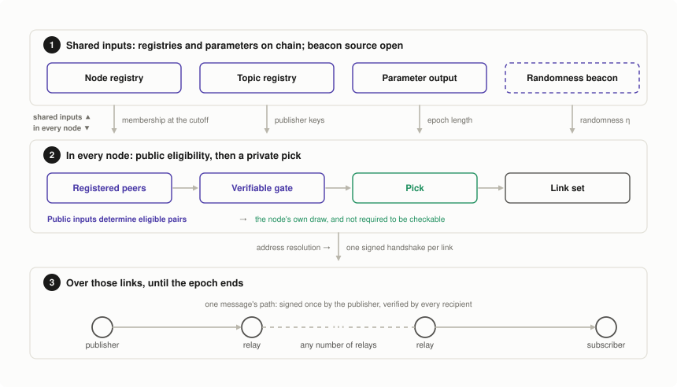
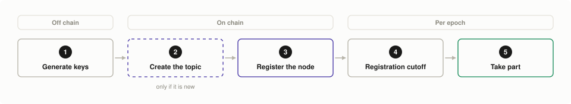
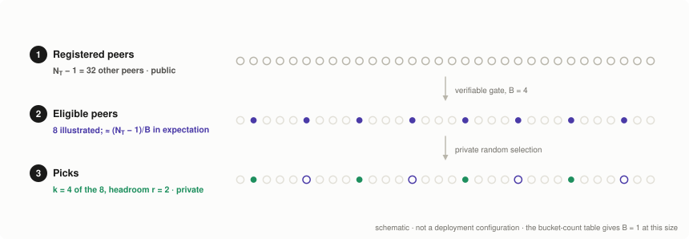
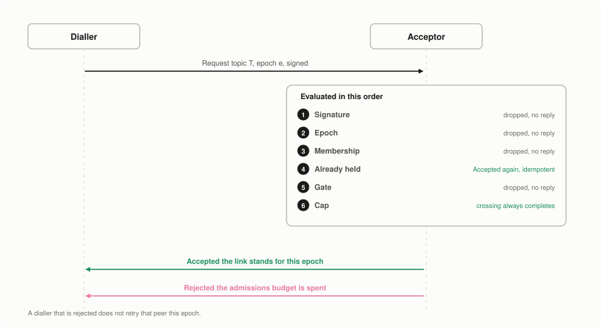
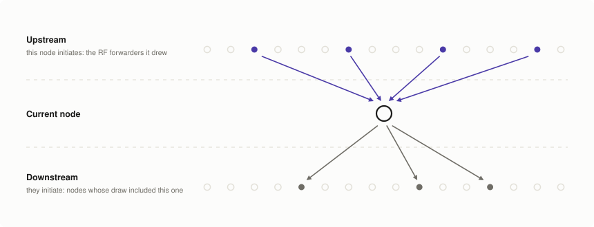
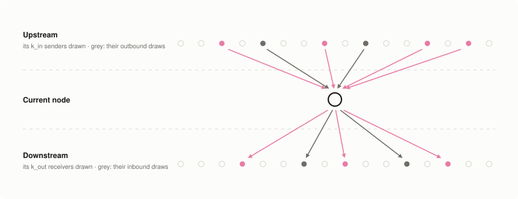
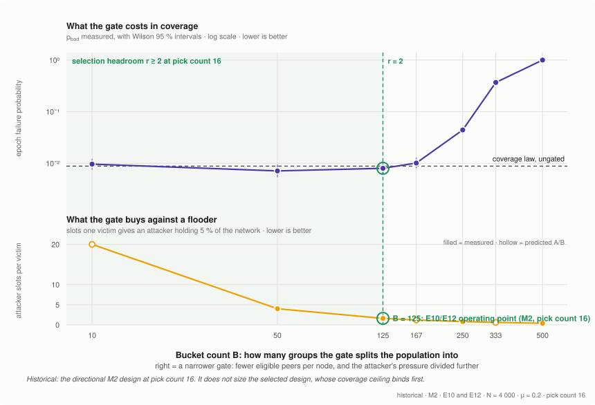
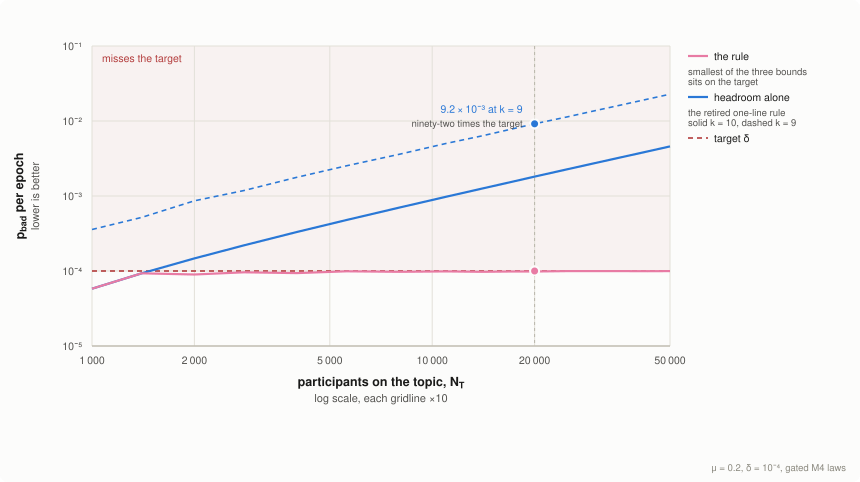
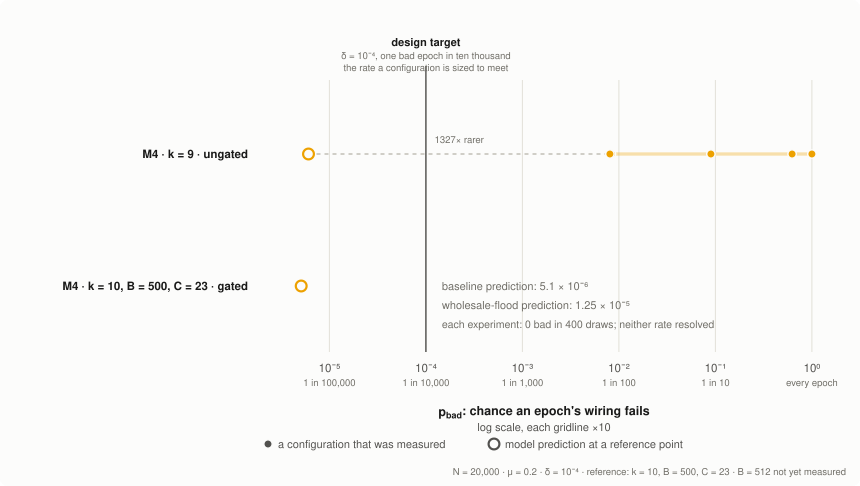

<!-- Existing categories:

- Meta      | For meta-CIPs which typically serves another category or group of categories.
- Wallets   | For standardisation across wallets (hardware, full-node or light).
- Tokens    | About tokens (fungible or non-fungible) and minting policies in general.
- Metadata  | For proposals around metadata (on-chain or off-chain).
- Tools     | A broad category for ecosystem tools not falling into any other category.
- Plutus    | Changes or additions to Plutus
- Ledger    | For proposals regarding the Cardano ledger (including Reward Sharing Schemes)
- Consensus | For proposals affecting implementations of the Cardano Consensus layer and algorithms
- Network   | Specifications and implementations of Cardano's network protocols and applications

-->

## Abstract
<!-- A short (\~200 word) description of the proposed solution and the technical issue being addressed. -->

The Cardano ecosystem lacks a decentralised layer for [messages](#term-message) that must be trustworthy but do not belong on the chain itself. Emergency alerts to stake pool operators, notifications from pools to their delegators, dApp and wallet messaging, and governance communication all run on centralised infrastructure today. Nothing binds a message to the on-chain identity of its sender, and delivery depends on a single service, so coordination around a Byzantine-fault-tolerant chain does not inherit its guarantees. Existing peer-to-peer solutions such as GossipSub[^gossipsub] do not close the gap: their resistance to eclipse rests on a discovery layer that admits freely created identities.

We propose a decentralised topic-based publish/subscribe protocol anchored on Cardano. The chain is the protocol's trust root and carries none of its traffic. [Nodes](#term-node) [register](#term-registry) on chain, which makes identities verifiable and costly to mass-produce, and per-epoch on-chain randomness draws a degree-bounded dissemination topology that any participant can recompute but none can influence. Topics carry arbitrary application content: the chain anchors trust, not the payload. Against an adversary controlling a bounded fraction of nodes, the per-epoch probability that any honest publisher fails to reach every honest subscriber is a tunable design target, grounded in formal analysis and in simulation at deployment scale. The coverage results are cross-validated between independent implementations; those for the admission rules rest on one, which the Rationale states.

Anchoring on the chain is a deliberate trade. It is what supplies a membership list that cannot be cheaply inflated and randomness no participant can steer; it is also a dependency on the system this layer is most often needed to coordinate around. The Rationale states where that dependency binds and what remains substitutable.

> [!NOTE]
> **What this document decides, and what it leaves to a deployment.** The dissemination design is selected on measured evidence, and the rules that size its parameters are stated normatively. What a deployment supplies is a small, named set of values: the adversarial fraction and failure target it sizes against, the honest downtime rate, the epoch length, and the randomness source. Each is read from a stated place, priced in the Rationale, and listed in [Path to Active](#acceptance-criteria) alongside what remains open. Measurements, tools and work continuing past this revision are at [pubsub.cardano-scaling.org](https://pubsub.cardano-scaling.org/), none of it normative.

<details>
  <summary><h2>Table of contents</h2></summary>

- [Abstract](#abstract)
- [Motivation: Why is this CIP necessary?](#motivation-why-is-this-cip-necessary)
- [Specification](#specification)
  - [Architecture](#architecture)
  - [Parameters](#parameters)
  - [Identity and keys](#identity-and-keys)
  - [On-chain state](#on-chain-state)
    - [The parameter output](#the-parameter-output)
    - [Authority over the parameter output](#authority-over-the-parameter-output)
    - [The topic registry](#the-topic-registry)
    - [The node registry](#the-node-registry)
    - [Address resolution](#address-resolution)
    - [Lifecycle and the registration cutoff](#lifecycle-and-the-registration-cutoff)
  - [Epochs and the randomness beacon](#epochs-and-the-randomness-beacon)
  - [Canonical encoding and domain separation](#canonical-encoding-and-domain-separation)
  - [Topology derivation](#topology-derivation)
    - [The registered peers on a topic](#the-registered-peers-on-a-topic)
    - [The verifiable gate](#the-verifiable-gate)
    - [Selection headroom and the bucket count](#selection-headroom-and-the-bucket-count)
    - [Selection](#selection)
    - [The dissemination design](#the-dissemination-design)
    - [The serving cap](#the-serving-cap)
    - [What the rules do on a small topic](#what-the-rules-do-on-a-small-topic)
  - [Link establishment](#link-establishment)
  - [Messages](#messages)
  - [Dissemination, recovery and retention](#dissemination-recovery-and-retention)
  - [Versioning](#versioning)
- [Rationale: How does this CIP achieve its goals?](#rationale-how-does-this-cip-achieve-its-goals)
  - [The adversary this proposal defends against](#the-adversary-this-proposal-defends-against)
  - [Evidence](#evidence)
    - [What is measured, and by what](#what-is-measured-and-by-what)
    - [Performance metrics](#performance-metrics)
    - [Designs evaluated](#designs-evaluated)
    - [Agreement between analysis and simulation](#agreement-between-analysis-and-simulation)
    - [Comparison at the proposed configurations](#comparison-at-the-proposed-configurations)
    - [Robustness](#robustness)
  - [Selecting the design](#selecting-the-design)
    - [Why the symmetric design](#why-the-symmetric-design)
    - [What a node pays, and how it scales](#what-a-node-pays-and-how-it-scales)
  - [Sizing the parameters](#sizing-the-parameters)
    - [Choosing the admission parameters](#choosing-the-admission-parameters)
    - [What can be turned, and what it costs](#what-can-be-turned-and-what-it-costs)
  - [What a subscriber is guaranteed](#what-a-subscriber-is-guaranteed)
    - [Two classes of fault, with different guarantees](#two-classes-of-fault-with-different-guarantees)
    - [What the protocol guarantees instead](#what-the-protocol-guarantees-instead)
    - [How long an epoch may be](#how-long-an-epoch-may-be)
  - [Limits of this evidence](#limits-of-this-evidence)
  - [Backward compatibility](#backward-compatibility)
  - [Open Questions](#open-questions)
- [Path to Active](#path-to-active)
  - [Acceptance Criteria](#acceptance-criteria)
  - [Implementation Plan](#implementation-plan)
- [References](#references)
  - [Prior art](#prior-art)
  - [External specifications this proposal builds on](#external-specifications-this-proposal-builds-on)
  - [Related CIPs](#related-cips)
  - [This proposal's own prior work](#this-proposals-own-prior-work)
  - [This proposal's evidence](#this-proposals-evidence)
  - [This proposal's reference implementation](#this-proposals-reference-implementation)
  - [Companion tools](#companion-tools)
  - [Open items tracked outside this document](#open-items-tracked-outside-this-document)
  - [Method notes](#method-notes)
- [Appendices](#appendices)
  - [Terminology](#terminology)
  - [Admission parameter bands](#admission-parameter-bands)
  - [Registry schemas](#registry-schemas)
  - [Reference implementation](#reference-implementation)
- [Acknowledgements](#acknowledgements)
- [Copyright](#copyright)

</details>

<details>
  <summary><h2>Index of figures</h2></summary>

- [Figure 1: The protocol at a glance](#figure-1)
- [Figure 2: Joining as a node](#figure-2)
- [Figure 3: Deriving one node's links for one epoch](#figure-3)
- [Figure 4: Establishing one link](#figure-4)
- [Figure 5: One node's links under M1](#figure-5)
- [Figure 6: One node's links under M2](#figure-6)
- [Figure 7: One node's links under M3](#figure-7)
- [Figure 8: One node's links under M5](#figure-8)
- [Figure 9: One node's links under M4](#figure-9)
- [Figure 10: Measured against predicted epoch failure probability](#figure-10)
- [Figure 11: Four-way trade-off across the non-dominated designs](#figure-11)
- [Figure 12: The bucket count trade-off](#figure-12)
- [Figure 13: What each way of sizing the bucket count delivers, against topic size](#figure-13)
- [Figure 14: Measured configurations against the configuration proposed](#figure-14)

</details>

<details>
  <summary><h2>Index of tables</h2></summary>

- [Table 1: The bucket count, by topic population](#table-1)
- [Table 2: The dissemination design at the reference shape](#table-2)
- [Table 3: The protocol's parameters](#table-3)
- [Table 4: The assumptions a deployment chooses](#table-4)
- [Table 5: Structural comparison of the dissemination designs](#table-5)
- [Table 6: The constants this section is measured at](#table-6)
- [Table 7: Performance metrics](#table-7)
- [Table 8: Cost at each design's configuration](#table-8)
- [Table 9: The two candidates, ungated](#table-9)
- [Table 9b: The same two designs, gated](#table-9b)
- [Table 10: Per-node cost against topics subscribed, at 1 kB and one message per second](#table-10)
- [Table 11: Per-epoch isolation risk, per node and network-wide](#table-11)
- [Table 12: Departure interval required per epoch length](#table-12)
- [Table 13: The protocol's vocabulary](#table-13)
- [Table 14: What each closed row gives up at its top](#table-14)
- [Table 15: Where the reference node decides each rule](#table-15)

</details>

## Motivation: Why is this CIP necessary?
<!-- A clear explanation that introduces the reason for a proposal, its use cases and stakeholders. If the CIP changes an established design then it must outline design issues that motivate a rework. For complex proposals, authors must write a Cardano Problem Statement (CPS) as defined in CIP-9999 and link to it as the `Motivation`. -->

The problem this proposal answers is stated in the accompanying [Cardano Problem Statement](../cps/README.md): Cardano has no standard way to deliver a message that must be trustworthy but does not belong in a transaction, and the channels carrying that traffic today sit outside the ecosystem's trust model. Substituting an unanchored peer-to-peer protocol does not close the gap, because resistance to eclipse rests on a discovery layer that admits freely created identities. The CPS sets out the gap, the four motivating scenarios, the stakeholders, and what any solution has to provide.

Two things Cardano already maintains are what make an answer possible. An on-chain registry with an associated cost is a Sybil-resisted membership list. Its per-epoch randomness is verifiable as well as unpredictable. A dissemination layer anchored on both can offer what neither a centralised broker nor an unanchored gossip mesh can: a peer set costly to inflate, and a topology no participant can steer.

**Which scenario this proposal is sized for.** The CPS scenarios differ by two orders of magnitude in how many nodes sit directly on a topic, and this proposal is designed and evaluated against the largest: emergency alerts from protocol teams to the roughly three thousand always-on stake pool nodes, which is also the scenario with the strongest delivery requirement. The Rationale evaluates at four thousand nodes to match today's stake-pool population and twenty thousand as headroom above it. The other three scenarios reach their audience through wallet backends, so the nodes directly on such a topic may number in the tens. The same rules serve them — the gate narrows with a topic's size and switches off where a topic is too small to bucket — but **nothing in this proposal is measured at that scale**, and [Limits of this evidence](#limits-of-this-evidence) states what that does and does not establish. A reader weighing the mediated scenarios should read it before the comparison.

## Specification
<!-- The technical specification should describe the proposed improvement in sufficient technical detail. In particular, it should provide enough information that an implementation can be performed solely on the basis of the design in the CIP. This is necessary to facilitate multiple, interoperable implementations. This must include how the CIP should be versioned, if not covered under an optional Versioning main heading. If a proposal defines structure of on-chain data it must include a CDDL schema in its specification.-->

This section specifies the protocol. It is ordered by the three bands of [Figure 1](#figure-1): what the chain supplies, how a node turns that into the links it will hold, and how messages travel over those links.

The key words MUST, MUST NOT, SHOULD, SHOULD NOT and MAY are to be interpreted as described in [RFC 2119](https://www.rfc-editor.org/rfc/rfc2119).

A [reference node](#this-proposals-reference-implementation) decides many of the rules below. [Table 15](#table-15) pins each one to the code that decides it, at a fixed commit, and says where the node departs from the text.

### Architecture

The chain is the protocol's trust root and carries none of its traffic. Two registries record who may participate and who may publish, a parameter output identifies the deployment and fixes its epoch length, and a randomness beacon supplies one unpredictable value per [epoch](#term-epoch). From those four public inputs, plus its own registered identity, every [node](#term-node) computes, for each topic it subscribes to, the set of peers it is permitted to link with — and so can anyone else, for any node. From that set it then draws privately the [links](#term-link) it will hold for the epoch. Messages then travel over those links.

An epoch here is the protocol's own dissemination period, the interval for which one drawn topology stands; its length is a parameter of this proposal. It is not the five-day Cardano ledger epoch, and the two need not coincide. A node is likewise the protocol's own: a process registered in its node registry, which runs beside a Cardano node and reads from it but is not one.

<div align="center">
<a name="figure-1" id="figure-1"></a>



<em>Figure 1: The protocol at a glance</em>

</div>

The figure's three bands are the order of this section.

| Band | What it holds | Specified in |
| :--: | --- | --- |
| **1** | What the chain supplies: the two registries, the parameter output, and the epoch's randomness | [Identity and keys](#identity-and-keys), [On-chain state](#on-chain-state), [Epochs and the randomness beacon](#epochs-and-the-randomness-beacon) |
| **2** | What every node computes from those inputs alone: eligible peers, the gate, its own private pick, the link set | [Canonical encoding](#canonical-encoding-and-domain-separation), [Topology derivation](#topology-derivation) |
| **3** | What travels over the links once they stand | [Messages](#messages), [Dissemination, recovery and retention](#dissemination-recovery-and-retention) |

The arrow between bands 2 and 3 is one signed handshake per link, which [Link establishment](#link-establishment) specifies.

Three properties of that arrangement carry most of the design.

**Derivation replaces discovery.** A node does not ask peers who its peers should be. It reads the [registry](#term-registry), applies a public predicate, and dials the result. There is no gossiped view of the network to poison, because there is no view: the peers a node may consider are the registry itself. This is what removes the attack surface the [CPS](../cps/README.md) identifies in discovery layers that admit freely created identities. Hardening such a layer instead was the design this proposal started from, and it was set aside: the hardened peer sampler was found to admit a targeted eclipse under an adversary that only withholds,[^peersampler] which is the same adversary this proposal is analysed against.

**The topology is checkable, not merely asserted.** Because the predicate is a function of public data, any participant can recompute which links a given node was permitted to hold in a given epoch and check the ones it actually holds. A node that dials outside its permitted set produces signed evidence of having done so.

**What a node keeps private is its own draw, not its position.** The predicate narrows a node's eligible set; which of those peers it then picks is not required to be checkable. [Topology derivation](#topology-derivation) states where that split falls.

### Parameters

A handful of named quantities size the protocol, and they are of two kinds. Some are parameters the protocol runs on. The rest are assumptions about the environment it is being sized for. A node reads both. Only the parameters are ever checked by a peer, and that difference decides where each is held.

**Only two of the values must be identical across nodes.**

- **The bucket count *B*.** It decides how narrowly the peers a node may link with are drawn from a topic's population. *B* is not held on chain at all: a node looks it up in [Table 1](#table-1) of this document, by how many peers the topic has in the snapshot.
- **The epoch length *T*<sub>epoch</sub>.** It fixes where an epoch begins and ends, and so which snapshot and which randomness a topology is drawn from. It is read from the [parameter output](#the-parameter-output).

The snapshot both refer to is the protocol's own: the two registries and the parameter output as they stand at the epoch's [registration cutoff](#lifecycle-and-the-registration-cutoff), a chain position fixed before the epoch's randomness is known. It is not the ledger's stake distribution snapshot, and is not taken at an epoch boundary.

[Topology derivation](#topology-derivation) specifies how both are used.

**Everything else a node computes is its own.** How many links it opens is checked by nobody. How many it accepts is a matter of its own capacity. A node that sizes either badly loses coverage or capacity, and disagrees with no one.

<div align="center">
<a name="table-3" id="table-3"></a>

| Symbol | Controls | Value | Argued in |
| :--: | --- | --- | --- |
| <a name="param-t-epoch" id="param-t-epoch"></a>*T*<sub>epoch</sub> | How long a topology stands, and so how long a subscriber can be cut off | **Open.** Carried in the [parameter output](#the-parameter-output); bounded below by the beacon interval and above by the [churn budget](#table-7) | [How long an epoch may be](#how-long-an-epoch-may-be) |
| <a name="param-cutoff" id="param-cutoff"></a>n/a | The [registration cutoff](#term-snapshot): the chain position each epoch is derived from | **Fixed by rule:** strictly before *η*<sub>e</sub> is determined | [Lifecycle and the registration cutoff](#lifecycle-and-the-registration-cutoff) |
| <a name="param-eta" id="param-eta"></a>*η*<sub>e</sub> | The epoch's randomness | **Open source**, fixed requirements | [Epochs and the randomness beacon](#epochs-and-the-randomness-beacon), [issue #22](https://github.com/input-output-hk/pubsub/issues/22) |
| <a name="param-b" id="param-b"></a>*B* | How narrowly a node's permitted peers are drawn from a topic | **Selected:** from [Table 1](#table-1), by the topic's registered population | [Choosing the admission parameters](#choosing-the-admission-parameters) |
| <a name="param-r" id="param-r"></a>*r* | Peers left eligible per link a node opens | **Floor fixed:** ≥ 2, and not the binding constraint at the candidate pick counts | [Choosing the admission parameters](#choosing-the-admission-parameters) |
| <a name="param-k" id="param-k"></a>*k* | Links a node opens per topic | **Derived:** the smallest count meeting *δ* once honest downtime is folded in. Written *RF* for relay links in the tables and figures; *RF* = 10 at the reference shape (*N* = 20 000, *μ* = 0.2, *δ* = 10⁻⁴ per epoch) | [The dissemination design](#the-dissemination-design) |
| <a name="param-c" id="param-c"></a>*C* | Links a node accepts per topic per kind | **Fixed by rule:** ≥ *L* + *c*·√*L*, for the fresh admission load *L* and the headroom constant *c* that [The serving cap](#the-serving-cap) fixes | [The serving cap](#the-serving-cap), [Choosing the admission parameters](#choosing-the-admission-parameters) |
| <a name="param-retention" id="param-retention"></a>retention | How long a node caches messages, for dedup, equivocation and recovery | **Floor fixed:** ≥ 1 epoch. Value open, per topic | [What the protocol guarantees instead](#what-the-protocol-guarantees-instead) |
| <a name="param-deposit" id="param-deposit"></a>deposit | The cost of one registered identity, and so the Sybil surface | **Open.** Not forfeitable for non-delivery | [Two classes of fault](#two-classes-of-fault-with-different-guarantees), [Open Questions](#open-questions) |
| <a name="param-withdrawal-delay" id="param-withdrawal-delay"></a>withdrawal delay | How long a retired entry waits before its deposit may be claimed, and so how fast identities can rotate | **Floor fixed:** ≥ 1 epoch. Value open | [The node registry](#the-node-registry) |

<em>Table 3: The protocol's parameters</em>

</div>

**The assumptions are choices a deployment makes, not facts any peer can check.** *μ*, *δ*, *p* and *A* describe the environment the protocol is being sized for, and the failure rate it is being sized to. They are the axes the design was explored along, and every coverage figure in this document is conditional on them. An implementor picks the point that matches the deployment they are building for; the [Evidence](#evidence) gives the laws across that space rather than only at the point this proposal fixes.

A node reads them to size its own pick count and serving cap. No peer verifies them, and no link is ever refused over one, which is why they need no on-chain home. Changing one re-sizes the deployment: it means rebuilding [Table 1](#table-1) and restating what every node is configured with. Two are tied to the epoch length, since a failure rate per epoch and a downtime rate across an epoch both mean something else if the epoch changes. A scheduled change to *T*<sub>epoch</sub> therefore requires *δ* and *p* to be restated against it.

<div align="center">
<a name="table-4" id="table-4"></a>

| Symbol | What it assumes | Value | Argued in |
| :--: | --- | --- | --- |
| <a name="param-mu" id="param-mu"></a>*μ* | The share of registered nodes that accept their links and forward nothing | **Open.** Declared by the deployment; what [Table 1](#table-1) was built at | [Open Questions](#open-questions) |
| <a name="param-a" id="param-a"></a>*A* | How many registered identities one adversary holds. Bounded by *μ* and the population, not implied by them: the same *μ* may be one adversary or many | **Open.** Declared by the deployment; read by the admissions-budget rule | [Choosing the admission parameters](#choosing-the-admission-parameters) |
| <a name="param-delta" id="param-delta"></a>*δ* | The per-epoch coverage failure a deployment is willing to accept | **Open.** Declared by the deployment; what the pick count is solved to meet | [Open Questions](#open-questions) |
| <a name="param-p" id="param-p"></a>*p* | The share of honest nodes absent across an epoch, which is what this proposal means by churn: nodes going offline and returning within a membership fixed at the cutoff, not turnover in who is registered. The drop-out rate *λ* read against the epoch length, by *p* = 1 − e<sup>−λ·*T*</sup> | **Open.** Declared by the deployment; shifts the fraction the pick count is solved at | [How long an epoch may be](#how-long-an-epoch-may-be) |

<em>Table 4: The assumptions a deployment chooses</em>

</div>

The quantities used only to *measure* a design — the epoch failure probability, the cost and latency metrics, and the churn budget — are defined in [Table 7](#table-7) and are not repeated here.

### Identity and keys

This section fixes the three key roles the protocol distinguishes, the constraints the rest of the Specification places on an identity, and the registration proof that binds one. It does not fix whether an identity is anchored to a credential that already carries a trust relationship; that question is posed in the [Open Questions](#open-questions), and the requirement any anchoring would have to meet is stated below.

**The three key roles.** Three keys with distinct roles appear in the protocol, and an implementation MUST keep them distinct.

- The **operator credential** authorises registry transactions. It is a payment credential in the ordinary Cardano sense, held wherever the operator holds keys, and is never used by the running node.
- The **node identity key** signs link-establishment messages, and is the identity the topology is derived over. The private key is held by the node process.
- The **publisher key** signs messages on a topic and is authorised by that topic's registry entry.

A publisher key MAY coincide with a node identity key, and a single publisher key MAY be authorised on several topics, but the roles do not imply one another: authorisation to publish does not admit a key to the node registry, and registration does not authorise publication.

**What the rest of the Specification leans on.** Identity is the raw Ed25519 public key rather than a hash of it, because peers verify signatures against it directly on every handshake and because the [gate preimage](#the-verifiable-gate) consumes it raw. Anything that gates participation MUST be **snapshottable** — evaluable at a fixed chain position, identically by every node — since the topology derives from the [registration-cutoff snapshot](#term-snapshot) rather than from the chain tip. Any future anchoring to an existing credential MUST preserve both properties, or it reopens the derivation rather than extending it.

**Proof of possession.** A registration transaction MUST carry a signature by the node identity key, in the notation [Canonical encoding](#canonical-encoding-and-domain-separation) fixes, over

$$\mathrm{LP}(\texttt{pubsub/register/v1}) \,\|\, \mathrm{LP}(id) \,\|\, \mathrm{LP}(op)$$

where *id* is the node identity key and *op* the operator credential. Without it an operator can lock a deposit against a public key it does not hold, and because an identity may hold at most one entry, squatting a key that is known in advance would block its legitimate holder from registering at all. Any anchoring mechanism added later needs its own proof of possession for the same reason.

**Display encoding.** A node identity is displayed as Bech32[^bech32] under the human-readable prefix `pubsub`. The encoding is for display and interchange only: every preimage in this proposal consumes the raw key bytes, never a display form.

### On-chain state

The protocol holds three things on chain: a **parameter output** that identifies the deployment and fixes its epoch length, a **topic registry**, and a **node registry**. Each is a script output whose datum carries its content; creating, updating and retiring an entry are ordinary transactions spending and recreating that output. Both registries are the protocol's own: an entry in either neither requires nor implies stake pool or dRep registration. This section specifies what each holds and the state transitions it must admit, and leaves the validator implementation to the deployment.

**Which registry holds what.** The two registries divide by who may write an entry, not by what it is about.

- **A node entry is written by its operator.** It holds what is that node's own to declare: its identity key, its deposit, its endpoints, and the topics it takes part in.
- **A topic entry is written by the topic's owner.** It holds what is the topic's own to declare: that it exists, which keys may publish on it, and how long messages are retained.

Subscribing is a node's decision, so it sits on the node entry. Authorising a publisher is the owner's, so it sits on the topic entry. [Figure 2](#figure-2) puts the two in the order an operator meets them.

<div align="center">
<a name="figure-2" id="figure-2"></a>



<em>Figure 2: Joining as a node</em>

</div>

Stage 1 is specified under [Identity and keys](#identity-and-keys) and stage 5 under [Topology derivation](#topology-derivation). The two entries of stages 2 and 3 are specified in the subsections below, and the registration and cutoff of stages 3 and 4 under [Lifecycle and the registration cutoff](#lifecycle-and-the-registration-cutoff).

#### The parameter output

One output per deployment, created when the registries are deployed. It does two jobs.

**It identifies the deployment.** It names the script hashes that constitute this deployment's node and topic registries, so every other on-chain object a node reads is reached from here. Two deployments — a test network and a production one, or successive revisions of this proposal — are distinct parameter outputs and never share a topology.

A node is configured with the script hash of the parameter output itself: one value, supplied rather than discovered, that settles which deployment the process has joined. It is this layer's counterpart to the genesis hash a **Cardano** node is given, and not that same value. The script hash and the deployment's declared assumptions are what an operator supplies out of band; every other object the protocol reads is reached from the chain.

**Exactly one parameter output MUST exist per deployment, and the validator MUST enforce that.** A one-shot minting policy is the RECOMMENDED mechanism: the policy permits a single mint, the validator requires the resulting token to be present in the output, and a node takes the output holding that token. Without an enforced singleton, anyone could pay to create a second output at the same script carrying a plausible datum, and nothing in this proposal would say which one a node should read.

**A node that cannot read the parameter output MUST NOT participate.** If the output is absent, unreachable, or cannot be parsed as this proposal's schema, the node MUST NOT derive a topology for the epoch and MUST NOT open links. It MUST NOT substitute a default, and MUST NOT carry forward a value read in an earlier epoch. A node acting on an epoch length other than the agreed one derives from a different snapshot under different randomness, so its dials are refused by peers that used the agreed one; it would be participating in name only. Declining to participate is also indistinguishable from downtime, which the analysis already accounts for.

**It carries the epoch length.** *T*<sub>epoch</sub> MUST be read from this output. No node may substitute its own value. One that did would derive from a different snapshot under different randomness, and be refused by peers that used the agreed one. Holding it here rather than in configuration is what lets a change be *scheduled*: the rules below announce a new value against a future epoch, and a configuration file has no way to say which epoch a value takes effect from. Whether that is worth an on-chain output at all is posed below.

**It does not carry the sizing assumptions.** *μ*, *δ*, *p* and *A* are declared by the deployment. A node reads them from its configuration at startup; an implementation MUST NOT compile them in. [Parameters](#parameters) sets out why they need no on-chain home. Whether they should instead vary per topic is posed in the [Open Questions](#open-questions).

Three rules govern changes.

1. A change MUST be read from the [registration-cutoff snapshot](#term-snapshot), as the registries are, and MUST NOT be read at the chain tip.
2. A change MUST take effect at an **announced epoch**, recorded as a pending change against the epoch it applies from. Moving it alters what every node computes, so a change effective at the tip would split the network mid-epoch — the failure the [registration cutoff](#lifecycle-and-the-registration-cutoff) exists to prevent. This is the same rule [Versioning](#versioning) states for any change to what a conforming node computes.
3. A pending change MUST be announced before the registration cutoff of the epoch it applies from, MAY be moved later or cancelled before that cutoff, and MUST NOT be brought forward — bringing one forward would apply values that some nodes had already derived an epoch without. Once the epoch has arrived the pending value is promoted to current; until it is, a node reading the snapshot MUST use the pending value from that epoch onward and the current one before it.

#### Authority over the parameter output

An output that can be changed is an authority, and this proposal does not settle who holds it. Whoever may spend the parameter output can move the epoch length, and with it how long a subscriber can be cut off and how much churn a topology must absorb. The authority is bounded — the value is public, every node reads it, and its effect is recomputable and auditable by anyone — but it is real, and it is the one place in this design where a single party changes what every node computes. Five arrangements are available, and the choice is posed in the [Open Questions](#open-questions).

**No parameter output at all.** Ship the registry script hashes and the epoch length in node configuration, named by hash in the way a genesis file is, and make a change a coordinated restart. No standing authority, at the cost of losing the scheduling that a pending on-chain change provides.

**An immutable output.** Created at deployment and never spent. A change means deploying a new instance that nodes migrate to. No standing authority either, at the cost of making any change an overlay-wide cutover.

**Governance-controlled.** A Cardano governance action moves the value. No privileged party, at the cost of the heaviest process for the smallest change.

**An authorised credential**, named in the output and held by whoever deployed it. Simplest, and standing central control.

**Per topic, set by its owner.** Each topic entry carries its own epoch length, so no party sets one for the whole network and a topic rotates on the schedule its use case wants. The derivation still agrees, since both ends of a link are on one topic and read the same entry, and a badly chosen length costs that topic's own subscribers rather than anyone else's. Three costs come with it. The beacon must supply a value at each topic's cutoff rather than one per network-wide epoch; a node on several topics derives from several snapshots; and an owner that can move a boundary needs the announcement discipline above, or it can time a cutoff against randomness it can already see. It also carries *δ* and *p* per topic, since both are read against the epoch length.

#### The topic registry

One entry per topic. It binds a topic identifier to the set of keys authorised to publish on it, to the owner permitted to change that set, and to the topic's retention window. An empty publisher set means the topic is open: any registered node may publish to it.

The topic registry is global and read by every node, because whether a topic exists and who may publish on it are facts about the network rather than about any node.

A topic entry moves through three operations of its own, and the third is *announced* rather than immediate.

**Step 1. Creation.** Creates the entry and brings the topic into existence.

1. The topic identifier MUST be the blake2b-256 hash of the output that creates the entry, which makes identifiers unforgeable and collision-free without a naming authority.
2. The retention window MUST be at least one epoch, for the reason [Dissemination, recovery and retention](#dissemination-recovery-and-retention) gives.
3. The entry MAY carry an empty publisher set.

**Step 2. Changing the authorised publishers.** Replaces the publisher set.

1. Only the owner credential named in the entry MAY change the set. That credential MUST NOT be a publisher key: the authority to revoke has to sit outside the set it revokes from.
2. A key is **granted** authority from the first epoch whose snapshot contains it, in the same way a node's topic interests are, so a grant is predictable and every node in the epoch agrees on it.
3. A **revocation** takes effect at the chain tip, once it is deep enough that a rollback will not restore it; a deployment SHOULD require the same confirmation depth it uses for any other consequential registry read.
4. A revocation invalidates the key's whole history on the topic. A recipient MUST reject every message from a currently-revoked key, whatever time the message claims to have been published at. Timestamps are self-reported, so a recipient can never establish *when* a message was published, only when it received it; evaluating authority at the recipient's own present is what makes a revocation final.
5. An owner replacing a publisher key in the ordinary course SHOULD grant the successor, publish under it, and remove the predecessor only once a retention window has elapsed, since removal invalidates the predecessor's still-cached messages.

The two directions are deliberately asymmetric. Both moves are in the safe direction: a node can only ever drop a message another node accepted, never accept one another node dropped. Grants wait for the snapshot because nothing is urgent about admitting a publisher and consistency is worth more; revocation cannot wait, because the case that matters is a compromised key, and an epoch is hours or days. The cost is that nodes at slightly different chain positions disagree for a few blocks about the whole of a revoked key's cached history. That is tolerable here in a way it would not be in a ledger: this protocol does not attempt consensus on what was delivered, only that what is delivered is authentic.

**Step 3. Ending the topic.** A topic ends at an epoch boundary, announced in advance.

1. The owner MUST announce the end by recording in the entry the epoch *e*<sub>end</sub> at which it takes effect.
2. *e*<sub>end</sub> MUST be an epoch whose registration cutoff has not yet passed, so that every node sees the announcement in the snapshot of the epoch the end takes effect in.
3. Until *e*<sub>end</sub> the topic is live in every respect: nodes keep their subscriptions, derive links for it, and publish and relay on it as normal.
4. From *e*<sub>end</sub> the topic MUST be excluded from topology derivation, and nodes MUST drop their subscriptions and tear down their links for it at that epoch boundary.
5. The owner MAY move *e*<sub>end</sub> later or cancel the end, provided the change is itself announced before the cutoff of the epoch it affects.
6. The entry MAY be removed from the chain once *e*<sub>end</sub> has passed.

The announcement exists because the alternative does not work. Removing an entry outright ends the topic at the chain tip, while every node derives its topology from the epoch's snapshot, so the two rules read different chain positions: nodes tearing down links the moment they see a removal would disagree with nodes still deriving that topic from the snapshot, and a message in flight would be relayed by some and dropped by others. Announcing an end and applying it at an epoch boundary puts topic lifetime on the same clock as everything else the topology depends on, in the same way that a stake pool's retirement names a future epoch rather than taking effect on submission.

Two consequences follow.

- **A node entry may outlive a topic it lists.** A listed topic that has ended is simply excluded from that node's derivation, and a node left with no live topic takes part in no topology until it updates its entry, which the announcement gives it an epoch's notice to do.
- **Retention is unaffected.** Messages already forwarded stay in caches for the retention window, so a subscriber can still recover from a topic that has just ended.

#### The node registry

One entry per participating node. It binds a node identity to the topics that node takes part in, to a locked [deposit](#term-deposit), and optionally to a network endpoint at which it can be reached.

Keeping the subscription on the node entry is what keeps both registries free of contention. A subscriber list on the topic entry would be one output that every node must spend to join or leave. A large topic would then serialise its subscriptions behind a single UTxO, and a validator would have to resolve the ordering. Each operator spends only its own output, so no registry operation waits on another party's transaction. The derivation reads the edge from the same side: *N*<sub>T</sub> is [the number of nodes whose snapshot entry lists *T*](#the-registered-peers-on-a-topic).

The topic-interest set is authoritative. A node's effective subscriptions are the topics in its registry entry, never a local configuration file, because every other node derives that node's obligations from the registry and the two must agree.

The deposit makes identities costly to mass-produce and is the whole of the protocol's Sybil resistance. It is neither pledge nor stake: it is not delegated, earns nothing, and confers no weight in the protocol beyond the right to hold one identity. It is returned to the operator when the entry is retired, after a delay. It MUST NOT be forfeitable for failing to deliver messages: as the [Rationale](#two-classes-of-fault-with-different-guarantees) establishes, the protocol cannot attribute an absence of messages to any node, so a bond conditioned on delivery would be a bond conditioned on something unobservable. The alternative is not forfeiture but **decay**: a deposit that erodes wherever a node supplies no positive evidence of having participated, as Ethereum's inactivity leak treats liveness faults. That reverses what has to be observed — evidence of presence rather than evidence of absence — and it is posed, undecided, in the [Open Questions](#open-questions).

The withdrawal delay is what keeps the deposit attached to a *standing* identity, and it does two things.

- **The delay MUST be at least one epoch.** A retiring entry is still in the snapshot the current epoch derives from, so other nodes hold links to it until that epoch ends; reclaiming immediately would leave the identity unbonded while it still occupies positions in the standing topology.
- **It bounds how fast an operator can rotate identities.** The deposit prices identities that stand rather than identities that once existed; without the delay, a single deposit funds a fresh identity every epoch, which is the re-registration the [Rationale](#the-adversary-this-proposal-defends-against) excludes from its adversary model.

Its value beyond that floor is open.

#### Address resolution

Turning a registered identity into an address that can be dialled is specified here as an interface rather than a mechanism, in the same way the [beacon](#term-beacon) is. The topology never depends on an address: the snapshot fixes identities and topic interests, and nothing in the derivation, the gate, the handshake or the analysis reads an endpoint. What the protocol needs is only that a node which another node has derived a link to can be found, and that finding it cannot be spoofed. Any mechanism meeting four requirements conforms.

1. **Authenticated to the node identity key**, so that an address is usable only where the identity the topology is derived over vouches for it.
2. **Resolvable by every node that derives a link** to the one being addressed, since a dialler learns who its peers are from the registry rather than from whoever told it about them.
3. **Refreshable within an epoch**, because an operator whose address changes mid-epoch would otherwise be unreachable until the next cutoff for no gain.
4. **Failing closed:** an address that cannot be resolved MUST be treated exactly as silence, since a node that cannot be reached is indistinguishable from one that is registered and not forwarding — the [adversary](#the-adversary-this-proposal-defends-against) the analysis already assumes.

Recording the endpoint in the node's registry entry is the RECOMMENDED mechanism, and it is the one this proposal specifies. It meets all four by construction, and it removes the bootstrap problem rather than relocating it: the chain is the entry point, so there are no seed nodes to advertise, attack, or keep online. Its cost is that every participant's address is public and permanent, which for stake pool operators inverts the practice of keeping block-producing infrastructure unadvertised. A deployment unwilling to pay that cost MAY leave the endpoint list empty and resolve addresses off-chain instead. Signed address records are the candidate: because identity is rooted in the registry rather than in the layer that distributes addresses, such a record is self-authenticating, so that layer can withhold an address but cannot forge one. What it does not supply is an entry point, and that gap, along with the choice between the two mechanisms, is among the questions [Path to Active](#acceptance-criteria) leaves open.

One participant needs no address at all. An authorised [publisher](#identity-and-keys) key need not belong to a registered node, so it has no position in the topology, no deposit and no endpoint; a node run by the same operator injects the messages it signs. Because [the signature is end to end](#messages), that injecting node is trusted for availability only, never for authenticity or integrity. Only a topic that names its publisher keys allows this, since an open one reserves publishing to registered nodes.

#### Lifecycle and the registration cutoff

A node entry moves through four operations, and every epoch is derived from a snapshot taken at a fifth point. Registration and the snapshot are stages 3 and 4 of [Figure 2](#figure-2); the other three operations come after joining and are what an entry does for the rest of its life. Each step below states its constraints normatively, with the reasoning after them.

**Step 1. Registration.** Creates a node entry and locks the [deposit](#term-deposit).

1. The entry MUST list at least one topic, and every topic it lists MUST have an active entry in the topic registry. A topic entry created in the same transaction satisfies that, and a validator MUST accept it: the transaction's own outputs are visible to it, and the topic identifier is derived from an output the transaction spends, so it is known before submission. An operator can therefore bring up a new topic and the first node on it atomically, and never needs to do the reverse, since creating a topic takes no registered identity.
2. The transaction MUST lock the deposit, which stays locked for as long as the entry stands.
3. An identity MUST NOT hold more than one entry. The identity key is the entry's key, so a second entry for it is not a second identity but a malformed registry.
4. The entry participates in dissemination from the first epoch whose snapshot contains it, never from the moment it lands on chain.

**Step 2. Update.** Replaces the topic-interest set, the endpoint, or both.

1. Only the operator credential named in the entry MAY update it.
2. Every newly listed topic MUST have an active entry in the topic registry, and the set MUST remain non-empty.
3. A changed topic set takes effect at the next registration cutoff, because the topic set is an input the topology is derived from.
4. A changed endpoint list takes effect at the chain tip, because reachability is not such an input, and it MAY be emptied by a node resolving its address off-chain instead.

That asymmetry is deliberate: an operator changing endpoints submits one transaction and remains reachable, while an operator changing topics waits for the next epoch. A node whose address changed mid-epoch would otherwise be unreachable until the next cutoff for no gain.

**Step 3. Retirement.** Marks an entry withdrawing and starts the withdrawal delay.

1. Only the operator credential MAY retire the entry.
2. The entry remains in every snapshot already taken, so the node MUST continue to serve the links derived for the epoch in progress.
3. The entry MUST NOT appear in the snapshot of any later epoch.

Retirement is the orderly path. A node that simply stops responding leaves its entry standing and is treated by everyone else as a registered node that happens not to be forwarding, which is indistinguishable from the adversary the [Rationale](#the-adversary-this-proposal-defends-against) analyses.

**Step 4. Claim.** Takes the deposit back.

1. The claim MUST NOT succeed before the epoch recorded in the entry as `claimable_from`.
2. That epoch MUST be at least one epoch after the retirement, for the reasons given under [The node registry](#the-node-registry).

**Step 5. The snapshot and the registration cutoff.** Each epoch is derived from a *snapshot* of both registries and of the parameter output, taken at that epoch's **registration cutoff**.

1. The cutoff MUST fall strictly before the point at which the epoch's randomness *η*<sub>e</sub> is determined.
2. A node MUST derive the epoch from the snapshot, and MUST NOT derive it from the chain as it currently stands.
3. The snapshot fixes exactly the inputs the topology is a function of: the registered identities, their topic interests, and the parameters the admission rules read. The endpoint is read at the tip and is not fixed by it.

The cutoff ordering is what makes neighbour selection non-influenceable: a node registering, retiring or changing its topics cannot see the randomness it will be positioned by, so it cannot choose an identity or a moment that places it near a chosen victim. The converse obligation falls on the beacon, and is stated in [Epochs and the randomness beacon](#epochs-and-the-randomness-beacon).

> [!WARNING]
> **The plain reading is wrong in the one case that matters.** A node does not read the registry at the tip and compute its peers from it: a registration that lands after the cutoff is visible there and is *not* part of the epoch. Two nodes deriving from different chain positions would disagree about who is registered and refuse each other's dials. Deriving from the cutoff snapshot is what makes the derivation agree across the network.

The datum schemas for all three, in CDDL,[^cddl] are under [Registry schemas](#registry-schemas). What every implementation needs from the chain is the ability to **enumerate both registries, and read the parameter output, at a fixed chain position**, since the topology derives from that snapshot rather than from the tip.

### Epochs and the randomness beacon

A topology has to stand still to be useful, and it has to change to be safe.

If it stands still forever, a subscriber whose peers all happen to be adversarial is cut off permanently, and nothing in the design ever rescues it. If it changes continuously, no reader can say what coverage the network had when a message was published, and every node pays to re-establish links it has just opened. The protocol therefore fixes the topology for a period, and then draws a new one.

That period is an [epoch](#term-epoch), the protocol's own and not the ledger's. Epoch *e* runs for *T*<sub>epoch</sub>, and for its whole duration every node holds the links derived for *e* and re-derives nothing. Rotation to *e*+1 is what ends being cut off, so *T*<sub>epoch</sub> bounds how long a subscriber can be silenced and is a security parameter rather than an operational one. Its value is open; the [Rationale](#how-long-an-epoch-may-be) bounds it from both directions and shows that only the upper bound binds.

Redrawing needs a fresh value that nobody can predict and nobody can steer — otherwise a participant could place itself beside a chosen victim, which is exactly what the [CPS](../cps/README.md) requires a solution to prevent.

Each epoch has one randomness value *η*<sub>e</sub>, a byte string, supplied by a **beacon**. The choice of source is open, so the beacon is specified here as an interface rather than a mechanism. A conforming source MUST meet all four of:

1. **Unbiasable.** No participant, and no coalition of the size the protocol is analysed against, may influence *η*<sub>e</sub> towards a value of its choosing.
2. **Grinding-resistant.** The same requirement stated against a party that can cheaply enumerate candidate values: no adversary may search over anything it controls to move where it lands in the topology.
3. **Publicly recomputable.** Every node derives the identical value from chain data alone — no service to trust, no round of agreement.
4. **Fixed after the epoch's registration cutoff.** The membership the topology is drawn over is settled before the randomness that draws it.

Requirements 3 and 4 are the pair that interact. Public recomputability means *η*<sub>e</sub> becomes knowable at some point; the cutoff ordering means membership is already closed when it does. Neither alone suffices, and the [Rationale](#what-the-protocol-guarantees-instead) states why the independence of successive draws depends on both.

The beacon also floors *T*<sub>epoch</sub>, which cannot be shorter than the interval at which a fresh unbiasable value is available: a per-block source would permit epochs of seconds, a ledger-derived per-epoch nonce would force five days. The source therefore decides whether epoch length is constrained by the beacon or by the churn ceiling, and the choice is tracked as [issue #22](https://github.com/input-output-hk/pubsub/issues/22).

### Canonical encoding and domain separation

Every signature in the protocol is over a canonical byte string, never over a serialised structure, so that two implementations cannot disagree by encoding the same content differently. Three rules apply throughout:

- Variable-length fields are **length-prefixed**, written `LP(x)`: a four-byte big-endian length followed by the bytes.
- Fields are joined by plain byte **concatenation**, written ‖, with no separator between fields.
- Integers are **big-endian and fixed width**.
- Every preimage begins with a length-prefixed **domain tag** naming what is being signed, so a signature valid in one role cannot be replayed into another.

A node identity is an Ed25519 public key,[^ed25519] and wherever it enters a preimage it is consumed raw, never in a display form.

### Topology derivation

> [!NOTE]
> **Reading the tag.** Five dissemination designs were analysed and this proposal selects
> one, so some of what follows is general and some is a property of the design chosen.
> **[applies to: …]** marks the difference: the expression means something only for the
> designs or link kinds named, and says nothing about the others.
>
> **An untagged formula holds for any of the designs and carries no measured constant.**
> That is the point of the tags: they are what lets the rest be read without checking. They
> are for the reader and impose no requirement on an implementation beyond the rule they
> qualify.


Everything in this subsection is a pure function of the epoch's snapshot, *η*<sub>e</sub>, and the deriving node's own identity. No message is exchanged and no peer is consulted. Two nodes running the same derivation over the same inputs obtain the same answer, which is what lets an acceptor check a dialler's claim rather than take it.

<div align="center">
<a name="figure-3" id="figure-3"></a>



<em>Figure 3: Deriving one node's links for one epoch</em>

</div>

The three rows are the same peers, marked three times over.

- **Row 1** is everyone registered on the topic, taken from the [node registry](#the-node-registry) as it stood at that epoch's [registration cutoff](#term-snapshot), so every node reads the same list.
- **Row 2** is the smaller set this node may link with; the [bucket count](#term-b) *B* decides how much smaller, and a node looks it up in [Table 1](#table-1) by how many peers the topic has.
- **Row 3** is the *k* of those that the node picks, using randomness of its own.

The figure is drawn at 32 registered peers and *B* = 4, so eight are eligible and *k* = 4 are picked. The ratio of row 2 to row 3 is the [selection headroom](#term-r) *r* = 2, the smallest value this Specification permits.

The three rows differ in who can check them. **Rows 1 and 2 are recomputable by anyone holding the chain**, so an acceptor, or any third party, can reject or expose a link outside the permitted set. **Row 3 is the node's own randomness and is not checkable by anyone**, because a private pick is what keeps the topology a random graph rather than a published one. Concretely, an acceptor presented with a dial verifies three things and nothing else:

- the dialler is registered on this topic, in the snapshot this epoch derives from;
- the gate holds for the pair, recomputed from public data alone — sorted by identity bytes for a symmetric kind, ordered for a directional one;
- accepting would not exceed the serving cap *C*.

Nobody can check *which* eligible peers a node chose, or that it opened any links at all. The gate bounds where an adversary may place itself; it does not compel anyone to participate.

#### The registered peers on a topic

Write *N*<sub>T</sub> for the number of nodes whose snapshot entry lists topic *T* — row 1 of [Figure 3](#figure-3). For a node *a* among them, the peers it might link to on *T* are the other *N*<sub>T</sub> − 1, and that is the full membership rather than a sample of it: there is no view, and therefore nothing to bias. Being registered on the topic says only that a link between the two would be legitimate; it does not mean the link exists, nor that the gate below admits it.

#### The verifiable gate

The gate is the step from row 1 to row 2 of [Figure 3](#figure-3): it narrows the candidates to those a node is permitted to link with in this epoch. For a pair (*a*, *b*) on topic *T* under randomness *η*, with domain tag *d* and [bucket count](#term-b) *B*:

$$\mathrm{gate}_d(a, b, T, \eta, B) \iff \mathrm{trunc}_{64}\big(\mathrm{SHA\text{-}256}(P)\big) \bmod B = 0$$

A pair passes when its digest lands in bucket zero, so one pair in *B* is admitted. Every value of *B* in [Table 1](#table-1) is a power of two, which makes that reduction a mask on the low bits rather than a division, and the pass rate exactly 1/*B*.

The preimage *P* and its reduction are fixed exactly as follows, since any divergence makes two implementations disagree about which links are legal:

$$P = \mathrm{LP}(d) \,\|\, \mathrm{LP}(\eta) \,\|\, \mathrm{LP}(T) \,\|\, \mathrm{LP}(a) \,\|\, \mathrm{LP}(b)$$

`LP` is the length prefix defined under [Canonical encoding and domain separation](#canonical-encoding-and-domain-separation); *T* is the raw 32-byte topic identifier and *a*, *b* are the raw identity public keys, never a display form. For a **symmetric** link kind the two keys MUST be sorted by their raw bytes before they enter *P*; for a **directional** kind they enter in the order given. `trunc`<sub>64</sub> takes the first eight bytes of the digest as a big-endian unsigned integer. *B* = 1 makes the gate vacuous and every registered peer eligible, which is the correct degenerate behaviour on a topic too small to bucket.

That ordering is what separates the two kinds. A directional link draws (*a*, *b*) and (*b*, *a*) as two independent chances. A symmetric link gives both ends the same preimage and so the same answer, which is what stops either end claiming a link the other cannot see.

The sorted pair was chosen on measurement. The alternative is to draw each direction on its own and admit the pair if either draw passes. That rule is looser, and it costs four things.

- A pair passes twice as often, 2/*B* rather than 1/*B*. To leave the topology equally dense, *B* has to double.
- At equal density the coverage is the same, so the looser rule buys nothing for what it costs.
- It breaks a property the design leans on elsewhere: that a node's own picks can never be refused for want of [admissions budget](#the-serving-cap).
- Where that budget binds, it roughly doubles **honest starvation** — honest dials turned away because the budget is already spent.

The sorted pair is the better of the two everywhere in the operating window.[^symgate]

Each link kind uses its own domain tag, of the form `pubsub/gate/<kind>/v1`. A node's choices for one kind are therefore an independent draw from its choices for another.

The **eligible set** *S*<sub>d</sub>(*a*, *T*) is the registered peers for which the gate holds. Since SHA-256[^hashes] is modelled as a random oracle over inputs no participant controls after the cutoff, roughly (*N*<sub>T</sub> − 1)/*B* of them are eligible, and an adversary holding *A* identities has roughly *A*/*B* of its own eligible for any chosen victim. That division is the gate's purpose: it is what an attacker cannot escape by registering more identities, because each of them lands in a bucket it did not choose.

**What the gate really changes is the price of *targeting*.** Without it, one registered identity buys a hostile link beside whichever node the attacker names. One hostile edge on a chosen victim costs one deposit.

With it, that identity reaches a *chosen* victim only with probability 1/*B* [applies to: symmetric link kinds; a directional design draws each direction independently and reaches 2/*B*]. The same edge now costs about *B* deposits in expectation, which is five hundred at the bucket count this proposal specifies. The [serving cap](#the-serving-cap) then ends the auction at *C* admitted edges, however large the attacker's budget.

Broad flooding is diluted. Aimed attacks are repriced. The second is what the [CPS](../cps/README.md) is about.

#### Selection headroom and the bucket count

Everything above argues for a large bucket count: the wider the division, the more an attacker pays for a chosen victim. What stops *B* from growing without limit is the draw itself. If the gate leaves a node barely as many eligible peers as it must open links to, the node has no choice left and the topology stops being a random graph. The [selection headroom](#term-r) is the ratio that measures this — row 2 against row 3 of [Figure 3](#figure-3) — for a link kind with pick count *k*:

$$r = \frac{N_\text{T} - 1}{B \cdot k}$$

Since the gate leaves a node roughly (*N*<sub>T</sub> − 1)/*B* eligible peers, *r* is how many of them it has for each pick it must make. At *r* = 1 there are exactly as many candidates as picks: the node takes all of them, and its own randomness chooses nothing. Raising *r* buys that choice back, and wherever the gate is on the rules below hold it at two or more.

**Only one of these has to be identical across nodes.** An acceptor recomputes the gate on every dial it receives, so two nodes that disagree about the [bucket count](#term-b) *B* disagree about which links are legal, and refuse each other. Nothing checks a dialler's [pick count](#term-pick-count) *k*, and the [serving cap](#term-cap) *C* is the acceptor's own capacity, so a node that sizes either badly loses coverage or capacity without disagreeing with anyone.

*B* MUST therefore be the value [Table 1](#table-1) below gives for the topic's registered population, read from the epoch's [snapshot](#term-snapshot); *k* and *C* follow rules each node applies for itself, stated under [the dissemination design](#the-dissemination-design) and [the serving cap](#the-serving-cap). The table is published by this document rather than the chain, and only the topic gaining or losing members can move a row.

<div align="center">
<a name="table-1" id="table-1"></a>

| Registered nodes on the topic | *B* | Mask bits | Recommended *k* |
| ---: | ---: | :--: | ---: |
| 2 – 40 | 1 | 0 — gate off | 10 |
| 41 – 80 | 2 | 1 | 10 |
| 81 – 160 | 4 | 2 | 10 |
| 161 – 320 | 8 | 3 | 10 |
| 321 – 640 | 16 | 4 | 10 |
| 641 – 1 293 | 32 | 5 | 10 |
| 1 294 – 2 703 | 64 | 6 | 10 |
| 2 704 – 5 641 | 128 | 7 | 10 |
| 5 642 – 11 750 | 256 | 8 | 10 |
| 11 751 and above | 512 | 9 | 10 |

<em>Table 1: The bucket count, by topic population</em>

</div>

**Every value is a power of two, and that is the point.** The *mask bits* column is that reduction: a candidate is eligible when that many low bits of the gate hash are all zero. No division, no logarithm, and no rounding rule to agree on.

Each row's *B* is the largest value the three ceilings below permit at the row's **lowest** population, so every row is safe across its whole range. A topic near the top of a row therefore runs a narrower divisor than it could: at most a factor of two below the ceiling, and less than that at the populations this proposal is sized for.

**Where the table comes from.** All three of the following are **ceilings** on *B*, and each row takes the smallest of them. The table takes the gate off where the smallest ceiling falls below 2, since a topic too small to bucket would pay coverage for resistance it cannot buy.

- ***B*<sub>target</sub>**, the largest *B* whose gated coverage law meets the failure target *δ* [applies to: one design at a time — each design has its own coverage law, so this bound is not comparable between designs].
- ***B*<sub>pool</sub>** = ⌊(*N*<sub>T</sub> − 1)(1 − *μ*) / ln(*H*/*δ*)⌋, where *H* = (1 − *μ*)*N*<sub>T</sub> is the honest population on the topic. This keeps the candidate pool large enough to draw from at all.
- ***B*<sub>headroom</sub>** = ⌊(*N*<sub>T</sub> − 1) / 2*k*⌋, which holds the [selection headroom](#term-r) at *r* ≥ 2. The ratio itself is general and is applied per link kind; the [Rationale](#choosing-the-admission-parameters) sets out what does and does not carry.

Only the first requires evaluating the coverage law; the other two are arithmetic. All three can be walked interactively in the [parameter surface](https://pubsub.cardano-scaling.org/experiments/parameters/), a companion web page that plots the bounds against topic size with the network size, the attacker's identity count, *μ*, *p* and the pick count as controls. It shows which of the three is binding at any point, and marks where the curves stop being backed by measurement.

Past the pool floor the gate stops being a defence rather than merely narrowing further. The probability that a node's pool is empty altogether is about e<sup>−(1−*μ*)(*N*<sub>T</sub>−1)/*B*</sup>, and it does not depend on the pick count, so no amount of fanout compensates for a pool that was never populated. Narrow past it and the pool is no larger than the pick count itself: a node takes everything eligible, and there is nothing left for the gate to divide. The [serving cap](#the-serving-cap) inverts at the same boundary — past it no value of *C* both binds and stays harmless. The [Rationale](#choosing-the-admission-parameters) prices both edges.

These three ceilings are the table's provenance, not a second way to obtain *B*: they were applied once, when the table was built, and a node reads *B* from [Table 1](#table-1) without evaluating any of them. That is what keeps the failure target *δ* and the adversarial fraction *μ* out of a node's derivation and off the chain — they are properties of the deployment, and a deployment that changes one rebuilds and republishes the table. The [Appendix](#admission-parameter-bands) derives each row, prices what it gives up, and lists what remains to be measured.

#### Selection

From its eligible set on each topic and for each link kind, a node picks *k* of them uniformly at random without replacement — row 3 of [Figure 3](#figure-3) — and opens a link to each. If fewer than *k* are eligible, it links to all of them. The randomness used for this pick MUST be private to the node and unpredictable to others; it is not derived from [*η*<sub>e</sub>](#param-eta), and two nodes with identical registry entries must not make identical picks.

#### The dissemination design

Everything above is stated for a link kind with a pick count.

**A node holds one link kind per topic: a symmetric relay link.** Relay names a role, not a class of machine: every subscriber forwards others' messages on the topics it subscribes to, and there is no relay tier and no counterpart to an SPO relay node. There is no separate publication-seeding kind. A node's own publications and the messages it relays for others travel the same links; a link carries traffic in both directions and is established once for the pair rather than once per direction. Its gate domain tag is `pubsub/gate/relay/v1`, and the pair is sorted by identity bytes before the gate is evaluated, as [the verifiable gate](#the-verifiable-gate) requires of a symmetric kind. The design is the one the analysis calls M4 — steppable message by message in the [dissemination simulator](https://pubsub.cardano-scaling.org/experiments/models/#m4) — and the [Rationale](#why-the-symmetric-design) sets out why it rather than the directional alternative.

Two consequences follow.

- **A node's realised degree on a topic is its pick count plus the admissions it granted**, bounded by *k* + *C* exactly.
- **There is one gate, one serving cap and one sizing rule per topic, rather than two of each.** A publisher reaches the network over the same links a subscriber does.

<div align="center">
<a name="table-2" id="table-2"></a>

| Link kind | Direction | Picks per node, *RF* | Links per node, mean / ceiling |
| :--: | :--: | ---: | ---: |
| relay | symmetric | 10 | 17.5 / 33 |

<em>Table 2: The dissemination design at the reference shape</em>

</div>

The ceiling is exact rather than typical: the [serving cap](#the-serving-cap) bounds admissions, a node's own picks are never charged against it, and so a node's degree on a topic cannot exceed *k* + *C* whatever order requests arrive in.

**The pick count is derived rather than fixed here, and what it reads is honest downtime.** An offline honest node and a silent adversary are the same thing to the rest of the network, for the reason [the adversary](#the-adversary-this-proposal-defends-against) sets out, so a pick count sized against the adversarial fraction alone under-provisions by exactly the downtime a deployment expects.

*k* MUST be the smallest pick count for which the gated coverage law meets the failure target *δ* at the shifted adversarial fraction *μ*<sub>eff</sub> = *μ* + *p*(1 − *μ*), where *p* is the per-epoch honest downtime rate the deployment sizes against, and *B* and *C* are those the rules above give. *μ*, *δ* and *p* are the assumptions the deployment declares, each set out in [Table 4](#table-4).

At the reference shape this proposal is sized for, the rule gives *RF* = 10, which is the value [Table 2](#table-2) carries; [the Rationale](#what-can-be-turned-and-what-it-costs) prices the tenth pick against the cheaper *RF* = 9.

#### The serving cap

The gate bounds who may dial a node; the [serving cap](#term-cap) *C* bounds how many of them it will serve. It is an **admissions budget**: a node MUST refuse a peer-initiated request for a link it did not itself select, once *C* such admissions have been granted for that topic and link kind in the current epoch. A request that answers the node's own pending selection — a *crossing*, where both ends picked each other — is not an admission, and MUST be completed whatever the state of the budget.

Counting admissions rather than total degree is what keeps a node's own picks safe. Were its own links to count against a cap, an attacker that dialled early would make the node turn away peers it had itself chosen, so arriving first would buy a veto over honest selection. Two rules follow.

- **A node MUST count an admission as it grants it.** It MUST NOT arrive at the figure by counting its links at the end of an epoch, because a symmetric handshake leaves no record of which side dialled.
- **The budget runs for one epoch, and is NOT restored when a link is severed.** Restoring it would mean knowing which side dialled, which is the same thing the handshake erased.

**The cap is sized against the traffic a node should expect to admit, not against the attacker.** Set it too tight and what it turns away is honest peers, of whom there are far more. The load to clear is one epoch's fresh admissions, honest and adversarial together:

$$L = (1 - m)\left[\,k(1-\mu) + A/B\,\right], \qquad m = \min\!\left(1,\ \frac{k \cdot B}{N_\text{T} - 1}\right)$$

*m* is the share of a node's own picks answered as crossings instead of arriving as admissions [applies to: symmetric link kinds — a crossing needs both ends to select each other, which a directional kind cannot produce, so *m* = 0 there], and *A* is the adversarial identity count the deployment sizes against. An adversary's dials spend budget whether the node wants them or not, so a cap clearing only the honest term *k*(1 − *m*)(1 − *μ*) falls short by roughly half.

***C* MUST be at least *L* + *c*·√*L***, where the headroom constant *c* is about 3.5 for the symmetric link kind this proposal specifies, and about 2 for a directional one; it moves with the pick count. At the reference shape *A* = 3 500 gives *L* = 11.3 and the *C* = 23 this proposal specifies. Erring high is safe and erring low is not: a budget that binds enters the coverage law rather than sitting beside it, so this axis is a cliff rather than a trade-off.[^synthesis]

The cap is the second line of defence and not the first. The gate has already divided an attacker's identities across *B* buckets before any reach a victim; the cap bounds what concentration can achieve when it happens. It cannot reach the adversary a node meets through its *own* picks, which are selections rather than admissions — the [Rationale](#choosing-the-admission-parameters) prices that floor and the evidence behind the rule.

#### What the rules do on a small topic

Everything specified so far is sized for a topic with thousands of members, where the [bucket count](#term-b) *B* runs into the hundreds. On a topic of thirty, [Table 1](#table-1) gives *B* = 1, so the gate divides by nothing and does no work at all. The question is what protects such a topic instead.

The rules need no separate mode for it. The first row of the table switches the gate off, and a node that cannot find [*k*](#term-pick-count) eligible peers links to all of them. Exactly where that switch falls depends on [*δ*](#param-delta) and [*μ*](#param-mu) as well as on the pick count. What changes below it is which mechanism does the protecting.

On a **large topic** a node's peers are a sample of the membership, so the danger is an adversary concentrating identities on a chosen victim. The gate is what answers it.

On a **small topic** the picks are a large fraction of the membership, so concentration is free. It is also no longer enough. Cutting a subscriber off needs every peer it picked to be adversarial **and** no honest node to have picked it, and the second is improbable when each node picks a tenth or a quarter of the topic. With the gate off, what stands behind that conjunction is the [deposit](#term-deposit): every identity an attacker needs still has to be paid for.

Two things a deployment should do at that size.

- **Where the gate is off, set the serving cap to *C* ≥ *N*<sub>T</sub> − 1.** A node that accepts everyone cannot be crowded out of anything, and a tight cap with no gate has the worst of both.
- **On the order of ten participants, raise the pick count until the topology is complete.** A node linked to every other is cut off only if every member is adversarial, which is stronger than the gate gives at any size, and cheap at that membership.

Completeness is not automatic: at a pick count sized for large topics, a topic of forty is well short of it. The [Appendix](#admission-parameter-bands) gives the link density between the two.

### Link establishment

Links are opened by a signed handshake. The dialler sends a **Request** naming the topic and, by the message's kind, the link kind. The acceptor replies **Accepted**, replies **Rejected** if it is at its serving cap, or silently drops the request. Either end MAY send **Terminated** to tear down an established link, and MUST send one for each link it holds when shutting down.

<div align="center">
<a name="figure-4" id="figure-4"></a>



<em>Figure 4: Establishing one link</em>

</div>

Every handshake message is signed by the emitter's node identity key over

$$\mathrm{LP}(\texttt{pubsub/link/v1}) \,\|\, \mathrm{LP}(id) \,\|\, \texttt{action} \,\|\, \mathrm{LP}(T) \,\|\, \texttt{kind} \,\|\, e$$

where *id* is the emitter's identity key, `action` and `kind` are one byte each, *T* is the topic identifier and *e* is the eight-byte epoch index.

An acceptor takes the peer's identity from this preimage, never from the connection the message arrived over. That is what lets the transport be left open. This proposal fixes the byte strings every implementation must agree on, and not the framing or session layer that carries them.

An acceptor evaluates a Request in the order numbered in [Figure 4](#figure-4), and the order is normative because it determines what a refusal reveals:

1. **Kind.** A request for a link kind the node does not operate is dropped.
2. **Signature.** The signature MUST verify against the emitter's key, and the emitter MUST NOT be the acceptor itself.
3. **Epoch.** The epoch index MUST equal the acceptor's current epoch. An acceptor MUST NOT evaluate the gate at an epoch the requester claims, only at its own; the index is there to prevent replay, not to select the randomness.
4. **Membership.** The acceptor MUST subscribe to *T*, and the emitter MUST be registered on *T* in this epoch's snapshot.
5. **Already held.** If the link already exists, the acceptor re-sends Accepted and stops. Accepting twice is idempotent, which lets a lost reply be repaired by re-dialling.
6. **Gate.** The gate MUST hold for the pair, recomputed by the acceptor from public data: on the pair sorted by identity bytes for a symmetric kind, and on the ordered pair for a directional one. The single kind this proposal specifies is symmetric, so an acceptor evaluates the sorted pair and the requester's role does not enter.
7. **Cap.** If the request answers a selection the acceptor has itself made — a *crossing* — it is completed regardless of the budget. Otherwise it is an admission, and the acceptor refuses it once *C* admissions have been granted for that kind on *T* in this epoch.

A failure at 1, 2, 3, 4 or 6 is dropped without reply. These are conditions an honest dialler never meets, since it reads the same registry and computes the same gate, so a reply would inform only a peer that is probing. A failure at 7 is answered with **Rejected**, because capacity is a normal and honest outcome that the dialler should distinguish from unreachability.

A dialler that is rejected does not retry that peer within the epoch, and its realised degree may therefore fall short of *k*. Sizing the serving cap by the rule above is what keeps that outcome rare rather than routine, and the next epoch redraws regardless.

> [!NOTE]
> A [link](#term-link) is logical. It is identified by a peer, a topic and a link kind, and an implementation MAY carry any number of links to the same peer over a single transport connection; doing so is RECOMMENDED. Every count in this proposal is a count of links, which [What a node pays](#what-a-node-pays-and-how-it-scales) shows is an upper bound on transport connections.

Nodes tear down every link at the end of an epoch and derive afresh. An implementation MAY overlap the two, holding the outgoing epoch's links while establishing the incoming epoch's, and this is RECOMMENDED for topics carrying time-critical traffic. It MUST NOT forward messages over links derived for an epoch that has ended.


### Messages

A message is identified by the triple (topic, publisher, sequence number), and that triple is what makes loss detectable and recovery precise. Sequence numbers are per (topic, publisher), begin at zero, and increase by one for each message that publisher publishes on that topic. A publisher MUST NOT reuse a sequence number; doing so is equivocation, and is detectable by any node holding both messages. It is one of the two faults this protocol makes self-evidencing, the other being a link outside the permitted set, and the [Rationale](#two-classes-of-fault-with-different-guarantees) explains why the list stops there.

Each message additionally carries the hash of the publisher's previous message on the topic, which chains a publisher's messages so that a recovered range can be checked to be the range that was published rather than a plausible substitute, and a publisher timestamp, which is signed but carries no consensus meaning and MUST NOT be relied on for ordering.

```cddl
message =
  [ topic      : topic_id
  , publisher  : publisher_key
  , sequence   : uint .size 8
  , parent     : bytes .size 32   ; hash of the previous message; zero if first
  , timestamp  : uint .size 8     ; publisher wall clock, milliseconds
  , payload    : bytes            ; opaque to the protocol
  , signature  : bytes .size 64
  ]
```

The signature is over

$$\mathrm{LP}(\texttt{pubsub/message/v1}) \,\|\, \mathrm{LP}(\text{topic}) \,\|\, \mathrm{LP}(\text{publisher}) \,\|\, \text{parent} \,\|\, \text{sequence} \,\|\, \text{timestamp} \,\|\, \mathrm{LP}(\text{payload})$$

and is produced once by the publisher. Relays forward the message unchanged and never re-sign it, so authenticity is end to end and independent of the path. The **message hash** is the SHA-256 of that same preimage, excluding the signature, so that a malleable signature cannot produce a second identity for one message.

A recipient MUST make these checks, in this order, before acting on a message.

1. **Topic.** The topic is registered.
2. **Authorisation.** The publisher key is authorised on it, or the topic is open.
3. **Revocation.** The key has not been revoked.
4. **Signature.** The signature verifies.

The order is normative for the same reason it is on a handshake: an unverified message must never be recorded, forwarded, or allowed to occupy the duplicate-suppression cache. Authorisation is read at the epoch's snapshot and revocation at the chain tip, as [The topic registry](#the-topic-registry) sets out.

Delivery is ordered per (topic, publisher). The protocol defines no ordering across publishers on a topic, and two subscribers MAY observe messages from different publishers in different relative orders. An application needing a total order must impose one itself.


### Dissemination, recovery and retention

**Forwarding.** On receiving a message that verifies and is not a duplicate, a node delivers it to its local application if it subscribes to the topic, and forwards it on its links for that topic, excluding the link it arrived on. Publishing is the same path with no arrival link to exclude.

**Duplicate suppression.** A node keeps the message hashes it has seen and drops a message whose hash it already holds. Suppression is by content hash rather than by the identifying triple, deliberately: two different messages bearing the same triple are equivocation, and both must propagate so that any node holding both can recognise it.

**Gap detection.** A node tracks, per (topic, publisher), the highest sequence number below which it holds everything. A message arriving more than one above that mark reveals a gap. This detects loss between messages but not loss at the end of a sequence: if a publisher falls silent, or is silenced, nothing arrives to reveal what is missing. Closing that case requires a reference outside the dissemination path, which the [Rationale](#what-the-protocol-guarantees-instead) sets out and does not resolve here.

**Recovery.** Having identified a gap, a node requests the missing range for that (topic, publisher) from one or more of its peers, and SHOULD request from several, since a single peer that dropped the messages is also able to decline to return them. Each returned message is verified as any other, and additionally checked to chain correctly from the last message the node holds. A range that no reachable peer can serve is reported to the application as unrecoverable; the node does not stall, and continues delivering newer messages.

**Retention.** Recovery is served out of peers' caches. Each node keeps messages it has forwarded for a bounded window, counted in [epochs](#param-t-epoch) rather than in wall-clock time. That one cache does three jobs.

1. **Duplicate suppression.** A message whose content hash the node already holds is dropped rather than forwarded again.
2. **Equivocation detection.** Two messages sharing a triple but differing in content both propagate, so a node holding both can recognise the conflict.
3. **Recovery.** It answers a peer's request for a range that peer is missing.

Nothing else stores a topic's history. There are no archival nodes in this proposal, and the chain holds no message content.

The window has a floor, and the floor follows from what rotation is for. A subscriber is [muted](#term-muting) for an epoch when every peer it drew is adversarial or absent and no honest node drew it, so it receives nothing on the topic; redrawing the topology is what ends that. It can act on what it missed only once it holds honest peers, which is the next epoch at the earliest. **The retention window MUST be at least one epoch**, since a shorter one would expire precisely the messages rotation exists to let a subscriber recover, and **SHOULD be at least two**, since detecting the gap costs up to a further epoch where detection is left to rotation alone. The [Rationale](#what-the-protocol-guarantees-instead) sets out both. Its value beyond the floor is a per-topic parameter carried in the topic registry, is open, and is posed in the [Open Questions](#open-questions).

Long-range replay is out of scope, and the [CPS](../cps/README.md) is why: its scenarios are notifications, and it names message persistence a non-goal, since recovering content long after publication is a storage problem separable from delivery. A node offline for longer than the retention window, or one whose messages were withheld widely enough that no reachable cache still holds them, has no path back to what it missed. A use case that does need persistence would want dedicated replication nodes, and the incentives to keep them storing and serving; that is future work, and the [Rationale](#what-the-protocol-guarantees-instead) states the limitation and what it does and does not imply.


### Versioning

Three things version independently, because they change for unrelated reasons and on unrelated timescales.

**On-chain schemas** version with the validators that enforce them. An entry's shape is fixed by the validator guarding it, and the [parameter output](#the-parameter-output) names both registries by script hash, so a reader always reaches an entry through the hash that determines how to read it. There is no version field in a datum. Changing a schema means new validators, and so a new parameter output: the `registries` pair is immutable, and no redeemer rewrites it.

A deployment therefore migrates by standing up a second one. It publishes the new parameter output and announces the epoch at which nodes cut over. Nothing switches the old validators off, and nothing can: a script on chain goes on accepting whatever its own rules allow, and anyone may keep writing entries to it. What ends the old deployment is that nodes stop reading it, since a node derives from the parameter output it is configured with and from the registries that output names. Its entries stay spendable in the meantime, so operators can retire them and take their deposits back after the [withdrawal delay](#param-withdrawal-delay). The two deployments never share a topology, for the reason [the parameter output](#the-parameter-output) gives, so a node runs in one or the other and never in both.

**Signature preimages** carry their version in the domain tag, as `pubsub/message/v1` and `pubsub/link/v1`. Any change to what a preimage covers, or to how it is encoded, MUST increment that suffix. Because the tag is inside the signed bytes, a signature made under one version can never verify under another, so incompatible implementations fail closed instead of accepting each other's messages under the wrong interpretation. The gate's domain tags version by the same rule, and a change there changes which links are legal, so it MUST take effect at an epoch boundary and never within one.

**The protocol as a whole** is versioned by this CIP. A change that alters what a conforming node computes, rather than what it encodes, is a new revision of this document. Because every node in an epoch must derive the same topology, such a change cannot be rolled out gradually: it takes effect at an announced epoch, and nodes MUST agree on which epoch that is before it arrives.

Within these rules, the changes this proposal anticipates are additive. Adding a link kind adds its gate domain tag and its own sizing rules. Fixing the beacon source supplies *η* without altering how it is consumed. New link kinds, new payload conventions and per-topic policy all extend the registries rather than reinterpreting them.


The [Rationale](#rationale-how-does-this-cip-achieve-its-goals) that follows sets out the adversary the protocol is analysed against, what was measured and how, why this design was chosen over the four measured beside it, what the guarantees cost, and where they stop.

## Rationale: How does this CIP achieve its goals?
<!-- The rationale fleshes out the specification by describing what motivated the design and what led to particular design decisions. It should describe alternate designs considered and related work. The rationale should provide evidence of consensus within the community and discuss significant objections or concerns raised during the discussion.

It must also explain how the proposal affects the backward compatibility of existing solutions when applicable. If the proposal responds to a CPS, the 'Rationale' section should explain how it addresses the CPS, and answer any questions that the CPS poses for potential solutions.
-->

The [CPS](../cps/README.md) set out six goals. All six are met. Four follow from how the protocol is built, and the remaining two are quantitative, which is what the evidence in this section establishes.

- **Authenticity and integrity** follow from publisher signatures verifiable against the on-chain [registry](#term-registry): the signed preimage covers the payload and relays never re-sign, so a [message](#messages) that arrived altered does not verify.
- **Payload-agnostic topics** follow from the protocol declining to interpret what it carries.
- **Addressing left to the application** follows from the same property, since a payload the protocol treats as opaque may carry whatever a publisher addresses to its intended recipient.
- **Non-influenceable neighbour selection** rests on the randomness source and the registration cutoff, and is argued under the guarantees below.

A property that follows from how messages are signed, or from what the protocol declines to read, does not depend on a sample and cannot be eroded by one.

The remaining two are what the measurements are for. **Censorship resistance** was stated as a requirement on how rare, how brief and how unsteerable suppression is: rarity is the failure probability measured throughout, brevity is bounded by the [epoch](#term-epoch), and unsteerability is the same randomness argument. **Bounded cost per node** was stated as connections and traffic that must not scale with the network, and both are measured.

Every figure below is stated per [epoch](#term-epoch), whose length is a parameter of this proposal rather than a fixed quantity.

### The adversary this proposal defends against

The protocol is analysed against an adversary controlling a bounded fraction [*μ*](#param-mu) of registered [nodes](#term-node), each *silent*: it accepts its allotted [links](#term-link) and forwards nothing. It is deliberately the *least capable* adversary that still defeats delivery, rather than the least damaging one: it forges nothing, corrupts nothing and adapts to nothing, and withholding alone is enough. A node that never emits a [message](#term-message) cannot be distinguished from an honest node that has nothing to forward, so it is also the cheapest attack to mount and the hardest to observe. An eclipse attack against a specific subscriber reduces to this behaviour among that subscriber's peers.

Three things are outside this model, for different reasons.

1. **Withholding selectively rather than entirely.** A stronger capability, but not against the metric measured here: an adversary that forwards nothing on every link it holds is already the worst case for those links. Selective withholding differs in being harder to notice, not in what it costs delivery, and detection is treated under [Two classes of fault](#two-classes-of-fault-with-different-guarantees).
2. **Forwarding corrupted content.** Bounded by construction, since a recipient verifies before it forwards, records or caches, and a message contradicting its publisher's signature is an attributable fault rather than an unmodelled one. What remains is wasted bandwidth.
3. **Resource exhaustion and denial of service.** Genuinely out of scope, as is an adversary that re-registers between epochs to re-target a chosen victim.

The analysis also assumes the adversarial share is fixed before the topology is drawn and independent of it. An adversary that corrupts *chosen* nodes after the draw is stronger, and against it the cost of stranding a victim turns on that victim's own links rather than the network-wide fraction.

That cost depends on what the adversary knows. The gate is public, so which links are *permitted* can be recomputed by anyone; which of them a node opened is its own private draw. An adversary holding only the public half must corrupt a victim's whole eligible set rather than its realised neighbours: at the bucket count this proposal specifies, forty identities against sixteen, since the gate leaves about four times the pick count eligible. Narrowing the pool favours the defender here, and the gap widens with the gate rather than closing. Both readings are given below.[^eclipse]

[Churn](#term-churn), honest nodes dropping offline and returning, is not a separate threat model: a node offline for an epoch holds its allotted links and forwards nothing, indistinguishable to every other node from a silent adversary. Independent honest downtime with per-epoch probability [*p*](#param-p) therefore enters the coverage analysis as a shift in the adversarial fraction, from μ to μ + *p*(1−μ), and the same results apply at the shifted value; the shift has been checked against simulation, by marking nodes down and re-measuring coverage.[^churn] What a single independent *p* cannot represent is correlated downtime, such as upgrade waves or region outages.

### Evidence

Everything below is measured against the adversary just described.

Five candidate designs were analysed before one was chosen, named M1 to M5:

<div align="center">
<a name="table-5" id="table-5"></a>

| Design | Differs from |
| :--: | --- |
| M1 | The push primitive: a node forwards to *F* targets it drew |
| M2 | M1 with the direction inverted: a node draws *RF* forwarders |
| M3 | M2 plus *s* − 1 seeding links carrying only their owner's publications |
| M5 | M1 and M2 run at once, as *k*<sub>in</sub> and *k*<sub>out</sub> tuned separately |
| M4 | M5 with the two link sets merged into one bidirectional link |

<em>Table 5: Structural comparison of the dissemination designs</em>

</div>

The Specification fixes M4, the symmetric relay link. **Every comparison in this section is run with the admission rules switched off**, so the configurations it names are the ones the coverage models were evaluated at rather than the one this proposal specifies; the deployed configuration's numbers follow under [Sizing the parameters](#sizing-the-parameters). Leaving the rules off changes little and favours the designs that lost: the [gate](#the-verifiable-gate) is sized to leave coverage unaffected, and the costs it does impose fall on the directional designs.

#### What is measured, and by what

Each epoch the protocol derives a dissemination topology for every topic separately: each node registered on a topic is assigned a bounded set of peers there, and the assignment stands for the whole epoch. A node subscribed to several topics draws independently on each, which is why [what a node pays](#what-a-node-pays-and-how-it-scales) multiplies its cost by the number of subscriptions. Nodes following the protocol are *honest*; the rest are the silent adversary set out above. On any topic some nodes publish and others subscribe.

The guarantee is a property of the drawn topology, not of an individual message: a draw is **good** when every honest publisher reaches every honest subscriber, and **bad** when some publisher is cut off for the whole epoch. The criterion is all-or-nothing because an average hides the failure that matters: 99.99 % delivery may be a tolerable trickle of losses or one publisher silenced completely. The central quantity is the probability that a draw is bad, written *p*<sub>bad</sub>.

Two observations bound what a bad draw costs.

- **A bad draw is a bad *topology*, not necessarily a failed delivery.** A draw counts as bad when one publisher *could* be silenced, whether or not that node published, so *p*<sub>bad</sub> is an upper bound on observed failure. The margin is a property of the design: nil under M4, where a cut-off node is missed whoever publishes, and total under M2, whose failures are almost entirely publishers who cannot be heard.
- **When delivery does fall short, it falls short by one subscriber**, or by every subscriber at once where the publisher itself was cut off; nothing measured lies between. The second mode is the second term of the coverage laws, what M3's seeding links and M5's outbound links exist to make rare, and the one that scales with nothing: one node's isolation costs the whole topic that epoch.

**Everything below is a way of estimating *p*<sub>bad</sub>, a cost paid to lower it, or a condition under which it rises.**

Two independent instruments estimate it, built separately.

- **Analysis** derives, for each design, a closed-form *coverage law* predicting *p*<sub>bad</sub> from the network size, the adversarial fraction and the design's own parameters, with its own simulator to check the law wherever sampling is feasible.
- **Measurement** builds populations of the reference implementation's own node logic, the same code the node runs, driven by a deterministic scheduler in place of a network, then disseminates real messages and counts what happens.

A closed form can approximate the wrong model; an implementation can faithfully run a subtly wrong protocol. They fail in unrelated ways, so **their agreement is the evidence offered here**, not either result alone. Every measurement is reproducible byte-for-byte from a tool commit, a configuration and a master seed.[^reproduction]

#### Performance metrics

A design is characterised by four things: how often a draw fails, what it costs to run at that failure rate, how quickly messages arrive, and how much degradation it absorbs before the failure rate changes. Four constants fix what everything here is measured at.

<div align="center">
<a name="table-6" id="table-6"></a>

| Constant | Value | What it is | Where it comes from |
| :--: | :--: | --- | --- |
| *N* | 20 000, and 4 000 | The registered population on a topic | 4 000 is the order of today's stake-pool population; 20 000 is headroom above it |
| [*μ*](#param-mu) | 0.2 | Fraction of registered nodes assumed adversarial | An assumption about who registers and what registration costs them, not a measurement. Swept from 0.20 to 0.40 to check the laws hold across it[^musweep] |
| [*δ*](#param-delta) | 10⁻⁴ per epoch | The failure probability a configuration is sized to meet | A choice, and one that cannot be read independently of epoch length |
| [*k*](#param-k) | varies by design | Peers a node picks per topic per link kind | The knob each design is tuned by; the comparison holds *δ* fixed and lets *k* differ |

<em>Table 6: The constants this section is measured at</em>

</div>

**Two of these four are choices this proposal makes rather than results it derives.** [*μ*](#param-mu) and [*δ*](#param-delta) are assumptions about the deployment; every failure probability in this document is conditional on them, and both are posed as open questions below. A reader who disagrees with either should read the figures as shape rather than values.

Every design's coverage law is [available interactively](https://pubsub.cardano-scaling.org/experiments/compare-designs/), with *μ*, *N* and *δ* as controls, so the comparison below can be re-derived at any point in that space. The admission parameters have [their own tool](https://pubsub.cardano-scaling.org/experiments/parameters/), which applies the rules of this section rather than evaluating a fixed configuration: it derives the bucket count, the admissions budget and the pick count from a topic size, a target and a downtime rate. The laws are what the tool evaluates, and [Figure 10](#figure-10) is the evidence that they predict what the reference implementation actually does.

<div align="center">
<a name="table-7" id="table-7"></a>

| Category | Metric | Measurement |
| :--: | --- | --- |
| Coverage | Epoch failure probability, *p*<sub>bad</sub> | Probability that a drawn epoch topology fails to carry some honest publisher's messages to every honest subscriber |
| Cost | Transmissions per publication, *m* | Honest-to-honest message copies sent per published message, duplicates included |
| | Deliveries per node, *c* | Copies of each published message received by an average honest node, duplicates included |
| | Links per node, *d* and *d̂* | Links held for the whole epoch, mean and maximum, counting a node's own picks and the links others opened to it |
| Latency | Hops to full coverage, *h*<sub>full</sub> | Forwarding depth at which the last honest subscriber receives |
| Resilience | Churn budget, *p*<sub>max</sub> | Largest honest downtime fraction for which a deployed configuration still meets *δ* |

<em>Table 7: Performance metrics</em>

</div>

**_Epoch failure probability._** A property of the draw rather than of a message, estimated by sampling topologies and counting failures against the all-or-nothing criterion defined above.

$$p_\text{bad} = P(\text{some honest publisher cannot reach every honest subscriber over the epoch's links})$$

**_Churn budget._** Reading a design's own law at the shifted fraction defined above, the budget is the largest downtime a configuration absorbs while still meeting the target:

$$p_\text{max} = \max \{\, p : p_\text{bad}(\mu + p(1-\mu)) \le \delta \,\}$$

Downtime relates to the drop-out rate and the epoch length by [*p*](#param-p) = 1 − e<sup>−λ·T</sup>, which is why *p*<sub>max</sub> bounds epoch length as well as resilience.

Deliveries per node counts duplicates, since a duplicate is suppressed only after crossing the network; the whole-network figure is the same quantity undivided, *m* = *c*·*H* with *H* the honest count. For links the maximum matters as much as the mean, because connection slots are provisioned for the worst-affected node.

#### Designs evaluated

Every design starts from the same constraint: a node may not choose its peers, so it draws them at random from the topic's registered population and carries messages over the links that draw opens. The only knob is how many peers a node draws: the [pick count](#term-pick-count), written *RF* for relay links and *F* under M1. In every design below it is what trades cost against *p*<sub>bad</sub>. Where a design adds a second link kind for a node's own publications, those picks are counted separately: M3 opens *s* − 1 of them, its *s* counting the intended initial holders rather than the links opened. This subsection sets out each mechanism and the failure it leaves open; [Comparison at the proposed configurations](#comparison-at-the-proposed-configurations) prices the designs, and only the pick budget is quoted here, because its fall is the derivation.

<div align="center">
<a name="figure-5" id="figure-5"></a>


<em>Figure 5: One node's links under M1</em>

</div>

**M1 is the smallest thing that works.** One link kind, one direction: a node draws *F* targets from the topic's peers, the downstream layer of [Figure 5](#figure-5), and forwards everything it holds to them, its own publications included. Its upstream layer it does not control: those links are other nodes' draws that happened to include it. It meets [*δ*](#param-delta) = 10⁻⁴ at *F* = 24, the largest pick count in the field. The direction also fixes which failure a node can suffer. The chance that all *F* of its own picks land adversarial is [*μ*](#param-mu)<sup>*F*</sup>, nothing at all at these parameters. The failure that remains is a node whose upstream layer is empty, one no honest peer happened to draw, and such a node cannot **receive**.

<div align="center">
<a name="figure-6" id="figure-6"></a>



<em>Figure 6: One node's links under M2</em>

</div>

**M2 inverts the direction, and that is all it does.** A node draws *RF* forwarders and receives from them, the upstream layer of [Figure 6](#figure-6): it controls what it hears, not who hears it. The surviving failure is the mirror image, a publisher nobody drew: its downstream layer is empty, and it cannot be **heard**. The direction also sets how severe a bad draw is; the spread recorded above, nil under M4 to total under M2, measures exactly that.

On cost, inversion buys nothing. M2 meets the same target at the same pick count, *RF* = 24, matches M1 on every cost axis to three figures. **Choosing between the primitives is a choice of which failure to suffer, not a cost decision, so the way out of twenty-four picks has to be structural.**

**Two structures cover both failure directions, and they differ only in what the second link kind carries.** A pull node is silent because nothing pushes on its behalf; giving it push links back closes that.

<div align="center">
<a name="figure-7" id="figure-7"></a>


<em>Figure 7: One node's links under M3</em>

</div>

**M3 carries only its owner's own publications.** A node keeps M2's *RF* relay links and adds *s* − 1 standing initiation links, the dashed links of [Figure 7](#figure-7). Over these it hands each of its own messages to its intended initial holders, rather than waiting to be picked. The specialisation is what makes it cheap: a seeding link carries one node's traffic instead of the whole topic's, so the relay fanout can be smaller at the same coverage. At (*RF* = 13, *s* = 7) the budget is 19 picks against M2's 24, and the specialisation makes M3 the cheapest design in the field on bandwidth. What it does not buy is state: 12 of its links carry only their owner's publications, cheap to run but still connection slots to provision and still exposed to churn.

<div align="center">
<a name="figure-8" id="figure-8"></a>



<em>Figure 8: One node's links under M5</em>

</div>

**M5 carries everything.** A node opens *k*<sub>in</sub> inbound and *k*<sub>out</sub> outbound links, both general-purpose and both its own draws, as [Figure 8](#figure-8) shows, and tunes the two counts independently. At (9, 8) that is 17 picks against M2's 24, and every cost figure improves together: **covering both failure directions is cheaper on every axis than covering either alone.**

The fork is a genuine trade: M3 and M5 land at the same failure probability and the same churn budget, so specialising the second kind buys bandwidth where generalising it buys connections, and neither dominates. Both are still directional: the floor is *μ*<sup>*k*</sup>, with nothing to rescue a node whose picks all failed.

<div align="center">
<a name="figure-9" id="figure-9"></a>


<em>Figure 9: One node's links under M4</em>

</div>

**M4 asks what M5's second knob was for.** The best split found for M5 is 9 and 8, one link away from symmetric, which suggests the two sets are not doing different work. Merge them: a node draws *RF* peers, opens one link to each, and floods every message that verifies on all its links for the topic, except the link the message arrived on. A link is established once for the pair rather than once per direction. A node's own publications travel the same links it relays over, so there is neither a second kind nor a second count; in [Figure 9](#figure-9) the layers differ only by who opened the link, and every arrow points both ways.

The merge is not a saving in bookkeeping. One pick now buys both directions, so the same coverage needs roughly half as many: *RF* = 9 against M5's 17. It also changes the failure condition from a disjunction into a conjunction. Under a directional design a node is cut off if its own picks all landed adversarial, and separately if no honest peer picked it. Under a symmetric one both must happen at once, because a link an honest picker opens carries traffic both ways and repairs both directions. The conjunction multiplies the *μ*<sup>*k*</sup> core by roughly e<sup>−*k*(1−*μ*)</sup>, about three decades at the parameters specified here. That is why nine symmetric picks beat seventeen directed ones on coverage, and why M4 absorbs several times the honest downtime the directional designs do: with the directions fused, every honest node still up can rescue a neighbour; with them separated, it cannot. [Comparison at the proposed configurations](#comparison-at-the-proposed-configurations) and [Robustness](#robustness) carry the figures.

The five designs nest, and the boundaries between them are checkable. M1 and M2 are the two halves of M5: switching off M5's inbound links leaves pure push, and switching off its outbound links pure pull. M3 is M2 at *s* = 1 by construction.[^boundaries] M5 configured at those boundaries must therefore reproduce M1's and M2's results exactly. That is a free consistency check on both the analysis and the implementation: any discrepancy is a defect in one of the three, not a property of the protocol.

<!-- Figures are generated, not hand-drawn: pubsub-node/docs/experiments/cells.json is
     the single source, and make_cip_figures.py regenerates images/*.svg from it.
     `make_cip_figures.py --check` fails if a committed SVG is stale, so the figures
     cannot drift from the data.

     cells.json is transcribed by hand from the comparison documents rather than
     emitted by the experiments tool. check_cells_against_docs.py closes that loop
     for every configuration that has a write-up: it looks each measured quantity
     up in its design's comparison document and fails on anything it cannot find.
     All twenty-eight values pass, across every configuration the figures use:
     the five published operating points and the two preferred splits, whose
     write-ups landed with input-output-hk/pubsub#169. -->


#### Agreement between analysis and simulation

The laws were checked against the measurement framework at 23 configurations, spanning all five designs, two and a half orders of magnitude in *p*<sub>bad</sub>, and two network sizes: *N* = 4,000, the order of today's stake-pool population, and *N* = 20,000 as headroom above it. Each configuration draws between 150 and 30 000 topologies and counts the bad ones, comparing each count with what that design's law predicts.

In the figure below each point is one measured sample, its horizontal position the failure rate the law predicts, its vertical the rate observed. A count from finitely many draws scatters around the true rate, so the **bar** through each point spans the rates that would plausibly produce it, at 95 % confidence for that sample's own size;[^wilson] a law inside the bar is consistent with the measurement. The **shaded band** repeats that interval at the size most samples share, as context for the eye. Both axes are logarithmic; the configurations range from failing in roughly one epoch in three hundred to almost every epoch. Filled marks are the configurations above, hollow ones a further 35 measured under honest downtime, described under [Robustness](#robustness).

<div align="center">
<a name="figure-10" id="figure-10"></a>


<em>Figure 10: Measured against predicted epoch failure probability</em>

</div>

> [!IMPORTANT]
> Across the 22 non-degenerate configurations the mean standardised deviation from the laws is +0.21, and against the analysis team's own independent simulators +0.05. **The two implementations are statistically indistinguishable from each other and from the laws**.

#### Comparison at the proposed configurations

Every design below is shown at the configuration this proposal names for it, at *N* = 20 000 and [*μ*](#param-mu) = 0.2, and every later table and figure carries the same configurations. For M1, M2 and M5 that is the cheapest one meeting [*δ*](#param-delta) = 10⁻⁴. For M3 and M4 it is the preferred split, which [Robustness](#robustness) derives below: each has a configuration at the same or nearly the same cost that absorbs several times the downtime, and carrying the superseded ones would mean comparing at parameters the rest of this proposal argues against.

<div align="center">
<a name="table-8" id="table-8"></a>

| Design | Parameters | *p*<sub>bad</sub> | Deliveries per node | Links, mean | Links, busiest node | Hops (full) | Downtime absorbed |
| :--: | --- | ---: | ---: | ---: | ---: | ---: | ---: |
| M3 | RF = 13, *s* = 7 | 4.4 × 10⁻⁵ | **10.4** | 38.0 | 64 | 5.5 | 2.17 % |
| M4 | RF = 9 | 6.1 × 10⁻⁶ | 13.4 | 18.0 | 37 | 5.0 | 7.43 % |
| M5 | (9, 8) | 4.4 × 10⁻⁵ | 13.6 | 34.0 | 58 | 5.0 | 2.18 % |
| M1 | *F* = 24 | 7.3 × 10⁻⁵ | 19.2 | 48.0 | 75 | 5.0 | 1.76 % |
| M2 | RF = 24 | 7.3 × 10⁻⁵ | 19.2 | 48.0 | 75 | **4.8** | 1.70 % |
| | | | | | | | |
| **M4 as specified** | *RF* = 10, gated | **5.1 × 10⁻⁶** | **13.0** | **17.5** | **33** | 5.0 | **7.57 %** |

<em>Table 8: Cost at each design's configuration</em>

</div>

The first five rows are ungated, at the configurations the coverage models were evaluated at, and they are not equally safe: the *p*<sub>bad</sub> column spans an order of magnitude, so a cost difference between rows at different failure rates is not by itself a verdict. The last row is the configuration this proposal specifies, measured under the gate and the admissions budget: not comparable column-by-column, but given so the proposal's own numbers appear beside the field it was chosen from. Bold marks the best value in each column. All are measured; see the reproduction note. The busiest-node column is the most connections any single honest node held, the figure a deployment sizes connection limits against: a measured worst case over the sampled graphs *at that row's configuration*, not a bound.[^degrees] [Figure 11](#figure-11) plots three of those columns at once: both axes are costs, so lower and further left is better, and marker size is hops to the last subscriber, so smaller is faster.

Three things follow.

**Latency barely discriminates at the mean.** The whole field spans 4.8 to 5.5 forwarding steps, a couple of hundred milliseconds between best and worst at wide-area per-hop times, unlikely to decide anything for the use cases in the Motivation. The full depth distributions separate the designs more sharply at the tail, by two orders of magnitude in how often a subscriber waits the longest hop, but that tail is a fraction of a percent of subscribers.[^depth]

**Bandwidth and state disagree about the winner.** M3 is cheapest in traffic and M4 in held connections. M3 holds more than twice M4's connections, the seeding links behind its traffic advantage costing a slot each, and the gap widens at the worst node: 64 connections against M4's 37.

**M1, M2 and M5 are beaten on both cost axes at once**, so no weighting of bandwidth against state selects them. On cost alone the choice is between M3 and M4, and it turns on which resource binds in the deployment. Cost is not the whole comparison, though: with latency and tolerance of degradation included, three of these five are back in contention ([Selecting the design](#selecting-the-design)), and what settles the choice in the end is the [admission rules](#why-the-symmetric-design), under which the directional candidate cannot reach the reliability target at equal attack cost.

#### Robustness

The comparison above prices every design *assuming all honest nodes are up*. Since honest downtime enters as a shift in the adversarial fraction, each design also has a churn budget, the downtime it absorbs before leaving the target, and those budgets are not equal.

A design's churn budget cannot be sampled directly: it is defined where *p*<sub>bad</sub> meets the 10⁻⁴ target, and resolving a rate that low takes on the order of 10⁵ to 10⁶ draws per churn level tested. What can be tested is the reduction underneath it, at parameters where failures are frequent enough to count; if it holds, the budgets follow from laws [Figure 10](#figure-10) has already validated.

It holds. **In 38 of 40 configurations**, spanning the five designs, downtime to 35 % offline, and the two configurations this proposal names, the shifted-fraction prediction lands inside the measurement's 95 % interval; two misses is what forty comparisons at that confidence are expected to produce. The sweep carries the reduction from an adversarial fraction of 0.20 out to 0.48.[^churn]

The resulting budgets span more than a factor of four, and are the last column of [Table 8](#table-8).

The same figures can be read as security rather than resilience: a budget for downtime is equally a margin above the adversarial fraction assumed. Against the 0.2 assumed, M3 at (13, 7) still meets the target at [*μ*](#param-mu) = 0.217 and M4 at RF = 9 at *μ* = 0.259. M3's narrower margin is structural rather than incidental: its bandwidth advantage comes through a small number of dedicated seeding links, and a mechanism that is cheap because it is small has the least margin when part of it stops responding.

This does not overturn Table 8, but it does mean cost alone does not select a design.

**Where M3's proposed split comes from.** The budget of 19 divides between relaying and seeding in several ways, and the published choice of (RF = 12, *s* = 8) is not the best of them. With *s* − 1 seeding links the budget is *RF* + (*s* − 1), so 12 + 7 and 13 + 6 both come to 19, and the split (RF = 13, *s* = 7) holds that same budget and the same 38 links. For 0.8 further deliveries per node it buys a factor of four in downtime tolerance and a halved failure probability.

> [!NOTE]
> **(13, 7) is the split every table and figure in this proposal carries**, and (12, 8) appears only in the table above, whose subject is the comparison between them. A reader meeting the published split in the earlier literature should expect M3 to look stronger on bandwidth and markedly weaker on the other three axes.

The budgets above remain read off the laws rather than observed: the experiment establishes that the reduction holds, not the budget values. One residual: the measurements sit slightly above their predictions, and the excess pools onto M3 alone, matching a separate finding that M3's law is mildly optimistic wherever its pick count is small.[^finiten] Suggestive rather than established, and conservative either way, since it would make M3's budget smaller rather than larger.[^churn]

### Selecting the design

A dissemination layer trades bandwidth, connection state, latency and tolerance of degradation against one another; no design in the family is best on all four. The Evidence subsection measures each axis separately, and the figure below puts them side by side.

<div align="center">
<a name="figure-11" id="figure-11"></a>


<em>Figure 11: Four-way trade-off across the non-dominated designs</em>

</div>

Widening the comparison from two axes to four changes which designs are in contention, and so does letting M3 and M4 take their best parameters rather than the published ones. The published operating points were all chosen as the cheapest configuration meeting the failure target; re-searching the two contenders against the validated laws shows what that rule costs. M3's re-split is derived under [Robustness](#robustness), and the equivalent step for M4, RF = 8 to RF = 9, buys seven times the churn budget for 1.6 further deliveries per node and two further connections. M1, M2 and M5 remain at their cheapest-meeting-target points.

At those parameters M4 beats M5 on every axis, and M1 falls with it; both are drawn muted rather than dropped, each lying wholly inside a contending design. Three remain. The figure carries its own reading key; what it cannot say is that enclosed area has no meaning, the axes being different quantities in different units, so only position along each axis should be compared.

**M4 is the most even and the only design to reach the outer ring twice. M2 leads speed alone and is innermost elsewhere; M3 leads bandwidth alone.** The re-split is what moves M3's churn vertex: one link from seeding to relaying quadruples it at the same budget and the same links, and cuts M3's bandwidth lead over M4 to 22 % from the 28 % the published split would show. M3 is plotted at its best overall split rather than its best bandwidth split; a reader weighing traffic against connections should know a further 6 % of bandwidth is available, at the cost of three quarters of its churn tolerance and a longer path to the last subscriber.

> [!IMPORTANT]
> The general form governs the parameter choice as much as the design choice: **within this family, efficiency is bought with margin.** A configuration tuned to sit just inside the failure target is, by construction, the one with least room to absorb anything the model did not anticipate. That is a property of the rule used to choose parameters, not of any mechanism, which is why M3's brittleness disappears under a different split of the same budget rather than requiring a different design.

**On the choice of axes.** These four are measured under the same adversary and are independent of one another. The epoch failure probability is not a fifth spoke because the churn axis already carries it: the churn budget is the distance between a design's *p*<sub>bad</sub> and the target [*δ*](#param-delta), expressed as downtime, so the two rank the designs identically. The rate each shape is drawn at is printed on the figure, since a normalised radar would show designs more than an order of magnitude apart in it as comparable. The cost of an adaptive eclipse is priced against a different adversary and is carried in [Table 9](#table-9) instead. Other quantities and combinations are plotted in the [design comparison](https://pubsub.cardano-scaling.org/experiments/compare-designs/), which carries nine and lets a reader choose which to show.

- **The *worst-case* number of connections a node must accept**, as distinct from the mean, is arguably the figure an operator provisions against. It is measured and appears in Table 8; it is left off the figure only because four axes already carry the argument.
- **The headroom a configuration has below the failure target** was rejected as an axis because it reflects where integer parameter steps happened to fall rather than any property of the design.
- **Mean receipt depth** is omitted as well, since it moves with the hop count already plotted and would double-count latency.

#### Why the symmetric design

Two designs survive the comparison above, and on the coverage models neither dominates the other. M3 at (13, 7) is cheaper in traffic; M4 at RF = 9 holds less than half the connections, reaches its last subscriber sooner, and absorbs more than three times the downtime:

<div align="center">
<a name="table-9" id="table-9"></a>

| | M3 (13, 7) | M4 (RF = 9) |
| :--: | ---: | ---: |
| Downtime absorbed | 2.17 % | **7.43 %** |
| Corruptions to strand a chosen node, knowing its links <sup>a</sup> | 10.4 | **14.4** |

<em>Table 9: The two candidates, ungated</em>

<em><sup>a</sup> Two different formulas, not a measured difference: <em>k</em>(1−<em>μ</em>) where the links that can strand a node are directional, 2<em>k</em>(1−<em>μ</em>) where they are symmetric, since a symmetric pick yields two usable directions. Cost and latency for both designs are in [Table 8](#table-8); only the rows that change under the admission rules are repeated here, so that Table 9b has a before-half.</em>

</div>

The three designs already beaten on cost were not re-measured under the gate, and do not need to be: both structural taxes below fall on directional designs, and M1, M2 and M5 are all directional, so the ungated comparison is their best case.

**That table decides nothing, because no deployment gets to run either design the way it was measured.** The [gate](#the-verifiable-gate) is not an option a deployment exercises: it is derived per topic from the topic's own size, and on any topic large enough for bounded fanout to be worth having, it is on. Both candidates have since been measured under the gate and the admissions budget, at the scale and the pick counts this proposal specifies.[^synthesis]

<div align="center">
<a name="table-9b" id="table-9b"></a>

| | M3 gated, best compliant | M4 gated, as specified |
| :--: | ---: | ---: |
| Parameters | *RF* = 13, *s* = 7, *B* = 769 | *RF* = 10, *B* = 500, *C* = 23 |
| Failure probability | 5.8 × 10⁻⁵ | **5.1 × 10⁻⁶** |
| Honest downtime absorbed | 1.58 % | **7.57 %** |
| Peers one identity may reach | 52 | **40** |
| Identities to strand a chosen node, knowing only the public gate | 26 | **40** |
| At M4's attack surface | **no pick count meets the target** | 5.1 × 10⁻⁶ |
| Seams carrying a gate and a cap | 2 | **1** |

<em>Table 9b: The same two designs, gated</em>

</div>

The downtime row moves the wrong way for the directional design. Ungated it absorbed 2.17 % against the symmetric design's 7.43 %, a factor of three. Under the admission rules the gap widens to a factor of five, and the reason is the same missing conjunction: with no honest picker able to repair both directions at once, every node lost to downtime is a node that cannot rescue anyone. Availability is where the two taxes compound rather than merely add.

**Under armour the question stops being a trade-off and becomes a frontier.** The claim is not that the directional design cannot meet the target — it can, and was measured doing so at its own coordinates. It is that once the attacker's price is fixed, each design has a best reliability it can buy at that price, and the directional design's floor sits above the symmetric one's at every price point. Two structural taxes put it there.

**The yardstick is the attack surface per registered identity** — how many victims one deposit buys a place beside. It is the only quantity denominated in the attacker's own budget unit before any design-specific mechanics apply, and contact is the upstream resource of every attack: no admissible pair, no attack of any kind on that seam. Normalise on anything else — equal bucket counts, say — and one design's attacker gets its reach at a discount, so what is being compared is the subsidy rather than the topology.

**Tax one: one lottery coin per relationship, or two.** A symmetric pair draws a single gate value covering both directions, so one identity is admissible to (*N*<sub>T</sub> − 1)/*B* peers. A directional design draws each direction independently and pays twice over, reaching 2(*N*<sub>T</sub> − 1)/*B*. The exchange rate is two, which means **raw bucket counts are not comparable across the designs**: the directional candidate at *B* = 769 runs a numerically wider gate than the symmetric one at 500 and still hands the attacker more reach, 52 against 40.

**Tax two: a conjunction on the failure, or a single condition.** Under a symmetric kind a node is cut off only if every pick it made landed adversarial **and** no honest peer in its own candidate pool picked it — one honest picker repairs both directions at once, because the link it opens carries traffic both ways. That conjunction multiplies the [*μ*](#param-mu)<sup>*k*</sup> core by roughly e<sup>−*k*(1−*μ*)</sup>, about three decades at the parameters specified here. A directional design has no such conjunction on the hearing side: seeding links carry only their own sender's publications, so nothing rescues a node whose relay picks all failed. Its floor is *μ*<sup>*k*</sup> alone.

**The second tax drives everything else.** Meeting the target on *μ*<sup>*k*</sup> alone forces the directional design to *k* ≥ 13; selection fidelity then demands pools of at least 26; that caps its bucket count at 769; and the two-coin rate doubles the result into an attack surface of 52. The symmetric design reaches the same target at *k* = 10, pools of 40, a bucket count of 500 and a surface of 40, a smaller number at every step of the same chain.

**Forced onto the symmetric design's price**, the directional one has nowhere to go: surface 40 means a bucket count of 1 000 and pools of about twenty, and the tail plateaus at 1.8 × 10⁻³ from *k* = 12 upward. Fourteen good neighbours cannot be drawn from a pool holding about sixteen honest ones, and a smaller pick count reopens *μ*<sup>*k*</sup> from the other side. Eighteen times the target, with no parameter escaping it. Where both designs produce countable failures — attack surface 32 — the head-to-head measured exactly that: the directional design failed 17 runs in 400, every one through the pool-starved hearing channel the argument predicts, against zero failures in 400 for the symmetric twin.[^synthesis]

**Availability is where the two taxes compound rather than merely add.** Ungated, the directional design absorbed 2.17 % downtime against the symmetric design's 7.43 %, a factor of three; under the admission rules the gap widens to a factor of five. The reason is the same missing conjunction: with no honest picker able to repair both directions at once, every node lost to downtime is a node that cannot rescue anyone.

**Weighting the axes does not decide this, and no longer needs to.** A weighting chooses among candidates that all clear the bar; it has nothing to say about one that does not. Whether an operator's binding constraint is the traffic it carries or the connections it holds is a question about bandwidth, the one axis the directional design leads; an answer favouring bandwidth would have bought a design that cannot reach the reliability target at equal attack cost. It remains a real question about deployment, worth answering; it is not this decision.

> [!NOTE]
> **The axes do not divide into security and performance as cleanly as they look.** Of the quantities in Table 9, only deliveries per node is straightforwardly a performance figure. Downtime absorbed is an availability property, and time to the last subscriber is a liveness bound on topics carrying urgent traffic. A reader who weights security above optimisation is therefore weighting up three of the four axes the symmetric design already leads, and weighting down the one it does not.

**One seam rather than two, and the comparison charges only one.** The surface figures above count the directional design's relay seam alone; its second armoured surface was not added in, so the normalisation is generous to it throughout. Its publication-seeding links are a separate kind with their own gate, serving cap and sizing rule, and the seam inverts: a node's cap there governs what it will *accept* from publishers, so refusals starve the dialler's first hop rather than its own. Measured under a binding cap, that seam strangles exactly the links that would have rescued an otherwise-muted publisher, a coupling that has to be sized around.[^synthesis] The symmetric design has no such seam: reciprocity collapses both failure directions into one channel with one gate, one cap and one budget rule, and every normative statement elsewhere in this proposal is written once rather than twice.

**What this argument still rests on.** The gated laws behind Table 9b were derived inside the experiments programme and validated against measurement: they reproduce each design's published ungated law when the gate is made vacuous, and every feasible row above is anchored by a measured cell. They have since been independently re-derived and reproduced number for number in review, and carry a symbol table, stated independence assumptions and a bound on the correction they neglect. What remains is a derivation document in the style of the formal analysis that carries the ungated results, a write-up rather than an open validation question.[^synthesis]

**The verdict is scoped to the regime it was measured in, and the axis it turns on narrows outside it.** Every figure above is at *N* = 20 000, where the gate divides an attacker's reach by hundreds and held connections are what separate the two candidates. As topics shrink the bucket count the rules give falls, so the attack-surface argument that makes the directional design infeasible loses its multiplier; and multiplexing recovers more for the design holding more links, which [What a node pays](#what-a-node-pays-and-how-it-scales) measures at 55 % for M3 against 33 % for M4 on a topic of five hundred. On a topic of a few hundred the comparison is therefore closer than the rows above suggest, and on a topic of tens neither design is doing what it was selected for, the overlay approaching a clique. The selection stands where it was measured, not as a claim about every topic size a deployment might carry.

#### What a node pays, and how it scales

Both measured costs are per topic, and a node that subscribes to several pays for each; scaling the measured figures is arithmetic over deployment assumptions. For one-kilobyte messages arriving once a second on each topic:

<div align="center">
<a name="table-10" id="table-10"></a>

| Topics a node subscribes to | M3 (13, 7) | | M4 (RF = 9) | |
| :--: | ---: | ---: | ---: | ---: |
| | ingress | links | ingress | links |
| 1 | **83 kbit/s** | 38 | 107 kbit/s | **18** |
| 5 | **416 kbit/s** | 190 | 536 kbit/s | **90** |
| 10 | **832 kbit/s** | 380 | 1.1 Mbit/s | **180** |
| 25 | **2.1 Mbit/s** | 950 | 2.7 Mbit/s | **450** |

<em>Table 10: Per-node cost against topics subscribed, at 1 kB and one message per second</em>

</div>

Both quantities scale linearly, so the ratio between the designs never changes; what changes is which one becomes the binding constraint. Bandwidth stays modest throughout: even twenty-five busy topics is a couple of megabits, which any always-on operator already has. Connection count does not: at twenty-five topics M3 asks a node to hold 950 connections against M4's 450.

**This cost did not appear in the single-topic comparison**, where 38 against 18 looks like a difference of degree. Under a realistic subscription profile it becomes a difference of kind: one design stays inside the file-descriptor and socket budgets an operator will accept, and the other does not.

The same multiplication governs the [pick count](#the-dissemination-design), which is why that rule is stated per topic rather than per node. One additional relay link is about a tenth of a topic's cost: invisible on a single subscription, around forty connections and a quarter of a megabit at twenty-five. A deployment sizing its pick count against its downtime rate is therefore sizing it against its subscription profile at the same time.

These counts are of [links](#term-link), so **the columns above are upper bounds on transport connections**: [Link establishment](#link-establishment) permits carrying every link to one peer over a single connection, and recommends it.

A node subscribing to *T* topics, each drawing *d* links from a population of *P*, expects to hold (*P*−1)(1−(1−*d*/(*P*−1))<sup>*T*</sup>) distinct peers, and the saving is whatever separates that from *dT*. At the *N* = 20 000 the table assumes it is negligible: twenty-five topics take M3 from 950 links to 929 connections and M4 from 450 to 445, around 2 % and 1 %. Two topics rarely land on the same peer among twenty thousand, so **multiplexing does not rescue M3 at deployment scale**.

It bites where the population is small: on a topic drawing from three thousand participants, the same twenty-five subscriptions save M3 14 % and M4 7 %; at five hundred, 55 % and 33 %. Small topics are where connection count stops separating the designs, and the [CPS](../cps/README.md) use cases include some.

### Sizing the parameters

The design is settled. What remains is the three counts it runs on: the bucket count, the serving cap and the pick count. This section is the evidence behind the rules the Specification states for each.

#### Choosing the admission parameters

Everything above concerns how many peers a node links to. Two further knobs govern *which* peers it may link to and *how many* it must serve: the [bucket count](#term-b) *B*, which sets how narrow the verifiable gate is, and the [serving cap](#term-cap) *C*, which bounds how many links one node will accept. The [Specification](#topology-derivation) defines both normatively, along with the [selection headroom](#term-r) *r* = (*N*<sub>T</sub>−1)/(*B*·*k*) that measures what the gate costs the draw. Neither knob appears in the coverage models; the evidence for both is below. *r* is what Figure 12 is really drawn against, and the bucket counts on its axis are annotated with it.

Coverage and attack resistance pull in opposite directions on the bucket count; Figure 12 puts them one above the other on a shared axis. **Moving right narrows the gate**: fewer eligible peers per node, so the upper panel is what verifiability costs in coverage; more buckets dividing the attacker's identities, so the lower panel is what it buys. A good *B* has not yet moved in the upper panel and has moved as far as possible in the lower.

<div align="center">
<a name="figure-12" id="figure-12"></a>



<em>Figure 12: The bucket count trade-off</em>

</div>

**Verifiability is free where the gate leaves headroom.** Coverage is unaffected while the gate leaves each node at least twice as many eligible peers as it needs to pick from; at parity the failure rate is five times the law, and below parity the draw collapses. In the other direction the gate divides an attacker's pressure: an attacker holding [*A*](#param-a) identities lands *A*/*B* slots on the average victim, which measurement matches across a grid of bucket counts, serving caps and attacker sizes. The exceptions are the defence working: where the attacker's share approaches what the cap leaves free, the cap truncates it below *A*/*B*.[^gate]

**The headroom floor of two is a directional measurement, and the design this proposal specifies is symmetric.** The plateau above was measured on M2 at *N* = 4 000, in the regime where the pick count is large.[^gate] Two parts of it generalise differently.

The *ratio* carries across designs unchanged: a node's own eligible set is about (*N*<sub>T</sub> − 1)/*B* whether its link kind is symmetric or directional, since sorting the pair changes how many peers one identity is admissible to across both directions, not how many candidates a node draws its own picks from. The rule is stated per link kind, as a design with two kinds requires.

The *value* of the floor has not been measured under a symmetric kind, where the candidate pool enters the failure probability twice rather than once, and nothing here shows the plateau sits at two rather than higher. E18 prices what the gate costs in coverage under symmetric links[^symgate] and is the experiment that would settle it.

The consequence is narrow. At the pick counts this proposal specifies the failure target binds and the headroom floor is slack, so its exact value is not in use; the floor binds only on topics below a few thousand participants, the range [Limits of this evidence](#limits-of-this-evidence) says nothing here reaches.

> [!TIP]
> The rule follows from the shape, with one boundary these measurements could not see: **the largest bucket count that still leaves headroom is the most dilutive, and it is coverage-exact only where the pick count is large enough to hide the all-picks-adversarial term**. Anything wider hands the attacker proportionally more concentration for no gain. Anything narrower pays a coverage penalty — and at a small pick count that penalty arrives well before the headroom floor does, so headroom alone is not a sufficient rule.[^synthesis]

That boundary is what the [Specification's rule](#the-verifiable-gate) exists to respect. Figure 13 plots the failure probability each way of sizing arrives at, not the three bounds themselves: nearly proportional to the topic's size, they are parallel lines on log axes that a reader cannot separate.

<div align="center">
<a name="figure-13" id="figure-13"></a>



<em>Figure 13: What each way of sizing the bucket count delivers, against topic size</em>

</div>

Taking the smallest of the three bounds holds the failure probability at the
target across the whole range. Reading only the headroom floor leaves the target behind above a
few thousand participants, and at twenty thousand with nine picks it misses by
9.2 × 10⁻³ against 10⁻⁴, ninety-two times over. The gap widens with the topic,
because the headroom floor grows in proportion to the topic while the coverage
budget does not.[^synthesis] Both curves, and the bounds behind them, can be moved
off this figure's assumptions in the [parameter surface](https://pubsub.cardano-scaling.org/experiments/parameters/).


**Where a deployment forgoes the pick count and lets the gate alone set degree, it pays a factor of two in failure probability, and one extra link buys it back.** Sizing the gate for one more link than the model's pick count restores the ungated law: measured at a ratio of 2.27 against 2.26 predicted. Around six per cent more traffic is the gate's entire coverage price wherever it is priced at all.

**The serving cap's failure mode is not the one it looks like.** Raising the cap hands an attacker *more* slots on each victim, yet it is what preserves coverage. Within one cell of the grid the gate and the attacker are fixed and only the cap varies, which isolates the effect.

At the narrow gate under a 10 % attacker, moving the cap from 20 to 24 takes the network from failing in seven epochs out of ten to none, while the attacker's hold on each victim rises from 6.8 slots to 7.6. Under a 20 % attacker the same gate is whole only at 32, the attacker gaining slots while delivery is restored.

**The harm is honest links starved of capacity, not slots lost to the adversary.** The same measurement read from the honest side, per victim: at the recommended gate under a fifth-of-the-network attacker, the share of honest nodes that lose at least one dial to a full acceptor runs **30.6 % at a cap of 20, 14.0 % at 24 and 0.36 % at 32**. The deepest single victim loses fourteen dials at the tight cap and two at the loose one. A cap sized only to deny the attacker denies the honest population first.

A cap of about twice the pick count absorbed even an attacker holding a fifth of the network. That anchor is directional, and superseded under a symmetric kind, where the budget is sized against fresh honest arrival instead; the Specification states the rule for each. The wider gate is better still: at *B* = 125 the network never enters the failing regime at any cap tested, the recommendation the coverage panel of Figure 12 gives, arrived at from the attack side.[^gate]

The starvation counts show why the coverage panel and the attack side agree. Widening the gate does not merely dilute the attacker, it removes the starvation: honest dials refused per run fall by two orders of magnitude from the tight corner of the grid to the loose one. The gate and the cap are two ways of buying the same thing: honest links that are not refused.[^gate][^gate]

**The symmetric seam is measured, and it does not behave like the directional one.** The two experiments above run M2's relay wiring, and their rules carry to M3 and M5, which share the acceptance plane unchanged. Two further passes cover M4's symmetric handshake directly: the coverage cost of the gate under symmetric links, and a flooding grid over bucket count, admissions budget and attacker size.[^symgate] Three of their results do not carry over from the directional case, and the Specification states them normatively.

**The adversary holds a floor no acceptance policy can reach.** A node reaches an adversary through its own picks, which are selections rather than admissions, so the budget never sees them. Measured per victim that floor tracks *k*·[*μ*](#param-mu) and is flat in the bucket count across the operating window; the budget governs only the admitted route on top of it. In operator form the adversary's occupancy is *k*·*μ* plus the smaller of the fair race share and what the budget admits. In the directional case the whole of the attacker's surface was admission-gated, and no such floor existed.

**The cap's semantics had to be fixed before the grid meant anything.** Counting a node's own links against its cap lets a flooder that arrives early force the node to refuse peers it selected itself. Under the admissions budget that channel closes exactly — no such refusal occurs anywhere in the grid, against a measurable rate under the counting rule it replaces — and degree is bounded by *k* + *C* instead of overshooting in an order-dependent way. What is admitted is very nearly the same either way, around 41 % adversarial in the contrast cell: what the semantics buys is the invariant and the closed veto, not a better mix.

**Past the pool floor, no budget both binds and stays harmless.** Inside the operating window the sizing rule costs almost nothing in isolation risk. Outside it the two ends meet: a budget blocking as little as a twelfth of the fresh route adds a percentage point of failure probability, while one loose enough to avoid that does nothing at all. A pre-registered prediction was refuted here and is kept as a correction: the budget does *not* leave the empty-pool law untouched at saturation, and the two compose to add around six percentage points of failure probability where none was predicted.

These results were measured on one instrument. Closed forms for the gate and the budget were derived afterwards, validated against these measurements, and independently re-derived and reproduced number for number in review: the agreement argument is available here, assembled in the opposite order from the coverage results, which had their laws first. What remains is the derivation document.

The starvation counts show why the coverage panel and the attack side agree. Widening the gate does not merely dilute the attacker, it removes the starvation: at *B* = 125 a node loses 2 934 honest dials per run at the tight cap against 12 at the loose one, where the narrow gate under the same attacker loses 12 605 and 1 320. Two independent runs of those four cells, on different machines from the same configuration, seed and tool commit, agree on every one of those figures. The gate and the cap are two ways of buying the same thing, which is honest links that are not refused.[^gate]

#### What can be turned, and what it costs

The evidence above prices a fixed set of choices; the parameters a deployment may actually turn are not equally powerful.

**Fanout is the strong knob, and it is the only one that compounds.** Failure probability falls roughly as the adversarial fraction raised to the pick count. Under the gate at the bucket count this proposal specifies, the ladder runs 2.7 × 10⁻⁴, 3.6 × 10⁻⁵, 5.1 × 10⁻⁶ and 7.5 × 10⁻⁷ across pick counts of eight to eleven — about a factor of seven per link, for roughly one and a half further links and 1.2 further deliveries per node.[^synthesis] Anyone who finds the delivery guarantee insufficient should reach for this first.

**The tenth pick is what buys the downtime budget.** Gated at *RF* = 9 a node holds 16.0 links and carries 11.8 copies and absorbs 2.6 % honest downtime; at *RF* = 10 it holds 17.5 and carries 13.0 and absorbs 7.5 %. That is a per-topic figure and it multiplies: across the twenty-five subscriptions [What a node pays](#what-a-node-pays-and-how-it-scales) uses, roughly 400 connections against 440 and 2.4 Mbit/s against 2.6. Below about 2.6 % downtime the two are equivalent on reliability and *RF* = 9 is cheaper; above it, *RF* = 9 misses the target on downtime alone.[^synthesis]

**The admission parameters are not free of coverage, and that is a property of the pick count.** Where the pick count is large enough that the all-picks-adversarial term is negligible, the bucket count and the serving cap move coverage hardly at all, which is the regime the directional measurements were taken in. At the pick counts this proposal uses, the gate's own failure term re-enters the budget and a binding serving cap composes into the coverage law rather than sitting beside it. Both must therefore be sized against coverage as well as against admission.[^synthesis]

**And the strongest lever is not in this protocol at all.** The adversarial fraction is the parameter every failure probability is most sensitive to, and it is set by what registration costs — a chain-side decision. Making identities dearer moves the whole family further than any amount of fanout.

### What a subscriber is guaranteed

Sizing says what the protocol costs and how often it fails, not what a subscriber is owed when it does.

#### Two classes of fault, with different guarantees

The protocol distinguishes faults that are attributable from faults that are not: accountability for the *presence* of an incorrect message and for the *absence* of a message are formally different problems.[^accountable-liveness]

**Attributable faults** are evidenced by a message that was actually sent, and any recipient can verify them without cooperation from anyone else:

- content that is malformed under, or contradicts, the publisher's signature, checkable against the publisher's registered key;
- a message sent by a peer outside the connections permitted to it for the current epoch, checkable against the permitted set, which any participant can derive for any node from the on-chain registry together with the epoch's public randomness.

**Non-attributable faults** consist of the absence of messages. Attributing these is provably impossible without both a network that is more often synchronous than asynchronous and an honest majority among the parties able to attest.[^accountable-liveness] This proposal assumes neither: the dissemination analysis makes no timing assumption, and attestation is inherently local, since only the relay and the subscriber can speak to whether a given message was forwarded between them, two attesters with no majority to appeal to. A subscriber's entire peer set can be adversarial even when the network-wide fraction μ is small; that case is part of the residual per-epoch failure probability the [Evidence](#evidence) subsection quantifies.

> [!IMPORTANT]
> **The protocol does not claim to identify which node silenced a message.** A registration deposit therefore cannot be made conditional on relaying behaviour, and this proposal specifies [deposits](#term-deposit) as a Sybil-resistance cost rather than as a bond forfeitable for poor service.

#### What the protocol guarantees instead

Rather than punishing silence, the design bounds its duration and makes it observable.

**Bounded duration.** The dissemination topology is re-derived every epoch from fresh public randomness, so a subscriber draws an independent peer set each epoch. Being surrounded entirely by adversarial peers in one epoch is already improbable; remaining so requires the draw to repeat, and the probability falls geometrically in the number of epochs.

That geometry sizes both the epoch and the retention window below. The same laws that give *p*<sub>bad</sub> give the risk borne by one named node. At *N* = 20 000 and [*μ*](#param-mu) = 0.2:

<div align="center">
<a name="table-11" id="table-11"></a>

| | M3 (13, 7) | M4 (RF = 9) |
| --- | ---: | ---: |
| One named node cut off in a given epoch | 2.7 × 10⁻⁹ | 3.8 × 10⁻¹⁰ |
| The same node cut off again in the next | 7.5 × 10⁻¹⁸ | 1.4 × 10⁻¹⁹ |
| *Some* node cut off, network-wide | 4.4 × 10⁻⁵ | 6.1 × 10⁻⁶ |

<em>Table 11: Per-epoch isolation risk, per node and network-wide</em>

</div>

Two things follow.

1. **Isolation is a network-scale event, not a node-scale one.** A given node's own exposure is about four orders of magnitude below the network-wide figure — the honest population it is one of, so an operator asking "will this happen to me" and a protocol designer asking "will this happen to anyone" are asking questions with very different answers.
2. **Muting does not persist.** Because the draws are independent, the probability that a node already cut off is cut off again is not raised by its predicament: it is the same one-in-a-billion draw a second time. Runs of consecutive muting are not a regime this design has to be provisioned against.

> [!NOTE]
> The two designs also fail differently, which the single figure hides. Under M4 a cut-off node is one that cannot receive. Under M3 that accounts for under a third of the risk; the rest is a node that cannot be *heard*, its seeding links having all landed on adversaries while no honest node happened to pick it. The remedy is the same, but what a node should watch for is not.

Muting is therefore bounded in duration by the epoch length, with no evidence, accusation, or attribution required.

Three qualifications:

- **Shortening the epoch redistributes risk rather than reducing it.** Each episode of muting gets shorter, but episodes begin proportionally more often, leaving total expected exposure roughly unchanged. The redistribution is still worth having for time-critical topics, where a brief interruption is tolerable and a prolonged one is not.
- **Independence requires grinding resistance and a registration cutoff.** Both are requirements the [Specification](#epochs-and-the-randomness-beacon) states normatively: the randomness must resist grinding, and registration for an epoch must close before that epoch's randomness is fixed. Without both, an adversary can influence where it is positioned.
- **Independence of draws is not independence of outcomes.** Whether a subscriber is muted depends on the peers it draws *and* on whether they are live, and liveness is not redrawn each epoch. A correlated outage raises the effective adversarial fraction across consecutive epochs at once, so the geometric decay describes a network whose downtime is independent between epochs, not one in the middle of an upgrade wave.

**Detectability.** A subscriber cannot establish from the dissemination channel alone that it is being silenced: entirely silent peers deliver no later messages either, so no gap appears in the received sequence and the situation is indistinguishable from a topic with no recent activity. Detection requires a reference that remains reachable *while* the silencing lasts, and rotation supplies one without any new mechanism: the peers a subscriber holds in the neighbouring epoch, during the handover overlap or immediately after rotation, are an independent sample and can be queried for each publisher's current position. This costs nothing on chain; the price is a detection delay of up to one epoch, and no durable record of what was missed.

**A publisher could also commit its position on chain, and this proposal does not specify that.** Periodically recording its current sequence position for a topic would give any subscriber a reference on a cadence independent of the epoch, and, being public and durable, one a third party could check after the fact, which an in-network mechanism cannot offer.

It is recorded rather than specified for two reasons. Nothing has been measured about what it costs: a cadence fine enough for a topic carrying urgent traffic is a recurring transaction per publisher per period, and no figure in this proposal bounds it. And nothing downstream is specified to act on it: a subscriber that learns it is missing messages has, within this proposal, no move before the next rotation redraws its peers, so the mechanism buys evidence rather than delivery.

The lever this proposal reaches for instead is the [epoch length](#how-long-an-epoch-may-be), which shortens every episode of silence without a per-publisher on-chain cost, at the price of more frequent rotation. Which of the two is cheaper for a given topic is posed in the [Open Questions](#open-questions).

**Recovery.** Messages are identified by the triple (topic, publisher, sequence number), so a subscriber that has established what it is missing can request precisely those messages once it holds honest peers. Recovery therefore requires messages to be retained for at least the detection interval, which makes retention a protocol parameter rather than an implementation detail.

**Retention is a cache, and the epoch sets its floor.** What a subscriber recovers comes from other nodes' caches rather than from storage.

Rotation is what ends muting: a muted subscriber can act on what it missed only once it holds honest peers, the next epoch at the earliest, when its oldest missing message is already a full epoch old and the gap is still undetected. Detection by the adjacent epoch's peer set costs up to a further epoch, which is why the [Specification](#dissemination-recovery-and-retention) puts the floor at one epoch and the recommendation at two. It does not have to exceed that by much: runs of consecutive muting are not a regime the design has to cover ([Table 11](#table-11)), so the window is sized for one episode plus its detection, not for a worst case that compounds. A detection mechanism with a cadence independent of the epoch would buy the second epoch back; this proposal specifies none, so the floor is stated at the cost rotation alone imposes.<!-- Provenance: input-output-hk/pubsub discussion #144, which sets out the rotation/detection/deterrence layering this subsection renders, and poses the detection-delay-against-anchor-cost question as open. -->

**Why revocation is retroactive.** Timestamps are self-reported, so a recipient can never establish when a message was published, only when it received it. The rule that closes back-dating is therefore to evaluate a key's authority at the recipient's own present, and reject everything from a currently-revoked key. Its cost, that messages signed before a revocation stop verifying, is small: nothing keeps a topic's history, so a message older than the retention window cannot be served to anyone whatever the key's state. An owner rotating a key in the ordinary course avoids the cost by staging the change. Where a key is actually compromised, staging is impossible and the cost is real: revoking destroys that publisher's trailing retention window network-wide, including an alert in flight.

Bounding a grant to a stated span of epochs was considered as an alternative, and is not one. Evaluated at the recipient's own epoch it is immune to back-dating for the same reason the rule above is, and adds nothing to it. Evaluated against an epoch the message asserts — from the timestamp, or from a new field in the preimage — it is forgeable by exactly the key it is meant to bound. Expiry bounds the damage window of a compromise; it does not close the attack.

What expiry would buy is different: an authorisation that lapses without the owner acting. That is the only protection available where a compromise is never detected, or where the owner credential is lost, since nothing else here removes a publisher key without a transaction from that credential. It is recorded as a possible per-topic extension, in the form the topic-end announcement already uses: an end epoch on a grant, optional and absent by default, announced before the cutoff of the epoch it affects, movable later, never brought forward, evaluated at the receiving node's own epoch, and required to exceed the retention window. It is least suited to the emergency-alert scenario, where a lapsed grant is a silent network-wide outage on the channel with the strongest delivery requirement.

Retention is therefore a third quantity the epoch length governs, alongside the two bounds in [How long an epoch may be](#how-long-an-epoch-may-be), and the only one whose cost is borne as memory by every node on every topic it subscribes to. Where the two other bounds argue for a longer epoch or against it, this one simply makes a longer epoch more expensive.

**This is an ephemeral delivery layer, not a data availability layer.** A message withheld widely enough that no cache a subscriber can reach still holds it is indistinguishable from one never published, and this proposal supplies no way to tell them apart: doing so needs a reference outside the dissemination path, which the [Open Questions](#open-questions) pose and this document does not specify. Resolving it would establish only that a message is missing, not what it said. Recovering content beyond the cache window would need dedicated replication nodes with longer retention; that is future work. Applications that cannot tolerate silent per-publisher omission must carry their own end-to-end acknowledgement.

> [!WARNING]
> **Bounding duration is not a latency guarantee.** A message delivered after the next rotation is still late. Topics carrying urgent traffic must obtain redundancy within the epoch, publishing along several independent paths, rather than relying on rotation to repair a missed delivery.

#### How long an epoch may be

Rotation bounds how long a subscriber can be silenced, so the epoch length sets that guarantee directly. Two of the measurements bound it from opposite directions.

**From below, convergence.** The analysis assumes a standing topology, so an epoch must last long enough for one to form. Topology formation took exactly two dial rounds in all 200 runs of every operating point. A round is one request and one reply, so the floor is a few round-trips: seconds, once real connection establishment is included.

**From above, downtime.** Links are not repaired within an epoch, so the longer one runs the more of the population has dropped out by the time the topology is judged. Setting the accumulated downtime equal to a design's churn budget gives the longest epoch it sustains. With *λ* the rate at which a node drops out, that is *T* = −ln(1 − p_max) / *λ*. It is linear in the mean time between departures, so the designs differ on this axis by their churn budgets alone.

Three things follow.

**The window is extremely lopsided.** Seconds at the bottom against hours at the top: only the upper bound is close enough to bind, and it is the one that depends on the design.

**The design choice sets how often the protocol must rotate.** M4 at RF = 9 sustains roughly three and a half times the epoch length of M3 at (13, 7) or M5. Each rotation re-derives the topology and re-establishes every connection, a cost that follows directly from the parameter choice: within a design as well as between them, since M3 at the superseded (12, 8) sustains only a quarter of what (13, 7) does.

**A chosen epoch length implies a reliability requirement.** For a candidate epoch, each design needs the population to depart no more often than:

<div align="center">
<a name="table-12" id="table-12"></a>

| Proposed configuration | 1 hour | 6 hours | 1 day | 5 days |
| :--: | ---: | ---: | ---: | ---: |
| **M4 RF = 9** | **13 hours** | **3 days** | **13 days** | **2 months** |
| M5 (9, 8) | 2 days | 11 days | 45 days | 7 months |
| M3 (13, 7) | 2 days | 11 days | 46 days | 7 months |
| M1 *F* = 24 | 2 days | 14 days | 56 days | 9 months |
| M2 RF = 24 | 2 days | 15 days | 58 days | 10 months |

<em>Table 12: Departure interval required per epoch length</em>

<em>Every row is computed from that design's churn budget by the relation above, none separately measured; the budgets themselves are read off the coverage laws rather than sampled, for the reason [Robustness](#robustness) gives.</em>


</div>

Short epochs are undemanding: an hourly epoch asks only that a node stay up for between half a day and two days, which every design clears easily. The spread across the column is the churn budgets restated. The requirement becomes severe only if the epoch is long, and nothing in this proposal requires it to be. The design pressure runs the other way, since bounded muting is bounded by the epoch length.

The topology is redrawn from fresh public randomness, so the epoch cannot be shorter than the interval at which unbiasable randomness is available: a property of the [beacon](#term-beacon), whose design is open. A per-block source would permit epochs of seconds, while reusing the ledger's own per-epoch nonce would force five days and, with it, the demanding right-hand column above. **The beacon design therefore sets the epoch floor, and through it decides whether the churn ceiling binds at all.** Under a per-block or dedicated beacon it does not; under the ledger nonce, M3 at (13, 7) would need a population departing less often than once every seven months, against two months for M4 at RF = 9.

*λ* is the one quantity here that was not measured, being a property of the deployed population rather than of the protocol. What the analysis fixes is the shape of the trade.

### Limits of this evidence


**The gated layer has been reproduced, but not formally derived.** The closed forms behind the admission rules have been independently re-derived and reproduced in review; what they still lack is a derivation document in the style of the formal analysis behind the ungated coverage laws.

**The configurations that were measured are not the configurations that are proposed.** Sampling can only resolve a failure probability down to roughly one over the number of trials, and the configurations that meet the design target are, by construction, ones that almost never fail. What was measured instead is a range of deliberately weaker configurations, where failures are common enough to count.

**Rotation is argued, not measured.** The instrument never advances the epoch: a run holds the topology derived at its genesis randomness from the first message to the last, which the experiments driver pins in a test named `epoch_nonce_stays_at_genesis_across_a_run`. That is coherent with what *p*<sub>bad</sub> is, a property of one drawn topology, and with churn measured as absence within a draw rather than turnover between draws. Every figure describing a *sequence* of epochs is therefore arithmetic rather than observation: [Table 11](#table-11)'s second row is its first row squared, and the independence that licenses the squaring is a property the [beacon requirements](#epochs-and-the-randomness-beacon) are chosen to secure and that no measurement here exercises.

**The worst-case connection count is a sample minimum, not a bound.** Mean held connections are measured on both instruments and agree exactly.[^degrees] The busiest-node figures in [Table 8](#table-8) are different in kind: the largest value in a sample, and an extreme-value statistic grows with the number of graphs drawn and with the population size. They should be read as measured lower bounds on the worst case rather than as limits to provision against.

**Every measurement is at thousands of participants; some use cases are at tens.** The evidence runs at *N* = 4 000 and *N* = 20 000, chosen against the stake-pool population. Three of the four scenarios in the [CPS](../cps/README.md) reach their audience through wallet backends, and the number of nodes *directly* on such a topic may be tens rather than thousands. Nothing here establishes how the design behaves there, and there is reason to expect it differs in kind rather than degree: the coverage laws are asymptotic in *N*, the gate divides a population into *B* buckets that cannot be finer than the population itself, and the connection advantage that separates the two candidate designs weakens as topics shrink. A topic of fifty is not a small instance of this analysis; it is outside it.

**The laws carry a small systematic error, and it differs by design.** Pooled across the corpus the measurements sit about 2 % above the laws. That figure is two effects of opposite sign which nearly cancel: M3's law is optimistic where the pick count is low, by about 6 % at *RF* = 6 and around 2 % at the *RF* = 13 it is proposed with, at any population tested; M2's is pessimistic on small populations and converges as they grow.[^finiten] Both operating points sit where the error is around 2 %, which moves a target of 10⁻⁴ to roughly 1.02 × 10⁻⁴ and changes no conclusion here. It bounds something else, though: two designs whose errors differ by several percent in opposite directions cannot be told apart more finely than that, and some of the margins separating the two candidates are of that order.

**Correlated failure is out of scope.** Downtime is modelled as independent across nodes and epochs. Region outages and upgrade waves violate both assumptions, in the direction that makes the guarantee weaker, and are not quantified here.

**The adversarial fraction is chosen, not derived.** The designs are sized at a single value of [*μ*](#param-mu), an assumption about who registers and what registration costs them rather than a result of any analysis. The laws themselves have since been measured across the range a deployment might plausibly choose, from 0.20 to 0.40 natively and to 0.48 through churn, so *reading* a design off its law at another fraction is now evidence-backed;[^musweep] *picking* the fraction is not, and the designs do not degrade at equal rates as it varies.

Figure 14 places the measured configurations and the proposed ones side by side: solid marks are configurations whose failure rate was counted; hollow marks are the configuration each design proposes, whose rate is a law prediction at a level no feasible sample can resolve; the dashed span between them is carried by the laws alone.

<div align="center">
<a name="figure-14" id="figure-14"></a>



<em>Figure 14: Measured configurations against the configuration proposed</em>

</div>

The gap is close to two orders of magnitude for four of the five designs, and more than three for M4 at RF = 9, whose proposed point sits an order of magnitude inside the target rather than just under it. The laws are expected to be accurate across it, because the dominant failure mode in that range is the simplest one, a single node with no usable links, which they model exactly; [Figure 10](#figure-10) confirms they track measurement wherever measurement is possible. But the operating points themselves are predictions, not observations, and no amount of agreement at 10⁻² is a direct measurement at 10⁻⁴.

### Backward compatibility

There is nothing to be compatible with. This proposal defines a new layer that no existing Cardano component consumes, and it changes no ledger rule, no network protocol and no existing on-chain structure. A node runs alongside a Cardano node and reads from it; the protocol's registries are ordinary script outputs. Nodes that do not register take no part in any topology and are not addressable by it. The compatibility questions that do arise are internal to the protocol and are governed by [Versioning](#versioning).

### Open Questions

The values a deployment must choose are set out in the [CPS](../cps/README.md), which poses
them as questions about the problem rather than about this design: the adversarial fraction
and identity count to size against, the failure target, the honest downtime rate, the
population the topics that matter actually draw from, whether the smallest use cases need a
different mechanism at all, and what an identity should cost. This proposal states where
each is read from and what it buys; it does not choose any of them. What remains open about
the design itself is the following.

- **Who may change the [parameter output](#the-parameter-output)**, and therefore the epoch
  length every node derives against. The five arrangements are set out where the output is
  specified. The choice is between a standing authority over a network-wide parameter and a
  heavier path for every change.
- **Whether the sizing assumptions should differ per topic.** [*μ*](#param-mu), [*δ*](#param-delta) and [*p*](#param-p) are declared
  once for a deployment, and [Table 1](#table-1) is built at them. A failure target is a
  service level, and an emergency alert topic and a chat topic have no reason to share one;
  nor would per-topic values break the derivation, since agreement is only ever needed
  between the two ends of a link and a link is always on one topic. What they would break is
  the table, which is a lookup precisely so that *B* cannot diverge between implementations
  and stops being one if each topic may choose its own basis. A small set of named profiles,
  each with its own published table and named by a topic entry, would keep the lookup while
  letting the targets differ, and is not specified here. This question is coupled to the one
  above: *p* is the drop-out rate read against the epoch length and a per-epoch *δ* means
  something else at a different one, so a per-topic epoch length carries both with it.
- **The randomness source.** It sets the epoch floor and, through it, decides whether the
  churn ceiling binds at all. Tracked as [issue #22](https://github.com/input-output-hk/pubsub/issues/22).
- **The epoch length.** The Rationale bounds it from both directions and shows the upper
  bound is the binding one, but that bound depends on how often a node drops out, which was
  not measured. It cannot be settled independently of the failure target.
- **The retention window**, which the epoch bounds from below but does not fix. It is held
  as memory by every node on every topic it subscribes to, so its cost scales with the
  subscription profile in the same way links do, and it has not been measured.
- **The band values themselves.** Every row of [Table 1](#table-1) below twenty thousand nodes carries a value extrapolated from a rule fitted at four and twenty thousand rather than a measured one. The [Appendix](#admission-parameter-bands) lists what each row needs, in the order it is worth measuring. Until that lands, the table's shape is settled and its numbers are provisional.
- **Whether a subscriber should be given a way to detect that it is being silenced**, beyond
  the adjacent epoch's peer set. The [Rationale](#what-the-protocol-guarantees-instead)
  records on-chain position commitments as the candidate and does not specify them: nothing
  is measured about what they cost, and nothing downstream is specified to act on one.
  Answering this decides whether the retention floor can come back down to one epoch.
- **How the topology should behave when the chain the beacon reads from forks or halts.** A
  fork can give two nodes different randomness for the same epoch and so different
  topologies; a halt stops rotation altogether and with it the bound on how long a
  subscriber can be cut off. Whether either warrants a mechanism — links retained across a
  rotation, an operator-configured set of peers held independently of derivation, or a
  confirmation depth fixed normatively — is open, and any such mechanism has to be priced
  against the coverage analysis rather than assumed free.
- **Whether a deposit should decay in the absence of positively supplied evidence of
  participation**, following the approach Ethereum's inactivity leak takes to liveness
  faults,[^accountable-liveness] or remain a static Sybil-resistance cost with detection used
  only for recovery. Deterrence requires a record a third party can check after the fact,
  which an in-network mechanism does not produce.
- **Whether adding a partial-synchrony assumption is acceptable**, given that the analysis
  presented here deliberately avoids one, and what it would buy.
- **How many node identities a single trust anchor may derive**, which bounds the residual
  Sybil surface the deposit alone must price.

## Path to Active

### Acceptance Criteria
<!-- Describes what are the acceptance criteria whereby a proposal becomes 'Active' -->

This proposal is deliberately not implementation-ready. It establishes what the dissemination family costs and what it guarantees, and it leaves named choices open where the evidence does not settle them. The list below is what would close them.

**Before a design can be built from this**

- [x] A dissemination design is selected. The gated comparison makes the directional candidate infeasible at equal attack surface rather than merely more expensive, so the choice no longer turns on an operator's binding constraint.[^synthesis] Its pick count follows a rule whose input — the honest downtime rate — remains a deployment choice.
- [x] The gated closed forms are independently derived. The verifiable gate and the serving cap have closed forms, validated against measurement, recovering the ungated laws where the gate is made vacuous, and independently re-derived and reproduced number for number in review.[^synthesis] A derivation document in the formal analysis's style is the remaining write-up.
- [x] Those parameters gain evidence covering both candidate designs. The directional measurements run M2's wiring and carry to M3 and M5; a further pass covers M4's symmetric handshake, which needs its own sizing rules rather than the directional ones.[^symgate]
- [ ] The randomness beacon is specified. It sets the epoch floor and, through it, decides whether the churn ceiling binds at all.
- [ ] The relationship to CIP-0137 is stated. Both proposals carry topic-based publish/subscribe on Cardano in the Network category. Whether they are alternatives, whether one can carry the other's traffic, and whether a deployment would run both, is not settled here and should be settled with that proposal's authors.
- [ ] Node behaviour is specified at the seams the analysis does not reach: retry of an *unanswered* dial within an epoch, and whether a refusal is remembered across retries, since [Link establishment](#link-establishment) settles only the explicit refusal and says nothing about a request that drew no reply or a reply that was lost; the handover across an epoch boundary; and tolerance of clock skew between publishers and recipients.

**Choices this proposal poses rather than answers**

- [ ] The adversarial fraction to size against, and separately the coordinated Sybil budget the gate is provisioned for. The gate divides an attacker's reach by the bucket count, and the bucket count cannot exceed what the topic's own size allows, so on a small topic the protection is correspondingly small.
- [ ] The epoch length, the retention window, and the per-epoch failure target. None is derivable from the analysis; each is a deployment choice the analysis prices.
- [ ] The network size below which these designs need something other than a parameterisation of themselves. Every measurement here is at thousands of participants; several use cases put tens of nodes on a topic, and whether that regime is served by this design, by a degenerate case of it, or by an additional mechanism is unestablished. The leading candidate for an additional mechanism is a hardened backbone: a small set of peers, identifiable on chain, holding links that are not derived per epoch and so do not thin out as a topic shrinks. It is the same shape as the links [the beacon section](#epochs-and-the-randomness-beacon) records as insurance against a fork, and it would apply to the scenarios whose direct participants number in the tens rather than to the population this analysis measures. Nothing here prices it, and it trades against the property that no node chooses its own neighbours.

**Left to the layers this proposal does not define**

- [ ] Message persistence beyond the recovery window, and with it the omission problem: distinguishing a message withheld from one never published.
- [ ] Fees and incentives, including whether a registration deposit decays in the absence of evidence of participation or remains a static Sybil-resistance cost.
- [ ] An off-chain mechanism for [address resolution](#address-resolution), for deployments that will not publish endpoints on chain, and with it the entry-point question that the on-chain endpoint answers for free.

<!-- For core categories (Ledger, Plutus, Network, Consensus) the following SHOULD be included: -->

- [ ] Two interoperating implementations, and adoption by operators representing a substantial share of the stake-pool population.

The criterion CIP-0001 suggests for core categories — implementation present within block producing nodes used by 80 % or more of stake — does not apply as written. A pub/sub node runs alongside a Cardano node and does not validate blocks, so the protocol is adopted by operators rather than shipped inside the block-producing node. The criterion above is the equivalent for a layer of that shape.

### Implementation Plan
<!-- A plan to meet those criteria or `N/A` if an implementation plan is not applicable. -->

The criteria above fall into three groups, and what blocks a specification is now short.

**Blocking.** The randomness beacon has to be chosen, because it sets the epoch floor and through it decides whether the churn ceiling binds at all. Node behaviour has to be stated at the seams the analysis does not reach — retry of an unanswered dial within an epoch and whether a refusal is remembered across retries, the handover across an epoch boundary, and tolerance of clock skew between publishers and recipients. The retry seam has a shape the rest of the design already supplies: which peers a node should hold is drawn once per epoch from that epoch's randomness, while acting to hold them may repeat within the epoch without redrawing anything, so a node can repair a link without disturbing the topology it and its peers agreed on. Fusing the two, so that a retry advances the randomness, reshuffles the whole permitted set and is what the separation avoids. What that leaves open is how much a node remembers about a peer between one attempt and the next, and the trade runs opposite ways at the seam's two ends. Remembering an explicit refusal is what [Link establishment](#link-establishment) already chooses, and it is paid for in a realised degree short of *k*. Remembering a silent drop would concede more, since silence is not evidence of capacity and may be nothing but a lost reply; forgetting it invites a node to spend the epoch re-dialling a peer that will never answer. And the relationship to CIP-0137 has to be settled with that proposal's authors rather than asserted here.

**Measurement, not analysis.** The band table's rows below twenty thousand nodes carry extrapolated values. The [Appendix](#admission-parameter-bands) lists what each needs and in what order, and the first item is a single re-run. This is simulator work on an existing instrument, not new analysis.

**Deployment choices.** The adversarial fraction and identity count, the failure target, the honest downtime rate, the epoch length and the retention window are all values a deployment supplies. They are best settled with the stake pools, wallet backends and dApp infrastructure expected to run the layer, and this proposal prices each rather than choosing it.

**Deferred layers.** Message persistence beyond the recovery window, fees and incentives, and an off-chain address-resolution mechanism are separate proposals. This one is written so that it does not presume their answers.


## References

Footnote markers throughout this document carry method notes on individual measurements.
Rendered pages collect those at the foot of the page rather than here. This section lists the
external work the proposal relies on, the related process documents, and where its own
evidence and tooling live.

### Prior art

- Vyzovitis, Napora, McCormick, Dias and Psaras. *GossipSub: Attack-Resilient Message
  Propagation in the Filecoin and ETH2.0 Networks.* arXiv:2007.02754.
  <https://arxiv.org/abs/2007.02754>
- *gossipsub v1.1 — Security extensions to improve on attack resilience and bootstrapping.*
  <https://github.com/libp2p/specs/blob/master/pubsub/gossipsub/gossipsub-v1.1.md>
- libp2p. <https://libp2p.io> — and its Kademlia DHT, the peer discovery layer in the usual
  deployment: <https://github.com/libp2p/specs/tree/master/kad-dht>
- Antonov and Voulgaris. *SecureCyclon: Dependable Peer Sampling.* ICDCS 2023, pp. 1–12.
  <https://doi.org/10.1109/ICDCS57875.2023.00041> — the hardened peer-sampling protocol this
  design was originally built on top of, and the peer-reviewed state of the art for the layer
  this proposal replaces.
- Lewis-Pye, Neu, Roughgarden and Zanolini. *Accountable Liveness.* IACR ePrint 2025/693.
  <https://eprint.iacr.org/2025/693>

### External specifications this proposal builds on

- RFC 2119 — the normative keywords. <https://www.rfc-editor.org/rfc/rfc2119>
- RFC 8032 — EdDSA, of which Ed25519 is the instantiation used here.
  <https://www.rfc-editor.org/rfc/rfc8032>
- FIPS 180-4 — SHA-256.
  <https://nvlpubs.nist.gov/nistpubs/FIPS/NIST.FIPS.180-4.pdf>
- RFC 7693 — BLAKE2b, truncated to 256 bits for topic identifiers.
  <https://www.rfc-editor.org/rfc/rfc7693>
- RFC 8610 — CDDL, the schema language the registry datums are written in.
  <https://www.rfc-editor.org/rfc/rfc8610>
- BIP-0173 — Bech32, used for the display form of a node identity.
  <https://github.com/bitcoin/bips/blob/master/bip-0173.mediawiki>

### Related CIPs

- CIP-0137, *Decentralized Message Queue*. <https://github.com/cardano-foundation/CIPs/tree/master/CIP-0137> — a Network-category proposal for topic-based message
  diffusion on Cardano, and the closest existing work in the ecosystem. Its participants are
  stake pool operators authenticated by their operational certificates, so its Sybil resistance
  comes from active stake; its overlay is built by the existing connection-churn machinery. It
  states no delivery guarantee and no resistance to targeted censorship, which is the gap the
  [CPS](../cps/README.md) is about. The two proposals overlap in purpose and differ in where
  identity and topology come from; a full relationship statement is
  [outstanding work](#acceptance-criteria).
- CIP-0019 — Cardano addresses, whose credential form the registry datums reuse.
- The problem statement this proposal answers: [CPS](../cps/README.md), in this repository.

### This proposal's own prior work

- *PubSub Technical Report 1: Three-Layer Stack Findings and a Path Forward* — the evaluation of
  the inherited three-layer design this proposal replaces:
  <https://github.com/input-output-hk/pubsub/blob/main/docs/technical-report-1.md>
- The architecture building blocks and the staged design synthesis behind the current shape:
  <https://github.com/input-output-hk/pubsub/tree/main/docs>

### This proposal's evidence

Every measurement is identified by a tool commit, a sweep configuration and a master seed.

- Experiment write-ups, including the statistical conventions:
  <https://github.com/input-output-hk/pubsub/tree/main/pubsub-node/docs/experiments>
- The per-configuration record the figures are generated from:
  <https://github.com/input-output-hk/pubsub/blob/main/pubsub-node/docs/experiments/cells.json>
- Sweep configurations:
  <https://github.com/input-output-hk/pubsub/tree/main/pubsub-node/configs/experiments>
- The formal analysis, including the cost of an adaptive eclipse:
  <https://github.com/input-output-hk/pubsub/blob/main/formal_spec/hybrid_dissemination/models/m4/properties/adaptive_eclipse_cost.md>
- The peer-sampling survey, and the analysis of SecureCyclon under a silent adversary that
  motivated deriving the topology rather than sampling peers:
  <https://github.com/input-output-hk/pubsub/blob/main/formal_spec/related_work/related_peersampling.md>
  and <https://github.com/input-output-hk/pubsub/blob/main/formal_spec/peer_sampling/secure_cyclon/REPORT.md>

### This proposal's reference implementation

A Rust node implements the rules this Specification states, and is the code the
[Evidence](#what-is-measured-and-by-what) measures: the experiment driver builds populations of
its state machine and disseminates real messages over them, so what the measurements run is this
code rather than a model of it. It covers the second and third bands of [Figure 1](#figure-1):
what a node derives, and what then travels over the links it holds. The first band is stubbed:
signing is a mock scheme and both registries are held in memory, so the node decides the
protocol's rules and not the byte strings this document fixes. [Table 15](#table-15) gives the
correspondence rule by rule, and what each row departs from.

- The node, at the commit this document cites:
  <https://github.com/input-output-hk/pubsub/tree/fe75f49338487377fcf54180988f498c87770df9/pubsub-node>
- The decision records behind each seam:
  <https://github.com/input-output-hk/pubsub/tree/fe75f49338487377fcf54180988f498c87770df9/pubsub-node/docs/decisions>

### Companion tools

These evaluate the rules this document states, at points other than the ones it fixes.

- The parameter surface — derives the bucket count, the admissions budget and the pick count
  from a topic size, a failure target and a downtime rate, and shows which bound binds:
  <https://pubsub.cardano-scaling.org/experiments/parameters/>
- Design comparison — each design's coverage law, with the adversarial fraction, network size
  and failure target as controls:
  <https://pubsub.cardano-scaling.org/experiments/compare-designs/>
- The dissemination simulator, steppable message by message:
  <https://pubsub.cardano-scaling.org/experiments/models/#m4>

### Open items tracked outside this document

- The randomness beacon source: <https://github.com/input-output-hk/pubsub/issues/22>

### Method notes

[^accountable-liveness]: Andrew Lewis-Pye, Joachim Neu, Tim Roughgarden and Luca Zanolini. *Accountable Liveness.* IACR ePrint Archive, Report 2025/693. <https://eprint.iacr.org/2025/693>. Establishes accountability for liveness violations as a distinct problem from accountability for safety violations, and proves it unattainable both in networks that are more often asynchronous than synchronous and under an adversarial majority, neither restriction applying to safety accountability. Also formalises the guarantees underlying Ethereum's inactivity-leak mechanism.

[^gossipsub]: Dimitris Vyzovitis, Yusef Napora, Dirk McCormick, David Dias and Yiannis Psaras. *GossipSub: Attack-Resilient Message Propagation in the Filecoin and ETH2.0 Networks.* arXiv:2007.02754. <https://arxiv.org/abs/2007.02754>. The peer scoring and mesh hardening referred to here are specified in gossipsub v1.1, *Security extensions to improve on attack resilience and bootstrapping*: <https://github.com/libp2p/specs/blob/master/pubsub/gossipsub/gossipsub-v1.1.md>.

[^libp2p]: libp2p, the modular networking stack GossipSub is most widely deployed on. <https://libp2p.io>. Peer discovery in the usual deployment is its Kademlia DHT, in which a peer identity is a self-generated key pair rather than an entry in any registry: <https://github.com/libp2p/specs/tree/master/kad-dht>.

[^peersampler]: Antonov and Voulgaris, *SecureCyclon: Dependable Peer Sampling*, ICDCS 2023, the hardened peer sampler this project started from, analysed under a silent adversary in <https://github.com/input-output-hk/pubsub/blob/main/formal_spec/peer_sampling/secure_cyclon/REPORT.md>; the survey it was chosen from is <https://github.com/input-output-hk/pubsub/blob/main/formal_spec/related_work/related_peersampling.md>.

[^bech32]: Bech32 address format, BIP-0173, as used across Cardano for human-facing identifiers. <https://github.com/bitcoin/bips/blob/master/bip-0173.mediawiki>. Used here for display only; every preimage in this proposal consumes raw key bytes.

[^cddl]: Concise Data Definition Language (CDDL), RFC 8610. <https://www.rfc-editor.org/rfc/rfc8610>. The registry schemas in this proposal are written against it, as CIP-0001 requires of a proposal that defines the structure of on-chain data.

[^ed25519]: Edwards-Curve Digital Signature Algorithm (EdDSA), RFC 8032, of which Ed25519 is the instantiation used here. <https://www.rfc-editor.org/rfc/rfc8032>. It is the scheme Cardano already signs transactions and blocks with.

[^hashes]: SHA-256 is specified in FIPS 180-4. <https://nvlpubs.nist.gov/nistpubs/FIPS/NIST.FIPS.180-4.pdf>. The topic identifier's blake2b-256 is BLAKE2b truncated to 256 bits, specified in RFC 7693 <https://www.rfc-editor.org/rfc/rfc7693>, and is the hash Cardano already derives on-chain identifiers with.

[^churn]: Churn tolerance, experiment E13. Forty configurations in three rounds: twenty-five across the five designs with downtime swept from 0 to 12 % of the honest population, then nine at the then-published operating points at 20 to 30 %, then six at the two configurations this proposal names, M3 at (13, 7) and M4 at RF = 9, the latter at 25 to 35 %. About 121 000 draws; each scored against its design's coverage law evaluated at the shifted adversarial fraction, which together span 0.20 to 0.48. Method, full results and the residual: [`docs/experiments/churn-tolerance.md`](https://github.com/input-output-hk/pubsub/blob/main/pubsub-node/docs/experiments/churn-tolerance.md) and [`docs/experiments/churn-proposed-points.md`](https://github.com/input-output-hk/pubsub/blob/main/pubsub-node/docs/experiments/churn-proposed-points.md).

[^depth]: Propagation depth as a distribution. Pooled first-receipt depth at each operating point, from the same runs as the cost table; the means reproduce the published figures. The deepest wave carries 0.17 % of receipts under M3 against 0.0013 % under M4, so the tail separates the designs where the means do not. Detail: [`docs/experiments/depth-distribution.md`](https://github.com/input-output-hk/pubsub/blob/main/pubsub-node/docs/experiments/depth-distribution.md).

[^eclipse]: The cost of stranding a chosen node. Analysed separately from the coverage work, and priced two ways because the answer depends on what the adversary knows. Knowing a victim's realised links, the cost is its honest degree: *k*(1−*μ*) where links are directional and 2*k*(1−*μ*) where they are symmetric, since one corruption removes a bidirectional link once rather than twice. Knowing only the public gate, the cost is the eligible set the gate leaves, (*N*<sub>T</sub> − 1)/*B*, whichever peers a node happened to pick. The second figure is the one an adversary without inside knowledge pays. The two were close while the bucket count was set at the headroom floor, where the eligible set is about 2*k*; at the bucket count the [gate rules](#the-verifiable-gate) now give it is about 4*k*, so the figure an outside adversary pays is roughly two and a half times the figure an inside one does. Method and the cross-model table: [`adaptive_eclipse_cost.md`](https://github.com/input-output-hk/pubsub/blob/main/formal_spec/hybrid_dissemination/models/m4/properties/adaptive_eclipse_cost.md).

[^musweep]: The adversarial fraction as a swept axis. Twenty-nine cells across five designs, μ from 0.20 to 0.40, two network sizes, 116 000 draws; the law falls inside the measurement's interval in 24 of them, mean standardised deviation +0.36, pooled ratio 1.017 ± 0.012. What it licenses is narrow: inverting a design's law at a fraction other than 0.2 in order to size it, which every re-provisioning argument does. Method and full results: [`docs/experiments/mu-sweep.md`](https://github.com/input-output-hk/pubsub/blob/main/pubsub-node/docs/experiments/mu-sweep.md).

[^finiten]: Where the laws lose accuracy. Sixteen cells at μ = 0.2, 60 000 draws each, isolating what the corpus-wide 2 % optimism actually is. M3 measures 1.059, 1.064 and 1.056 against its law at N = 1 000, 2 000 and 4 000 with the pick count held at RF = 6, so the deviation does not follow the population; sorted by pick count it falls to about 2 % at RF = 12–13. M2 measures 0.961, 0.986 and 0.991 across the same populations at RF = 11, so its deviation does follow the population. Three intermediate readings were overturned, two by control cells and one by a confound in the sweep's own design, and the document keeps them. Method and full results: [`docs/experiments/finite-n.md`](https://github.com/input-output-hk/pubsub/blob/main/pubsub-node/docs/experiments/finite-n.md).

[^gate]: The admission parameters, directional case. Both experiments run model M2 at N = 4 000; M4's symmetric handshake is covered separately.[^symgate] Two experiments over the calibrated bulk point: the coverage cost of the verifiable gate across a ladder of bucket counts, and its value against a slot-flooding attacker over a grid of bucket count, serving cap and attacker size; 10 350 runs in the flooding grid alone. Method, full grids and the sizing rules: [`e10-selection-fidelity.md`](https://github.com/input-output-hk/pubsub/blob/main/pubsub-node/docs/experiments/e10-selection-fidelity.md) and [`e12-flooding-mitigation.md`](https://github.com/input-output-hk/pubsub/blob/main/pubsub-node/docs/experiments/e12-flooding-mitigation.md).

[^symgate]: The admission parameters under symmetric links, experiments E18 and E19 at N = 4 000. E18 prices what the gate costs in coverage once links are symmetric; E19 prices what it buys against a Sybil flooder that dials every honest node the gate admits, over a grid of bucket count, admissions budget and attacker fraction, with 400 runs per cell and the tail arms at 8 000. Every cell's predictions were committed before it ran and the refuted ones are kept as corrections rather than rewritten. The cap semantics are fixed in [ADR 0042](https://github.com/input-output-hk/pubsub/blob/main/pubsub-node/docs/decisions/0042-symmetric-acceptance-cap-semantics.md) and the comparison against the direction-dependent gate in [ADR 0043](https://github.com/input-output-hk/pubsub/blob/main/pubsub-node/docs/decisions/0043-ordered-symmetric-comparison-predicate.md). Method and full grids: [`docs/experiments/gated-symmetric.md`](https://github.com/input-output-hk/pubsub/blob/main/pubsub-node/docs/experiments/gated-symmetric.md) and [`docs/experiments/symmetric-flooding.md`](https://github.com/input-output-hk/pubsub/blob/main/pubsub-node/docs/experiments/symmetric-flooding.md).

[^synthesis]: The gated parameter set at the operating shape these designs propose, experiment E20. Eleven pre-registered cells, the first of the programme at *N* = 20 000, composing the measured results of E10, E12, E18 and E19 through an (*N*, *k*)-parameterised prediction ledger whose forms recover each design's published ungated law at *B* = 1. It is the first pass to measure the gate and the admissions budget at the pick counts these designs use rather than at the larger pick count the directional work was calibrated at, and the bucket-count and serving-cap rules above are its. Its gated closed forms are validated against measurement and were independently re-derived and reproduced number for number in the branch's formal review; a derivation document in the formal specification's style is the named hardening step. Method, cells and full results: [`docs/experiments/m4-synthesis.md`](https://github.com/input-output-hk/pubsub/blob/main/pubsub-node/docs/experiments/m4-synthesis.md).

[^wilson]: The Wilson score interval, used throughout for a proportion estimated from a finite number of draws. It is preferred to the normal approximation here because the failure rates measured are small and the approximation's coverage degrades badly as a proportion approaches zero. Intervals are quoted at 95 % and computed at each sample's own size.

[^degrees]: Links per node. Counted as the distinct (peer, link kind) pairs a node holds an established link with, in either direction and regardless of the counterparty's class, since an adversary still occupies a connection slot; a symmetric link is counted once. Measured over 200 graphs per operating point (M2: 40). The propagation-digraph degrees the framework reports elsewhere are a different and smaller quantity, omitting links that carry no dissemination traffic, which under M3 is fourteen of its thirty-eight. Method and the one unresolved discrepancy against the earlier figures: [`docs/experiments/standing-degree.md`](https://github.com/input-output-hk/pubsub/blob/main/pubsub-node/docs/experiments/standing-degree.md).

[^boundaries]: The boundary is the analysis's own: M3's coverage law at *s* = 1 recovers M2's, stated in [`full_coverage.md`](https://github.com/input-output-hk/pubsub/blob/main/formal_spec/hybrid_dissemination/models/m3/properties/full_coverage.md), and the *s* = 1 limit is re-run as a check at *N* = 20 000 in the reproduction scripts.

[^reproduction]: Reproducing the measurements. Each result is identified by a tool commit, a sweep configuration, and a master seed; those three reproduce the output files byte-for-byte, independently of how many runs execute in parallel. All three are recorded per configuration in [`cells.json`](https://github.com/input-output-hk/pubsub/blob/main/pubsub-node/docs/experiments/cells.json), which is also the source the figures in this section are generated from; the configurations themselves are under [`configs/experiments/`](https://github.com/input-output-hk/pubsub/tree/main/pubsub-node/configs/experiments) and the per-design comparisons, including the statistical conventions, under [`docs/experiments/`](https://github.com/input-output-hk/pubsub/tree/main/pubsub-node/docs/experiments).

## Appendices

### Terminology

Several of these words carry an established Cardano meaning that is *not* the meaning used here, and a reader who imports the familiar one will misread the design. Each term is also defined where it first appears; this table collects them, and names the colliding term where there is one. The quantities used to *measure* a design rather than to configure one are in [Table 7](#table-7).

<div align="center">
<a name="table-13" id="table-13"></a>

| Term | In this proposal | Not to be confused with |
| --- | --- | --- |
| <a name="term-epoch" id="term-epoch"></a>**epoch** | One dissemination period: the interval for which a drawn topology stands, indexed *e*. Its length is a parameter of this proposal. | The Cardano **ledger epoch** of five days. The two are independent; this proposal does not require them to coincide, and the dissemination epoch is expected to be far shorter. |
| <a name="term-snapshot" id="term-snapshot"></a>**snapshot**, **registration cutoff** | Both registries and the parameter output as they stand at one fixed chain position. That position is each epoch's **registration cutoff**, which falls *before* the epoch and strictly before the epoch's randomness is determined. The epoch's topology is derived from the snapshot, never from the chain tip. | The Cardano **stake distribution snapshot**, taken at an epoch boundary. This one is not taken at a boundary and is not the ledger's. Its defining property is that it closes before the randomness that will draw the topology, which is what stops a registration being timed against it. |
| <a name="term-node" id="term-node"></a>**node** | A process that has registered in the node registry and participates in dissemination. | A **Cardano node**, block-producing or otherwise. A pub/sub node runs alongside one and reads from it; it does not validate blocks. |
| <a name="term-relay" id="term-relay"></a>**relay** | A role, not a class of machine: any node forwarding another party's message on a topic it subscribes to. Every subscriber relays. | An **SPO relay node**, which is a distinct, privileged piece of infrastructure. There is no relay tier here, and no node is designated to carry traffic for others. |
| <a name="term-registry" id="term-registry"></a>**registry**, **registration** | The protocol's own two on-chain registries, holding participating nodes and topics. | **Stake pool registration**, **dRep registration**, or the entries these create. Registering here neither requires nor implies either. |
| <a name="term-deposit" id="term-deposit"></a>**deposit** | Ada locked by a registration entry for as long as it stands, making identities costly to mass-produce. Returned after retirement, once the withdrawal delay has elapsed. | **Pledge**, delegated **stake**, or a governance deposit. It is not delegated, earns nothing, and confers no weight in the protocol beyond the right to hold one identity. |
| <a name="term-link" id="term-link"></a>**link** | A logical channel identified by a peer, a topic and a link kind, held for the whole epoch. Not a transport connection: many links MAY share one, and doing so is RECOMMENDED; see [Link establishment](#link-establishment). | |
| <a name="term-message" id="term-message"></a>**message** | An application payload published to a topic, signed end to end by its publisher. | A **transaction**, or a Cardano network-protocol message. Messages are never written to the chain. |
| <a name="term-muting" id="term-muting"></a>**muted**, of a subscriber | Receiving nothing on a topic for an epoch, because every peer it drew is adversarial or absent and no honest node drew it. It ends when the topology is redrawn, so it is bounded by the epoch length and needs no evidence or accusation to lift. | Being **silenced** as a publisher. Under the symmetric design this proposal specifies, a muted node is one that cannot hear; being unable to be *heard* is a failure mode of the directional designs, which [Why the symmetric design](#why-the-symmetric-design) sets out. |
| <a name="term-churn" id="term-churn"></a>**churn** | Registered nodes going offline and returning within an epoch's fixed membership. Measured as *p*, the share absent across an epoch. | **Membership turnover.** Which nodes are registered is fixed at the epoch's [registration cutoff](#term-snapshot), so a node that goes offline is still in the snapshot and still holds the links drawn to it. Churn here is a liveness property, not a change in who participates. |
| <a name="term-beacon" id="term-beacon"></a>**beacon** | The source of the per-epoch randomness *η*, treated here as an interface with stated requirements. | The ledger's **epoch nonce** specifically. That nonce is one candidate source among others; the choice is open. |
| <a name="term-pick-count" id="term-pick-count"></a>**pick count**, *k* | How many peers one node picks to link to, per topic and per link kind. Measured configurations and the formal analysis label the relay case *RF*, which is why the design tables and figures below read *RF* = 10 rather than *k* = 10. | A **replication factor**, which in this project means how many replication servers hold a topic and belongs to the deferred storage layer. Nor the relay-tier extension's fanout, which that proposal also writes *k*: there is no relay tier here, and nothing is replicated to *k* places. |
| <a name="term-eligible" id="term-eligible"></a>**eligible peers** | The registered peers a given node may link to in a given epoch, being those its gate admits. Roughly one in *B* of the topic, and so far larger than the number of links it opens: it picks those from this set privately. | |
| <a name="term-b" id="term-b"></a>**bucket count**, *B* | How narrow the verifiable gate is. Roughly one candidate in *B* survives it for a given node and epoch. | |
| <a name="term-r" id="term-r"></a>**selection headroom**, *r* | How many peers the gate leaves a node eligible to link to, per link it must open. Its floor is what keeps the draw random. A property of the gate rather than of the coverage target. | |
| <a name="term-cap" id="term-cap"></a>**serving cap**, *C* | How many links a node will admit on one topic for one link kind that it did not itself select. An admissions budget: a commitment to serve, never a limit on what the node may open, and refusing beyond it is normal behaviour rather than a fault. | Not a bound on a node's total degree; a node's own picks are never charged against it. |

<em>Table 13: The protocol's vocabulary</em>

</div>

### Admission parameter bands

How [Table 1](#table-1) was built, what it gives up, and what remains to be measured.

**Each row's floor is where the ceilings change their answer.** A row's population floor is the
smallest population at which the smallest of the three ceilings first reaches that power of two,
evaluated at *μ* = 0.2, *δ* = 10⁻⁴ and *k* = 10. At every floor, the row's *B* equals that
smallest ceiling exactly. Both computable ceilings rise with population, so a row that is safe at
its floor is safe across its whole range. The table is therefore an integer encoding of the
continuous rule's own steps rather than a separate approximation of it.

**What a row gives up.** A row holds one *B* across a range in which the ceiling keeps rising, so
a topic near the top of a row runs a narrower divisor than the ceiling would allow. An adversarial
registration is then eligible to a larger share of any given node's candidate pool, so an attacker
reaches a given share of a target's neighbourhood with fewer registered identities. Every closed
row keeps that below a factor of two, by construction: a row's top is one node below the
population at which the ceiling reaches twice the row's *B*.

| At the top of row | Ceiling | Row *B* | Loss |
| ---: | ---: | ---: | ---: |
| 80 | 3 | 2 | 1.50× |
| 160 | 7 | 4 | 1.75× |
| 320 | 15 | 8 | 1.88× |
| 640 | 31 | 16 | 1.94× |
| 1 293 | 63 | 32 | 1.97× |
| 2 703 | 127 | 64 | 1.98× |
| 5 641 | 255 | 128 | 1.99× |
| 11 750 | 511 | 256 | 2.00× |

<a name="table-14" id="table-14"></a>

<em>Table 14: What each closed row gives up at its top</em>

At the populations this proposal is sized for the loss is much smaller, because those sit low in
their rows rather than at the top: **1.10×** at three thousand nodes, the delivery-critical
population; **1.45×** at four thousand; **1.65×** at twenty thousand.

> [!WARNING]
> **The last row is open, and its loss is not bounded.** Above 11 751 nodes the table holds
> *B* = 512 however large the topic becomes, while the ceiling keeps rising: the loss reaches
> 2.00× at 24 438 nodes, 3.19× at forty thousand and 7.62× at a hundred thousand. The claim that
> no row gives up more than a factor of two holds for the closed rows only. A deployment expecting
> to exceed roughly twenty-five thousand nodes on one topic needs a further row, and this proposal
> does not provide one because nothing has been measured above twenty thousand.

**Below the gate.** The first row switches the gate off. That is not the same as a complete graph.
A complete graph needs the pick count to reach the membership, at *N*<sub>T</sub> ≤ *k* + 1 —
eleven nodes at *k* = 10. Between there and the top of the first row the graph is neither gated
nor complete: each node picks *k* peers, a pair is linked if either end picked the other, and the
expected share of possible links present is 1 − (1 − *k*/(*N*<sub>T</sub> − 1))². At *k* = 10 that
runs 0.99 at twelve nodes, 0.78 at twenty, 0.57 at thirty and 0.45 at forty. A deployment that
wants the completeness guarantee on a topic in that range has to raise the pick count to get it.

**What remains to be measured.** Nothing in the table below twenty thousand nodes has been
measured, and the rows are listed here in the order it is worth measuring them.

1. **The last row's floor.** Confirm *B* = 512 meets the failure target at 11 751 nodes. The only
   published anchor for the failure-target ceiling is at twenty thousand nodes, which does not
   certify a smaller population. This is the one unverified safety claim in the table.
2. **The last row at twenty thousand.** Re-run the measured configuration at *B* = 512 rather than
   500, to confirm the 2.4 % narrowing is immaterial. It leaves 39.1 expected eligible peers
   against 40.0, which is the safe direction for an attacker's reach and the marginally unsafe
   one for coverage. Until this lands, the figures quoted elsewhere in this proposal are at 500
   and the table specifies 512.
3. **The delivery-critical row**, 2 704 – 5 641. Measure coverage at three thousand nodes at
   *B* = 128, and re-run the existing four-thousand-node cell at *B* = 128 against its own ceiling
   of 185.
4. **The tight rows**, 41 – 1 293. Nothing has ever been measured at three-digit populations, and
   these are the rows where the gate leaves the least headroom. Measure at each floor.
5. **The first row.** Confirm completeness at eleven nodes and below, and measure realised degree
   and isolation at twelve, twenty, thirty and forty against the density curve above.

**What the table does not carry.** The serving cap is not in it. The cap is the acceptor's own
capacity commitment, so two nodes that size it differently do not disagree about which links are
legal — one simply admits fewer. It follows the rule under
[the serving cap](#the-serving-cap) instead, and its value depends on the adversarial identity
count a deployment sizes against, which is not a property of a topic's population. The pick count
is carried as a recommendation for the same reason: nothing checks a dialler's pick count, so
getting it wrong costs the node coverage rather than interoperability.

### Registry schemas

```cddl
; --- parameter output --------------------------------------------------------
; One output per deployment. Identifies the deployment and fixes its epoch
; length. The assumptions the admission rules were sized at -- mu, delta, p
; and A -- are declared in node configuration and are not held here.

parameters =
  [ registries     : [ node_registry : script_hash, topic_registry : script_hash ]
  , t_epoch        : uint          ; epoch length, in slots
  , pending        : null / [ t_epoch : uint, effective_from : epoch_no ]
  , authority      : authority
  ]

authority =
    [ 0 ]                          ; immutable; the output is never spent
  / [ 1, credential ]              ; this credential may announce a change

; Redeemer for spending the parameter output.
parameters_redeemer =
    [ 0, t_epoch : uint, effective_from : epoch_no ]  ; announce a change
  / [ 1 ]                                          ; cancel a pending change
  / [ 2 ]                                          ; promote a pending change once its
                                                   ; epoch has arrived

; --- node registry -----------------------------------------------------------
; Datum of one node-registry entry. One entry per participating node.

node_registration =
  [ node_id       : node_key       ; identity public key; also the entry's key
  , operator      : credential     ; may update, retire and claim this entry
  , topics        : [+ topic_id]   ; authoritative topic interests, non-empty
  , endpoints     : [* endpoint]   ; ordered, most preferred first; MAY be empty
  , deposit       : coin           ; locked while the entry stands
  , state         : node_state
  ]

node_state =
    [ 0 ]                          ; active
  / [ 1, claimable_from : epoch_no ]  ; withdrawing, after retirement

; Redeemer for spending a node-registry entry.
node_redeemer =
    [ 0, topics : [+ topic_id], endpoints : [* endpoint] ]  ; update
  / [ 1 ]                                                   ; retire
  / [ 2 ]                                                   ; claim the deposit

; --- topic registry ----------------------------------------------------------
; Datum of one topic-registry entry. One entry per topic.

topic_registration =
  [ topic_id      : topic_id
  , owner         : credential     ; may change publishers, or end the topic
  , publishers    : [* publisher_key]  ; empty = open to every registered node
  , retention     : uint           ; epochs; at least 1 (see Retention below)
  , state         : topic_state
  ]

topic_state =
    [ 0 ]                          ; live
  / [ 1, ends_at : epoch_no ]      ; ending, effective at that epoch

topic_redeemer =
    [ 0, publishers : [* publisher_key] ]  ; set the authorised publishers
  / [ 1, ends_at : epoch_no ]              ; announce the end, or move it later
  / [ 2 ]                                  ; cancel a pending end
  / [ 3 ]                                  ; remove the entry, once ended

; --- shared ------------------------------------------------------------------

node_key      = bytes .size 32     ; Ed25519 public key
publisher_key = bytes .size 32     ; Ed25519 public key
topic_id      = bytes .size 32     ; blake2b-256 of the topic's creating output
credential    = $hash28            ; key hash or script hash, as in CIP-0019
script_hash   = $hash28            ; the hash of a registry validator
ratio         = [ numerator : uint, denominator : uint ]  ; exact; never floating point
coin          = uint
epoch_no      = uint               ; dissemination epoch index, not a ledger epoch

endpoint  = [ host : host_name / ipv4 / ipv6, port : uint .size 2 ]
host_name = text .size (1..255)
ipv4      = bytes .size 4
ipv6      = bytes .size 16
```

### Reference implementation

Each rule below is decided by the block of the [reference node](#this-proposals-reference-implementation) its row links to. The table carries rules of mechanism and only those, because a rule about behaviour is settled by reading the code that decides it where a rule fixing a byte string is not, so the encoding rules are left out of it. Every link is pinned to one commit, and the line numbers are that commit's; another revision of the tree will differ.

Three departures run through the whole table rather than any one row of it.

- **Signing is a mock scheme.** Every signature check is real in shape and not in cryptography.
- **Both registries are in-memory projections folded from live deltas.** Nothing is read at a fixed chain position and no epoch has a registration cutoff.
- **Every parameter is supplied as configuration.** The node derives neither the bucket count from [Table 1](#table-1), nor the serving cap from its sizing rule, nor the pick count from a failure target.

The last column carries what is particular to one rule.

The byte encodings are the node's own throughout. Neither signature preimage carries the domain tag [Canonical encoding](#canonical-encoding-and-domain-separation) fixes, the gate hashes under tags of the node's own naming and reduces its digest little-endian, and a handshake carries no epoch index, which is why the acceptor's third check has nothing below to decide it.

<div align="center">
<a name="table-15" id="table-15"></a>

| Rule | Decided in | Departure |
| --- | --- | --- |
| [Selection](#selection): the pick randomness is private and unpredictable, and two nodes with identical registry entries do not pick alike | [`src/strategies/connection/selection.rs:144-169`](https://github.com/input-output-hk/pubsub/blob/fe75f49338487377fcf54180988f498c87770df9/pubsub-node/src/strategies/connection/selection.rs#L144-L169) | — |
| [The dissemination design](#the-dissemination-design): the dialler mirrors on acceptance, and an entry already active is re-affirmed rather than dropped as unsolicited | [`src/state/handlers/symmetric.rs:119-135`](https://github.com/input-output-hk/pubsub/blob/fe75f49338487377fcf54180988f498c87770df9/pubsub-node/src/state/handlers/symmetric.rs#L119-L135) | the directional designs remain configurable |
| [Link establishment](#link-establishment): one Terminated for each link held, on shutdown | [`src/state.rs:608-651`](https://github.com/input-output-hk/pubsub/blob/fe75f49338487377fcf54180988f498c87770df9/pubsub-node/src/state.rs#L608-L651) | — |
| [Link establishment](#link-establishment): the signature verifies under the key carried in the preimage, and a self-emitted request is dropped | [`src/state/handlers/mod.rs:27-75`](https://github.com/input-output-hk/pubsub/blob/fe75f49338487377fcf54180988f498c87770df9/pubsub-node/src/state/handlers/mod.rs#L27-L75) | — |
| [Link establishment](#link-establishment): a link already held is re-accepted idempotently, ahead of gate and cap | [`src/strategies/acceptance/mod.rs:117-153`](https://github.com/input-output-hk/pubsub/blob/fe75f49338487377fcf54180988f498c87770df9/pubsub-node/src/strategies/acceptance/mod.rs#L117-L153) | — |
| [Link establishment](#link-establishment): an acceptor evaluates a Request in the numbered order | [`src/strategies/acceptance/unified.rs:130-194`](https://github.com/input-output-hk/pubsub/blob/fe75f49338487377fcf54180988f498c87770df9/pubsub-node/src/strategies/acceptance/unified.rs#L130-L194) | steps 1 and 2 sit in the handler, step 3 is absent, and a crossing short-circuits ahead of membership and the gate |
| [Link establishment](#link-establishment): a crossing completes regardless of the budget and spends none of it, and an admission is counted as it is granted, only on a first insertion | [`src/state/handlers/symmetric.rs:59-117`](https://github.com/input-output-hk/pubsub/blob/fe75f49338487377fcf54180988f498c87770df9/pubsub-node/src/state/handlers/symmetric.rs#L59-L117) | the budget is never refunded on severance, only on rotation |
| [Messages](#messages): a recipient checks topic, authorisation, revocation and signature in that order, before acting on a message | [`src/state.rs:1022-1120`](https://github.com/input-output-hk/pubsub/blob/fe75f49338487377fcf54180988f498c87770df9/pubsub-node/src/state.rs#L1022-L1120) | revocation, step 3, is absent; a link gate precedes step 1, and a signature failure severs the admitting link |
| [Dissemination](#dissemination-recovery-and-retention): duplicates are suppressed by content hash, so two messages sharing a triple both propagate | [`src/state.rs:933-972`](https://github.com/input-output-hk/pubsub/blob/fe75f49338487377fcf54180988f498c87770df9/pubsub-node/src/state.rs#L933-L972) | the cache is unbounded, with no retention window |

<em>Table 15: Where the reference node decides each rule</em>

</div>

**What has no counterpart.** [On-chain state](#on-chain-state) as transactions: the parameter output, the four registry-entry operations and the credentials that authorise them, the deposit, and topic creation. [The randomness beacon](#epochs-and-the-randomness-beacon) and the epoch it fixes, the node's epoch being an opaque value a driver supplies, with no epoch length and no scheduled rotation. [The registration cutoff](#lifecycle-and-the-registration-cutoff), membership being folded at the tip, so no derivation is pinned to a snapshot. [Address resolution](#address-resolution), the node holding no endpoint of any kind. Gap detection, recovery and [retention](#dissemination-recovery-and-retention): there is no range request, no per-publisher sequence mark and no bounded cache. The [proof of possession](#identity-and-keys), the Bech32 display form, and revocation. And the sizing rules themselves, nothing in the node evaluating a coverage law, [Table 1](#table-1), or the admissions-budget rule.

## Acknowledgements

This proposal rests on work by the formal-methods and experiments teams on the Cardano
pub/sub project, whose independent analysis and simulation produced the coverage laws and
the measurements this document reports, and whose disagreements are the reason several of
its claims are stated as narrowly as they are. The design questions it leaves open were
sharpened in review by the authors listed above.

## Copyright
<!-- The CIP must be explicitly licensed under acceptable copyright terms. Uncomment the license you wish to use (delete the other one) and ensure it matches the License field in the header.

If AI/LLMs were used in the creation of the copyright text, the author may choose to include a disclaimer to describe their application within the proposal.
-->

This CIP is licensed under [CC-BY-4.0](https://creativecommons.org/licenses/by/4.0/legalcode).
