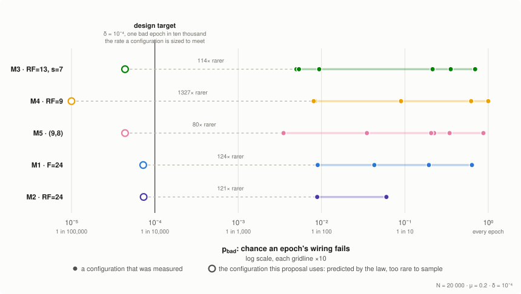
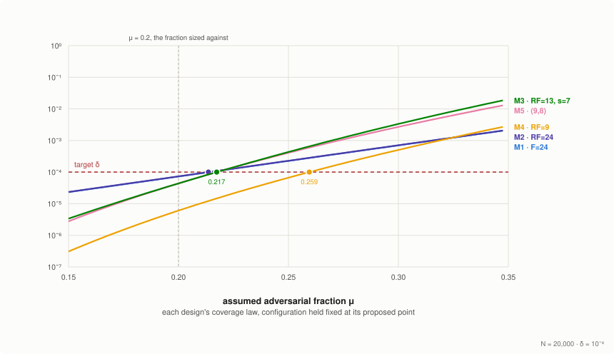

# Dissemination designs compared

A companion to the [Cardano PubSub CIP](README.md). It is not normative. The CIP specifies one dissemination design, the symmetric relay link, and its Rationale states why; this document sets out the five designs that were analysed before that choice, how each was parameterised, simulated and costed, and the measurements the CIP's numbers rest on. Every figure is generated from [`cells.json`](https://github.com/input-output-hk/pubsub/blob/main/pubsub-node/docs/experiments/cells.json) by the same script that generates the CIP's, which keeps the generated figures consistent with that data file. Prose and tables require separate cross-checks against the experiment write-ups.

The measurements and predictions below use the [adversary the CIP defends against](README.md#the-adversary-this-proposal-defends-against), at the stated reference configurations. The gated M4 reference remains *B* = 500, *k* = 10, *C* = 23. The CIP separately proposes evaluating *B* = 512, *k* = 10, *C* = 24; that candidate and the limitations of its coverage estimate are described under [The serving cap](README.md#the-serving-cap).

## The family

Five candidate designs were analysed before one was chosen, named M1 to M5:

| Design | Built from |
| :--: | --- |
| M1 | The push primitive: a node forwards to *F* targets it drew |
| M2 | M1 with the direction inverted: a node draws *RF* forwarders |
| M3 | M2 plus *s* − 1 seeding links carrying only their owner's publications |
| M5 | M1 and M2 run at once, as *k*in and *k*out tuned separately |
| M4 | M5 with the two link sets merged into one bidirectional link |

<em>Table 1: Structural comparison of the dissemination designs</em>

The Specification fixes M4, the symmetric relay link. **Every comparison in this section is run with the admission rules switched off**, so the configurations it names are the ones the coverage models were evaluated at rather than the one this proposal specifies; the deployed configuration's numbers follow under [Sizing the parameters](README.md#sizing-the-parameters). Leaving the rules off changes little and favours the designs that lost: the [gate](README.md#the-verifiable-gate) is sized to leave coverage unaffected, and the costs it does impose fall on the directional designs.

## What is measured, and by what

Each epoch the protocol derives a dissemination topology for every topic separately: each node registered on a topic is assigned a bounded set of peers there, and the assignment stands for the whole epoch. A node subscribed to several topics draws independently on each, which is why [what a node pays](#per-node-cost-against-subscriptions) multiplies its cost by the number of subscriptions. Nodes following the protocol are *honest*; the rest are the silent adversary set out above. On any topic some nodes publish and others subscribe.

The guarantee is a property of the drawn topology, not of an individual message: a draw is **good** when every honest publisher reaches every honest subscriber, and **bad** when some publisher is cut off for the whole epoch. The criterion is all-or-nothing because an average hides the failure that matters: 99.99 % delivery may be a tolerable trickle of losses or one publisher silenced completely. The central quantity is the probability that a draw is bad, written *p*bad.

Two observations bound what a bad draw costs.

- **A bad draw is a bad *topology*, not necessarily a failed delivery.** A draw counts as bad when one publisher *could* be silenced, whether or not that node published, so *p*bad is an upper bound on observed failure. The margin is a property of the design: nil under M4, where a cut-off node is missed whoever publishes, and total under M2, whose failures are almost entirely publishers who cannot be heard.
- **When delivery does fall short, it falls short by one subscriber**, or by every subscriber at once where the publisher itself was cut off; nothing measured lies between. The second mode is the second term of the coverage laws, what M3's seeding links and M5's outbound links exist to make rare, and the one that scales with nothing: one node's isolation costs the whole topic that epoch.

**Everything below is a way of estimating *p*bad, a cost paid to lower it, or a condition under which it rises.**

The ungated coverage work uses two independently built instruments.

- **Analysis** derives, for each design, a closed-form *coverage law* predicting *p*bad from the network size, the adversarial fraction and the design's own parameters, with its own simulator to check the law wherever sampling is feasible. The symmetric relay link's is stated under [The coverage law](README.md#the-coverage-law).
- **Measurement** builds populations of the reference implementation's own node logic, the same code the node runs, driven by a deterministic scheduler in place of a network, then disseminates real messages and counts what happens.

A closed form can approximate the wrong model; an implementation can faithfully run a subtly wrong protocol. They fail in unrelated ways, so **their agreement is the evidence offered here**, not either result alone. Every measurement is reproducible byte-for-byte from a tool commit, a configuration and a master seed.[^reproduction]

The gated admission experiments use the reference-node instrument. Their closed forms were independently re-derived and reproduced in review; this is a separate analytical check, not a second implementation of the gated protocol.[^synthesis]

## Performance metrics

A design is characterised by four things: how often a draw fails, what it costs to run at that failure rate, how quickly messages arrive, and how much degradation it absorbs before the failure rate changes. Table 2 records the evaluation settings.

| Constant | Value | What it is | Where it comes from |
| --- | :--: | --- | --- |
| *N* | 20,000, and 4,000 | The registered population on a topic | 4,000 and 20,000 are the main experimental populations; pool-count observations are reported separately[^sponumbers] |
| [*μ*](README.md#param-mu) | 0.2 | Fraction of registered nodes assumed adversarial | An assumption about who registers and what registration costs them, not a measurement. Swept from 0.20 to 0.40 to check the laws hold across it[^musweep] |
| [*δ*](README.md#param-delta) | 10⁻⁴ per epoch | The failure probability a configuration is sized to meet | A choice, and one that cannot be read independently of epoch length |
| [*p*](README.md#param-p) | 0 | Honest downtime during this section's comparisons | Every design is priced with all honest nodes up; downtime enters as a shift in *μ*, and what each design absorbs is its churn budget, the last column of [Table 4](#table-4) |
| [*k*](README.md#param-k) | varies by design | Peers a node picks per topic per link kind | The knob each design is tuned by; the comparison holds *δ* fixed and lets *k* differ |

<em>Table 2: The constants this section is measured at</em>

**The adversarial fraction and failure target are assumptions rather than results.** [*μ*](README.md#param-mu) and [*δ*](README.md#param-delta) are assumptions about the deployment; every failure probability in this document is conditional on them, and both are posed as open questions in the [CIP](README.md#open-questions). A reader who disagrees with either should read the figures as shape rather than values.

Every design's coverage law can be [evaluated interactively](https://pubsub.cardano-scaling.org/experiments/compare-designs/) with *μ*, *N* and *δ* as controls, and the [parameter surface](https://pubsub.cardano-scaling.org/experiments/parameters/) applies the Specification's sizing rules to a topic size, a target and a downtime rate.

| Category | Metric | Measurement |
| :--: | --- | --- |
| Coverage | Epoch failure probability, *p*bad | Probability that a drawn epoch topology fails to carry some honest publisher's messages to every honest subscriber |
| Cost | Transmissions per publication, *m* | Honest-to-honest message copies sent per published message, duplicates included |
| | Deliveries per node, *c* | Copies of each published message received by an average honest node, duplicates included |
| | Links per node, *d* and *d̂* | Links held for the whole epoch, mean and maximum, counting a node's own picks and the links others opened to it |
| Latency | Hops to full coverage, *h*full | Forwarding depth at which the last honest subscriber receives |
| Resilience | Churn budget, *p*max | Largest honest downtime fraction for which a deployed configuration still meets *δ* |

<em>Table 3: Performance metrics</em>

**_Churn budget._** Reading a design's own [coverage law](README.md#the-coverage-law) at the shifted fraction, the budget is the largest downtime a configuration absorbs while still meeting the target:

$$p_\text{max} = \max \{\, p : p_\text{bad}(\mu + p(1-\mu)) \le \delta \,\}$$

Downtime relates to the drop-out rate and the epoch length by [*p*](README.md#param-p) = 1 − e−λ·T, which is why *p*max bounds epoch length as well as resilience.

## The five designs

Every design starts from the same constraint: a node may not choose its peers, so it draws them at random from the topic's registered population and carries messages over the links that draw opens. The only knob is how many peers a node draws: the [pick count](README.md#term-pick-count), written *RF* for relay links and *F* under M1. In every design below it is what trades cost against *p*bad. Where a design adds a second link kind for a node's own publications, those picks are counted separately: M3 opens *s* − 1 of them, its *s* counting the intended initial holders rather than the links opened. This subsection sets out each mechanism and the failure it leaves open; [Table 4](#table-4) prices the designs, and only the pick budget is quoted here, because its fall is the derivation.

<em>Figure 1: One node's links under M1</em>

**M1 is the smallest thing that works.** One link kind, one direction: a node draws *F* targets from the topic's peers, the downstream layer of [Figure 1](#figure-1), and forwards everything it holds to them, its own publications included. Its upstream layer it does not control: those links are other nodes' draws that happened to include it. It meets [*δ*](README.md#param-delta) = 10⁻⁴ at *F* = 24, the largest pick count in the field. The direction also fixes which failure a node can suffer. The chance that all *F* of its own picks land adversarial is [*μ*](README.md#param-mu)*F*, nothing at all at these parameters. The failure that remains is a node whose upstream layer is empty, one no honest peer happened to draw, and such a node cannot **receive**.

<em>Figure 2: One node's links under M2</em>

**M2 inverts the direction, and that is all it does.** A node draws *RF* forwarders and receives from them, the upstream layer of [Figure 2](#figure-2): it controls what it hears, not who hears it. The surviving failure is the mirror image, a publisher nobody drew: its downstream layer is empty, and it cannot be **heard**. The direction also sets how severe a bad draw is; the spread recorded above, nil under M4 to total under M2, measures exactly that.

On cost, inversion buys nothing. M2 meets the same target at the same pick count, *RF* = 24, matches M1 on every cost axis to three figures. **Choosing between the primitives is a choice of which failure to suffer, not a cost decision, so the way out of twenty-four picks has to be structural.**

**Two structures cover both failure directions, and they differ only in what the second link kind carries.** A pull node is silent because nothing pushes on its behalf; giving it push links back closes that.

<em>Figure 3: One node's links under M3</em>

**M3 carries only its owner's own publications.** A node keeps M2's *RF* relay links and adds *s* − 1 standing initiation links, the dashed links of [Figure 3](#figure-3). Over these it hands each of its own messages to its intended initial holders, rather than waiting to be picked. The specialisation is what makes it cheap: a seeding link carries one node's traffic instead of the whole topic's, so the relay fanout can be smaller at the same coverage. At (*RF* = 13, *s* = 7) the budget is 19 picks against M2's 24, and the specialisation makes M3 the cheapest design in the field on bandwidth. What it does not buy is state: 12 of its links carry only their owner's publications, cheap to run but still connection slots to provision and still exposed to churn.

<em>Figure 4: One node's links under M5</em>

**M5 carries everything.** A node opens *k*in inbound and *k*out outbound links, both general-purpose and both its own draws, as [Figure 4](#figure-4) shows, and tunes the two counts independently. At (9, 8) that is 17 picks against M2's 24, and every cost figure improves together: **covering both failure directions is cheaper on every axis than covering either alone.**

The fork is a genuine trade: M3 and M5 land at the same failure probability and the same churn budget, so specialising the second kind buys bandwidth where generalising it buys connections, and neither dominates. Both are still directional: the floor is *μ**k*, with nothing to rescue a node whose picks all failed.

<em>Figure 5: One node's links under M4</em>

**M4 merges M5's two link sets into one.** M5's best split, 9 and 8, is one link from symmetric, which suggests its two sets do the same work. Under M4 a node draws *RF* peers and opens one link to each, established once for the pair rather than once per direction; in [Figure 5](#figure-5) the layers differ only by who opened the link, and every arrow points both ways. Every message that verifies is flooded on all the node's links for the topic except the one it arrived on, its own publications included, so there is neither a second link kind nor a second count. The failure left open needs both directional failures at once: every peer the node drew adversarial *and* no honest node having drawn it, since a link an honest picker opens carries traffic both ways. One pick buys both directions, so the budget is *RF* = 9 against M5's 17. [Why the symmetric design](#the-two-candidates-under-the-admission-rules) prices the conjunction and the downtime it buys.

<!-- make_cip_figures.py --check checks generated SVG freshness.
     check_cells_against_docs.py separately checks transcribed data against write-ups. -->

## Agreement between analysis and simulation

The laws were checked against the measurement framework at 23 configurations, spanning all five designs, two and a half orders of magnitude in *p*bad, and two network sizes: *N* = 4,000, above any stake-pool population yet registered, and *N* = 20,000 as headroom above it. Each configuration draws between 150 and 30,000 topologies and counts the bad ones, comparing each count with what that design's [coverage law](#what-is-measured-and-by-what) predicts.

The designs also nest, which gives a check that costs nothing. M1 and M2 are the two halves of M5: switching off M5's inbound links leaves pure push, switching off its outbound links pure pull. M3 at *s* = 1 is M2 by construction.[^boundaries] M5 configured at those boundaries must therefore reproduce M1's and M2's results exactly, and any discrepancy is a defect in the analysis or the implementation, not a property of the protocol.

In the figure below each point is one measured sample, its horizontal position the failure rate the law predicts, its vertical the rate observed. A count from finitely many draws scatters around the true rate, so the **bar** through each point spans the rates that would plausibly produce it, at 95 % confidence for that sample's own size;[^wilson] a law inside the bar is consistent with the measurement. The **shaded band** repeats that interval at the size most samples share, as context for the eye. Both axes are logarithmic; the configurations range from failing in roughly one epoch in three hundred to almost every epoch. Filled marks are the configurations above, hollow ones a further 35 measured under honest downtime, described below.

<em>Figure 6: Measured against predicted epoch failure probability</em>

The hollow marks are the same check run under honest downtime. A design's churn budget cannot be sampled directly, since resolving a rate near 10⁻⁴ takes 10⁵ to 10⁶ draws per churn level; what can be tested is the reduction beneath it, downtime entering as a shift in the adversarial fraction, at parameters where failures are frequent enough to count. **In 38 of 40 configurations**, spanning the five designs, downtime to 35 % offline and the two configurations this proposal names, the shifted-fraction prediction lands inside the measurement's 95 % interval, two misses being what forty comparisons at that confidence are expected to produce; the sweep carries the reduction from an adversarial fraction of 0.20 out to 0.48.[^churn] The budgets in [Table 4](#table-4) follow from the laws so validated.

The comparison points lie below the sampled failure rates. Filled marks in Figure 7 are observed rates at weaker configurations; hollow marks are model predictions for the ungated comparison points. The dashed spans show the extrapolation. The CIP separately presents the gated M4 reference experiment and its limitations.

<em>Figure 7: Sampled failures and predicted ungated comparison points</em>

## Cost at each design's configuration

Every design is shown at the configuration this proposal names for it, at *N* = 20,000 and [*μ*](README.md#param-mu) = 0.2, and every table and figure in the Rationale carries the same configurations. For M1, M2 and M5 that is the cheapest one meeting [*δ*](README.md#param-delta) = 10⁻⁴. For M3 and M4 it is the preferred split rather than the published one: each has a configuration at the same or nearly the same cost that absorbs several times the downtime, and carrying the superseded ones would mean comparing at parameters the rest of this proposal argues against.

| Design | Parameters | *p*bad | Deliveries per node | Links, mean | Links, busiest node | Hops (full) | Downtime absorbed |
| :--: | --- | ---: | ---: | ---: | ---: | ---: | ---: |
| M3 | RF = 13, *s* = 7 | 4.4 × 10⁻⁵ | **10.4** | 38.0 | 64 | 5.5 | 2.17 % |
| M4 | RF = 9 | 6.1 × 10⁻⁶ | 13.4 | 18.0 | 37 | 5.0 | 7.43 % |
| M5 | (9, 8) | 4.4 × 10⁻⁵ | 13.6 | 34.0 | 58 | 5.0 | 2.18 % |
| M1 | *F* = 24 | 7.3 × 10⁻⁵ | 19.2 | 48.0 | 75 | 5.0 | 1.76 % |
| M2 | RF = 24 | 7.3 × 10⁻⁵ | 19.2 | 48.0 | 75 | **4.8** | 1.70 % |
| | | | | | | | |
| **M4 gated reference** | *RF* = 10, *B* = 500, *C* = 23 | **5.1 × 10⁻⁶** | **13.0** | **17.5** | **33** | 5.0 | **7.57 %** |

<em>Table 4: Cost at each design's configuration</em>

The first five rows are ungated, at the configurations the coverage models were evaluated at, and they are not equally safe: the *p*bad column spans an order of magnitude, so a cost difference between rows at different failure rates is not by itself a verdict. The last row is the gated reference experiment at *B* = 500; the CIP now specifies *B* = 512 and identifies its rerun as outstanding. It is not comparable column-by-column, but given so the proposal's own numbers appear beside the field it was chosen from. Bold marks the best value in each column. The cost and latency columns are measured (see the reproduction note); the *p*bad column is read off each design's coverage law, for the reason [Limits of this evidence](README.md#limits-of-this-evidence) gives. The busiest-node column is the largest logical-link count any single honest node held: a measured worst case over the sampled graphs *at that row's configuration*, not a bound, and a sample extreme grows with the number of graphs drawn and with the population.[^degrees] Hops are quoted at the mean, where the field spans 4.8 to 5.5; the full depth distributions separate the designs by two orders of magnitude at the tail, for a fraction of a percent of subscribers.[^depth]

**M3's split.** The budget of 19 divides between relaying and seeding in several ways, and the published choice of (RF = 12, *s* = 8) is not the best of them. With *s* − 1 seeding links the budget is *RF* + (*s* − 1), so 12 + 7 and 13 + 6 both come to 19, and the split (RF = 13, *s* = 7) holds that same budget and the same 38 links. For 0.8 further deliveries per node it buys a factor of four in downtime tolerance and a halved failure probability, and it is the split every table and figure in this proposal carries; a reader meeting the published split in the earlier literature should expect M3 to look stronger on bandwidth and markedly weaker on the other three axes. The budgets in the last column are read off the laws rather than observed: the churn experiment establishes that the shifted-fraction reduction holds, not the budget values. The measurements sit slightly above their predictions, and the excess pools onto M3 alone, matching a separate finding that M3's law is mildly optimistic wherever its pick count is small;[^finiten] suggestive rather than established, and conservative either way, since it would make M3's budget smaller rather than larger.[^churn]

**Budgets as margins.** A budget for downtime is equally a margin above the adversarial fraction assumed: against the 0.2 assumed, M3 at (13, 7) still meets the target at *μ* = 0.217 and M4 at RF = 9 at *μ* = 0.259. M3's narrower margin is structural rather than incidental: its bandwidth advantage comes through a small number of dedicated seeding links, and a mechanism that is cheap because it is small has the least margin when part of it stops responding.

## The four-way trade-off

A dissemination layer trades bandwidth, connection state, latency and tolerance of degradation against one another; no design in the family is best on all four. The Evidence subsection measures each axis separately, and the figure below puts them side by side.[^axes]

<em>Figure 8: Four-way trade-off across the non-dominated designs</em>

Each contender is drawn at its best parameters rather than its published ones. The published operating points were all chosen as the cheapest configuration meeting the failure target, and re-searching the two contenders against the validated laws shows what that rule costs: M3's re-split is set out under [Table 4](#table-4), and the equivalent step for M4, RF = 8 to RF = 9, buys seven times the churn budget for 1.6 further deliveries per node and two further connections. M1, M2 and M5 remain at their cheapest-meeting-target points.

At those parameters M4 beats M5 on every axis, and M1 falls with it; both are drawn muted rather than dropped, each lying wholly inside a contending design. Three remain. The figure carries its own reading key; the size of a shape is not a score.

**M4 is the most even and the only design to reach the outer ring twice. M2 leads speed alone and is innermost elsewhere; M3 leads bandwidth alone.**

> [!IMPORTANT]
> The general form governs the parameter choice as much as the design choice: **within this family, efficiency is bought with margin.** A configuration tuned to sit just inside the failure target is, by construction, the one with least room to absorb anything the model did not anticipate. That is a property of the rule used to choose parameters, not of any mechanism, which is why M3's brittleness disappears under a different split of the same budget rather than requiring a different design.

## The two candidates under the admission rules

Of the three the radar leaves, M2 is behind M4 on every axis but speed, where it leads by a fifth of a hop ([Table 4](#table-4)); two remain, and on the coverage models neither dominates the other. That comparison is ungated, and no deployment runs either design ungated: the [gate](README.md#the-verifiable-gate) is derived per topic from the topic's own size, and on any topic large enough for bounded fanout to be worth having, it is on. The comparison that decides is under the gate and the admissions budget, at the scale and the pick counts this proposal specifies.[^synthesis] The three designs already beaten on cost were not re-measured under it, and do not need to be: both structural taxes below fall on directional designs, and M1, M2 and M5 are all directional, so the ungated comparison is their best case.

| | M3 gated, best compliant | M4 gated reference (*B* = 500) |
| --- | ---: | ---: |
| Parameters | *RF* = 13, *s* = 7, *B* = 769 | *RF* = 10, *B* = 500, *C* = 23 |
| Failure probability | 5.8 × 10⁻⁵ | **5.1 × 10⁻⁶** |
| Honest downtime absorbed | 1.58 % | **7.57 %** |
| Peers one identity may reach | 52 | **40** |
| Identities to strand a chosen node, knowing only the public gate | 26 | **40** |
| At M4's attack surface | **no pick count meets the target** | 5.1 × 10⁻⁶ |
| Seams carrying a gate and a cap | 2 | **1** |

<em>Table 5: The two candidates under the admission rules</em>

**Under the admission rules the trade-off becomes a frontier.** Once the attacker's price is fixed, each design has a best reliability it can buy at that price, and the directional design's floor sits above the symmetric one's at every price point. The price is the attack surface per registered identity, how many victims one deposit buys a place beside: the only quantity denominated in the attacker's own budget before any design-specific mechanics apply, and the upstream resource of every attack. Normalise on anything else, equal bucket counts say, and one design's attacker gets its reach at a discount. Two structural taxes put the directional floor where it is.

**Tax one: one lottery coin per relationship, or two.** A symmetric pair draws a single gate value covering both directions, so one identity is admissible to (*N*T − 1)/*B* peers. A directional design draws each direction independently and pays twice over, reaching 2(*N*T − 1)/*B*. The exchange rate is two, which means **raw bucket counts are not comparable across the designs**: the directional candidate at *B* = 769 runs a numerically wider gate than the symmetric one at 500 and still hands the attacker more reach, 52 against 40.[^seam]

**Tax two: a conjunction on the failure, or a single condition.** Under a symmetric kind a node is cut off only if every pick it made landed adversarial **and** no honest peer in its own candidate pool picked it: one honest picker repairs both directions at once, because the link it opens carries traffic both ways. That conjunction multiplies the [*μ*](README.md#param-mu)*k* core by roughly e−*k*(1−*μ*), about 3 × 10⁻⁴ at the parameters specified here, three orders of magnitude. A directional design has no such conjunction on the hearing side: seeding links carry only their own sender's publications, so nothing rescues a node whose relay picks all failed. Its floor is *μ**k* alone.

**Together the taxes leave the directional design nowhere to go.** Each alone could be paid: a wider gate restores the pool, a larger pick count restores the coverage. But the two repairs pull on the same dial in opposite directions, because the gate cannot be narrow enough to match the attacker's price and at the same time wide enough to feed the pick count the missing conjunction demands. Run at its own best coordinates the directional design meets the target but hands the attacker more reach, 52 against 40; forced to the symmetric design's attack surface, its best failure probability is 1.8 × 10⁻³ whatever its pick count, eighteen times the target ([Table 5](#table-5)). Where both designs produce countable failures, at attack surface 32, the head-to-head measured exactly this squeeze: the directional design failed 17 runs in 400, every one through the starved pool the argument predicts, against zero failures in 400 for the symmetric twin.[^synthesis]

**Availability is where the two taxes compound rather than merely add.** Ungated, the directional design absorbed 2.17 % downtime against the symmetric design's 7.43 %, a factor of three; under the admission rules the gap widens to a factor of five: with no honest picker able to repair both directions, every node lost to downtime is one that cannot rescue anyone.

**Cost does not decide.** The trade the radar shows is real, M3 cheaper in traffic and M4 in connections, and whether bandwidth or connections bind in a deployment remains a real question; but an answer favouring bandwidth would have bought a design that cannot reach the reliability target at equal attack cost, and a weighting chooses among candidates that all clear the bar. Nor do the radar's axes divide into security and performance as cleanly as they look: of the four in [Figure 8](#figure-8), only bandwidth is straightforwardly a performance figure, downtime absorbed is an availability property and time to the last subscriber a liveness bound, so a reader who weights security above optimisation is weighting up three of the four axes the symmetric design already leads.

## Per-node cost against subscriptions

Both measured costs are per topic, and a node that subscribes to several pays for each; scaling the measured figures is arithmetic over deployment assumptions. For one-kilobyte messages arriving once a second on each topic:

| Topics a node subscribes to | M3 (13, 7) | | M4 (RF = 9) | |
| :--: | ---: | ---: | ---: | ---: |
| | Ingress | Mean links | Ingress | Mean links |
| 1 | **83 kbit/s** | 38 | 107 kbit/s | **18** |
| 5 | **416 kbit/s** | 190 | 536 kbit/s | **90** |
| 10 | **832 kbit/s** | 380 | 1.1 Mbit/s | **180** |
| 25 | **2.1 Mbit/s** | 950 | 2.7 Mbit/s | **450** |

<em>Table 6: Per-node cost against topics subscribed, at 1 kB and one message per second</em>

The table shows mean [logical link](README.md#term-link) counts, scaled by the number of subscriptions. Individual nodes may hold more or fewer links. Multiple links to the same peer can [share a transport connection](README.md#link-establishment), reducing the connections needed. These figures do not specify a maximum connection requirement.

At the stated message rate and size, mean ingress and logical link counts scale with subscriptions. At twenty-five topics, M3 averages 950 logical links per node and M4 averages 450. Each transport connection carries buffers, keepalives and supervision, so provisioning also needs to account for nodes above the mean and how many links can share a connection.

The [pick count](README.md#the-relay-link-and-the-pick-count) is specified per topic, so increasing it also adds cost across subscriptions. A deployment sizes it against both its downtime assumptions and its subscription profile.

A node subscribing to *T* topics, each drawing *d* links from a population of *P*, expects to hold (*P*−1)(1−(1−*d*/(*P*−1))*T*) distinct peers, and the saving is whatever separates that from *dT*. At *N* = 20,000 and twenty-five topics, this estimate gives M3 929 distinct peers for its 950 mean logical links, and M4 445 for its 450. Sharing one transport connection per peer would therefore reduce the mean connection counts by about 2 % and 1 % respectively under these assumptions.

It bites where the population is small: on a topic drawing from three thousand participants, the same twenty-five subscriptions save M3 14 % and M4 7 %; at five hundred, 55 % and 33 %. Small topics are where connection count stops separating the designs, and the [CPS](../cps/README.md) use cases include some.

## Isolation risk and epoch length across the designs

The same laws that give *p*bad give the risk borne by one named node, and the churn budget of each design bounds the epoch it sustains. Both are tabulated for every design here; the CIP carries the symmetric link's rows only.

**Repeated isolation.** Each epoch gives a subscriber another opportunity to connect to honest peers. If its isolation probability is *q* in each epoch and successive outcomes are independent, isolation in both of two specified consecutive epochs has probability *q*². Different peer selections can still leave the same subscriber isolated; the same set of peers need not recur.

Table 7 illustrates this at the ungated comparison configurations, *N* = 20,000 and [*μ*](README.md#param-mu) = 0.2:

| | M3 (13, 7) | M4 (RF = 9) |
| --- | ---: | ---: |
| One named node cut off in a given epoch | 2.7 × 10⁻⁹ | 3.8 × 10⁻¹⁰ |
| The same named node cut off in both of two specified consecutive epochs | 7.5 × 10⁻¹⁸ | 1.4 × 10⁻¹⁹ |
| *Some* node cut off, network-wide | 4.4 × 10⁻⁵ | 6.1 × 10⁻⁶ |

<em>Table 7: Per-epoch isolation risk, per node and network-wide</em>

The first row gives a named node's probability *q*. The second is the joint probability *q*² of isolation in two specified consecutive epochs, assuming independent outcomes. Conditional on already being isolated, the next epoch's probability remains *q*. The third row concerns any honest node in the network. These are predictions for the ungated comparison points, not the proposed gated configuration.

Rotation gives another opportunity to reconnect; it does not impose a maximum isolation duration. Correlated outages and beacon failures can invalidate the independence assumption. See the CIP's discussion of recovery and retention.

Links are not repaired within an epoch, so the longer one runs the more of the population has dropped out by the time the topology is judged. Setting the accumulated downtime equal to a design's churn budget gives the longest epoch it sustains: with *λ* the rate at which a node drops out, *T* = −ln(1 − *p*max) / *λ*.

**A chosen epoch length implies a reliability requirement.** For a candidate epoch, each design needs the population to depart no more often than:

| Proposed configuration | 1 hour | 6 hours | 1 day | 5 days |
| :--: | ---: | ---: | ---: | ---: |
| **M4 RF = 9** | **13 hours** | **3 days** | **13 days** | **2 months** |
| M5 (9, 8) | 2 days | 11 days | 45 days | 7 months |
| M3 (13, 7) | 2 days | 11 days | 46 days | 7 months |
| M1 *F* = 24 | 2 days | 14 days | 56 days | 9 months |
| M2 RF = 24 | 2 days | 15 days | 58 days | 10 months |

<em>Table 8: Departure interval required per epoch length</em>

<em>Every row is computed from that design's churn budget by the relation above, none separately measured; the budgets themselves are read off the coverage laws rather than sampled, for the reason [Agreement between analysis and simulation](#agreement-between-analysis-and-simulation) gives.</em>

Shorter epochs provide more frequent opportunities to reconnect. The table gives the mean departure intervals required by the dropout model, not measured participant availability.

The interval between fresh, unbiasable randomness values is one constraint on epoch length. The [beacon](README.md#term-beacon) design remains open; a source based on the Cardano ledger epoch nonce would provide fresh values only at the ledger's epoch cadence.

A faster beacon may permit shorter epochs, but epoch length must also accommodate snapshot timing and topology formation. Whether this leaves enough room within the predicted downtime budget depends on the participants' departure rate. These inputs still need validation; choosing a faster beacon alone does not establish a suitable epoch length. See [How long an epoch may be](README.md#how-long-an-epoch-may-be).

## Sensitivity to the adversarial fraction

**The adversarial fraction is chosen, not derived.** The designs are sized at a single [*μ*](README.md#param-mu), an assumption about who registers and what registration costs them. The laws have since been measured from 0.20 to 0.40 natively and to 0.48 through churn, so *reading* a design off its law at another fraction is evidence-backed;[^musweep] *picking* the fraction is not, and the designs do not degrade at equal rates as it varies ([Figure 9](#figure-9)): moving right assumes a more hostile registry, moving up is a worse chance that an epoch's draw cuts some honest node off, and each curve is one design held at its proposed configuration, out of the target once it crosses the dashed line. The horizontal distance from *μ* = 0.2 to a design's crossing is its margin for that assumption being wrong.

<em>Figure 9: The proposed configurations as the adversarial fraction varies</em>

## Where the laws lose accuracy

**Model error varies by design and configuration.** Pooled across the ungated comparisons, the measurements sit about 2 % above the laws, two effects of opposite sign nearly cancelling: M3's law optimistic at low pick counts, M2's pessimistic on small populations.[^finiten] This average is not an error bound for the proposed gated configuration. Some candidate bucket-table entries lie very close to the failure target, so deployment validation needs to establish an allowance for model error and confirm that the chosen parameters still meet the target, as the [CIP's sizing limits](README.md#including-admission-refusals) explain.

## Alternatives to the specified rules

### The either-direction rule

The CIP's gate sorts a pair by identity bytes and draws once. The alternative is to draw each direction on its own and admit the pair if either draw passes.

- A pair passes with probability 2/*B* − 1/*B*² rather than 1/*B*, assuming independent directional draws. For large *B*, matching the density therefore requires approximately doubling *B*.
- At equal density the coverage is the same, so the looser rule buys nothing for what it costs.
- It breaks a property the design leans on elsewhere: that a node's own picks can never be refused for want of [admissions budget](README.md#the-serving-cap).
- Where that budget binds, it roughly doubles **honest starvation** — honest dials turned away because the budget is already spent.

The sorted pair is the better of the two everywhere in the operating window.[^symgate]

### Directional admission anchors

The admission parameters were first measured on a directional design, model M2, and the CIP's rules for the symmetric link supersede those anchors. They are kept here because the ratio they establish carries across designs even where the value does not.

**The serving cap's failure mode is not the one it looks like.** Raising the cap hands an attacker *more* slots on each victim, yet it is what preserves coverage: the harm is honest links starved of capacity rather than slots lost to the adversary, the share of honest nodes losing at least one dial to a full acceptor falling from 30.6 % at a cap of 20 to 0.36 % at 32 under a fifth-of-the-network attacker, so a cap sized only to deny the attacker denies the honest population first.[^gate] These anchors are directional and superseded under a symmetric kind, where the budget is sized against fresh honest arrival instead; the Specification states the rule for each.

## Method notes

[^reproduction]: Reproducing the measurements. Each result is identified by a tool commit, a sweep configuration, and a master seed; those three reproduce the output files byte-for-byte, independently of how many runs execute in parallel. All three are recorded per configuration in [`cells.json`](https://github.com/input-output-hk/pubsub/blob/main/pubsub-node/docs/experiments/cells.json), which is also the source the figures in this section are generated from; the configurations themselves are under [`configs/experiments/`](https://github.com/input-output-hk/pubsub/tree/main/pubsub-node/configs/experiments) and the per-design comparisons, including the statistical conventions, under [`docs/experiments/`](https://github.com/input-output-hk/pubsub/tree/main/pubsub-node/docs/experiments).

[^sponumbers]: Stake-pool counts read from Blockfrost over epochs 210 to 646: at no epoch were more than 2,696 pools registered at once, and the pools holding 99 % of stake never numbered more than 899.

[^musweep]: The adversarial fraction as a swept axis. Twenty-nine cells across five designs, μ from 0.20 to 0.40, two network sizes, 116,000 draws; the law falls inside the measurement's interval in 24 of them, mean standardised deviation +0.36, pooled ratio 1.017 ± 0.012. What it licenses is narrow: inverting a design's law at a fraction other than 0.2 in order to size it, which every re-provisioning argument does. Method and full results: [`docs/experiments/mu-sweep.md`](https://github.com/input-output-hk/pubsub/blob/main/pubsub-node/docs/experiments/mu-sweep.md).

[^boundaries]: The boundary is the analysis's own: M3's coverage law at *s* = 1 recovers M2's, stated in [`full_coverage.md`](https://github.com/input-output-hk/pubsub/blob/main/formal_spec/hybrid_dissemination/models/m3/properties/full_coverage.md), and the *s* = 1 limit is re-run as a check at *N* = 20,000 in the reproduction scripts.

[^wilson]: The Wilson score interval, used throughout for a proportion estimated from a finite number of draws. It is preferred to the normal approximation here because the failure rates measured are small and the approximation's coverage degrades badly as a proportion approaches zero. Intervals are quoted at 95 % and computed at each sample's own size.

[^churn]: Churn tolerance, experiment E13. Forty configurations in three rounds: twenty-five across the five designs with downtime swept from 0 to 12 % of the honest population, then nine at the then-published operating points at 20 to 30 %, then six at the two configurations this proposal names, M3 at (13, 7) and M4 at RF = 9, the latter at 25 to 35 %. About 121,000 draws; each scored against its design's coverage law evaluated at the shifted adversarial fraction, which together span 0.20 to 0.48. Method, full results and the residual: [`docs/experiments/churn-tolerance.md`](https://github.com/input-output-hk/pubsub/blob/main/pubsub-node/docs/experiments/churn-tolerance.md) and [`docs/experiments/churn-proposed-points.md`](https://github.com/input-output-hk/pubsub/blob/main/pubsub-node/docs/experiments/churn-proposed-points.md).

[^degrees]: Links per node. Counted as the distinct (peer, link kind) pairs a node holds an established link with, in either direction and regardless of the counterparty's class, since an adversary still occupies a connection slot; a symmetric link is counted once. Measured over 200 graphs per operating point (M2: 40). The propagation-digraph degrees the framework reports elsewhere are a different and smaller quantity, omitting links that carry no dissemination traffic, which under M3 is fourteen of its thirty-eight. Method and the one unresolved discrepancy against the earlier figures: [`docs/experiments/standing-degree.md`](https://github.com/input-output-hk/pubsub/blob/main/pubsub-node/docs/experiments/standing-degree.md).

[^depth]: Propagation depth as a distribution. Pooled first-receipt depth at each operating point, from the same runs as the cost table; the means reproduce the published figures. The deepest wave carries 0.17 % of receipts under M3 against 0.0013 % under M4, so the tail separates the designs where the means do not. Detail: [`docs/experiments/depth-distribution.md`](https://github.com/input-output-hk/pubsub/blob/main/pubsub-node/docs/experiments/depth-distribution.md).

[^finiten]: Where the laws lose accuracy. Sixteen cells at μ = 0.2, 60,000 draws each, isolating what the corpus-wide 2 % optimism actually is. M3 measures 1.059, 1.064 and 1.056 against its law at N = 1,000, 2,000 and 4,000 with the pick count held at RF = 6, so the deviation does not follow the population; sorted by pick count it falls to about 2 % at RF = 12–13. M2 measures 0.961, 0.986 and 0.991 across the same populations at RF = 11, so its deviation does follow the population. Three intermediate readings were overturned, two by control cells and one by a confound in the sweep's own design, and the document keeps them. Method and full results: [`docs/experiments/finite-n.md`](https://github.com/input-output-hk/pubsub/blob/main/pubsub-node/docs/experiments/finite-n.md).

[^axes]: On the choice of axes. The four are measured under the same adversary and are independent of one another. The epoch failure probability is not a fifth spoke because the churn axis already carries it: the churn budget is the distance between a design's *p*bad and the target *δ*, expressed as downtime, so the two rank the designs identically. The rate each shape is drawn at is in [Table 4](#table-4) rather than on the figure, since a normalised radar would show designs more than an order of magnitude apart in it as comparable. The cost of an adaptive eclipse is priced against a different adversary and is carried in [Table 5](#table-5) instead. Left off: the worst-case connections a node must accept, arguably the figure an operator provisions against, which [Table 4](#table-4) carries; the headroom a configuration has below the failure target, which reflects where integer parameter steps fell rather than any property of the design; and mean receipt depth, which moves with the hop count already plotted. Other quantities and combinations are plotted in the [design comparison](https://pubsub.cardano-scaling.org/experiments/compare-designs/), which carries nine and lets a reader choose which to show.

[^synthesis]: The gated parameter set at the operating shape these designs propose, experiment E20. Eleven pre-registered cells, the first of the programme at *N* = 20,000, composing the measured results of E10, E12, E18 and E19 through an (*N*, *k*)-parameterised prediction ledger whose forms recover each design's published ungated law at *B* = 1. It is the first pass to measure the gate and the admissions budget at the pick counts these designs use rather than at the larger pick count the directional work was calibrated at, and the bucket-count and serving-cap rules above are its. Its gated closed forms are validated against measurement and were independently re-derived and reproduced number for number in the branch's formal review; a derivation document in the formal specification's style is the named hardening step. Method, cells and full results: [`docs/experiments/m4-synthesis.md`](https://github.com/input-output-hk/pubsub/blob/main/pubsub-node/docs/experiments/m4-synthesis.md).

[^seam]: One seam rather than two. The surface figures count the directional design's relay seam alone, so the normalisation is generous to it. Its publication-seeding links are a second kind with their own gate, serving cap and sizing rule, whose cap governs what a node will accept from publishers; measured under a binding cap in E20, that seam strangles exactly the links that would have rescued an otherwise-muted publisher. The symmetric design has one channel with one gate, one cap and one budget rule, and every normative statement elsewhere in this proposal is written once rather than twice.

[^symgate]: The admission parameters under symmetric links, experiments E18 and E19 at N = 4,000. E18 prices what the gate costs in coverage once links are symmetric; E19 prices what it buys against a Sybil flooder that dials every honest node the gate admits, over a grid of bucket count, admissions budget and attacker fraction, with 400 runs per cell and the tail arms at 8,000. Every cell's predictions were committed before it ran and the refuted ones are kept as corrections rather than rewritten. The cap semantics are fixed in [ADR 0042](https://github.com/input-output-hk/pubsub/blob/main/pubsub-node/docs/decisions/0042-symmetric-acceptance-cap-semantics.md) and the comparison against the direction-dependent gate in [ADR 0043](https://github.com/input-output-hk/pubsub/blob/main/pubsub-node/docs/decisions/0043-ordered-symmetric-comparison-predicate.md). Method and full grids: [`docs/experiments/gated-symmetric.md`](https://github.com/input-output-hk/pubsub/blob/main/pubsub-node/docs/experiments/gated-symmetric.md) and [`docs/experiments/symmetric-flooding.md`](https://github.com/input-output-hk/pubsub/blob/main/pubsub-node/docs/experiments/symmetric-flooding.md).

[^gate]: The admission parameters, directional case. Both experiments run model M2 at N = 4,000; M4's symmetric handshake is covered separately.[^symgate] Two experiments over the calibrated bulk point: the coverage cost of the verifiable gate across a ladder of bucket counts, and its value against a slot-flooding attacker over a grid of bucket count, serving cap and attacker size; 10,350 runs in the flooding grid alone. Method, full grids and the sizing rules: [`e10-selection-fidelity.md`](https://github.com/input-output-hk/pubsub/blob/main/pubsub-node/docs/experiments/e10-selection-fidelity.md) and [`e12-flooding-mitigation.md`](https://github.com/input-output-hk/pubsub/blob/main/pubsub-node/docs/experiments/e12-flooding-mitigation.md).
