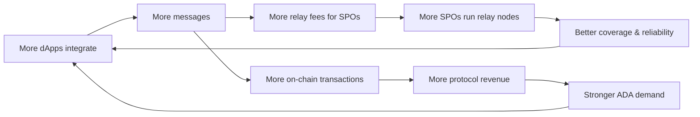

# Revenue Opportunities

PubSub creates multiple revenue streams across the Cardano ecosystem — for the protocol, for SPOs, and for the broader network economy.

## Protocol Revenue

### Message Fees

Every message published through PubSub can carry a small ADA fee. At scale, even micro-fees generate meaningful protocol revenue.

- **Basic notifications**: Free or near-zero (drives adoption)
- **DeFi intents**: Higher fees justified by the value being transacted
- **Guaranteed delivery / priority**: Premium tier for time-sensitive messages

A free tier is essential for adoption. Revenue comes from high-volume and high-value use cases, not from casual users.

### Topic Registration

Creating a topic on-chain costs ADA — similar to domain name registration. This prevents topic squatting and generates one-time revenue.

- Standard topic names: modest registration fee
- Premium or short names: higher fees (market-driven)
- Renewal fees: optional, prevents abandoned topics from cluttering the registry

### Cross-Chain Messaging

Other ecosystems could use Cardano's PubSub infrastructure for their own coordination needs. This positions Cardano as a **messaging backbone** beyond its own ecosystem.

- Bridge protocols pay relay fees for cross-chain message delivery
- Partner chains (e.g., Midnight) use PubSub as their native messaging layer
- External ecosystems integrate via PubSub SDKs, paying ADA-denominated fees

This is where PubSub scales beyond Cardano — every external message generates ADA demand.

## SPO Revenue

PubSub creates a **second income stream** for stake pool operators beyond block production rewards.

### Relay Fees

SPOs operating PubSub relay nodes earn fees for message propagation. More topics subscribed and more messages relayed means more revenue.

- Fee distribution proportional to messages relayed
- Creates a competitive market: reliable nodes earn more
- Incentivizes geographic distribution and low-latency infrastructure

### Premium Services

SPOs can differentiate by offering premium relay services:

- **Guaranteed QoS** — low-latency, high-availability message delivery
- **Message archival** — storing historical messages for later retrieval
- **Dedicated capacity** — reserved bandwidth for high-volume publishers

### Impact on Staking

More SPO revenue → running a pool is more profitable → more attractive to delegate to → more ADA staked → stronger network security. PubSub turns SPOs from block producers into full infrastructure operators.

## DeFi-Driven Revenue

### Intent Fulfillment

Every intent that flows through PubSub and gets fulfilled results in an on-chain transaction. These transactions generate protocol fees that **would not exist without PubSub**.

- User broadcasts intent → agent fulfills → nested transaction on-chain → ADA fees
- Higher intent volume = more transactions = more protocol revenue
- Babel Fee transactions still settle in ADA under the hood

### Priority Messaging

Agents competing to fulfill intents may pay for faster delivery — not front-running (eUTXO prevents that), but speed of discovery.

- Priority fees go to relay nodes
- Creates a healthy fee market without MEV extraction
- Analogous to priority gas fees, but for message delivery

## Platform Revenue

### Enterprise APIs

High-volume integrators (exchanges, bridges, institutional DeFi) may need enterprise-grade access:

- SLA-backed message delivery guarantees
- Dedicated API endpoints with higher rate limits
- Custom topic configurations and access controls

### Data Services

Aggregated, anonymized network analytics as a paid service:

- Intent volume trends (valuable for DeFi protocols)
- Topic activity metrics (valuable for ecosystem analytics)
- Network health dashboards

## Revenue Flywheel

The key insight: PubSub doesn't just generate direct fees — it **enables transaction types that wouldn't otherwise exist**. Every Babel Fee transaction, every intent fulfillment, every governance vote triggered by a notification is new economic activity on Cardano.
