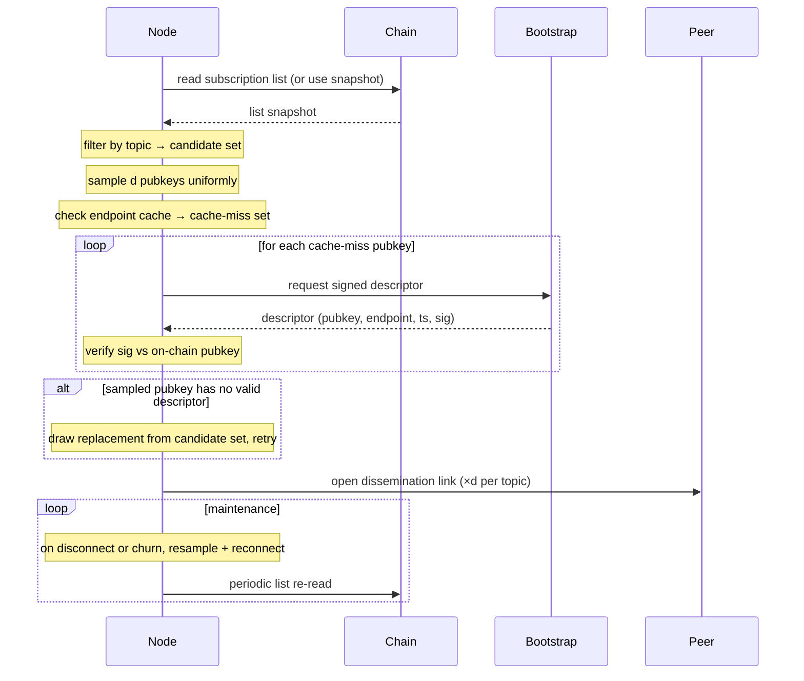

# Node Lifecycle Flows

## 1. Joining and registering

1. Operator generates keypair and picks topic-interest set.
2. Submit subscription transaction: locks the deposit and writes the public key and topic-interest set to the on-chain subscription list.
3. Connect to one or more trusted bootstrap nodes (endpoints known out-of-band).
4. Push a signed descriptor (pubkey, current endpoint, timestamp) to the bootstrap nodes so they can serve it to other subscribers.
5. After confirmation, read the subscription list from chain and filter by the node's own topic interests — yields the candidate pubkey set per topic.
6. Continue with the IP-discovery flow (§2) to resolve endpoints and open dissemination links.

## 2. Finding and connecting to peers (IP discovery)

RandCast-only first iteration: no ring neighbours. Working-set selection is a uniform random sample of size `d` per topic (`d ≈ ln(n)` plus a safety margin, or a configured constant). Maintenance guarantees the minimum fanout, since random links are the only links.

1. Re-read the subscription list (or use the most recent synced snapshot); filter by topic interest → candidate pubkey set per topic.
2. Sample `d` pubkeys uniformly at random from the candidate set per topic. No ring computation.
3. Check the local endpoint cache; collect cache-miss pubkeys.
4. Request signed descriptors for cache-miss pubkeys from connected bootstrap node(s) (or any connected peer).
5. Verify each descriptor's signature against the on-chain pubkey; reject stale or mismatched timestamps.
6. Cache verified endpoints.
7. Handle gaps: for any sampled pubkey with no valid descriptor, draw a replacement from the candidate set and repeat until `d` live targets are secured or the candidate set is exhausted.
8. Open dissemination-layer links to the `d` sampled peers per topic.
9. Maintain fanout: on disconnect or descriptor-verification failure, resample from the candidate set to restore `d`. Re-read the list periodically to track churn.
10. Drop bootstrap connections unless bootstrap is itself a subscriber; future descriptors arrive via gossip on dissemination links, bootstrap remains a fallback.

## 3. Publishing and relaying messages

**Publishing.**

1. The publisher signs the message with the topic's authorised publisher key (as listed in the topic registry). The signature covers `topicId`, `parentHash`, `sequence`, `timestamp`, and `payload`.
2. The publisher pushes the signed message to every relay listed for the topic in the topic registry.

**Relaying.**

1. Receive a message on a dissemination-layer link.
2. Verify the signature against the topic's publisher set; drop if invalid.
3. Check the recently-seen cache by message hash; drop if duplicate.
4. Deliver to local consumers if the topic is in the node's interest set.
5. Forward on outgoing dissemination links for that topic, except the link the message arrived on.

## 4. Leaving and unregistering

1. Submit an unsubscribe transaction that removes the entry from the on-chain subscription list. The deposit becomes withdrawable after the contract's delay window.
2. Close open dissemination-layer connections.
3. Optionally publish a signed "leaving" descriptor on the remaining dissemination links so peers can evict the cache entry immediately; otherwise peers evict on their next list re-read.
4. After the delay window, claim the deposit.

Partial leave (unsubscribing from one topic but staying in others) is a subscription-list update transaction that removes the topic from the entry's topic-interest set, followed by closing the topic-specific dissemination links.
