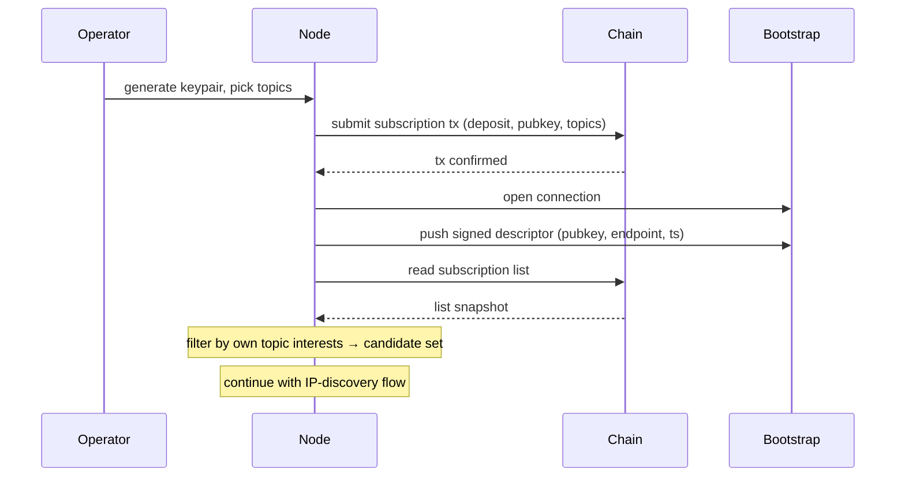
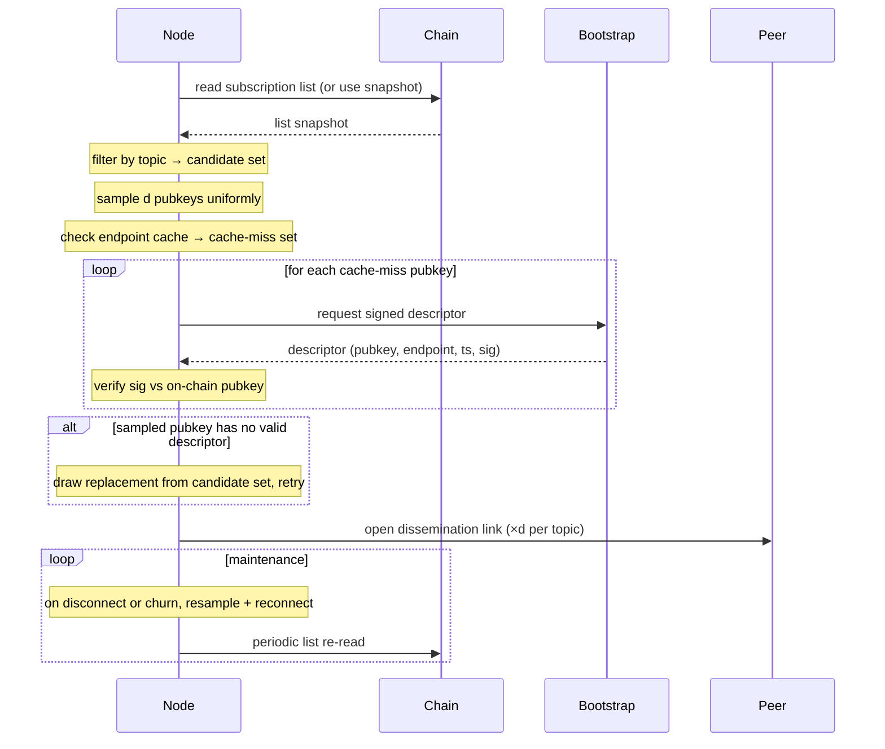
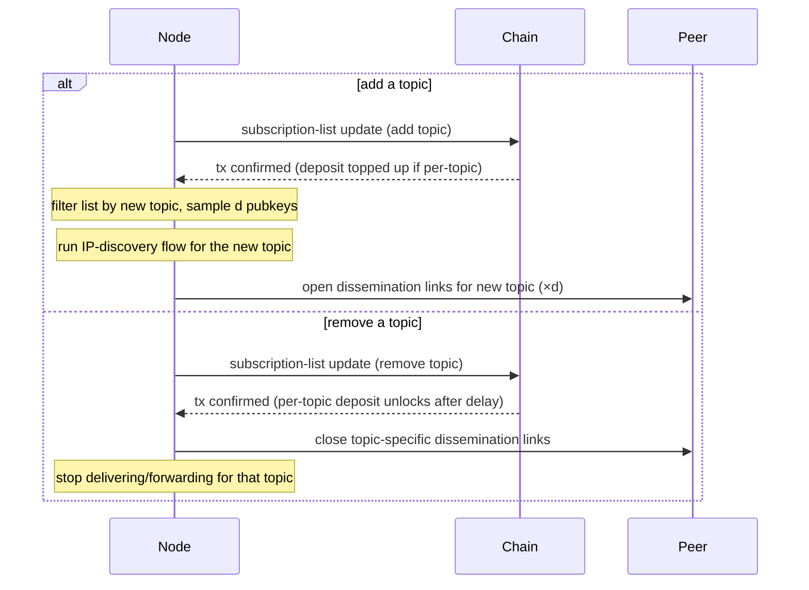
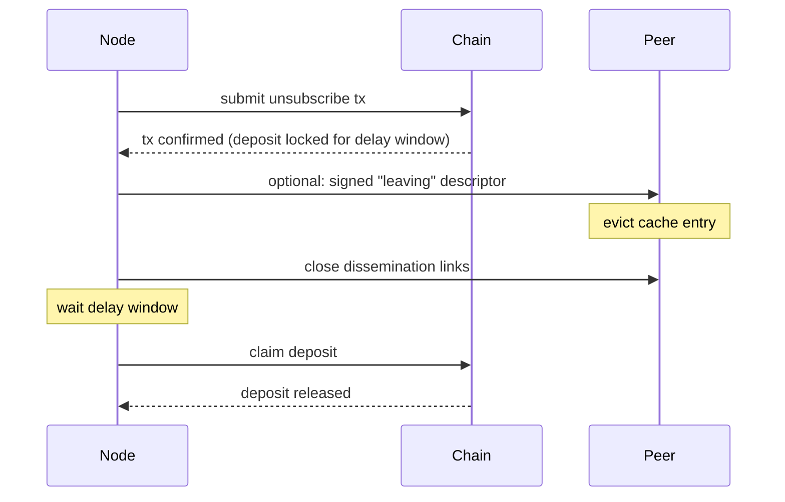

# Node Lifecycle Flows

## Preliminaries

Two on-chain artifacts back these flows:

- **Topic registry**: per-topic entry containing the topic identifier and the authorised publisher key(s) for that topic. Read by relayers to verify message signatures.
- **Subscription list**: per-subscriber entry containing the operator's public key, the subscribed topic-interest set, and the locked deposit. Read to determine who participates in dissemination for each topic.

Network endpoints (IPs/hostnames) are not on-chain. They are exchanged peer-to-peer as signed descriptors and served by bootstrap nodes during [IP discovery](#2-finding-and-connecting-to-peers-ip-discovery).

## 1. Joining and registering

1. Operator generates keypair and picks topic-interest set.
2. Submit subscription transaction: locks the deposit and writes the public key and topic-interest set to the on-chain subscription list.
3. Connect to one or more trusted bootstrap nodes (endpoints known out-of-band).
4. Push a signed descriptor (pubkey, current endpoint, timestamp) to the bootstrap nodes so they can serve it to other subscribers.
5. After confirmation, read the subscription list from chain and filter by the node's own topic interests — yields the candidate pubkey set per topic.
6. Continue with the [IP-discovery flow](#2-finding-and-connecting-to-peers-ip-discovery) to resolve endpoints and open dissemination links.



## 2. Finding and connecting to peers (IP discovery)

RandCast-only first iteration: no ring neighbours. Working-set selection is a uniform random sample of size `d` per topic (`d ≈ ln(n)` plus a safety margin, or a configured constant). Maintenance guarantees the minimum fanout, since random links are the only links.

1. Re-read the subscription list (or use the most recent synced snapshot); filter by topic interest → candidate pubkey set per topic.
2. Sample `d` pubkeys uniformly at random from the candidate set per topic. No ring computation.
3. Check the local endpoint cache; collect cache-miss pubkeys.
4. Request signed descriptors for cache-miss pubkeys from connected bootstrap node(s) (or any connected peer).
5. Verify each descriptor's signature against the on-chain pubkey; reject stale or mismatched timestamps.
6. Cache verified endpoints.
7. Handle gaps: for any sampled pubkey with no valid descriptor, draw a replacement from the candidate set and repeat until `d` live targets are secured or the candidate set is exhausted.
8. Open dissemination-layer links to the `d` sampled peers per topic.
9. Maintain fanout: on disconnect or descriptor-verification failure, resample from the candidate set to restore `d`. Re-read the list periodically to track churn.
10. Drop bootstrap connections unless bootstrap is itself a subscriber; future descriptors arrive via gossip on dissemination links, bootstrap remains a fallback.



## 3. Publishing and relaying messages

No dedicated relay set. Publishers inject messages via the same [IP-discovery mechanism](#2-finding-and-connecting-to-peers-ip-discovery) subscribers use. Publisher authorisation comes from the on-chain topic registry, which binds an authorised publisher key (or set of keys) to each topic.

**Publishing.**

1. Construct the message `(topicId, parentHash, sequence, timestamp, payload)` and sign it with the publisher key authorised for the topic in the topic registry.
2. Discover injection targets: read the subscription list, filter by topic → candidate set; sample `k` pubkeys uniformly (`k` is the publication fanout, independent of the dissemination fanout `d`); resolve endpoints via the local cache or by querying bootstrap nodes. Same flow as the [IP-discovery steps 1–7](#2-finding-and-connecting-to-peers-ip-discovery).
3. Send the signed message to the `k` resolved peers. Gossip handles propagation from there. The publisher does not need to maintain dissemination-layer links unless it publishes frequently and wants to amortise discovery cost.

**Relaying.**

1. Receive a message on a dissemination-layer link.
2. Look up the topic's authorised publisher key(s) in the topic registry and verify the signature. Drop if invalid.
3. Check the recently-seen cache by message hash; drop if duplicate.
4. Deliver to local consumers if the topic is in the node's interest set.
5. Forward on outgoing dissemination links for that topic, except the link the message arrived on.

```mermaid
sequenceDiagram
    participant Publisher
    participant Chain
    participant Bootstrap
    participant Peer
    participant OtherPeer

    Note over Publisher: sign message with authorised publisher key
    Publisher->>Chain: read subscription list
    Chain-->>Publisher: list snapshot
    Note over Publisher: filter by topic, sample k pubkeys
    Publisher->>Bootstrap: request descriptors (cache misses)
    Bootstrap-->>Publisher: signed descriptors
    Publisher->>Peer: send signed message (×k)

    Note over Peer: look up publisher key in topic registry
    Note over Peer: verify signature; drop if invalid
    Note over Peer: dedupe by message hash
    Note over Peer: deliver to local consumers if subscribed
    Peer->>OtherPeer: forward on outgoing links (except inbound)
```

## 4. Changing topic subscription

A node already on the network can extend or reduce its topic-interest set without leaving and rejoining.

**Adding a topic.**

1. Submit a subscription-list update transaction adding the new topic to the entry's topic-interest set. Deposit may be adjusted upward if the contract sets a per-topic component.
2. After confirmation, read the subscription list and filter by the newly added topic → candidate pubkey set for that topic.
3. Run the [IP-discovery flow](#2-finding-and-connecting-to-peers-ip-discovery) for the new topic to resolve endpoints and open `d` dissemination-layer links. Forwarding on the new topic starts on the next message round.

**Removing a topic.**

1. Submit a subscription-list update transaction removing the topic from the entry's topic-interest set. The per-topic deposit component (if any) is released after the contract's withdrawal-delay window.
2. Close dissemination-layer connections that exist solely for the removed topic; connections shared with other still-subscribed topics stay open.
3. Stop delivering and forwarding messages for the removed topic; the recently-seen cache and endpoint cache entries scoped to that topic may be evicted.



## 5. Leaving and unregistering

Full leave: the node removes its entire entry from the subscription list and exits the network. For removing a single topic while staying subscribed to others, see [Changing topic subscription](#4-changing-topic-subscription).

1. Submit an unsubscribe transaction that removes the entry from the on-chain subscription list. The deposit becomes withdrawable after the contract's delay window.
2. Optionally publish a signed "leaving" descriptor on the remaining dissemination links so peers can evict the cache entry immediately; otherwise peers evict on their next list re-read.
3. Close open dissemination-layer connections.
4. After the delay window, claim the deposit.


