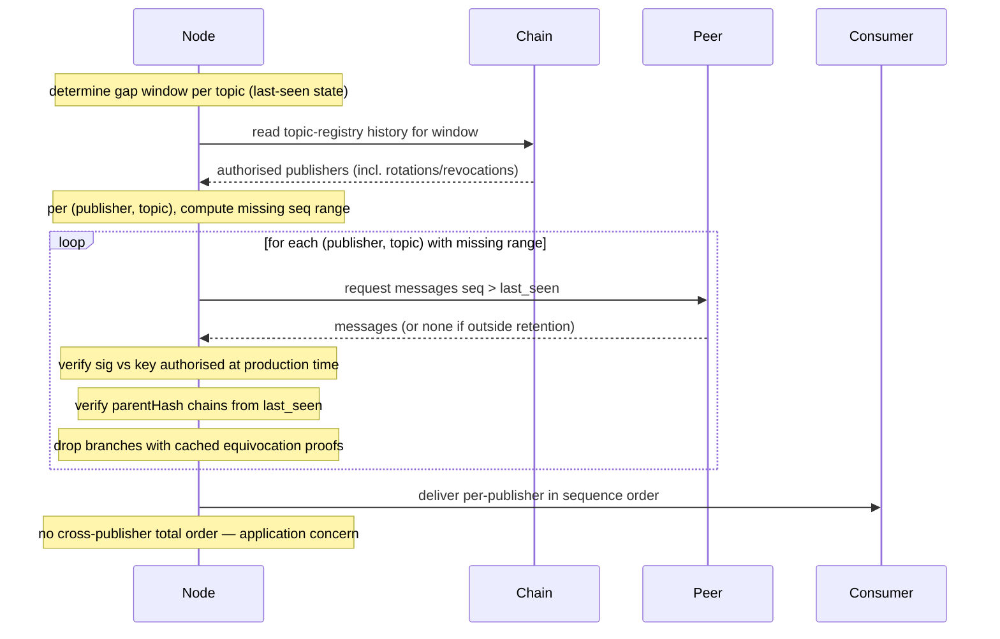

# Catch-up / replay

A node that went offline, or that disconnected from its dissemination peers for long enough to miss messages, backfills by enumerating the publishers authorised on each subscribed topic during the gap window and then pulling missing per-publisher `sequence` ranges from any reachable subscriber. Delivery to local consumers is per-publisher and gap-free; no total order across publishers is reconstructed (see [publishing.md → Ordering model](./publishing.md#ordering-model)).

## Steps

1. **Determine the gap window per topic.** Bounded by the local last-delivered `(publisher, sequence)` state (or last-applied timestamp if no state has ever been seen for a `(publisher, topic)`) and now.
2. **Enumerate authorised publishers during the window.** Read topic-registry history via the chain follower to obtain every publisher key authorised for `T` at any point during the gap — including keys revoked, rotated, or newly authorised mid-gap. Current-state-only registry reads are insufficient; see residual open points.
3. **Compute per-publisher missing ranges.** For each `(publisher, topic)`, read local state for the last contiguously-delivered `sequence` (or genesis sentinel if none).
4. **Fetch from peers in parallel.** Query existing dissemination peers — or, if connectivity is degraded, any reachable subscriber to `T` — for messages with `seq > last_seen` for that `(publisher, topic)`. Querying multiple sources in parallel defeats selective drops.
5. **Verify each returned message.**
    - Signature against the publisher key authorised *at the time the message was produced* — not necessarily the currently-authorised key (matters if the publisher rotated or was revoked mid-gap).
    - `parentHash` chains correctly from `last_seen` forward; reject if the chain is broken.
    - Cross-check against any cached equivocation proofs or on-chain slashing records for that publisher; refuse to deliver from a branch known to be orphaned.
6. **Deliver to local consumers, per-publisher.** Each publisher's stream is delivered in `sequence` order. Inter-publisher merge order is not specified by this layer — applications that need a canonical order across publishers compose it themselves.

## Diagram

## Types

No new types. Reuses [`Message`](./publishing.md#types) from publishing.

## Residual open points

- **Cache retention at peers.** How far back replay can reach is bounded by peer cache retention. The equivocation-detection cache (see [publishing.md residual points](./publishing.md#residual-open-points)) provides a baseline; explicit replay retention is a separate knob. Default TBD.
- **No peer holds the missed messages.** When the gap exceeds peer retention, replay must abort gracefully and surface the unrecoverable range to the application. A periodic on-chain Merkle anchor of topic state (recorded under [Ordering model](./publishing.md#ordering-model) as a deferred alternative) would bound this; not adopted in this iteration.
- **Publisher key rotation mid-gap.** Step 5's "key authorised at production time" requires the topic-registry contract to expose **history**, not just current state. The existing Quint spec (`formal_spec/topic_registry/`) should confirm or extend its interface to make this queryable; flagged as a downstream dependency.
- **Equivocation during the gap.** A publisher that equivocated and was slashed mid-gap has both forked branches orphaned. Replay must refuse to deliver from either; cached equivocation proofs and the on-chain slashing transaction are the authority.
- **Sub-problems this iteration does *not* solve.** Two replay shapes are explicitly out of scope under the per-publisher ordering choice — recording them here so consumers know not to expect them and so future work has a hook:
    - **Replaying messages in the order subscribers originally observed them.** Each subscriber's observation order is local and not reconstructable from per-publisher chains alone. A deterministic merge rule, causal DAG, or on-chain anchor would be required.
    - **Merging two subscribers' views into a single canonical history.** Without a total-order primitive, two honest subscribers' delivery logs can differ across publishers. Reconciling them is an application-level concern in this iteration.
