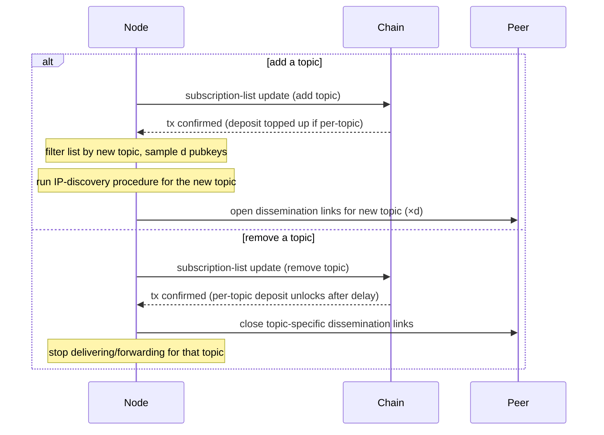

# Changing topic subscription

A node already on the network extends or reduces its topic-interest set without leaving and rejoining. For removing the entire entry (all topics + reclaim deposit), see [Leaving and unregistering](./leaving.md).

## Steps

**Adding a topic.**

1. Submit a subscription-list update transaction adding the new topic to the entry's topic-interest set. Deposit may be adjusted upward if the contract sets a per-topic component.
2. After confirmation, read the subscription list and filter by the newly added topic → candidate pubkey set for that topic.
3. Run the [IP-discovery procedure](./ip-discovery.md) for the new topic to resolve endpoints and open `d` dissemination-layer links. Forwarding on the new topic starts on the next message round.

**Removing a topic.**

1. Submit a subscription-list update transaction removing the topic from the entry's topic-interest set. The per-topic deposit component (if any) is released after the contract's withdrawal-delay window.
2. Close dissemination-layer connections that exist solely for the removed topic; connections shared with other still-subscribed topics stay open.
3. Stop delivering and forwarding messages for the removed topic; the recently-seen cache and endpoint cache entries scoped to that topic may be evicted.

## Diagram

## Peer awareness

Other peers learn about a subscription change two ways:

- **Gossip (honest fast path).** Honest nodes notify their current dissemination peers when they change their topic-interest set — similar in spirit to the descriptor push during joining and endpoint change. Peers that overlap on the affected topic update their working-set view immediately: pruning a removed-topic peer or considering a newly-relevant peer in the next discovery round.
- **Chain re-read (authoritative fallback).** On its next periodic chain re-read (see [IP discovery](./ip-discovery.md) step 9), each node sees the updated subscription-list entry and reconciles its candidate sets. This catches changes that gossip missed — including the adversarial case where a leaving node intentionally fails to notify peers.

The chain re-read is the source of truth; gossip is a latency optimisation. Both paths converge to the same view.
