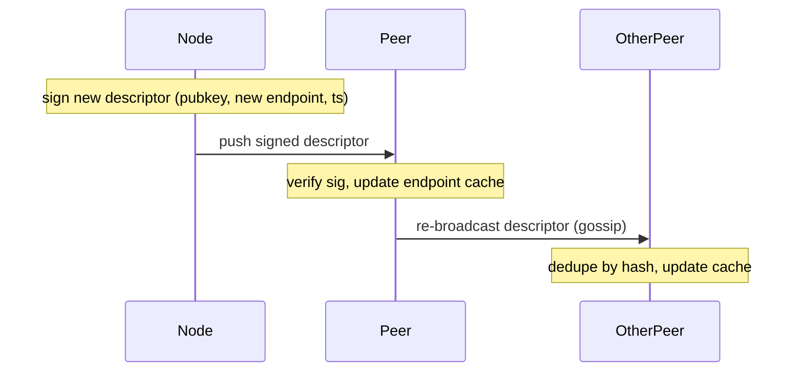

# Endpoint change

A node's network endpoint can change for routine operational reasons — network move, container restart with a new address, NAT shuffle. Because endpoints are off-chain, no chain transaction is required: the node signs a fresh descriptor and propagates it on its existing dissemination links.

## Steps

1. Sign a fresh [`SignedDescriptor`](./joining.md#types) containing the new endpoint with the node identity private key.
2. Push the new descriptor to current random-link peers on the dissemination layer (one push per topic the node participates in).
3. Receiving peers verify the signature, update their endpoint cache for that pubkey, and re-broadcast the descriptor on their own dissemination links. Standard message deduplication (by descriptor hash) suppresses cycles.
4. Within one or two propagation rounds, peers across the topics the node subscribes to have the new endpoint in cache.

If the node was offline at the time of the change (no dissemination links existed to push on), it re-enters via the [joining procedure](./joining.md) using its existing on-chain entry — skipping the subscription transaction in step 2 of joining.

## Diagram

