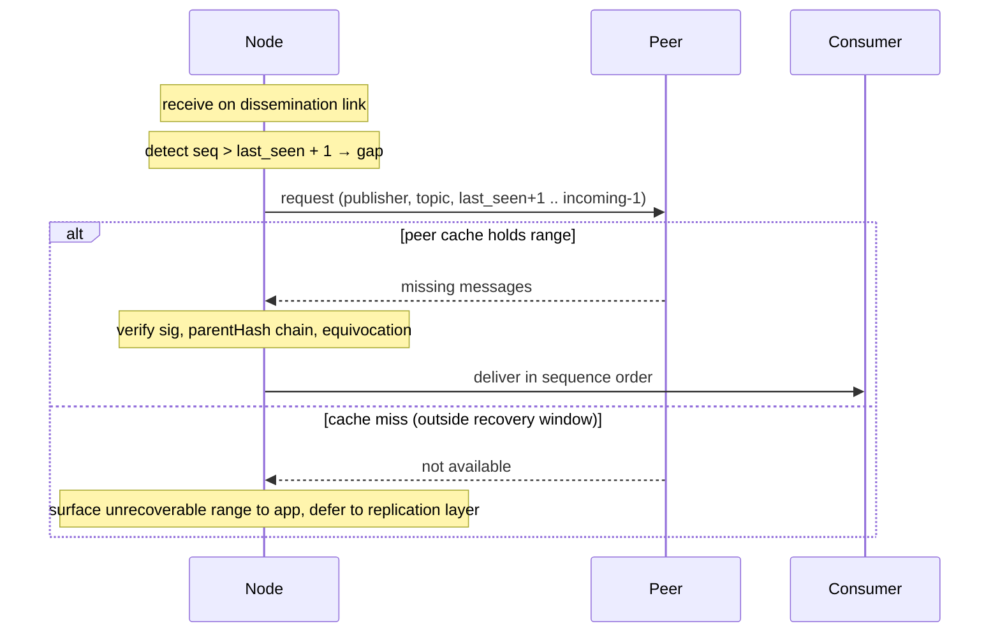

# Gap recovery

A subscribed node that briefly missed one or more recent messages on a topic — for example because a dissemination link churned, the node had a momentary disconnect, or a forwarding race left it without a copy — recovers the gap by asking peers for the missing per-`(publisher, topic)` `sequence` range. Queries are served from peers' recently-seen caches, which the equivocation defence already maintains. No total order is reconstructed (see [publishing.md → Ordering model](./publishing.md#ordering-model)).

This is the standard **NACK-based loss recovery** pattern from reliable multicast (SRM, PGM); gossipsub calls the same shape `iwant` / `ihave`. Recovery range is bounded by peer cache retention — long-range historical replay (a node offline for hours or days) is **not** addressed here; it is deferred to a future [catch-up / replay](./catch-up.md) procedure backed by a replication layer.

## Steps

1. **Detect a gap.** While receiving on dissemination links, track the last contiguously-delivered `sequence` per `(publisher, topic)`. An incoming message with `sequence > last_seen + 1` indicates one or more missing messages.
2. **Request the missing range.** Ask the dissemination peer the gap was observed on (or another peer subscribed to the topic) for messages in `(last_seen, incoming.sequence)` for that `(publisher, topic)`. Multiple peers can be queried in parallel to defeat selective drops.
3. **Peer serves from recently-seen cache.** Peers already retain recently-forwarded messages for dedup and equivocation detection. Cache hits return the messages; cache misses indicate the gap is outside this iteration's recovery window.
4. **Verify each returned message.** Signature against the currently-authorised publisher key for the topic; `parentHash` chains correctly forward from `last_seen`; reject any branch known to be equivocating (cached proof or on-chain slashing). Short-range recovery sits inside the registry's stability window — key rotation/revocation across the gap is a replication-layer concern.
5. **Deliver per-publisher, in `sequence` order.** Inter-publisher merge order is unspecified — applications layer it themselves.
6. **Cache-miss handling.** If no queried peer's cache extends far enough back, surface the unrecoverable range to the application and continue with newer messages. Recovery beyond the cache window is deferred to the replication layer. A cache miss does **not** distinguish honest loss from a publisher that withheld the message — see [publishing.md → Omission and availability](./publishing.md#omission-and-availability-open-limitation).

## Diagram

## Types

No new types. Reuses [`Message`](./publishing.md#types) from publishing.

## Out of scope

Deferred to a future **replication layer**:

- **Long-range historical replay.** Gaps that exceed peer cache retention (e.g. a node offline for hours or days). Addressed by dedicated replication nodes with longer retention than the equivocation cache, optionally combined with periodic on-chain Merkle anchors of topic state.
- **Publisher key rotation or revocation across the gap.** Replay across a key change requires registry *history*, not just current state. Not needed for short-range recovery (the gap is inside the registry's stability window); will be specified when the replication layer lands.
- **Equivocation that landed during a longer gap.** Within the short-range window, the local equivocation cache already provides protection. Longer windows need replication nodes that retain enough state to confirm or refuse delivery from forked branches.

## Residual open points

- **Cache window sizing.** Peers retain recent messages for dedup + equivocation detection. The retention window is configurable (see [publishing.md residual points](./publishing.md#residual-open-points)) and directly determines how far back this procedure can recover. Default TBD.
- **Gap-detection trigger.** Step 1 detects gaps via incoming messages with `seq > last_seen + 1`. If a publisher stops publishing entirely during a node's brief disconnect, no incoming message arrives to surface the trailing gap. A periodic per-publisher "are you up to seq X?" probe against dissemination peers would close this; defer until the need is observed.
- **Sub-problems this iteration does *not* solve.** Even within the short-range scope, two replay shapes remain out of reach without a total-order primitive — recorded here so consumers know not to expect them and future work has a hook:
    - **Replaying messages in the order any individual subscriber originally observed them.** Each subscriber's observation order is local and not reconstructable from per-publisher chains alone. A deterministic merge rule, causal DAG, or on-chain anchor would be required.
    - **Merging two subscribers' views into a single canonical history.** Without a total-order primitive, two honest subscribers' delivery logs can differ across publishers. Reconciling them is an application-level concern in this iteration.
