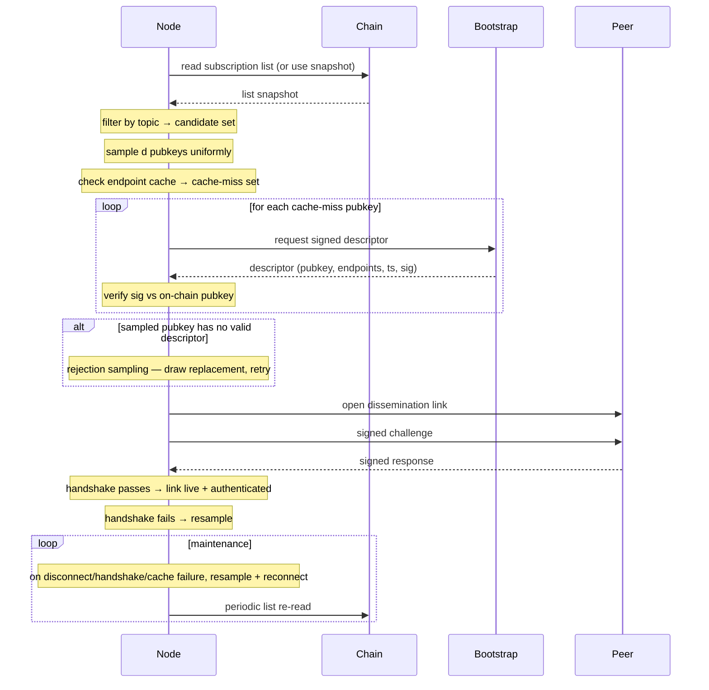

# IP discovery

A node resolves endpoints for the peers it intends to disseminate with and opens dissemination links to them. RandCast-only first iteration: no ring neighbours. Working-set selection is a uniform random sample of size `d` per topic; `d` is derived dynamically from the current network size `n` (see [README](./README.md#configuration-parameters)). The resulting overlay is **directed** — each node controls its `d` outgoing links; in-degree is emergent, as in the SecureCyclon view-exchange model the design inherits from.

## Steps

1. Re-read the subscription list (or use the most recent synced snapshot); filter by topic interest → candidate pubkey set per topic.
2. Sample `d` pubkeys uniformly at random from the candidate set per topic. No ring computation.
3. Check the local endpoint cache; collect cache-miss pubkeys.
4. Request [`SignedDescriptor`](./joining.md#types) entries for cache-miss pubkeys from connected bootstrap node(s) (or any connected peer).
5. Verify each descriptor's signature against the on-chain pubkey; reject stale or mismatched timestamps.
6. Cache verified endpoints.
7. **Rejection sampling.** For any sampled pubkey that returns no descriptor or one that fails step 5, draw a replacement from the candidate set and repeat until `d` live targets are secured or the candidate set is exhausted. This is rejection sampling over the on-chain candidate set — offline or unresolvable peers are filtered out without altering the underlying uniform distribution. If the candidate set is exhausted with fewer than `d` live peers, proceed with whatever `d_actual` was obtained; the graceful-degradation rules in step 10 take over from there.
8. Open a dissemination-layer link to each sampled peer.
9. **Handshake.** Exchange a signed challenge–response over the link to prove the peer controls the on-chain pubkey and the link is alive in both directions. Failed handshakes count as a gap → return to step 7 and resample. The overlay remains directed: the handshake authenticates and qualifies the link the local node will forward on; it does not require the peer to include the local node in *its* outgoing view.
10. **Maintain fanout with graceful degradation.**
    - **Resample triggers.** Disconnect, handshake failure, or descriptor-verification failure → return to step 7 to refill the slot.
    - **Periodic re-read.** Re-read the subscription list at the configured cadence (see [README](./README.md#configuration-parameters)) to track churn — joiners, leavers, topic-subscription changes, and endpoint updates all surface here. The chain follower is already running (see [README](./README.md#on-chain-artifacts)), so this is not extra infrastructure.
    - **Graceful degradation.** If `d_target` cannot be filled, operate with whatever `d_actual ≤ d_target` is available — better one live peer than zero. Log a warning when `d_actual < ⌈d_target / 2⌉`, an error when `d_actual < 2` (Fenner–Frieze connectivity floor). These thresholds are protocol constants, not configurable. Refill attempts run on exponential backoff capped at the re-read interval; transient gaps recover automatically.
11. Drop bootstrap connections unless bootstrap is itself a subscriber; future descriptors arrive via gossip on dissemination links, bootstrap remains a fallback.

## Diagram

