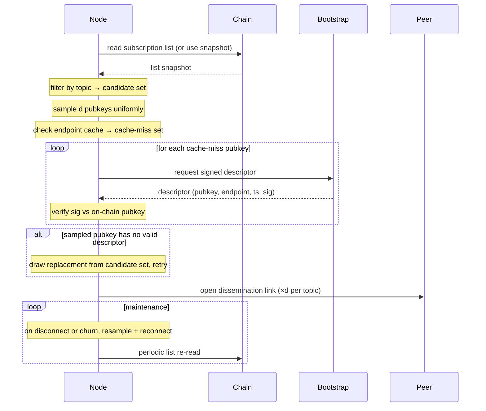

# IP discovery

A node resolves endpoints for the peers it intends to disseminate with and opens dissemination links to them. RandCast-only first iteration: no ring neighbours. Working-set selection is a uniform random sample of size `d` per topic (`d ≈ ln(n)` plus a safety margin, or a configured constant). Maintenance guarantees the minimum fanout, since random links are the only links.

## Steps

1. Re-read the subscription list (or use the most recent synced snapshot); filter by topic interest → candidate pubkey set per topic.
2. Sample `d` pubkeys uniformly at random from the candidate set per topic. No ring computation.
3. Check the local endpoint cache; collect cache-miss pubkeys.
4. Request [`SignedDescriptor`](./README.md#shared-types) entries for cache-miss pubkeys from connected bootstrap node(s) (or any connected peer).
5. Verify each descriptor's signature against the on-chain pubkey; reject stale or mismatched timestamps.
6. Cache verified endpoints.
7. Handle gaps: for any sampled pubkey with no valid descriptor, draw a replacement from the candidate set and repeat until `d` live targets are secured or the candidate set is exhausted.
8. Open dissemination-layer links to the `d` sampled peers per topic.
9. Maintain fanout: on disconnect or descriptor-verification failure, resample from the candidate set to restore `d`. Re-read the subscription list periodically (cadence is a [configurable parameter](./README.md#configuration-parameters)) to track churn — joiners, leavers, topic-subscription changes, and endpoint updates all surface here. The node's chain follower is already running for relayer verification (see [README](./README.md#chain-access)), so this is not extra infrastructure.
10. Drop bootstrap connections unless bootstrap is itself a subscriber; future descriptors arrive via gossip on dissemination links, bootstrap remains a fallback.

## Diagram

