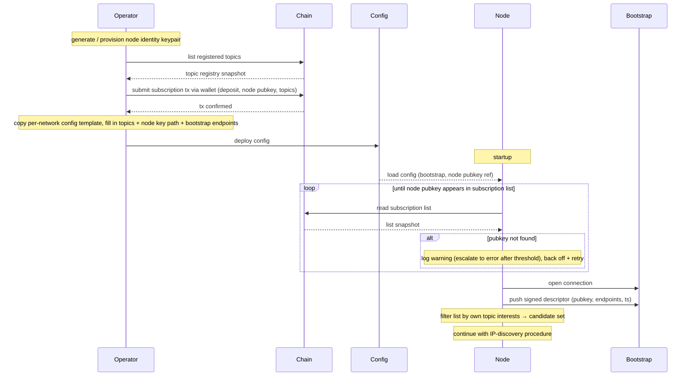

# Joining and registering

The first-time-join is two phases: **operator-driven pre-conditions** (key provisioning, registration transaction, config) and **node-driven startup** (the daemon loads its config, verifies it has an on-chain entry, then discovers and connects). Hands off to [IP discovery](./ip-discovery.md) once startup completes.

## Operator pre-conditions

These steps happen before the node daemon (`pubsub-node`) is started. They are performed by the operator (manually or via tooling).

> [!NOTE]
> **Proposed tooling:** a `pubsub-cli` binary complementary to `pubsub-node`, packaging the operator-side steps below behind a single CLI. Commands that read or mutate on-chain state require access to a Cardano node or compatible indexer/API. Illustrative commands are noted on each step.

1. Generate or provision the **node identity keypair** — distinct from the operator wallet, and the basis of the [`SignedDescriptor`](#types) the daemon uses at runtime. *(e.g., `pubsub-cli key gen`.)*
2. Discover the topics currently registered on chain and pick which ones to subscribe to. *(e.g., `pubsub-cli topics list`.)*
3. Submit the subscription transaction — deposit, node identity pubkey, topic-interest set go on-chain. Signed by the **operator's wallet** (which pays the deposit); the wallet key is not held by the node daemon. *(e.g., `pubsub-cli register --topics t1,t2 --deposit 1000`.)*
4. Prepare the node config by copying the per-network template and filling in the topic-interest set, the path to the node identity key, and the bootstrap endpoints. Per-network templates ship the network-specific parameters (contract addresses, network magic, era settings) so the operator only fills in deployment-local fields. *(e.g., `pubsub-cli config init --network mainnet --topics t1,t2 --node-key /path/to/key.skey`.)* The config topic-interest set is **not** the runtime authority: the node derives its effective interests from its on-chain subscription-list entry (step 3), so this config field is operator convenience that must match the registered set and must never widen the node's behaviour beyond it.

## Node startup

1. Load config.
2. Read the on-chain subscription list and look up the configured node identity pubkey.
3. If no entry is found, retry the lookup with exponential backoff — the registration tx may not yet be confirmed, or the chain follower may be lagging behind the tip. Log a warning on the first few misses and escalate to an error after a threshold so a misconfigured pubkey or missing registration becomes visible. The node does **not** initiate a registration transaction; that is the operator's job. Resume as soon as the entry appears.
4. Connect to one or more trusted bootstrap nodes from the config.
5. Push a [`SignedDescriptor`](#types) `(pubkey, endpoints, timestamp, signature)` to the bootstrap nodes so they can serve it to other subscribers. `endpoints` is an ordered list — preferred address first — so dual-stack (IPv4 + IPv6) and multi-homed nodes are covered without a schema change.
6. Filter the subscription list by the node's own topic interests — **as recorded in its own on-chain subscription-list entry** (the authoritative source; see step 3), not any local config value — yielding the candidate pubkey set per topic.
7. Continue with the [IP-discovery procedure](./ip-discovery.md) to resolve endpoints and open dissemination links.

## Diagram



## Types

**`SignedDescriptor`** — `(pubkey, endpoints, timestamp, signature)`. The descriptor is what other nodes need in order to find this node on the network. It is derived from the node identity keypair generated in step 1 of [Operator pre-conditions](#operator-pre-conditions): the public half is the `pubkey` field; the private half produces the `signature` over `(pubkey, endpoints, timestamp)`. The operator wallet is not involved at runtime — only the node identity key signs descriptors.

`endpoints` is an **ordered list** of network addresses for the same node — preferred first. One signature covers the whole list, so rollover is atomic (a network move replaces all addresses in a single descriptor, not one per transport). Dialers walk the list with a happy-eyeballs strategy ([RFC 8305](https://datatracker.ietf.org/doc/html/rfc8305)); [multiaddr](https://github.com/multiformats/multiaddr) encoding keeps the format transport-agnostic for future additions (QUIC, WebSocket, DNS).

Used here in [node-startup step 5](#node-startup) and reused by:

- [IP discovery](./ip-discovery.md) — resolves other peers' endpoints by fetching their descriptors.
- [Endpoint change](./endpoint-change.md) — broadcasts a fresh descriptor after a network move.
- [Leaving](./leaving.md) — variant with a sentinel "leaving" value to evict peer caches immediately.

## Key Provisioning

The first pre-condition is for the node operator to specify the key material 
that will be used to generate the node identifier and during the subsequent 
routine operations of the node.

The only strict requirement is the node identity key pair. This is a signature
key pair, generated uniformly at random and explicitly for the `pubsub-node`. It
may be generated in some external process and pass as input parameter, or 
internally during the node setup. Let `(pk_node,sk_node)` be the corresponding 
key pair.

Nodes may also intend to operate in a sort of "official role" -- e.g., SPOs or
dReps using the pubsub network to deliver public service announcements. In that
case, they may optionally specify their official public key (note that, here, it
cannot be internally generated by the node). This type of key pair acts as a
root of trust. Let `(pk_rot,sk_rot)` be the corresponding key pair.

## Node Identifier

Given `(pk_node,sk_node)` and, optionally, `(pk_rot,sk_rot)`, a node identifier
is computed as:

```
sig_node = Sig.Sign(sk_node, "pop_node"+pk_node)
if pk_rot != null:
  sig_rot = Sig'.Sign(sk_rot, "pop_rot"+pk_node)
  out = hash(pk_node,pk_rot,sig_rot,sig_node)
else:
  out = hash(pk_node, sig_node)
node_id = Bech32("pubsub", out) // Produces strings like pubsub1d3adf33
```

We require a signature verifiable under the chosen node key pair, as a
mechanism to prove possession. This is required to prevent rogue key
attacks when using aggregatable signatures. [TODO!] Looks like we may
use BLS signatures and aggregate them as a "proof of activity". If we
don't we may be able to skip this proof of possession.

When anchoring the identifier in an accepted root of trust, we require a 
signature from the correspoding root of trust signing key. This prevents attacks
that impersonate the corresponding anchor for registration -- which could lead 
to denial of service (the legitimate anchor cannot register).

We use `Sig` and `Sig'` for the signature schemes, as there is no need
for them to be the same. It may be also valid if they are.

[NOTE!] The previous assumes for simplicity that, for every trust anchor that
an operator has, it creates a new identifier. It is possible to generalize
the previous approach so that multiple trust anchors are used simultaneously
to produce a single identifier, if the operator intends to only run one
node for all of them.

## Registration

When the node sends the subscription transaction, the node registry 
smart contract verifies correctness of the node identifier (see next), 
in addition to verifying the deposit transaction. If either of the previous
fails, subscription is denied. The node registry stores 
`(node_id,pk_node,sig_node,[pk_rot,sig_rot,])`. [TODO!] Need to clarify 
whether this node registry is the same/related to the topic registry or 
subscription lists. At least, the information about each node specified here
should be reconstructable from on-chain information.


## Verifying a Node Identifier

Whenever some action requires asserting whether it originates from a node with
identifier `node_id`, we need to cryptographically verify this. Here, "action" 
can be disseminating a message in the pubsub network, or updating any of the 
on chain contracts (topic registry, subscription list). The process to do so
is as follows:

```
Find (node_id,pk_node,sig_node[,pk_rot,sig_rot]) in On-chain Node Registry
if pk_rot != null:
  inp = hash(pk_node,pk_rot,sig_rot,sig_node)
else:
  inp = hash(pk_node, sig_node)
assert node_id == Bech32("pubsub", inp)
assert Sig.Verify(pk_node, sig_node, "pop_node"+pk_node)
if pk_rot != null:
  assert Sig'.Verify(pk_rot, sig_rot, "pop_rot"+pk_node)
  assert validity of pk_rot // Process depends on the type of root of trust
```

Note that the last line requires validating the public key used as root of
trust, if any. The way to do this depends on the type of root of trust.
For instance, for SPOs we can use the VRF registered in the operational
certificates posted every 93 days, or the cold key registered during pool
registration. For dReps, we can use the DRep credential registered on-chain
via the DRep-registration certificate (CIP-1017).
