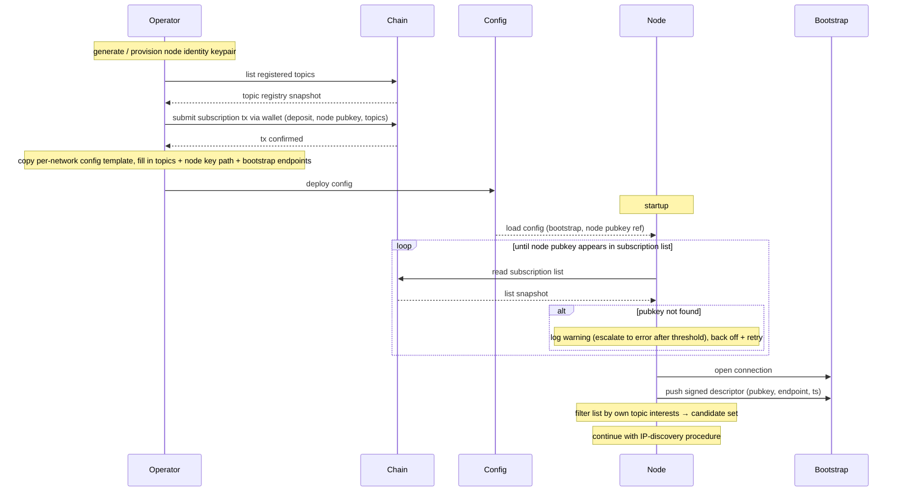

# Joining and registering

The first-time-join is two phases: **operator-driven pre-conditions** (key provisioning, registration transaction, config) and **node-driven startup** (the daemon loads its config, verifies it has an on-chain entry, then discovers and connects). Hands off to [IP discovery](./ip-discovery.md) once startup completes.

## Operator pre-conditions

These steps happen before the node daemon (`pubsub-node`) is started. They are performed by the operator (manually or via tooling).

> [!NOTE]
> **Proposed tooling:** a `pubsub-cli` binary complementary to `pubsub-node`, packaging the operator-side steps below behind a single CLI. Commands that read or mutate on-chain state require access to a Cardano node or compatible indexer/API. Illustrative commands are noted on each step.

1. Generate or provision the **node identity keypair** — distinct from the operator wallet, and the basis of the [`SignedDescriptor`](#types) the daemon uses at runtime. *(e.g., `pubsub-cli key gen`.)*
2. Discover the topics currently registered on chain and pick which ones to subscribe to. *(e.g., `pubsub-cli topics list`.)*
3. Submit the subscription transaction — deposit, node identity pubkey, topic-interest set go on-chain. Signed by the **operator's wallet** (which pays the deposit); the wallet key is not held by the node daemon. *(e.g., `pubsub-cli register --topics t1,t2 --deposit 1000`.)*
4. Prepare the node config by copying the per-network template and filling in the topic-interest set, the path to the node identity key, and the bootstrap endpoints. Per-network templates ship the network-specific parameters (contract addresses, network magic, era settings) so the operator only fills in deployment-local fields. *(e.g., `pubsub-cli config init --network mainnet --topics t1,t2 --node-key /path/to/key.skey`.)*

## Node startup

1. Load config.
2. Read the on-chain subscription list and look up the configured node identity pubkey.
3. If no entry is found, retry the lookup with exponential backoff — the registration tx may not yet be confirmed, or the chain follower may be lagging behind the tip. Log a warning on the first few misses and escalate to an error after a threshold so a misconfigured pubkey or missing registration becomes visible. The node does **not** initiate a registration transaction; that is the operator's job. Resume as soon as the entry appears.
4. Connect to one or more trusted bootstrap nodes from the config.
5. Push a [`SignedDescriptor`](#types) `(pubkey, current endpoint, timestamp, signature)` to the bootstrap nodes so they can serve it to other subscribers.
6. Filter the subscription list by the node's own topic interests — yields the candidate pubkey set per topic.
7. Continue with the [IP-discovery procedure](./ip-discovery.md) to resolve endpoints and open dissemination links.

## Diagram

## Types

**`SignedDescriptor`** — `(pubkey, endpoint, timestamp, signature)`. The descriptor is what other nodes need in order to find this node on the network. It is derived from the node identity keypair generated in step 1 of [Operator pre-conditions](#operator-pre-conditions): the public half is the `pubkey` field; the private half produces the `signature` over `(pubkey, endpoint, timestamp)`. The operator wallet is not involved at runtime — only the node identity key signs descriptors.

Used here in [node-startup step 5](#node-startup) and reused by:

- [IP discovery](./ip-discovery.md) — resolves other peers' endpoints by fetching their descriptors.
- [Endpoint change](./endpoint-change.md) — broadcasts a fresh descriptor after a network move.
- [Leaving](./leaving.md) — variant with a sentinel "leaving" value to evict peer caches immediately.

> *Open: single `endpoint` field today; dual-stack (IPv4 + IPv6) or multi-homed nodes would need multiple descriptors or a list-valued field.*
