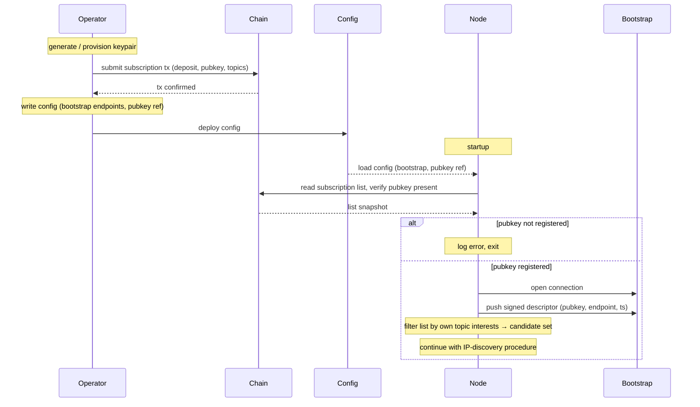

# Joining and registering

The first-time-join is two phases: **operator-driven pre-conditions** (key provisioning, registration transaction, config) and **node-driven startup** (the daemon loads its config, verifies it has an on-chain entry, then discovers and connects). Hands off to [IP discovery](./ip-discovery.md) once startup completes.

## Operator pre-conditions

These steps happen before the node daemon is started. They are performed by the operator (manually or via tooling).

1. Generate or provision the operator keypair.
2. Submit the subscription transaction — deposit, pubkey, topic-interest set go on-chain. Signed by the operator's wallet, not by the node daemon.
3. Prepare the node config: bootstrap endpoints, a reference to the operator pubkey (or to the local key-material file), and any node-local settings.

## Node startup

1. Load config.
2. Read the on-chain subscription list and verify there is an entry for the configured pubkey.
3. If no entry exists: log a clear error ("operator must register before starting the node — pubkey X not found in subscription list") and exit. The node does **not** initiate a registration transaction; that is the operator's job.
4. Connect to one or more trusted bootstrap nodes from the config.
5. Push a [`SignedDescriptor`](./README.md#shared-types) `(pubkey, current endpoint, timestamp, signature)` to the bootstrap nodes so they can serve it to other subscribers.
6. Filter the subscription list by the node's own topic interests — yields the candidate pubkey set per topic.
7. Continue with the [IP-discovery procedure](./ip-discovery.md) to resolve endpoints and open dissemination links.

## Diagram

