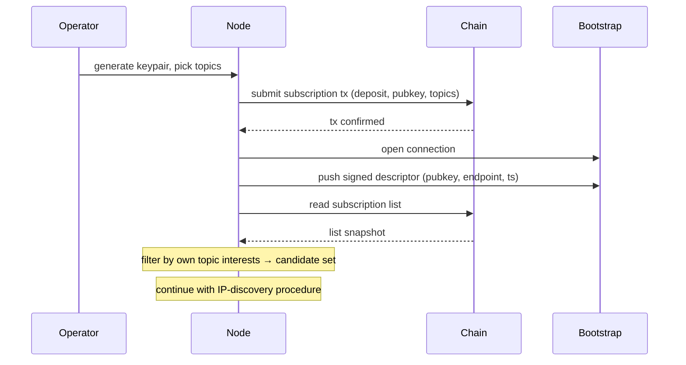

# Joining and registering

An operator joins the network for the first time: generates a keypair, locks the deposit on-chain, and becomes discoverable via the bootstrap nodes. Hands off to [IP discovery](./ip-discovery.md) to establish dissemination links.

## Steps

1. Operator generates keypair and picks topic-interest set.
2. Submit subscription transaction: locks the deposit and writes the public key and topic-interest set to the on-chain subscription list.
3. Connect to one or more trusted bootstrap nodes (endpoints known out-of-band).
4. Push a [`SignedDescriptor`](./README.md#shared-types) `(pubkey, current endpoint, timestamp, signature)` to the bootstrap nodes so they can serve it to other subscribers.
5. After confirmation, read the subscription list from chain and filter by the node's own topic interests — yields the candidate pubkey set per topic.
6. Continue with the [IP-discovery procedure](./ip-discovery.md) to resolve endpoints and open dissemination links.

## Diagram

