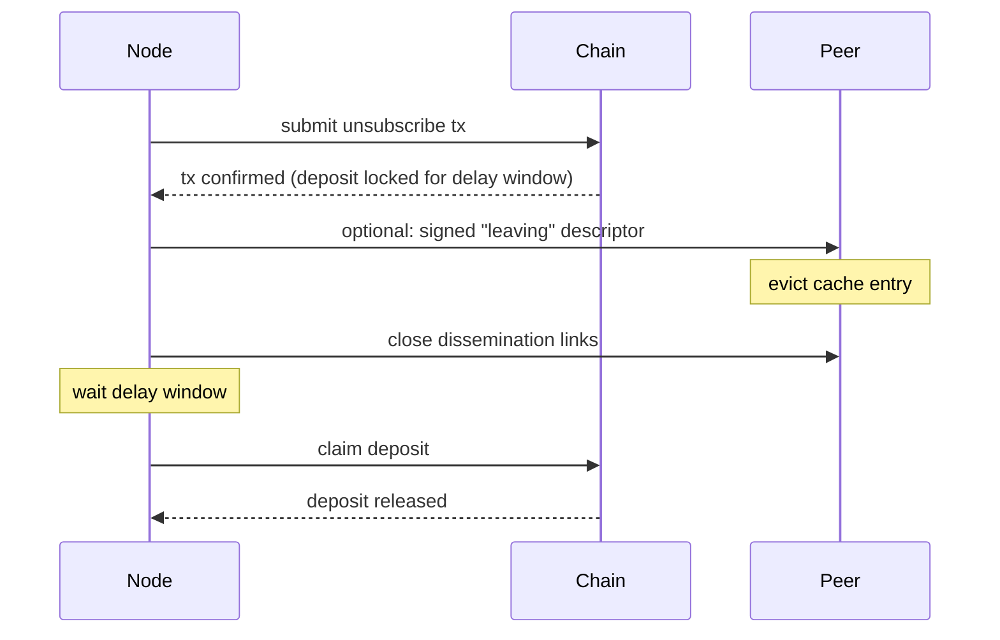

# Leaving and unregistering

A node removes its entire entry from the subscription list and exits the network. For removing a single topic while staying subscribed to others, see [Changing topic subscription](./changing-topic-subscription.md).

## Steps

1. Submit an unsubscribe transaction that removes the entry from the on-chain subscription list. The deposit becomes withdrawable after the contract's delay window.
2. Optionally publish a signed "leaving" descriptor on the remaining dissemination links so peers can evict the cache entry immediately; otherwise peers evict on their next list re-read.
3. Close open dissemination-layer connections.
4. After the delay window, claim the deposit.

## Diagram

## Types

**Leaving descriptor** — a [`SignedDescriptor`](./README.md#shared-types) with the endpoint field set to a sentinel "leaving" value (or with an explicit `leaving` flag once the schema is finalised). Sent so receiving peers evict cache entries immediately rather than waiting for a list re-read.
