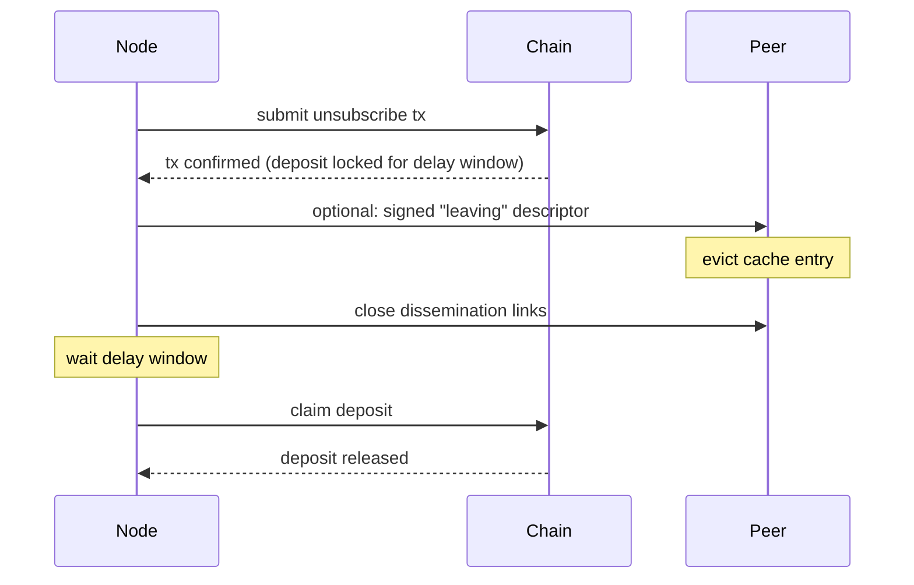

# Leaving and unregistering

A node removes its entire entry from the subscription list and exits the network. For removing a single topic while staying subscribed to others, see [Changing topic subscription](./changing-topic-subscription.md).

## Steps

1. Submit an unsubscribe transaction that removes the entry from the on-chain subscription list. The deposit becomes withdrawable after the contract's delay window.
2. Optionally publish a signed "leaving" descriptor on the remaining dissemination links so peers can evict the cache entry immediately; otherwise peers evict on their next list re-read.
3. Close open dissemination-layer connections.
4. After the delay window, claim the deposit.

> [!IMPORTANT]
> The withdrawal-delay window is the only opportunity to slash the operator's deposit for past misbehaviour. During this window, late equivocation proofs against the publisher key remain effective — see [Equivocation defence](./publishing.md#equivocation-defence-planned). Once the delay elapses and the deposit is claimed, the bond is gone and cannot be slashed.

## Diagram

## Types

**Leaving descriptor** — a [`SignedDescriptor`](./README.md#shared-types) with the endpoint field set to a sentinel "leaving" value (or with an explicit `leaving` flag once the schema is finalised). Sent so receiving peers evict cache entries immediately rather than waiting for a list re-read.

## Open questions

- **Silent abandonment vs. explicit leave.** The on-chain subscription list is not pruned by liveness — a node that goes offline silently and never submits an unsubscribe transaction stays in the list indefinitely. Sampling and the [authentication handshake](./ip-discovery.md) naturally route around such stale entries, but they continue to count toward `n` and thin out the rejection-sampling yield. Whether the deposit should be sized so that explicit unsubscribe is economically rational — making a non-trivial forfeit the price of lazy abandonment — is a deposit-economics question tied to the broader incentive design. Not addressed in this procedure.
