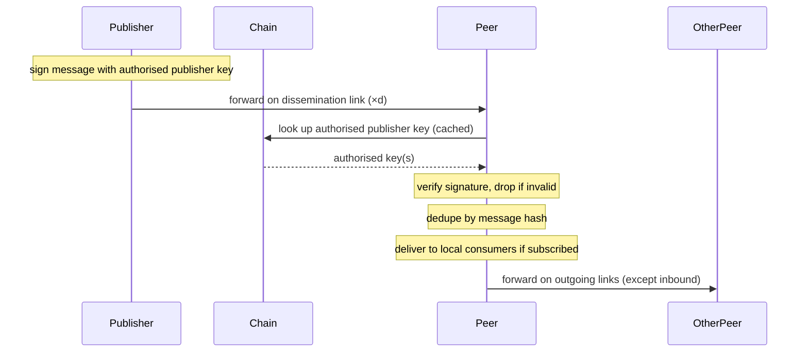

# Publishing and relaying

A publisher injects a signed message into a topic, and the overlay propagates it to subscribers. **In this iteration, a publisher must operate a subscribed node on every topic it publishes to** — its own dissemination-layer links serve as the injection points, so no separate publication-side discovery or sampling is needed. Publisher authorisation comes from the on-chain topic registry, which binds an authorised publisher key (or set of keys) to each topic. Because the operator already pays the subscription deposit, the freeloading concern of accepting third-party publishes is avoided by construction.

## Steps

**Publishing.**

1. Construct a [`Message`](#types) and sign it with the publisher key authorised for the topic in the topic registry. The publisher key is held by the operator; it may or may not be the same key as the operator pubkey on the subscription list.
2. Send the signed message to the node's existing dissemination-layer peers for that topic — the `d` outgoing links established during [IP discovery](./ip-discovery.md). No separate injection sampling.
3. Gossip propagates from there via the relaying rules below.

**Relaying.**

1. Receive a message on a dissemination-layer link.
2. Look up the topic's authorised publisher key(s) in the topic registry and verify the signature. Drop if invalid.
3. Check the recently-seen cache by message hash; drop if duplicate.
4. Deliver to local consumers if the topic is in the node's interest set.
5. Forward on outgoing dissemination links for that topic, except the link the message arrived on.

## Diagram

## Types

**`Message`** — `(topicId, parentHash, sequence, timestamp, payload, signature)`.

- `topicId` — identifier from the topic registry. Binds the message to its topic so relayers look up the right authorised publisher key.
- `parentHash` — hash of the previous message on this topic from this publisher (genesis sentinel, e.g. all-zeros, for the first). Forms a per-`(topic, publisher)` hash chain.
- `sequence` — monotonically increasing counter per `(topic, publisher)`. Cheap integer ordering tag; gap detection is O(1) integer compare.
- `timestamp` — publisher-side wall-clock at production. Not consensus-bound; for staleness checks and rough ordering hints.
- `payload` — opaque application data.
- `signature` — produced by the authorised publisher key, covering all other fields.

Together, `parentHash` and `sequence` make the per-publisher stream tamper-evident *and* gap-detectable. They support a future replay/catch-up layer, which is anticipated as a follow-on feature.

## Equivocation defence (planned)

A malicious authorised publisher can sign two different messages with the same `(topicId, sequence)` and gossip them along disjoint paths — a Byzantine equivocation that corrupts any consumer that depends on causal ordering. Without relayer-level enforcement the attack is essentially free in this iteration. The planned defence has three layers, each useful even without the next.

**1. Detection at every relayer (cache extension).** Extend the recently-seen cache (currently keyed by message hash for dedupe) to also key by `(publisher, topic, sequence)` with the value `(hash, message)`. On receive:

- Lookup hit with the same hash → dedupe (existing path).
- Lookup hit with a different hash → **equivocation**. The relayer now holds a cryptographic proof: two signed messages from the same publisher key with the same `(topic, sequence)` but different content.

Storage cost is bounded by the topic-registry size, not by message volume — roughly 50 B per `(publisher, topic)` entry for the minimal last-seq+hash form, or low-MB for a sliding window large enough to catch retroactive forks. Trivial alongside the chain follower and endpoint cache the node already maintains. Every relayer doing this is what makes the attack hard to evade: forks that stay disjoint at the first hop will typically meet at some downstream relayer within `O(log_d n)` gossip rounds.

**2. Proof-of-equivocation gossip.** The proof is small and self-verifying: any node receiving `(msg_A, msg_B)` re-checks both signatures and confirms `seq_A == seq_B ∧ hash_A != hash_B`. Validating peers drop all subsequent messages from the equivocating publisher key and re-broadcast the proof on their dissemination links. Branches that stayed disjoint up to that point get squashed network-wide once the proof emerges anywhere in the overlay.

**3. On-chain slashing via Plutus redeemer.** The proof is portable and cryptographically self-contained, which makes it a natural redeemer for a Plutus script that:

- Re-verifies both signatures using the on-chain authorised publisher key from the topic registry.
- Confirms the equivocation predicate (`seq_A == seq_B ∧ hash_A != hash_B`).
- Slashes the equivocating publisher's collateral — the subscription deposit of the node operator bound to the publisher key. Publishers must run a subscribed node, so the operator's deposit is the natural slashable bond; no separate collateral is needed.
- Pays a bounty to the submitter from the slashed amount; remainder is burned (deterrent) or redirected to a topic-owner fund.

The bounty makes detection economically rational: any watcher, subscriber, or relayer that holds both branches has positive expected value for submitting the proof. Same cryptographic-fault-attribution pattern as Tendermint validator slashing, Ethereum 2 double-sign slashing, and Casper FFG.

### Residual open points

- **Cache window size.** Minimum state (last `seq + hash` per `(publisher, topic)`) catches immediate equivocation. A sliding window of the last N hashes catches retroactive forks (publisher equivocates at seq 5 after seq 10 was already broadcast). Window size is configurable; default TBD.
- **Bounty calibration.** How the slashed amount splits between submitter bounty, burn, and any topic-owner fund. Ties into the broader incentive design.
- **Publisher-key rotation.** If a publisher rotates keys, equivocation by the old key after rotation needs unambiguous attribution. Solvable via key-version tracking in the topic registry.

## Open questions

- **Lightweight-client and API-gateway publishing.** Requiring publishers to run subscribed nodes excludes lightweight clients (CLI tools, scripts, services that only emit). An API-gateway pattern — a lightweight client signs locally and sends to any node's ingress API for injection — would unlock those use cases but raises a freeloading question (the gateway node does verification + relaying work for free, possibly without even subscribing to the topic). A fee or incentive mechanism would close that gap. Deferred until the incentive design lands.
