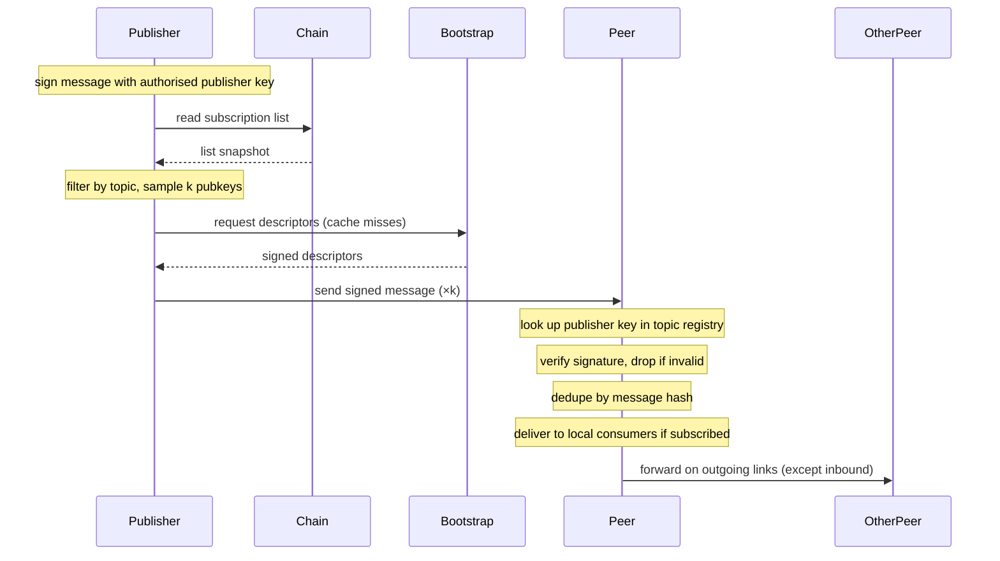

# Publishing and relaying

A publisher injects a signed message into a topic, and the overlay propagates it to subscribers. No dedicated relay set: publishers use the same [IP-discovery procedure](./ip-discovery.md) that subscribers use to find injection targets. Publisher authorisation comes from the on-chain topic registry, which binds an authorised publisher key (or set of keys) to each topic.

## Steps

**Publishing.**

1. Construct a [`Message`](#types) and sign it with the publisher key authorised for the topic in the topic registry.
2. Discover injection targets: read the subscription list, filter by topic → candidate set; sample `k` pubkeys uniformly (`k` is the publication fanout, independent of the dissemination fanout `d`); resolve endpoints via the local cache or by querying bootstrap nodes. Same flow as steps 1–7 of [IP discovery](./ip-discovery.md).
3. Send the signed message to the `k` resolved peers. Gossip handles propagation from there. The publisher does not need to maintain dissemination-layer links unless it publishes frequently and wants to amortise discovery cost.

**Relaying.**

1. Receive a message on a dissemination-layer link.
2. Look up the topic's authorised publisher key(s) in the topic registry and verify the signature. Drop if invalid.
3. Check the recently-seen cache by message hash; drop if duplicate.
4. Deliver to local consumers if the topic is in the node's interest set.
5. Forward on outgoing dissemination links for that topic, except the link the message arrived on.

## Diagram

## Types

**`Message`** — `(topicId, parentHash, sequence, timestamp, payload, signature)`.

- `topicId` — identifier from the topic registry. Binds the message to its topic so relayers look up the right authorised publisher key.
- `parentHash` — hash of the previous message on this topic from this publisher (genesis sentinel, e.g. all-zeros, for the first). Forms a per-`(topic, publisher)` hash chain.
- `sequence` — monotonically increasing counter per `(topic, publisher)`. Cheap integer ordering tag; gap detection is O(1) integer compare.
- `timestamp` — publisher-side wall-clock at production. Not consensus-bound; for staleness checks and rough ordering hints.
- `payload` — opaque application data.
- `signature` — produced by the authorised publisher key, covering all other fields.

Together, `parentHash` and `sequence` make the per-publisher stream tamper-evident *and* gap-detectable. They support a future replay/catch-up layer, which is anticipated as a follow-on feature.

## Open questions

- **Chain enforcement.** Relayers verify only the signature and dedupe by message hash; they do not check `sequence` monotonicity or `parentHash` linkage. Chain integrity is the consumer's responsibility for now. Whether to move enforcement into relayers (more storage per publisher at every relayer, but earlier rejection of malicious replays) is deferred until the replay/catch-up layer is designed.
