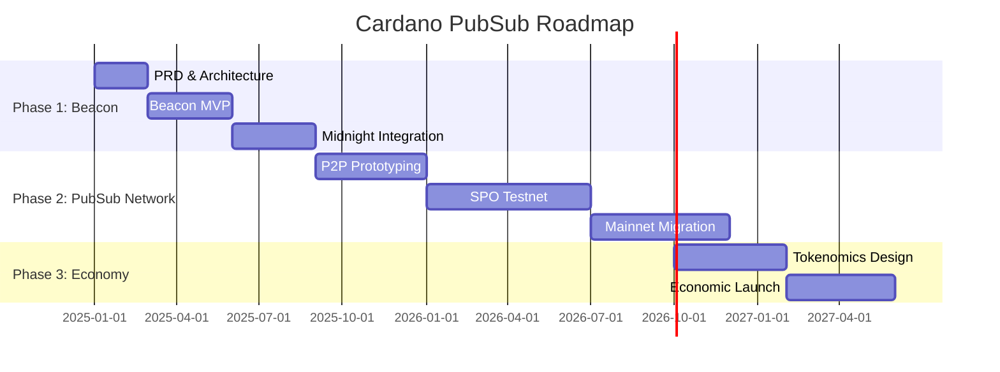
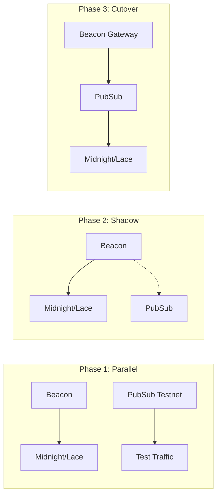

# Roadmap

!!! info "Audience: All stakeholders"

We follow a **lean, phased approach** focused on rapid prototyping (~1 month per prototype) to iterate quickly with stakeholder feedback.

## Phase Overview

## Detailed Timeline

### Phase 1: Beacon (Months 1-9)

**Goal:** Production-ready centralized service for Midnight mainnet.

| Sub-Phase | Timeline | Deliverables |
|-----------|----------|--------------|
| **1A: Foundation** | Jan-Feb 2025 | PRD finalized, architecture validated, Tech Lead hired |
| **1B: MVP** | Mar-May 2025 | Core pub/sub service, Identus integration, basic API |
| **1C: Integration** | Jun-Aug 2025 | Lace integration, Midnight notifications, production hardening |

**Key Milestones:**

- [ ] Week 2: PRD approved
- [ ] Week 4: Tech Lead onboarded
- [ ] Week 12: Beacon MVP internal demo
- [ ] Week 24: Lace integration complete
- [ ] Week 36: Midnight mainnet launch support

### Phase 2: PubSub Network (Months 10-24)

**Goal:** Decentralized, SPO-operated messaging network.

| Sub-Phase | Timeline | Deliverables |
|-----------|----------|--------------|
| **2A: Prototyping** | Sep-Dec 2025 | P2P networking prototype, Ouroboros integration research |
| **2B: Testnet** | Jan-Jun 2026 | SPO testnet, migration tooling, performance tuning |
| **2C: Mainnet** | Jul-Nov 2026 | Gradual migration from Beacon, SPO onboarding |

**Key Milestones:**

- [ ] Month 10: P2P prototype demo
- [ ] Month 14: First SPO testnet node
- [ ] Month 18: 50+ SPO testnet nodes
- [ ] Month 24: Beacon traffic migrated to PubSub

### Phase 3: Full Economy (Months 25-30)

**Goal:** Sustainable economic model with community governance.

| Sub-Phase | Timeline | Deliverables |
|-----------|----------|--------------|
| **3A: Design** | Oct 2026-Jan 2027 | Tokenomics RFC, community feedback, governance framework |
| **3B: Launch** | Feb-May 2027 | Economic incentives live, DAO established |

**Key Milestones:**

- [ ] Month 25: Economic model RFC published
- [ ] Month 28: Incentivized testnet
- [ ] Month 30: Full economic model live

---

## Beacon Delivery Plan (Detailed)

**Start Date: January 2025**

| Week | Activities | Owner | Exit Criteria |
|------|------------|-------|---------------|
| **1-2** | Align MVP scope, streamline PRD | PM | PRD approved by stakeholders |
| **3-4** | Tech Lead onboarding, team formation | PM + HR | Tech Lead productive |
| **5-8** | Prototype core flows, validate interfaces | Engineering | Working prototype |
| **9-10** | Performance benchmarking, architecture validation | Engineering | Targets met |
| **11-12** | Lock interfaces, begin production implementation | Engineering | API spec frozen |
| **13-20** | Production implementation | Engineering | Feature complete |
| **21-24** | Integration testing with Lace/Midnight | Engineering + Partners | Integration verified |
| **25-36** | Hardening, monitoring, launch prep | Engineering + DevOps | Production ready |

---

## Migration Strategy: Beacon → PubSub {#migration-strategy}

!!! warning "Critical Transition"
    Seamless migration is essential. Midnight and other integrations must not break.

### Migration Phases

### Compatibility Guarantees

| Aspect | Guarantee |
|--------|-----------|
| **API Endpoints** | Beacon APIs supported for 24 months post-PubSub launch |
| **Topic Structure** | Identical topic naming in both systems |
| **Message Format** | Beacon payloads work unchanged in PubSub |
| **Identity** | Same Identus DIDs, same verification |

### Migration Timeline

| Milestone | Target | Success Criteria |
|-----------|--------|------------------|
| Shadow mode enabled | Month 16 | 100% traffic mirrored |
| 10% traffic on PubSub | Month 18 | No errors, latency parity |
| 50% traffic on PubSub | Month 20 | SPO network stable |
| 100% traffic on PubSub | Month 24 | Beacon in gateway mode |
| Beacon gateway deprecated | Month 36 | Full decentralization |

---

## Dependencies

| Dependency | Owner | Risk | Mitigation |
|------------|-------|------|------------|
| Midnight mainnet timeline | Midnight Team | Medium | Regular syncs, flexible scope |
| Lace notification support | Lace Team | Low | Internal team, committed |
| Identus DID resolution | Identus Team | Low | Internal team, stable API |
| Plutus Events (Leios) | Core Team | Medium | Not required for Phase 1-2 |
| SPO participation | Community | Medium | Economic incentives, outreach |

---

## Decision Log

| Date | Decision | Rationale |
|------|----------|-----------|
| 2025-01 | Centralized Beacon before decentralized PubSub | Meet Midnight deadline, reduce risk |
| 2025-01 | Identus for identity (not custom DIDs) | Ecosystem alignment, less maintenance |
| 2025-01 | Ouroboros-native networking (not libp2p-only) | SPO adoption, native feel |
| TBD | Economic model (token vs. ADA-only) | Pending Phase 3 research |
