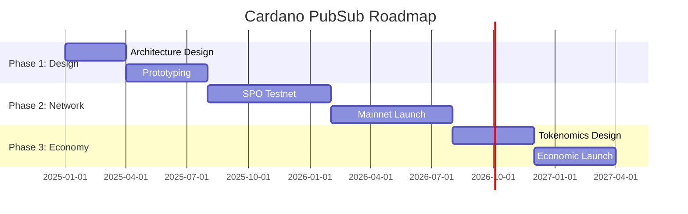

# Roadmap

!!! info "Audience: All stakeholders"

We follow a **lean, phased approach** focused on rapid prototyping (~1 month per prototype) to iterate quickly with stakeholder feedback.

## Phase Overview

## Detailed Timeline

### Phase 1: Architecture & Prototyping (2025)

**Goal:** Validate architecture and build working prototypes.

| Sub-Phase | Timeline | Deliverables |
|-----------|----------|--------------|
| **1A: Architecture** | Q1 2025 | Architecture finalized, Tech Lead hired, vendor selection |
| **1B: Prototyping** | Q2-Q3 2025 | Working P2P prototype, Identus integration, SDK draft |

**Key Milestones:**

- [ ] Q1: Architecture design approved
- [ ] Q1: Tech Lead onboarded
- [ ] Q2: P2P prototype demo
- [ ] Q3: SDK alpha for early integrators

### Phase 2: PubSub Network (2026 H1)

**Goal:** Launch decentralized, SPO-operated messaging network.

| Sub-Phase | Timeline | Deliverables |
|-----------|----------|--------------|
| **2A: Testnet** | Q4 2025 - Q1 2026 | SPO testnet, performance tuning, security audit |
| **2B: Mainnet** | Q2 2026 | Production launch, wallet integrations, developer docs |

**Key Milestones:**

- [ ] Q4 2025: First SPO testnet nodes
- [ ] Q1 2026: 50+ SPO testnet nodes
- [ ] Q2 2026: Mainnet launch
- [ ] Q2 2026: First wallet integrations live

### Phase 3: Full Economy (2026 H2+)

**Goal:** Sustainable economic model with community governance.

| Sub-Phase | Timeline | Deliverables |
|-----------|----------|--------------|
| **3A: Design** | Q3 2026 | Tokenomics RFC, community feedback, governance framework |
| **3B: Launch** | Q4 2026 | Economic incentives live, DAO established |

**Key Milestones:**

- [ ] Q3 2026: Economic model RFC published
- [ ] Q4 2026: Incentivized mainnet
- [ ] Q4 2026: DAO governance live

---

## Development Approach

### Prototyping Strategy

| Prototype | Focus | Duration |
|-----------|-------|----------|
| **P1: Networking** | Ouroboros + GossipSub hybrid | 4-6 weeks |
| **P2: Identity** | Identus DID integration | 4-6 weeks |
| **P3: Storage** | Tiered storage (hot/durable) | 4-6 weeks |
| **P4: Integration** | Full stack prototype | 6-8 weeks |

### Vendor Engagement

| Milestone | Target |
|-----------|--------|
| Initial outreach | Q1 2025 |
| Technical discussions | Q1 2025 |
| Vendor selection | Q1 2025 |
| Development start | Q2 2025 |

---

## Dependencies

| Dependency | Owner | Risk | Mitigation |
|------------|-------|------|------------|
| Identus DID resolution | Identus Team | Low | Internal team, stable API |
| SPO participation | Community | Medium | Economic incentives, outreach |
| Wallet integration | Wallet teams | Medium | Early engagement, simple SDK |
| Plutus Events (Leios) | Core Team | Medium | Not required for initial launch |

---

## Decision Log

| Date | Decision | Rationale |
|------|----------|-----------|
| 2025-01 | Decentralized-first approach | Build for long-term, SPO-powered network |
| 2025-01 | Identus for identity | Ecosystem alignment, less maintenance |
| 2025-01 | Ouroboros-native networking | SPO adoption, native feel |
| TBD | Economic model (token vs. ADA-only) | Pending Phase 3 research |
