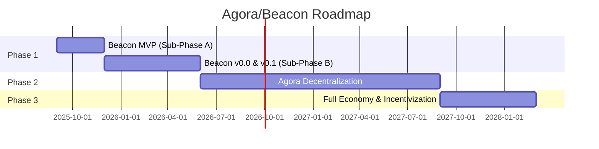

# Roadmap

We follow a lean approach focused on rapid prototyping (around couple sprints, ~1 month average per released prototype) that allows us to iterate and get feedback quickly from different stakeholders.

## Phase Overview

## Detailed Timeline

| Phase | Timeline | Goal | Key Deliverables |
|-------|----------|------|------------------|
| **Phase 1** | Months 1-9 | Beacon: Centralized Solution for Midnight | **Sub-Phase A (Months 1-3):** Rapid prototyping, finalized architecture, and MVP. **Sub-Phase B (Months 4-9):** A stable, centralized pub/sub service for Midnight (v0.0 & v0.1). |
| **Phase 2** | Months 10-24 | Agora: Decentralization & Unification | Develop and deploy the decentralized Agora backend, powered by the selected native network protocol, to be run by SPOs; Seamlessly migrate the Midnight service from the centralized Beacon backend. |
| **Phase 3** | Months 25-30 | Full Economy & Incentivization | Implement the on-chain economic model (staking, fees, rewards); Establish a formal DAO for community governance. |

## Beacon Delivery Plan

**Starting September 1, 2025**

| Week | Activities |
|------|------------|
| **1-2** | Align on essential MVP scope for launch (streamline current PRD) |
| **3-6** | Prototype core flows, validate interfaces between systems, refine requirements |
| **7-8** | Performance benchmarking & architecture validation |
| **9** | Lock MVP design & interfaces, onboard engineering team |
| **10-12** | Production implementation with defined APIs for Midnight mainnet |
