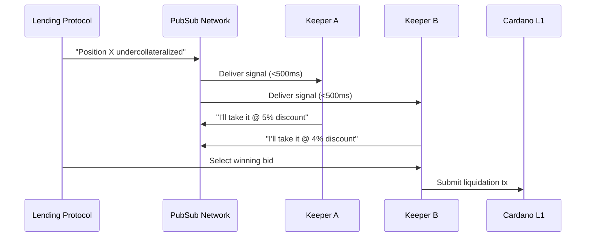
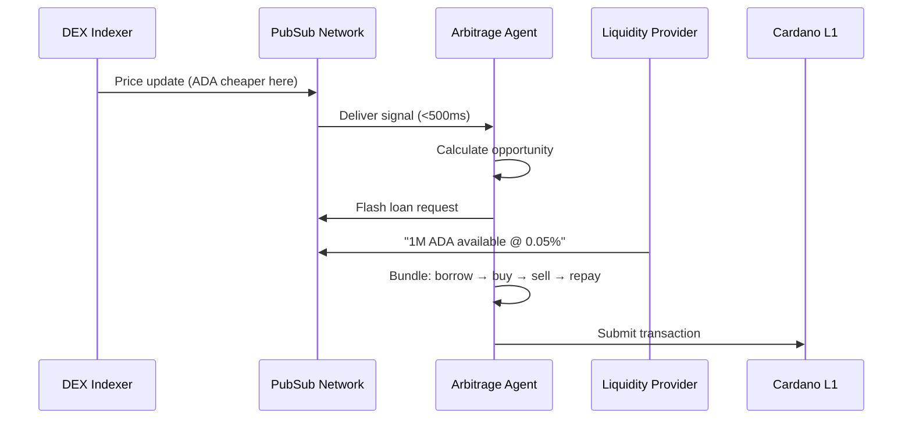

# Agent Coordination

**High-throughput coordination for automated systems.**

## The Problem

Automated systems — arbitrage bots, liquidation keepers, MEV searchers — need to coordinate faster than blockchain finality allows. Today, they use centralized APIs, proprietary WebSockets, or the L1 mempool. Each has limitations: centralized APIs are single points of failure, proprietary systems fragment liquidity, and mempools weren't designed for arbitrary coordination messages.

## The Solution

Cardano PubSub provides a **high-throughput coordination bus** for machine-to-machine communication. Agents discover opportunities, negotiate execution, and reach agreement off-chain in milliseconds — only settling the final transaction on L1.

## Value Proposition

| Benefit | Description |
|---------|-------------|
| **Speed** | Sub-second propagation vs. waiting for blocks |
| **Cost** | Off-chain coordination is nearly free; only settlement costs ADA |
| **Interoperability** | Standard topics work across protocols |
| **Privacy** | Encrypted channels for private negotiations |

## Actors

| Actor | Role | Description |
|-------|------|-------------|
| **Protocol/Indexer** | Publisher | Announces opportunities (liquidations, price updates) |
| **Searcher** | Subscriber | Scans for profitable opportunities |
| **Solver** | Publisher + Subscriber | Negotiates execution with other agents |
| **Coordinator Node** | Relayer | Low-latency SPO nodes optimized for agent traffic |

## Scenario: Liquidation Coordination

**A lending protocol position becomes undercollateralized. Multiple keepers coordinate to liquidate efficiently.**



### Step-by-Step

1. **Detection**: Protocol indexer detects undercollateralized position
2. **Broadcast**: Opportunity published to `agents/liquidations/{protocol}`
3. **Discovery**: Subscribed keepers receive signal within milliseconds
4. **Bidding**: Keepers publish bids indicating terms
5. **Selection**: Protocol selects most favorable bid
6. **Settlement**: Winning keeper submits transaction to L1

## Scenario: Multi-Hop Arbitrage

**Price discrepancy exists across DEXs. Agents coordinate to capture the spread.**



---

## Technical Specification

### Topics

| Topic | Message Type | Retention | QoS |
|-------|--------------|-----------|-----|
| `agents/prices/{pair}` | Price updates | 1 min | Best-effort |
| `agents/liquidations/{protocol}` | Liquidation alerts | 10 min | High priority |
| `agents/flash-loans` | Loan requests/offers | 5 min | Standard |
| `agents/negotiate/{session}` | Private negotiation | 10 min | Encrypted |

### Message Schema

```protobuf
message AgentSignal {
  bytes opportunity_id = 1;
  
  enum SignalType {
    LIQUIDATION = 0;
    ARBITRAGE = 1;
    FLASH_LOAN_REQUEST = 2;
    FLASH_LOAN_OFFER = 3;
    PRICE_UPDATE = 4;
  }
  SignalType signal_type = 2;
  
  bytes parameters_cbor = 3;     // Signal-specific params
  uint64 expires_at_ms = 4;      // Millisecond precision
  bytes agent_signature = 5;
}
```

### Performance Requirements

| Metric | Target | Rationale |
|--------|--------|-----------|
| **Throughput** | 10,000+ msg/sec | Handle market volatility |
| **Latency** | <500ms p99 | Stale data = failed opportunities |
| **Payload format** | CBOR/Protobuf | Binary for fast parsing |

### Architectural Implications

This use case drives:

- **Hot cache only** — agent data is ephemeral, no long-term storage needed
- **Burst handling** — network must absorb traffic spikes during volatility
- **Bloom filter subscriptions** — agents filter by asset/protocol efficiently
- **MLS encryption** — private negotiation channels
- **Millisecond timestamps** — more precise than slot-based timing

---

## Context: What This Is (and Isn't)

This use case covers **proven automated infrastructure** — the kind of systems that have processed billions in volume since 2020. On Ethereum, MEV infrastructure (Flashbots, etc.) handles nearly 100% of block building. Liquidation and arbitrage bots account for 30-50% of DEX volume.

This is distinct from speculative "AI agent" narratives. While autonomous AI agents with wallets may emerge, the current market is dominated by traditional automation: deterministic bots executing well-defined strategies. PubSub is designed for what works today, with room to support future agent architectures.

---

## Open Questions

| Question | Status | Notes |
|----------|--------|-------|
| Spam prevention (high-frequency topics)? | ⬜ Not started | Consider stake-weighted access |
| Agent identity (prevent Sybil attacks)? | ⬜ Not started | Require collateral or reputation |
| Time sync requirements? | ⬜ Not started | Prevent timestamp manipulation |

## Related

- [DeFi Intents](defi-intents.md) — User-to-agent intent broadcasting
- [Requirements: FR1.4, FR4.4, FR5.3](../product/requirements/functional.md)
- [Requirements: NFR1.2, NFR1.3, NFR2.1](../product/requirements/non-functional.md)
