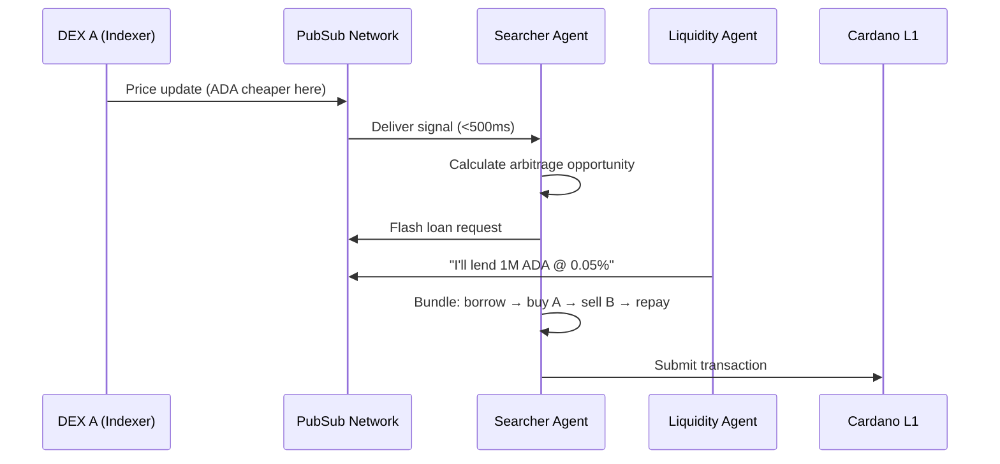

# Autonomous Agents

**Enable AI agents to coordinate at machine speed.**

## The Problem

Autonomous agents (arbitrage bots, liquidation keepers, DAO operators) need to coordinate complex actions faster than blockchain finality allows. Today, they use centralized APIs, proprietary WebSockets, or the L1 mempool — all with limitations around speed, cost, or censorship.

## The Solution

Cardano PubSub provides a **high-throughput coordination bus** for machine-to-machine communication. Agents discover opportunities, negotiate execution, and reach consensus off-chain in milliseconds — only settling the final transaction on L1.

## Value Proposition

| Benefit | Description |
|---------|-------------|
| **Speed** | Sub-second propagation vs. waiting for blocks |
| **Cost** | Off-chain "chatter" is nearly free; only final settlement costs ADA |
| **Interoperability** | Standard topics (`intents/liquidation`) work across protocols |
| **Privacy** | Encrypted channels for private negotiations |

## Actors

| Actor | Role | Description |
|-------|------|-------------|
| **Protocol/Indexer** | Publisher | Announces opportunities (liquidations, arbitrage) |
| **Searcher Agent** | Subscriber | Scans for profitable opportunities |
| **Solver Agent** | Publisher + Subscriber | Negotiates execution with other agents |
| **Coordinator Node** | Relayer | Low-latency SPO nodes optimized for agent traffic |

## Scenario: Multi-Hop Arbitrage

**ADA is cheaper on DEX A than DEX B. Multiple agents coordinate to capture the spread.**



### Step-by-Step

1. **Signal detection**: DEX indexer publishes price update to `market/ada-usdm/price`
2. **Opportunity analysis**: Searcher agents receive signal, calculate arbitrage potential
3. **Negotiation**: Agent X needs flash loan, publishes request to `intents/flash-loans`
4. **Response**: LP Agent offers terms via encrypted channel
5. **Bundle construction**: Agent X builds nested transaction (loan + buy + sell + repay)
6. **Settlement**: Transaction submitted to L1; all "chatter" stayed off-chain

---

## Technical Specification

### Topics

| Topic | Message Type | Retention | QoS |
|-------|--------------|-----------|-----|
| `market/{pair}/price` | Price updates | 1 min | Best-effort |
| `market/{pair}/depth` | Order book | 1 min | Best-effort |
| `intents/liquidation` | Liquidation alerts | 10 min | High priority |
| `intents/flash-loans` | Loan requests | 5 min | Standard |
| `agents/negotiate/{session}` | Private negotiation | 10 min | Encrypted |

### Message Schema

```protobuf
message AgentSignal {
  bytes target_id = 1;           // Opportunity ID (loan, position, etc.)
  
  enum ActionType {
    LIQUIDATE = 0;
    ARBITRAGE = 1;
    FLASH_LOAN_REQUEST = 2;
    FLASH_LOAN_OFFER = 3;
  }
  ActionType action = 2;
  
  bytes parameters_cbor = 3;     // Action-specific params
  uint64 expires_at_ms = 4;      // Millisecond precision
  bytes agent_signature = 5;
}
```

### Performance Requirements

| Metric | Target | Rationale |
|--------|--------|-----------|
| **Throughput** | 10,000+ msg/sec | Handle market volatility bursts |
| **Latency** | <500ms p99 | Stale data = failed transactions |
| **Payload format** | CBOR/Protobuf | Binary for fast parsing |

### Architectural Implications

This use case drives:

- **Hot Cache only** — all agent data is ephemeral
- **Burst handling** — network must absorb traffic spikes
- **Bloom filter subscriptions** — agents filter by asset/protocol
- **MLS encryption** — private negotiation channels
- **Millisecond timestamps** — more precise than slot-based timing

---

## Open Questions

| Question | Status | Notes |
|----------|--------|-------|
| MEV protection (public liquidation alerts create gas wars)? | ⬜ Not started | Consider sealed-bid auctions |
| Agent identity (prevent Sybil spam)? | ⬜ Not started | Require stake to publish on high-freq topics |
| Time sync requirements (NTP enforcement)? | ⬜ Not started | Prevent timestamp manipulation |

## Related

- [Requirements: FR1.4, FR4.4, FR5.3](../product/requirements/functional.md)
- [Requirements: NFR1.2, NFR1.3, NFR2.1](../product/requirements/non-functional.md)
