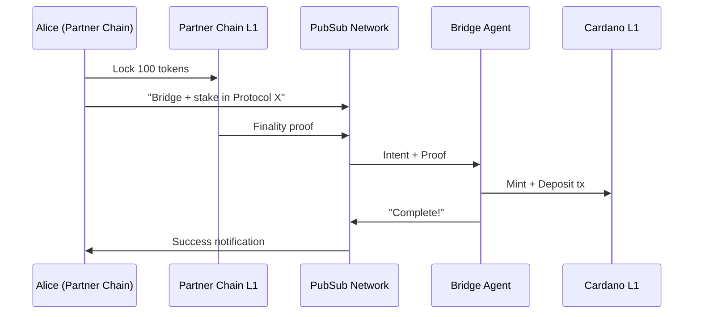

# Cross-Chain

**Collapse multi-step bridging into one-click actions.**

## The Problem

Moving assets between chains is painful: find a bridge, lock assets, wait for confirmations, switch wallets, claim on the other side, then deposit into a protocol. Each step is a drop-off point. Result: fragmented liquidity and frustrated users.

## The Solution

Cardano PubSub enables **cross-chain intents** — users express what they want ("bridge my BTC to Cardano and stake it") and agents handle the complexity. The signal is instant; execution happens in the background.

## Value Proposition

| Benefit | Description |
|---------|-------------|
| **One-Click UX** | "Bridge and Stake" in a single action |
| **Instant Feedback** | User sees progress via PubSub, even while bridge finalizes |
| **Unified Standard** | Protocols advertise opportunities; users respond from any chain |
| **Agent Competition** | Multiple bridge operators compete on speed and fees |

## Actors

| Actor | Role | Description |
|-------|------|-------------|
| **Source User** | Publisher | User on external chain expressing cross-chain intent |
| **Destination Protocol** | Publisher | Cardano protocol advertising yield/opportunities |
| **Bridge Agent** | Subscriber | Listens for intents, executes bridge + deposit |
| **Verifier Node** | Relayer | Validates cross-chain proofs before propagating |

## Scenario: Bridge and Stake

**Alice holds tokens on a partner chain. She sees a Cardano DeFi opportunity and wants in.**



### Step-by-Step

1. **Opportunity discovery**: Alice sees notification — "Earn 5% APY on Protocol X"
2. **Intent expression**: Alice clicks "Bridge & Stake", wallet constructs cross-chain intent
3. **Source action**: Alice signs lock transaction on partner chain
4. **Proof generation**: Once finalized, proof is attached to the intent
5. **Agent execution**: Bridge Agent verifies proof, mints wrapped tokens, deposits to protocol
6. **Notification**: Alice receives "Staking Complete" — LP tokens in her Cardano wallet

---

## Technical Specification

### Topics

| Topic | Purpose | Retention |
|-------|---------|-----------|
| `crosschain/{src}-{dst}/opportunities` | Protocols advertising yield | 24 hours |
| `crosschain/{src}-{dst}/intents` | User bridge intents | 1 hour |
| `crosschain/{src}-{dst}/proofs` | Finality proofs | 1 hour |
| `crosschain/{src}-{dst}/status` | Execution status updates | 1 hour |

### Message Schema

```protobuf
message CrossChainIntent {
  string source_chain = 1;       // "midnight", "bitcoin", etc.
  string source_address = 2;     // User's address on source chain
  string dest_address = 3;       // User's Cardano address
  
  message Action {
    string protocol = 1;         // Target protocol script hash
    string action = 2;           // "stake", "lp", "deposit"
    bytes params_cbor = 3;       // Action-specific parameters
  }
  Action dest_action = 4;
  
  string source_tx_hash = 5;     // Lock transaction reference
  bytes proof_data = 6;          // Finality proof (if available)
}
```

### Verification Requirements

Bridge agents and verifier nodes must validate:

| Check | Method |
|-------|--------|
| Source address ownership | Signature from source chain key |
| Lock transaction exists | Light client or proof verification |
| Lock is final | Chain-specific finality rules |
| Proof is valid | ZK proof or Mithril signature |

### Architectural Implications

This use case drives:

- **Verifier plugins** — modular support for different chain proofs
- **Foreign signature support** — Schnorr (Bitcoin), Ed25519, etc.
- **Large payload support** — ZK proofs can be 10-100KB
- **Multi-chain addressing** — string-based addresses, not Cardano-specific

---

## Open Questions

| Question | Status | Notes |
|----------|--------|-------|
| Proof size limits (STARKs can be large)? | ⬜ Not started | May need sidecar download protocol |
| Atomicity (what if bridge fails mid-way)? | ⬜ Not started | Need timeout + reclaim mechanism |
| Fee payment (user has foreign tokens, not ADA)? | ⬜ Not started | Agent takes spread; define standard |

## Related

- [Requirements: FR3.2, FR4.4](../product/requirements/functional.md)
- [Requirements: NFR6.2, NFR6.3](../product/requirements/non-functional.md)
