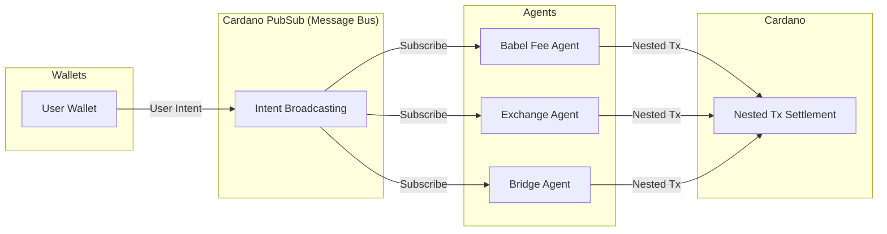
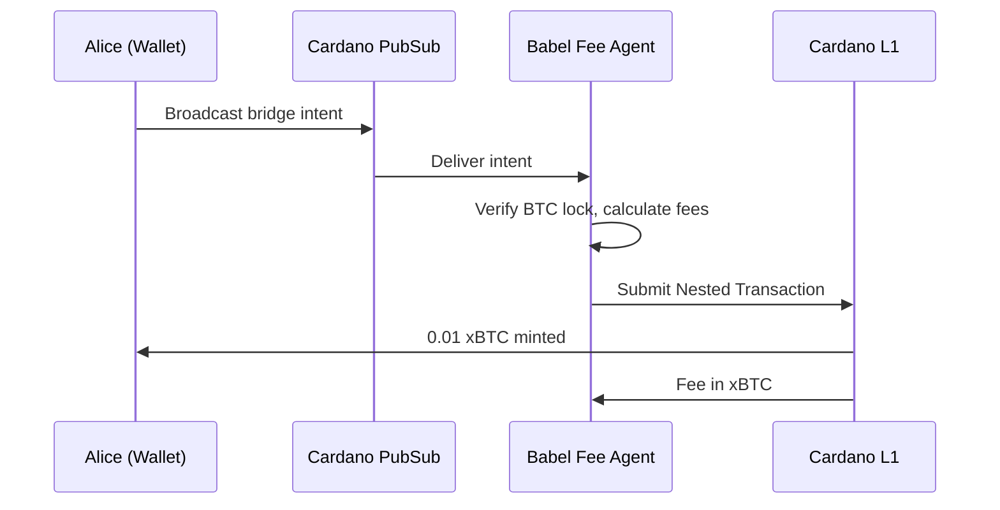

# DeFi Intents

**Cardano PubSub provides the Decentralised Message Bus for the DeFi Intents architecture.**

!!! info "Context"
    DeFi Intents is a broader initiative involving multiple teams and components. Cardano PubSub specifically provides the **communication layer** — the Decentralised Message Bus that connects users to agents.

## The Broader Initiative

The DeFi Intents architecture enables users to express **what they want** (e.g., "swap 0.05 BTC for USDX") without worrying about **how it's executed**. Specialized agents compete to fulfill these intents, covering fees and optimizing execution.

### Key Components

| Component | Owner | Description |
|-----------|-------|-------------|
| **User Intents** | Wallets | Partial transactions expressing desired outcomes |
| **Decentralised Message Bus** | **Cardano PubSub** | Broadcasts intents to agents; censorship-resistant propagation |
| **Agent Layer** | Service Providers | Off-chain agents that fulfill intents (Babel Fee Agents, Exchange Agents, etc.) |
| **Nested Transactions (CIP-118)** | Ledger Team | On-chain primitive enabling atomic multi-party transactions |

## PubSub's Role

Cardano PubSub is the **Decentralised Message Bus** — the permissionless network where User Intents are broadcast and agents subscribe.



### Why PubSub Matters

| Property | Benefit |
|----------|---------|
| **Permissionless** | Any agent can subscribe — no gatekeepers |
| **Censorship-resistant** | No single entity can block a user's intent |
| **ADA-free broadcasting** | Users publish intents without holding ADA |
| **Standard format** | All intents follow interoperable specifications |

## User Intent Format

A User Intent is a message broadcast via PubSub with the following structure:

| Field | Description | Example |
|-------|-------------|---------|
| **Topic** | Message category | `"intent"` |
| **Subject** | Intent type | `"limitOrder"`, `"marketOrder"`, `"btcVmxBridge"` |
| **SubTx** | Partial transaction (may be unbalanced) | See below |

### Example: Limit Order

A user wants to buy at least 100 BAR tokens for 50 FOO tokens:

```
msg = {
  Topic: "intent",
  Subject: "limitOrder",
  SubTx: {
    body: {
      inputs: [txIn0 (FOO 50, ADA 0.1)],   // User's input
      outputs: [txOut0 (BAR 100, ADA 0.1)] // Desired output
    },
    wits: {
      redeemers: [(RedeemerPtr Spending 0)],
      scripts: [spendingScript0]
    }
  }
}
```

**Note:** No ADA is provided for transaction fees. An agent will cover fees and take a spread (e.g., match with a seller offering 100 BAR for 45 FOO, keeping 5 FOO as profit).

### Example: Market Order with Constraints

A user wants immediate execution at best price, with minimum output and whitelisted agents:

```
msg = {
  Topic: "intent",
  Subject: "marketOrder",
  SubTx: {
    body: {
      inputs: [txIn0 (FOO 50, ADA 0.1)],
      outputs: [txOut0 (BAR 80, ADA 0.1)],  // Minimum acceptable
      requiredObservers: [
        (scriptHash1, data1),  // Route extra tokens to user
        (scriptHash2, data2)   // Whitelist trusted agents
      ]
    },
    wits: { ... }
  }
}
```

The `requiredObservers` scripts enforce user constraints on-chain, even though agent logic is opaque.

---

## Technical Specification (PubSub)

### Topics

| Topic | Purpose | Retention |
|-------|---------|-----------|
| `intent` | General intent broadcasting | 10-15 min |
| `intent/limitOrder` | Price-conditional orders | 1 hour |
| `intent/marketOrder` | Immediate execution | 10 min |
| `intent/babel` | Fee abstraction requests | 10 min |
| `intent/bridge/{protocol}` | Cross-chain bridging | 15 min |

### Performance Requirements

| Metric | Target | Rationale |
|--------|--------|-----------|
| **Propagation latency** | <500ms p95 | Agents need fresh intents to compete |
| **Message TTL** | Configurable per topic | Prevents stale intent execution |
| **Throughput** | 1,000+ intents/sec | Handle market volatility |

### Message Bus Properties

From the DeFi Intents PRD:

| Requirement | PubSub Support |
|-------------|----------------|
| **DMB-1: Permissionless** | Any entity can subscribe to the network |
| **DMB-2: ADA-free broadcasting** | Users publish without holding ADA |
| **DMB-3: Anti-censorship** | Decentralized propagation via SPO network |
| **DMB-4: Standard format** | Interoperable intent specifications |

---

## Agent Types (Context)

PubSub enables various agent types to subscribe and compete:

| Agent Type | Service | How They Use PubSub |
|------------|---------|---------------------|
| **Babel Fee Agent** | Covers ADA fees, takes payment in other tokens | Subscribes to intents lacking ADA |
| **Exchange Agent** | Market making, order matching | Aggregates limit orders, matches complementary intents |
| **Bridge Agent** | Cross-chain asset movement | Listens for bridge intents, provides collateral |
| **Arbitrage Agent** | Price equalization across venues | Monitors intents for profitable combinations |

---

## Example Flow: BTC Bridge with Babel Fees

**Scenario:** Alice wants to bridge 0.01 BTC to Cardano. She has no ADA.

1. **Alice's wallet** constructs a User Intent to mint xBTC via BitcoinVMX bridge
2. **Wallet broadcasts** intent to PubSub topic `intent/bridge/btcvmx`
3. **Babel Fee Agent** receives intent, verifies BTC lock proof
4. **Agent constructs** Nested Transaction:
   - Top-level: Agent provides ADA for fees/collateral
   - Sub-tx: Alice's intent to mint xBTC
5. **Agent submits** Nested Transaction to Cardano
6. **Settlement:** Alice receives 0.01 xBTC; Agent receives fee in xBTC



---

## Open Questions (PubSub-specific)

| Question | Status | Notes |
|----------|--------|-------|
| Intent message schema standardization | 🟡 In progress | Coordinating with DeFi Intents team |
| Topic hierarchy for different intent types | ⬜ Not started | Need input from agent developers |
| Rate limiting / spam prevention | ⬜ Not started | Consider stake-based access |
| Agent discovery (which agents support which intents) | ⬜ Not started | May need registry or advertisement protocol |

## Related

- [CIP-118: Nested Transactions](https://github.com/cardano-foundation/CIPs)
- [Requirements: FR1.1, FR1.4, FR5.1](../product/requirements/functional.md)
- [Requirements: NFR1.1, NFR1.2](../product/requirements/non-functional.md)
