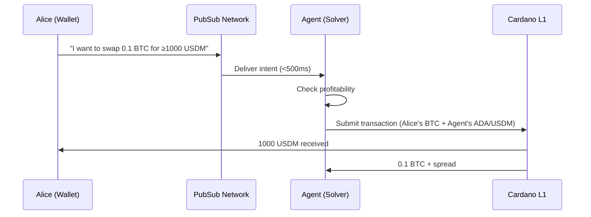

# DeFi Intents

**Enable fee-free trading by separating intent expression from execution.**

## The Problem

A user wants to swap BTC for a Cardano stablecoin, but they have no ADA to pay transaction fees. Today, they're stuck — they can't interact with Cardano DeFi without first acquiring ADA through a centralized exchange.

## The Solution

With Cardano PubSub, users broadcast **intents** — partial transactions expressing what they want (e.g., "swap 0.1 BTC for USDM") without worrying about fees or execution. **Agents** (solvers, market makers) compete to fulfill these intents, covering fees in exchange for a spread.

## Value Proposition

| Benefit | Description |
|---------|-------------|
| **Fee Abstraction** | Users trade without holding ADA — agents cover fees |
| **Better Prices** | Agents compete, driving prices toward optimal execution |
| **Censorship Resistance** | No single entity can block a user's trade intent |
| **Unified Standard** | Wallets integrate once; all agents can fulfill intents |

## Actors

| Actor | Role | Description |
|-------|------|-------------|
| **User/Wallet** | Publisher | Broadcasts intent to the network |
| **Agent** | Subscriber | Discovers intents, competes to fulfill them |
| **SPO Node** | Relayer | Propagates intents across the network |

## Scenario: BTC-to-Stablecoin Swap

**Alice has 0.1 BTC but no ADA. She wants USDM.**



### Step-by-Step

1. **Alice creates intent**: Her wallet constructs a partial transaction — 0.1 BTC in, ≥1000 USDM out, no fee specified
2. **Wallet publishes**: Intent broadcast to `intents/market-order` topic
3. **Network propagates**: SPO nodes relay the intent across the network in <500ms
4. **Agents compete**: Multiple agents see the intent, calculate profitability
5. **Winner executes**: Best agent bundles Alice's intent with their own liquidity, submits to L1
6. **Settlement**: Alice gets USDM, agent gets BTC + profit margin

---

## Technical Specification

### Topics

| Topic | Purpose | Retention |
|-------|---------|-----------|
| `intents/market-order` | General swap intents | 10 min |
| `intents/babel-fee` | Fee coverage requests | 10 min |
| `intents/limit-order` | Price-conditional intents | 1 hour |
| `intents/private/{agent_did}` | Direct-to-agent (OTC) | 1 hour |

### Message Schema

```protobuf
message IntentMessage {
  string intent_type = 1;        // "market", "limit", "babel"
  bytes partial_tx_cbor = 2;     // The unsigned partial transaction
  
  message Constraints {
    int64 min_output = 1;        // Minimum acceptable output
    int64 max_slippage_bps = 2;  // Max slippage in basis points
    int64 expiry_slot = 3;       // When intent expires
  }
  Constraints constraints = 3;
  
  bytes user_signature = 4;      // Signs (intent_type + constraints)
}
```

### Performance Requirements

| Metric | Target | Rationale |
|--------|--------|-----------|
| **Propagation latency** | <500ms p95 | Agents need fresh data to compete |
| **Message TTL** | 10 minutes | Prevents stale intent execution |
| **Throughput** | 1000 intents/sec | Handle market volatility spikes |

### Architectural Implications

This use case drives:

- **Hot Cache storage** — intents are ephemeral, RAM-only
- **GossipSub propagation** — speed over guaranteed delivery
- **Bloom filter subscriptions** — agents filter by asset pairs

---

## Open Questions

| Question | Status | Notes |
|----------|--------|-------|
| How do users pay PubSub broadcast fees without ADA? | 🟡 Design | Likely: agents sponsor, or wallets subsidize |
| Standard schema for cross-DEX intent compatibility? | ⬜ Not started | Need DeFi protocol input |
| MEV protection (front-running by malicious agents)? | ⬜ Not started | Consider commit-reveal or sealed bids |

## Related

- [Requirements: FR1.1, FR1.4, FR5.1](../product/requirements/functional.md)
- [Requirements: NFR1.1, NFR1.2](../product/requirements/non-functional.md)
