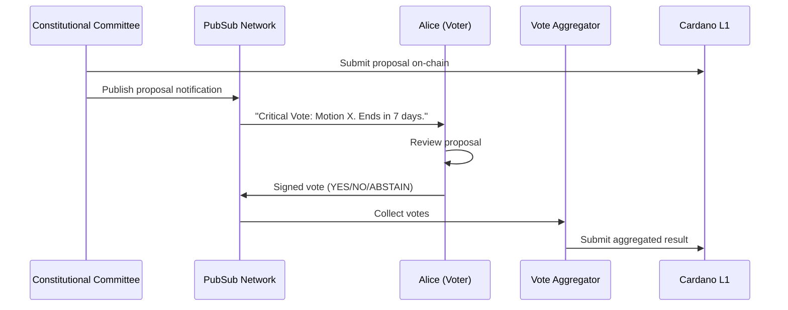

# Governance

**Transform voting from a chore into a one-click action.**

## The Problem

A critical governance proposal is live. It's announced on Twitter, discussed on Discord, and voting happens on a separate dApp. Users miss the announcement, forget to vote, or find the process too cumbersome. Result: low turnout, decisions made by a small minority.

## The Solution

With Cardano PubSub, governance bodies push **verified, actionable notifications** directly to voters via any PubSub-compatible client — wallets, dashboards, or dedicated governance apps. Users see the proposal, read the summary, and vote. One click, done.

## Value Proposition

| Benefit | Description |
|---------|-------------|
| **Guaranteed Delivery** | Every subscribed wallet receives the notification — no algorithm suppression |
| **Verified Source** | Messages are signed by governance bodies' DIDs — no impersonation |
| **One-Click Voting** | Vote buttons embedded in the notification — no dApp navigation |
| **Audit Trail** | All proposals and votes preserved in decentralized storage |

## Actors

| Actor | Role | Description |
|-------|------|-------------|
| **Governance Body** | Publisher | Constitutional Committee, DAOs, DReps publish proposals |
| **Voter** | Subscriber + Publisher | Receives proposals, publishes signed votes |
| **Vote Aggregator** | Subscriber | Collects votes, submits results to L1 |
| **SPO Node** | Relayer + Store | Propagates messages, stores proposals for voting period |

## Scenario: Constitutional Committee Vote

**The Constitutional Committee raises a critical motion. 7-day voting window.**



### Step-by-Step

1. **Proposal created**: Committee submits proposal on-chain, publishes notification to `governance/proposals`
2. **Verified delivery**: Alice's PubSub client receives notification, verifies Committee's DID signature
3. **Review**: Alice reads summary, optionally follows link to full text
4. **One-click vote**: Alice taps "Vote No" — client signs and publishes to `governance/votes/{proposal_id}`
5. **Aggregation**: Aggregator collects all votes, submits proof to L1
6. **Settlement**: Proposal passes or fails based on vote tally

---

## Technical Specification

### Topics

| Topic | Access | Retention | Purpose |
|-------|--------|-----------|---------|
| `governance/proposals` | Moderated | 30 days | Official proposal notifications |
| `governance/votes/{id}` | Public | 14 days | Vote submissions |
| `governance/discussion/{id}` | Public | 14 days | Proposal discussion |
| `governance/dreps/{did}` | Public | 7 days | DRep recommendations |

### Message Schema

**Proposal Notification:**
```protobuf
message ProposalNotification {
  string proposal_id = 1;         // On-chain reference
  string title = 2;
  string summary = 3;             // 280 char max
  string full_text_uri = 4;       // IPFS link
  int64 voting_ends_slot = 5;
  repeated string actions = 6;    // ["YES", "NO", "ABSTAIN"]
  bytes committee_signature = 7;
}
```

**Vote Message:**
```protobuf
message GovernanceVote {
  string proposal_id = 1;
  enum Choice { YES = 0; NO = 1; ABSTAIN = 2; }
  Choice choice = 2;
  string justification_uri = 3;   // Optional reasoning
  bytes voter_vkey = 4;
  bytes signature = 5;
}
```

### Performance Requirements

| Metric | Target | Rationale |
|--------|--------|-----------|
| **Delivery guarantee** | 99.99% | Missing a vote notification is unacceptable |
| **Storage duration** | ≥ voting period + 2 epochs | Must be available throughout voting |
| **Replication factor** | 7-10 nodes | High availability even with churn |

### Architectural Implications

This use case drives:

- **Durable DHT storage** — proposals must persist for weeks
- **Harary Graph topology** — guaranteed delivery, no message loss
- **Identus verification** — DID signatures for trusted sources
- **Moderated topics** — only authorized publishers for `governance/proposals`

---

## Open Questions

| Question | Status | Notes |
|----------|--------|-------|
| Standard for DRep-to-voter recommendation messages? | ⬜ Not started | Enables "how is my DRep voting?" |
| Aggregator trust model (who can submit tallies)? | ⬜ Not started | Consider multi-aggregator verification |
| Sharding for high-volume discussions (100k+ messages)? | ⬜ Not started | May need per-proposal shards |

## Related

- [Requirements: FR1.3, FR2.1, FR4.2](../product/requirements/functional.md)
- [Requirements: NFR3.1, NFR3.4](../product/requirements/non-functional.md)
- [CIP-1694](https://cips.cardano.org/cip/CIP-1694) — Cardano governance framework
