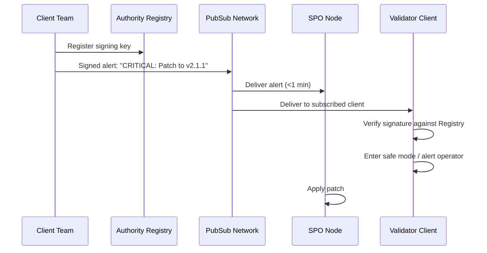
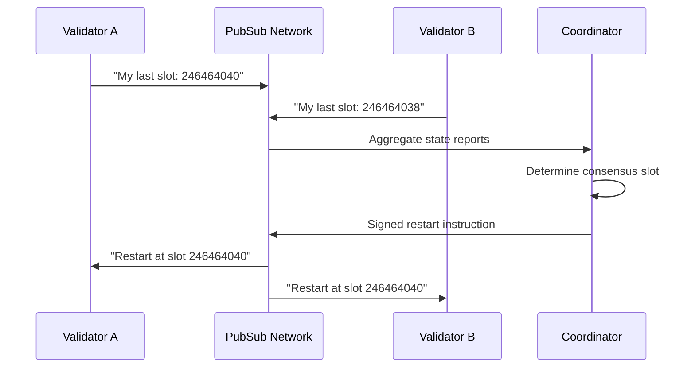

# Network Operations

**Authenticated coordination for protocol emergencies and SPO operations.**

## The Problem

When things go wrong — bridge exploits, client bugs, chain halts — network survival depends on human operators coordinating through Discord, Telegram, and Twitter. These channels are unauthenticated, prone to social engineering, and disconnected from validator software. The result: slow response times, information asymmetry, and billions in preventable losses.

The Ronin Bridge hack went undetected for six days because no alert system existed. Terra's collapse saw validators coordinating via leaked Telegram "War Room" logs. Solana restarts require validators to paste ledger heights into Discord chat. Ethereum's Prysm bug was patched via Twitter — operators who were asleep continued losing funds.

Beyond emergencies, routine SPO coordination is fragmented across five or more platforms. Protocol upgrades, voting deadlines, and maintenance windows are announced on Telegram, discussed on Discord, documented on forums, and often missed entirely.

## The Solution

Cardano PubSub provides **authenticated, cryptographically-signed coordination** for network operators. Emergency alerts propagate in seconds with verified signatures. Validator software can subscribe directly and respond automatically. SPOs receive protocol updates through a unified channel with delivery guarantees.

## Value Proposition

| Benefit | Description |
|---------|-------------|
| **Authenticated Alerts** | Messages signed by registered authorities — no impersonation risk |
| **Guaranteed Delivery** | P2P gossip with persistence for offline nodes |
| **Client Integration** | Validator software subscribes directly — automated response possible |
| **Unified Channel** | One source for protocol upgrades, voting, maintenance — no more fragmentation |

## Actors

| Actor | Role | Description |
|-------|------|-------------|
| **Protocol Authority** | Publisher | IOG, Intersect, Constitutional Committee — issues signed alerts |
| **SPO** | Subscriber | Receives alerts, coordinates responses, participates in recovery |
| **Validator Client** | Automated Subscriber | Node software subscribes to emergency topics |
| **Security Council** | Publisher | Multi-sig authority for critical alerts |

## Scenario: Emergency Client Patch

**A critical bug is discovered in node software. Operators need to patch immediately.**



### Step-by-Step

1. **Discovery**: Client team identifies critical bug
2. **Alert creation**: Team constructs signed alert with severity, target version, and recommended action
3. **Broadcast**: Alert published to `ops/emergency/critical`
4. **Propagation**: P2P gossip delivers to all subscribed nodes within seconds
5. **Verification**: Receiving clients verify signature against on-chain authority registry
6. **Response**: Automated safe mode or operator notification — no Twitter required

## Scenario: Chain Halt Recovery

**The network halts. Validators need to coordinate restart.**



### Step-by-Step

1. **Detection**: Validators detect halt via local monitoring
2. **State reporting**: Each validator publishes signed state observation to `ops/recovery/state`
3. **Aggregation**: Coordinator collects reports, determines consensus restart point
4. **Instruction**: Coordinator publishes signed restart instruction
5. **Execution**: Validators verify signature, restart with specified parameters
6. **Confirmation**: Validators report successful restart

---

## Technical Specification

### Topics

| Topic | Access | Retention | Purpose |
|-------|--------|-----------|---------|
| `ops/emergency/critical` | Moderated | 7 days | Critical security alerts |
| `ops/emergency/warning` | Moderated | 3 days | Non-critical warnings |
| `ops/protocol/upgrades` | Moderated | 30 days | Protocol upgrade announcements |
| `ops/protocol/voting` | Moderated | 14 days | Governance voting deadlines |
| `ops/recovery/state` | Authenticated | 1 hour | Validator state reports during recovery |
| `ops/recovery/instructions` | Moderated | 1 hour | Coordinator restart instructions |
| `ops/maintenance/{pool_id}` | Pool-authenticated | 7 days | Per-pool maintenance announcements |

### Message Schema

**Emergency Alert:**
```protobuf
message EmergencyAlert {
  enum Severity {
    INFO = 0;
    WARNING = 1;
    CRITICAL = 2;
  }
  Severity severity = 1;
  
  string target_client = 2;      // "cardano-node", "all"
  string target_version = 3;     // "<2.0.0", "all"
  
  enum Action {
    NOTIFY = 0;                  // Human reads and decides
    SAFE_MODE = 1;               // Client enters safe mode
    PAUSE = 2;                   // Stop block production
    UPGRADE = 3;                 // Apply specific patch
  }
  Action recommended_action = 4;
  
  string title = 5;
  string description = 6;
  string details_uri = 7;        // Link to full advisory
  
  bytes authority_signature = 8;
  string authority_did = 9;
}
```

**State Report:**
```protobuf
message StateReport {
  string validator_id = 1;
  uint64 last_slot = 2;
  bytes state_hash = 3;
  uint64 timestamp_ms = 4;
  bytes signature = 5;
}
```

### Authority Registry

Alerts are only trusted if signed by registered authorities:

| Authority Type | Registration | Examples |
|----------------|--------------|----------|
| **Client Team** | On-chain registry | IOG, CF, Emurgo |
| **Security Council** | Multi-sig | 5-of-9 emergency committee |
| **Protocol Body** | Governance action | Constitutional Committee |

Clients verify signatures against the on-chain registry before acting on alerts.

### Performance Requirements

| Metric | Target | Rationale |
|--------|--------|-----------|
| **Propagation** | <60 seconds to 95% of nodes | Emergencies are time-critical |
| **Delivery guarantee** | 99.99% | Missing an alert can mean losses |
| **Availability** | Independent of main chain | Must work during chain halts |
| **Retention** | Configurable by severity | Critical alerts persist longer |

### Architectural Implications

This use case drives:

- **Authority registry** — on-chain list of trusted signers
- **Severity routing** — critical alerts get priority propagation
- **Offline persistence** — nodes catch up on missed alerts
- **Client SDK** — validator software can subscribe directly
- **Independence** — PubSub runs even when main chain is halted

---

## Evidence: The Cost of the Current Gap

| Incident | Loss | Communication Failure |
|----------|------|----------------------|
| **Ronin Bridge** | $625M | 6-day detection delay — no alerts |
| **Terra/Luna** | $40B+ | Ad-hoc Telegram coordination |
| **Solana outages** | Hours of downtime | Discord-based restart coordination |
| **Prysm bug** | 382 ETH penalties | Twitter-based patch distribution |

**The pattern:** Networks that coordinate thousands of nodes for consensus rely on Discord for emergencies.

---

## Open Questions

| Question | Status | Notes |
|----------|--------|-------|
| Authority key rotation (what if a key is compromised)? | ⬜ Not started | Need revocation mechanism |
| Multi-chain coordination (bridge incidents)? | ⬜ Not started | May need cross-chain authority recognition |
| Automated response limits (prevent malicious safe-mode triggers)? | ⬜ Not started | Rate limiting, severity thresholds |

## Related

- [Emergency Coordination Research](../product/competitive/emergency-coordination.md)
- [Requirements: FR1.3, FR2.1, FR4.2](../product/requirements/functional.md)
- [Requirements: NFR3.1, NFR3.4](../product/requirements/non-functional.md)
