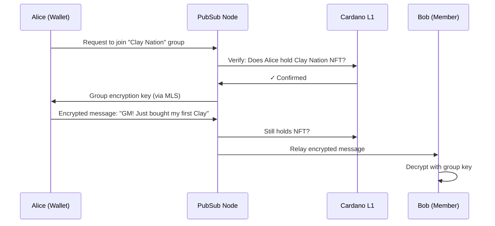

# Token-Gated Social

**Your wallet is your login. Your tokens are your permissions.**

## The Problem

Web3 communities live on Web2 platforms. Discord servers get hacked. "Verify your wallet" bots are phishing vectors. Moderators can be bribed. Communities can be de-platformed overnight. The social layer doesn't match the ownership layer.

## The Solution

Cardano PubSub enables **token-gated communities** where access is enforced by the blockchain. Hold the NFT? You're in. Sell it? You're out. Messages are end-to-end encrypted — even relay nodes can't read them.

## Value Proposition

| Benefit | Description |
|---------|-------------|
| **Native Gating** | On-chain verification, no "Collab.land" bots needed |
| **True Privacy** | E2EE via MLS — nodes relay but can't read |
| **Censorship Resistance** | No central server to ban you or leak your data |
| **Portable Identity** | Your DID reputation travels with you |

## Actors

| Actor | Role | Description |
|-------|------|-------------|
| **Community/DAO** | Admin | Defines access rules (token policy, minimum holdings) |
| **Member** | Publisher + Subscriber | Sends and receives encrypted messages |
| **PubSub Node** | Gatekeeper | Verifies token ownership before relaying |
| **Archive Node** | Store | Optional long-term history storage |

## Scenario: NFT Holders Chat

**Alice buys an NFT. She automatically gains access to the holders-only channel.**



### Step-by-Step

1. **Discovery**: Alice's wallet scans for groups matching her token holdings
2. **Join request**: Alice requests access to `social/group/clay-nation`
3. **Verification**: Node checks L1 — Alice holds the required NFT
4. **Key exchange**: Via MLS protocol, Alice receives the group encryption key
5. **Messaging**: Alice sends encrypted message; node verifies she still holds NFT
6. **Enforcement**: If Alice sells the NFT, her next message is rejected

---

## Technical Specification

### Topics

| Topic | Access | Retention | Purpose |
|-------|--------|-----------|---------|
| `social/group/{policy_id}` | Token-gated | 24 hours | NFT/token holder groups |
| `social/dm/{user_did}` | Private | 7 days | Direct messages |
| `social/broadcast/{did}` | Public | 24 hours | One-to-many announcements |

### Message Schema

```protobuf
message SocialMessage {
  string sender_did = 1;
  bytes group_id = 2;
  bytes mls_ciphertext = 3;      // Encrypted content
  uint64 epoch = 4;              // Key rotation epoch
  bytes signature = 5;
}
```

### Access Control

Nodes enforce gating via L1 state queries:

| Gate Type | Verification |
|-----------|--------------|
| NFT holder | UTXO contains asset with policy ID |
| Token holder | UTXO contains ≥N tokens |
| Stake delegator | Delegation certificate to specific pool |
| DAO member | Holds governance token |

### Privacy Features

| Feature | Implementation |
|---------|----------------|
| **Message encryption** | MLS (RFC 9420) — efficient group key management |
| **Metadata protection** | Sealed Sender — nodes don't know who sent |
| **Forward secrecy** | Key rotation every N messages or T time |

### Scalability Considerations

| Challenge | Solution |
|-----------|----------|
| Popular groups (100k+ members) | Shard into sub-topics |
| High message volume | 24-hour retention; archive nodes for history |
| Key rotation overhead | MLS tree structure scales logarithmically |

### Architectural Implications

This use case drives:

- **L1 State Oracle** — nodes query UTXO set for token verification
- **MLS integration** — efficient E2EE for dynamic groups
- **Sealed Sender routing** — metadata privacy
- **Tiered retention** — short default, optional archival

---

## Open Questions

| Question | Status | Notes |
|----------|--------|-------|
| Who pays for long-term message storage? | ⬜ Not started | Community-run archive nodes? |
| How to ban abusive members who still hold tokens? | ⬜ Not started | MLS allows admin to revoke key access |
| Cross-wallet identity (cold storage NFT, hot wallet chat)? | ⬜ Not started | Delegation via CIP-88 or similar |

## Related

- [Requirements: FR1.2, FR2.1, FR2.4](../product/requirements/functional.md)
- [Requirements: NFR4.1, NFR4.3, NFR5.1](../product/requirements/non-functional.md)
- [MLS RFC 9420](https://datatracker.ietf.org/doc/rfc9420/)
