# Data model: 004-connections

Entities, state machines, and the staleness catalog for the logical connection model.
Diagrams are Mermaid state diagrams beside their text descriptions, as the plan input
mandates; every transition shown traces to a spec FR or edge case.

## 1. Entities

### 1.1 `PeerId` (reshaped)

| Aspect | Value |
|---|---|
| Representation | newtype over `PublicKey` (was `String`) — research R2, ADR 0016 |
| String form | mock-stage **alias rule**: `FromStr` derives the key from the alias (`derive_public(PrivateKey(alias bytes))` after the existing non-empty / no-NUL validation); `Display` renders the alias back (UTF-8 prefix when the bytes end with the mock public suffix), hex otherwise |
| Equality/Hash | byte equality of the key (derived) |
| Distinctness | `PublisherId` remains a separate newtype over the same key type (role distinction, `message.rs`) |
| Removed | `as_str()` (no stable inner string) |

### 1.2 `UpstreamState` and the connection structures (`NodeState` additions)

```rust
pub enum UpstreamState { AwaitingAccept, Active }            // src/connection.rs, re-exported

// NodeState (crate-internal) gains:
upstream:   HashMap<(PeerId, TopicId), UpstreamState>,        // FR-001
downstream: HashSet<(PeerId, TopicId)>,                       // FR-002
strategy:   Arc<dyn ConnectionStrategy>,                      // service handle beside the verifier (R5)
```

- Keys are `(peer, topic)` — one logical connection per pair per role (spec Key
  Entities); the same pair may appear in both structures simultaneously (both-roles
  edge case).
- Terminal outcomes are **removals** (FR-003); no stored terminal states.
- `candidates` and the shell `peers` bootstrap list are untouched (FR-004).

### 1.3 Control messages (`message.rs` additions)

```rust
Message::Connection(ConnectionMessage)        // 2nd Message variant (ADR 0010 extension)

ConnectionMessage { plain: PlainConnection, signature: Signature }
PlainConnection   { emitter: PeerId, action: ConnectionAction }
#[non_exhaustive]
ConnectionAction  { Request{topic} | Accepted{topic} | Terminated{topic} }
```

`PlainConnection::signed_bytes()`: length-prefixed emitter key bytes, then a 1-byte
action tag (`0x00`/`0x01`/`0x02`) and length-prefixed topic UTF-8 — the signature binds
emitter + kind + topic (FR-011). Layout details in `contracts/connection-protocol.md`.

### 1.4 `ConnectionStrategy` (new seam)

```rust
trait ConnectionStrategy: Send + Sync {
    fn expected_upstream(&self, subscriptions: &HashSet<TopicId>,
                         candidates: &HashMap<TopicId, HashSet<PeerId>>)
        -> HashSet<(PeerId, TopicId)>;
}
struct ConnectToAllCandidates;   // v1: every candidate of every own topic
```

Pure and synchronous; consulted only from the `ConnectionSetup` arm of `apply`;
applied by the FR-007 diff (never removes). ADR 0017.

### 1.5 Events and effects

```rust
Event::ConnectionSetup            // setup trigger: timer-produced or externally pushed (FR-006)
Event::Shutdown                   // graceful teardown; loop terminal marker (FR-020)
// control messages arrive inside Event::MessageReceived (Message::Connection)

Effect::Send { to: PeerId, message: Message }                       // all wire actions (FR-005)
Effect::Misbehaved { peer: PeerId, topic: TopicId, cause: &'static str }  // FR-017 signal
```

### 1.6 Configuration

`NodeConfig.connection_setup_delay: Option<Duration>` ← TOML
`connection_setup_delay_ms: Option<u64>` (loader converts; parse at the edge).
`None` (the default): no timer producer is spawned (FR-006).

## 2. State machines

### 2.1 Upstream entry (dialer side) — per (peer, topic)

```mermaid
stateDiagram-v2
    [*] --> AwaitingAccept : setup event — pair expected & not held<br/>(FR-007; Effect::Send Request)
    AwaitingAccept --> AwaitingAccept : setup event recurs — re-dial<br/>(FR-007; entry kept, fresh Request)
    AwaitingAccept --> Active : Accepted from carried emitter matching the pair (FR-013)
    AwaitingAccept --> [*] : Terminated received (FR-014)<br/>or own shutdown (FR-020)
    Active --> [*] : Terminated received (FR-014)<br/>or misbehavior severance (FR-017, silent)<br/>or own shutdown (FR-020)
```



Text description:

- **Entry creation** happens only from the node's own strategy on a setup event
  (spec invariant: upstream entries originate only from the node's own strategy).
  An unsolicited `Accepted` never creates or activates anything (FR-013).
- **`AwaitingAccept` → `Active`** on a matching `Accepted` (keyed by carried emitter
  + topic). A duplicate `Accepted` after activation finds no pending entry and is a
  cause-tagged drop.
- **Re-dial loop**: a recurring setup event re-sends the `Request` for pairs still
  pending — state unchanged, wire action only (FR-007).
- **Exits are removals**: counterpart's graceful `Terminated` (FR-014), the node's
  own shutdown (FR-020), or — from `Active` only — silent misbehavior severance
  (FR-017; no notice sent). There is no `Closing`/`Rejected` stored state (FR-003).

### 2.2 Downstream entry (acceptor side) — per (peer, topic)

```mermaid
stateDiagram-v2
    [*] --> Held : Request passes control checks + membership validation<br/>(FR-012; Effect::Send Accepted)
    Held --> Held : duplicate Request re-validated — idempotent re-accept<br/>(FR-012; Accepted re-sent, entry kept)
    Held --> [*] : Terminated received (FR-014)<br/>or own shutdown (FR-020)
```

Text description: a single stored state ("held" — the set membership itself; no enum,
FR-002). Created only by a validated peer `Request` (spec invariant). The idempotent
re-accept self-loop covers the requester-restart flow; a re-dial by a peer that no
longer passes validation is dropped with the entry left as-is. Exits: counterpart
`Terminated` or own shutdown. Note the asymmetry: **misbehavior never removes a
downstream entry** — severance is the receiver's upstream-side act (see catalog S6).

### 2.3 Establishment round-trip (both ends)

```mermaid
sequenceDiagram
    participant A as A (dialer)
    participant B as B (acceptor)
    Note over A: setup event (timer or injected)
    A->>A: strategy → expected; diff (FR-007)<br/>upstream[(B,T)] = AwaitingAccept
    A->>B: Request{T} signed, emitter=A
    B->>B: control checks (FR-015)<br/>membership validation (FR-012)<br/>downstream += (A,T)
    B->>A: Accepted{T} signed, emitter=B
    A->>A: matches AwaitingAccept (FR-013)<br/>upstream[(B,T)] = Active
    Note over A,B: B may now deliver payload on T;<br/>A admits it (FR-016)
```

## 3. Staleness catalog

Each deliberately-unreconciled flow, its cause, observable footprint, and deferred
healer. Cross-references: spec edge case (EC) and the `IMPLEMENTATION_NOTES.md`
deferral entry that will record it (N-new identifiers assigned at implementation).

| # | Stale flow | Cause | Observable footprint | Healer (deferred) | Spec ref |
|---|---|---|---|---|---|
| S1 | Stuck `AwaitingAccept` | Target absent from the network (send silently dropped) or pre-convergence membership drop at the receiver | Upstream entry pinned at `AwaitingAccept` in the getter; admits nothing | Re-dial on any later setup event (in-feature, FR-007); GC / re-selection at dynamic transitions | EC "absent peer", EC "pre-convergence Request"; N-new(GC) |
| S2 | One-sided connection after **acceptor's** abrupt restart | Restarted acceptor lost `downstream(A,T)`; nothing recreates it — the survivor's `Active` entry blocks its own diff from re-requesting | Survivor holds a permanently quiet `Active` upstream | Liveness probing (009) / dynamic transitions | EC "acceptor's abrupt restart"; N-new(liveness) |
| S3 | Survivor-side stale entries after abrupt drop (no shutdown) | No `Terminated` notices on the abrupt path | Counterparts keep both-role entries that admit nothing | Requester-restart re-dial heals the restarted node's own direction (in-feature, idempotent re-accept); liveness heals the rest | EC "abrupt drop", US4-3/4; N-new(liveness) |
| S4 | Own-topic drift | Node's own registered topics shrink after establishment; reconciliation deferred — `Active` connections for the dropped topic persist on both ends | Senders keep sending; recipient's subscription filter drops (`topic_not_subscribed`) — protected, never misbehavior (FR-017/018) | Registry-driven re-scoping at 012 | EC via FR-017 note, Assumptions; existing deferral (ADR 0014's re-scoping note) |
| S5 | Peer-membership drift (both roles) | Candidates shrink between setups; held pairs no longer expected are left untouched (FR-007). Acceptor-side mirror: a downstream entry for a since-removed member is kept when its re-dial fails re-validation (FR-012) or when no re-dial occurs | Entries persist for ex-members in either role; payload from them still admitted while `Active` (severance only via misbehavior/Terminated) | Removal at dynamic transitions (re-selection with drops) | EC "repeated setup event", EC "duplicate connection request"; N-new(dynamic) |
| S6 | Misbehavior asymmetry | Severance removes the receiver's upstream entry only and is silent | Offender keeps its `downstream` and keeps sending into `not_connected` drops | Blacklist package (notice-less by design even then) | US3-2; N-new(misbehavior package) |

Reading the catalog: every stale state **admits no traffic it shouldn't** — stale
entries only ever *admit* (S2/S5's `Active` upstreams) or *send into drops* (S4/S6);
none creates traffic or state. That is the safety argument for deferring all healing:
staleness costs memory and wasted sends, never correctness of the received record.

## 4. Validation rules (transition-side summary)

| Input | Checks, in order | On failure |
|---|---|---|
| Payload (`Message::Signed`) | ① frame sender holds `Active` upstream for topic (FR-016) ② topic subscribed ③ signature verifies | ① `not_connected` drop ② `topic_not_subscribed` drop ③ `invalid_signature` drop **+ severance iff ① and ② passed** (FR-017) |
| Any control message | ① carried emitter ≠ self (FR-015) ② signature verifies over `plain.signed_bytes()` (FR-011/015) | `self_emitter` / `invalid_signature` drop; no state change |
| `Request` | ③ topic ∈ own subscriptions AND emitter ∈ candidates[topic] (FR-012) | `membership_validation_failed` drop; no reply |
| `Accepted` | ③ matching `AwaitingAccept` entry exists (FR-013) | `unsolicited_accept` drop |
| `Terminated` | ③ matching entry exists, either role (FR-014) | `unknown_termination` drop |
| `ConnectionSetup` | strategy → diff (FR-007/008); self never expected (FR-009, candidates exclude self) | n/a (empty expected set is a no-op) |
| `Shutdown` | none — unconditional clear + notices (FR-020) | n/a |
